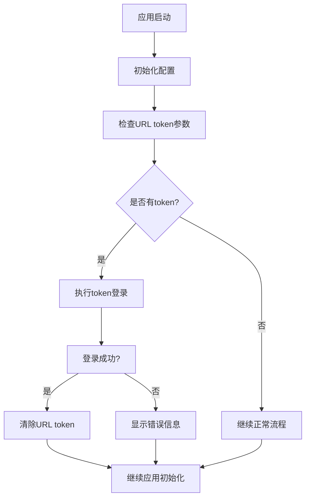
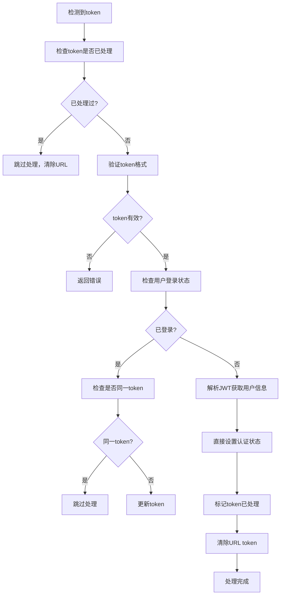

# Vue主应用Token集成功能实现文档

## 概述

本文档描述了为Angular应用实现的Vue主应用token集成功能，用于支持从Vue主应用通过iframe嵌入时的已登录token传递和认证处理。

**核心思路：** Vue主应用传递的token相当于"登录成功确认消息"，Angular应用将其当作标准登录流程处理，自动获取完整的用户信息、角色和权限，从而解决子页面"无权访问"的问题。

## 功能特性

- ✅ **统一token入口**：提供统一的URL token参数处理
- ✅ **直接认证设置**：检测到token时直接设置认证状态，无需重新登录
- ✅ **JWT解析**：自动解析JWT token获取用户信息和过期时间
- ✅ **防重复处理**：智能检测并跳过已处理的token，避免重复操作
- ✅ **兼容性**：支持有token和无token的访问方式
- ✅ **安全性**：处理完成后自动清除URL中的敏感token信息
- ✅ **调试友好**：完整的日志输出，便于问题排查
- ✅ **错误处理**：完善的异常处理和错误提示
- ✅ **完整缓存机制**：与正常登录流程一致的sessionStorage缓存
- ✅ **权限一致性**：确保获得与正常登录相同的用户权限和角色信息
- ✅ **JWT过期处理**：自动解析JWT token过期时间，确保会话管理一致性

## 实现架构

### 核心组件

1. **TokenUrlHandler服务** (`src/webapp/app/modules/uaa/token-url-handler.service.js`)
   - 负责URL token参数的解析和处理
   - 提供token登录的核心逻辑

2. **增强的Auth服务** (`src/webapp/app/modules/uaa/auth.service.js`)
   - 扩展了accessTokenLogin方法的日志输出
   - 支持token自动登录流程

3. **增强的JwtAuthService** (`src/webapp/app/modules/uaa/auth.jwt.service.js`)
   - 添加了详细的登录请求日志
   - 支持accessToken认证接口

4. **修改的应用启动流程** (`src/webapp/app/modules/main/main-init.js`)
   - 在应用初始化时检查和处理token参数

## 使用方法

### 1. Vue主应用集成

在Vue主应用中，通过iframe嵌入Angular模块时，可以在URL中传递token参数：

```javascript
// Vue主应用代码示例
const iframeUrl = `${angularModuleUrl}?token=${userToken}`;
document.getElementById('angular-iframe').src = iframeUrl;
```

### 2. URL格式

支持的URL格式：
```
# 登录页面带token
/login?token=YOUR_JWT_TOKEN

# 主页面带token
/home?token=YOUR_JWT_TOKEN

# 任意页面带token
/any-page?token=YOUR_JWT_TOKEN
```

**URL参数说明：**
- `token` (必需): JWT认证token，系统会自动解析token获取用户信息和过期时间
- 登录状态默认保存到sessionStorage，浏览器关闭后需重新登录

### 3. 后端API要求

确保后端支持以下认证接口：
```
POST /api/authenticate/accessToken
```

请求体格式：
```json
{
  "accessToken": "JWT_TOKEN_STRING",
  "tenantId": "TENANT_ID",
  "rememberMe": false
}
```

## 调试和日志

### 日志前缀

系统使用固定前缀的日志输出，便于调试：

- `[TokenUrlHandler]` - Token URL处理相关日志
- `[Auth]` - 认证服务相关日志  
- `[JwtAuthService]` - JWT认证服务相关日志
- `[CurrentUser]` - 用户信息设置相关日志
- `[MainRunInit]` - 应用初始化相关日志

### 调试步骤

1. 打开浏览器开发者工具
2. 切换到Console标签
3. 访问带token的URL
4. 观察日志输出，查看处理流程

### 测试页面

访问 `/test-token-login.html` 可以进行功能测试。

## 工作流程

### 1. 应用启动流程



### 2. Token处理流程



## 配置说明

### 1. Token参数名

默认使用 `token` 作为URL参数名，可在 `TokenUrlHandler` 服务中修改：

```javascript
var TOKEN_PARAM_NAME = 'token'; // 可修改为其他参数名
```

### 2. 租户配置

确保 `window.$oplus.appConfig.tenantId` 正确配置。

## 错误处理

### 常见错误及解决方案

1. **Token格式无效**
   - 检查token是否为有效的JWT格式
   - 确认token未过期

2. **认证接口错误**
   - 检查后端 `/api/authenticate/accessToken` 接口是否正常
   - 验证请求参数格式

3. **租户配置错误**
   - 确认 `tenantId` 配置正确
   - 检查租户是否激活

4. **网络请求失败**
   - 检查网络连接
   - 验证API服务器地址

## 安全考虑

1. **Token清除**：登录成功后立即从URL中清除token参数
2. **日志安全**：日志中不输出完整token，只显示前缀用于调试
3. **HTTPS传输**：生产环境建议使用HTTPS传输token
4. **Token有效期**：建议设置较短的token有效期

## 兼容性

- ✅ 支持现有的用户名密码登录
- ✅ 支持现有的安全登录模式
- ✅ 向后兼容，不影响现有功能
- ✅ 支持记住我功能
- ✅ 支持多租户环境

## 部署注意事项

1. 确保新增的 `token-url-handler.service.js` 文件被正确加载
2. 检查 `index.html` 中的脚本引用
3. 验证后端API接口的可用性
4. 测试不同场景下的功能表现

## 维护和扩展

### 添加新的token参数

如需支持更多token参数，可在 `TokenUrlHandler` 服务中扩展：

```javascript
// 支持多个token参数
var TOKEN_PARAMS = ['token', 'accessToken', 'authToken'];
```

### 自定义登录逻辑

可以在 `processTokenLogin` 方法中添加自定义的登录前后处理逻辑。

### 集成其他认证方式

可以扩展服务以支持其他认证方式，如OAuth、SAML等。
