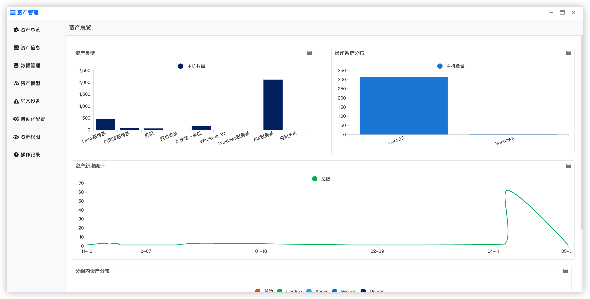
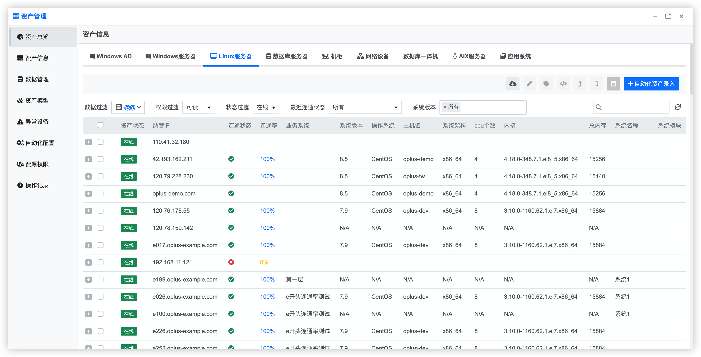
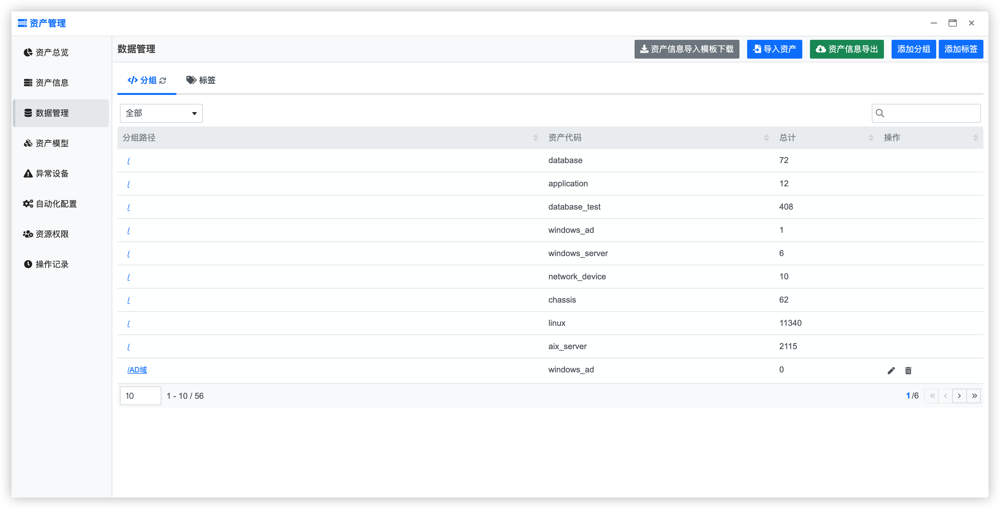
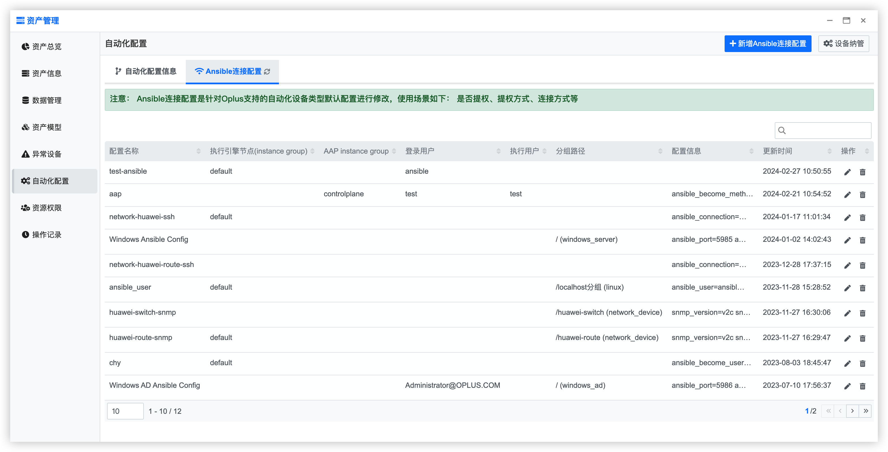
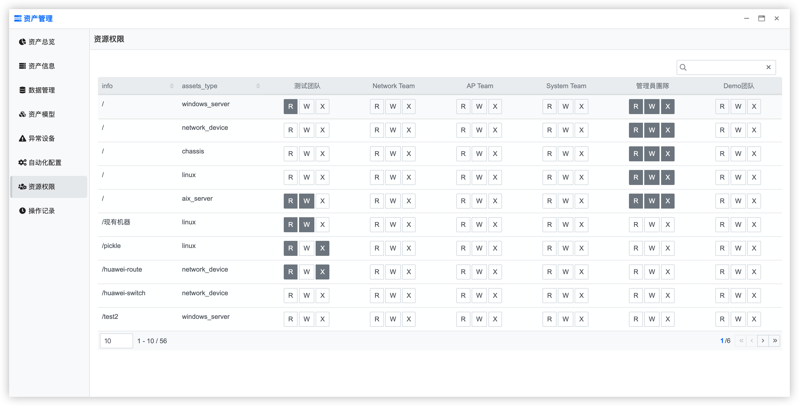

## 使用指南 {docsify-ignore}

### 功能概要

资产管理分为资产信息、资产模型、数据管理、自动化配置、异常设备几个功能模块，具体使用流程如下图：

资产管理界面如下图：

侧栏菜单，包括：

- 资产总览：当前管理资产的总体展示
- 资产信息：对导入的资产进行查询和管理操作
- 数据管理：对资产数据管理，包括分组、标签、资产导入、资产导出
- 资产模型：对资产模型进行查询和管理操作
- 异常设备：列举连通异常设备，对异常设备重新检测，导出异常设备信息等
- 自动化配置：对导入的资产进行自动化配置，包括纳管、`Ansible`配置等
- 资源权限：按照资产分组及用户所属团队给予资产不同的权限，包括：可读、可写、可执行权限
- 操作记录：展示用户在资产管理

### 资产信息

在左侧栏导航点击【资产信息】，进入资产界面，可对资产进行编辑、分组、标签、资产上下线管理

### 数据管理

在左侧导航栏选择【数据管理】，进入数据管理界面，数据管理页面展示的以分组、标签、条件为维度的资产数据管理，并对分组、标签、条件进行管理，同时可导入导出资产信息

### 资产模型

- 在左侧栏导航点击【资产模型】，进入资产模型界面，可对资产模型进行管理

- 模型录入/修改：

- 模型属性设置：

**注意：**资产模型分为自动化模型和非自动化模型

- 视图定义

资产的展示分为两块，一种是资产管理首页、另一种的执行作业所用的设备选择器。两种展示和方式都以表格形式展现。可在资产模型配置的视图解析中配置表格显示的字段，字段顺序。

### 自动化配置

在左侧导航栏选择【自动化配置】，进入自动化配置界面，该页面分为自动化配置信息和`Ansilbe`连接配置。

`Ansible`连接配置是针对`Oplus`支持的自动化设备类型默认配置进行修改

自动化配置是针对每一个自动化资产的默认连接配置进行修改

### 异常设备
在左侧导航栏选择【异常设备】按钮，进入异常设备页面，该页面展示的是所有连接最近一次连通测试失败的，或者连通率小于百分之五十的设备信息。此页面可手动执行设备连通性检查，手动采集设备资产信息，并且可以导出异常的设备信息。

### 资源权限
 资产分为以下权限

| 设备名   | 设备代码             |
| ----- | ---------------- |
| `R`   | 读          |
| `RW` | 读写   |
| `RWX` | 读写可执行    |

资产权限维度为团队和资产分组，若某一个某一个团队拥有某个分组的权限，那么团队内的所有人都拥有该分组的权限

拥有团队管理员角色的用户可以为各个团队分配分组权限

