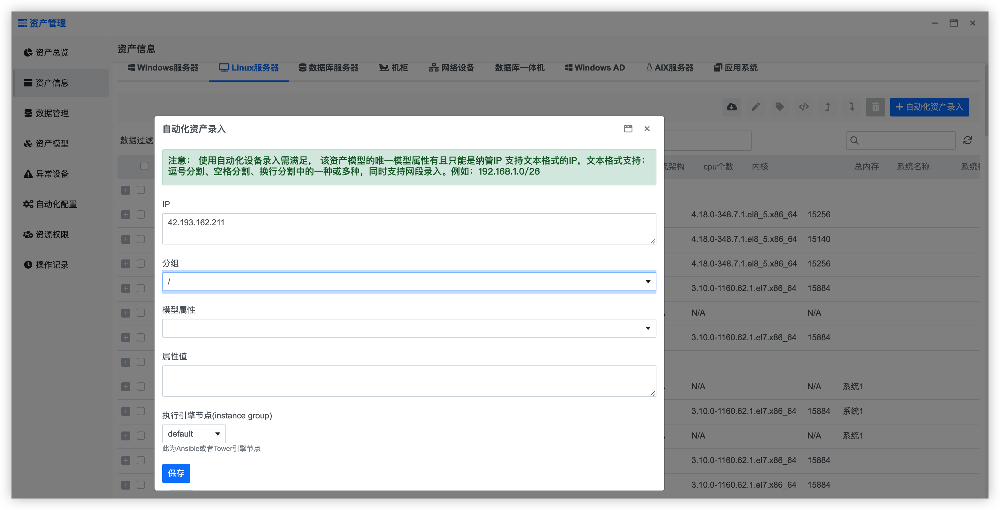
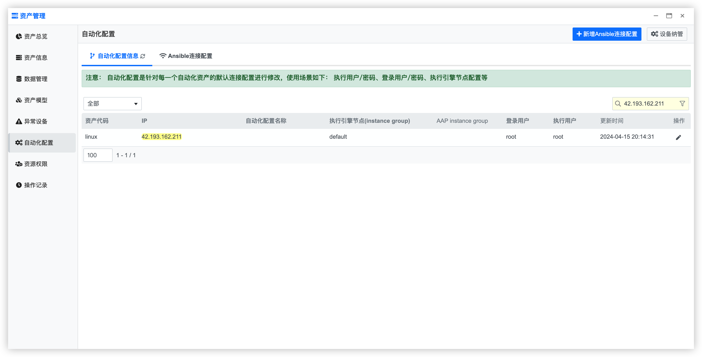
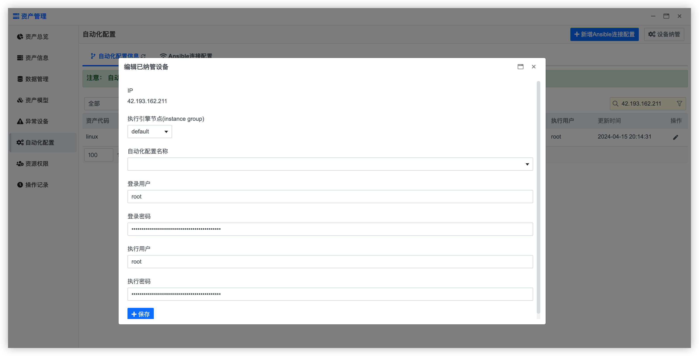
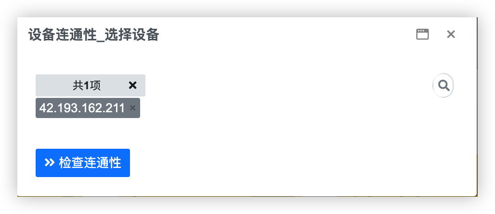
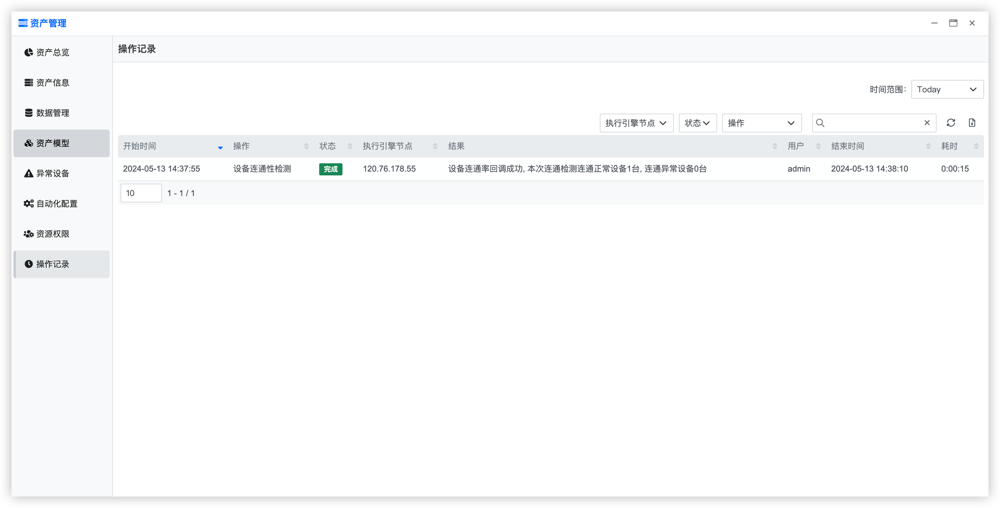

## 快速入门 {docsify-ignore}

### 示例：资产纳管

**步骤1：在【资产信息】页面点击【自动化录入】按钮，填写信息，录入一台linux服务器**

**步骤2：在【自动化配置】搜索已录入的的服务器，点击【表格】【操作】栏的编辑按钮，填写linux服务器上root用户以及密码**

**步骤3：在【异常设备】页面点击【检查连通性】按钮，选择已录入的服务器进行连通状态检查**

**步骤4：在【操作记录】页面查看【设备连通性检测】执行结果**

**步骤5：在【异常设备】页面点击【采集信息】按钮，选择已录入的服务器进行信息采集**

**步骤6：在【操作记录】页面查看【资产信息采集】执行结果**

**步骤7：在【资产信息】页面可以看到服务器的详细信息已经变化**

***至此，已完成资产的纳管，可以在【系统巡检】【补丁管理】【用户管理】等自动化场景模块中对已纳管服务器进行管理***
