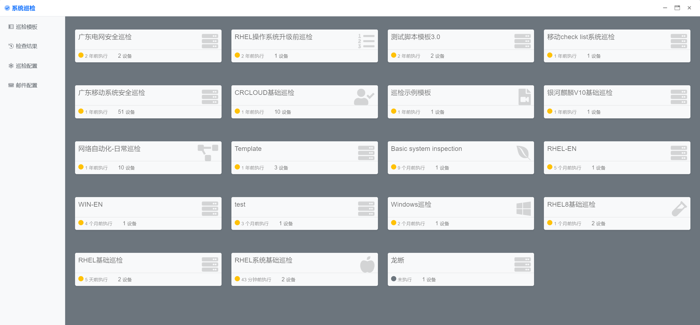
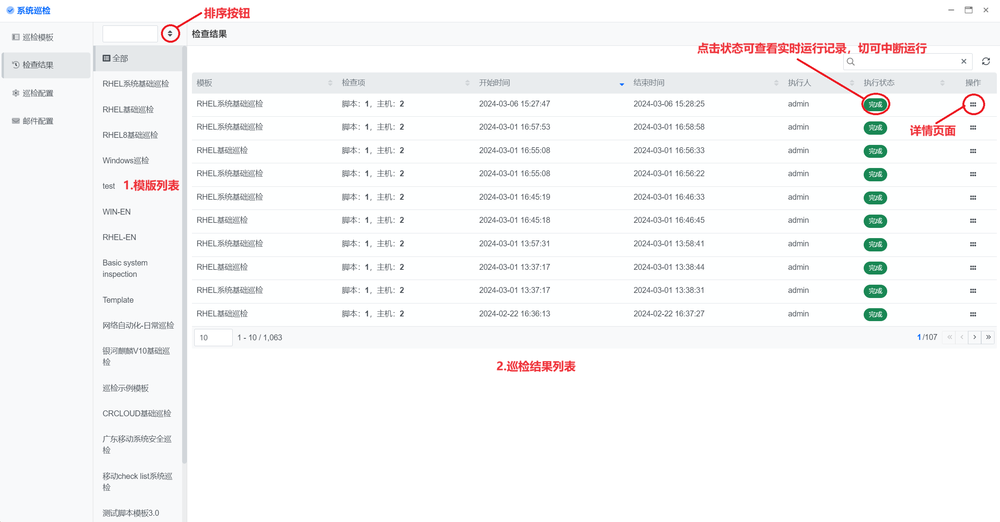
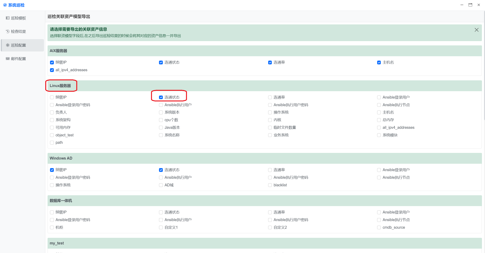
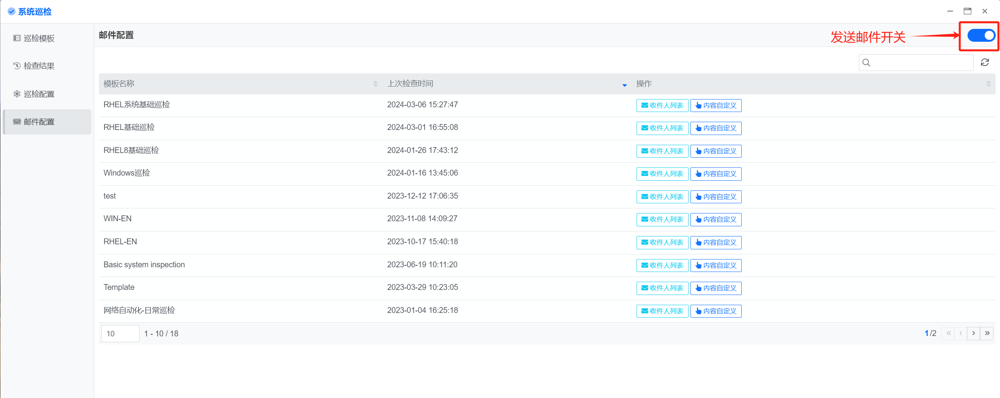
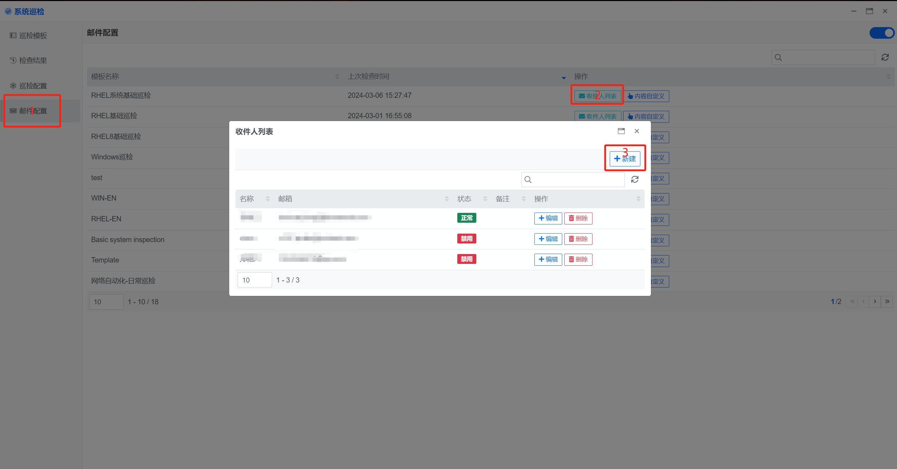
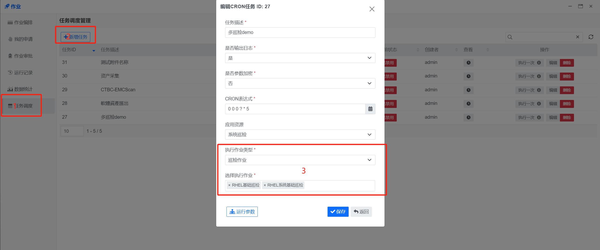

## 使用指南 {docsify-ignore}

### 功能概要
巡检的主要功能包括：巡检模板、巡检结果、巡检配置、邮件配置。

巡检的主界面如下，以卡片的形式展示各个巡检模板的概况。

### 巡检模板

1. 点击侧栏菜单【巡检模板】进入巡检模板列表

2. 点击页面右上角的新建模版进行新增模版，点击列表中的按钮可执行（点击执行时可进入执行界面，可从新选择主机执行）、修改、删除模版。

3. 模板的信息包括：

   - **名称**：概述巡检的简称，不超过50字。

   - **描述**：可选，巡检的用途、目的、使用方法等说明信息。

   - **图标**：可选。

   - **脚本**：巡检的脚本来自于[脚本库](gfs/guide)。点击选择文件，从脚本选择对话框中选择脚本。

   - **主机**：执行巡检脚本的目标机器。点击主机选择器，从主机选择对话框中选择要执行的主机（先选设备类型再选主机）。

> 注意：需要先在脚本库上传巡检脚本，脚本审核通过后才可以使用。  
> Playbook如果是以zip包形式上传的，选择zip文件；如果是以解压目录形式上传，选择对应的YAML文件，例如`site.yml`

### 检查结果

1. 点击左侧菜单栏“检查结果”，进入结果列表

   

2. 检查结果页面

   **模板列表**：列出所有执行过的巡检模板（默认显示全部），没有执行过的模板不会列出来（可排序）。

   **结果列表**：选择一个巡检模板，会列出该模板的所有执行记录。点击一条执行记录，可以查看当次巡检的结果。

3. 检查结果详情页面

   - 图右上角导出结果、可将巡检结果导出成excel（excel的列包含主机信息、可以根据巡检配置一起导出）

   - 结果大致分文三块，详情板块、指标板块、巡检项板块。

     **详情板块**：包含了执行状态（点击状态可查看详细的执行日志）、开始时间-结束时间、主机数、脚本路径。  

     **指标板块**：包含了KPI、主机概览、巡检概览、主机白名单操作（勾选主机设置白名单，下次执行该模版跳过白名单主机）。

     **巡检项板块**：

     ​	巡检项白名单：通过点击网格中的巡检项进入巡检项详情，再点击左下角的添加白名单即可设置巡检项白名单。

     ​	切换视图：默认以网格的形式展示、可通过`点击按钮【切换列表视图】`切换表格形式平铺展示。

   > 注意：主机白名单跟巡检项白名单不同点在于一个是主机维度`范围大`、巡检项维度`范围小`，共同点 生效范围为当前模版。

- **检查项状态**

- **通过**：检查项有明确的检查标准，并且检查结果符合标准
- **失败**：检查项有明确的检查标准，并且检查结果不符合标准
- **人工判断**：检查项没有明确的检查标准，需要人工查看检查结果数据来判断结果通过与否。
- **白名单**：检查项被设置成白名单后，该模版下次执行时 设置成白名单的检查下则会跳过。
- **缺数据**：检查过程中出现错误，例如主机无法连接，造成该检查项未检查，缺少相关的检查结果。

### 巡检配置

点击左侧菜单栏【巡检配置】，进入资产导出配置界面。

在巡检结果导出excel时，根据你巡检模版执行时选择的主机，通过主机类型（例如Linux）关联当前页面所显示的Linux服务器、并将勾选的字段一并导出在excel中。

### 邮件配置

点击左侧菜单栏【邮件配置】，进入邮件配置界面。

通过发送邮件开关进行控制是否发送邮件，发送邮件分为两种`【手动执行完成后发送、任务调度执行完成后发送】`

- 发送邮件的邮件服务器配置在哪？

  **答**： 【System Settings Center】-> 【电子邮件】 

  

- 收件人怎么填写？

  **答**：在巡检【邮件配置】列表中的`收件人列表`按钮

  ​	每个巡检模版都对应了一个收件人列表（可以有多个收件人），状态分为正常、禁用（只有正常状态的才会发送邮件）

  

- 发送的内容是什么？

  **答**：在巡检【邮件配置】列表中的`内容自定义`按钮

  ​	每个巡检模版都对应有自定义的内容，自定义内容可以为空

  ​	**自定义标题**：对应邮件的标题（默认标题是巡检模版名称）

  ​	**自定义内容：**对应邮件的内容（默认内容有巡检模版执行人跟执行时间、一个可视化的KPI、一个巡检的excel附件)

  ​	**巡检状态：**启用，巡检结果中的巡检项没有失败项则会在邮件标题前面加上【成功】有失败项【失败】，禁用则不加【xxxx】

  

- 任务调度在哪？

  **答**：【作业】-> 【任务调度】

  

  

  > **注意**：任务调度多巡检执行需要注意的点有，多巡检邮件标题名称在上图`框3`下面的运行参数填写（没有则发送默认的）、多巡检收件人怎么弄的（多个模版的收件人合并，每个人都发一份）、多巡检是将两个巡检的excel合并成一个excel文件。

  

  

