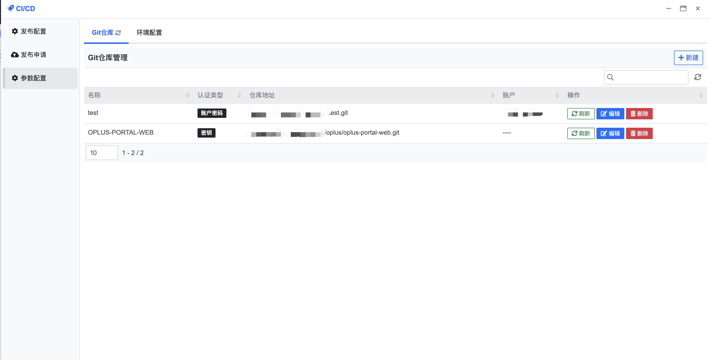
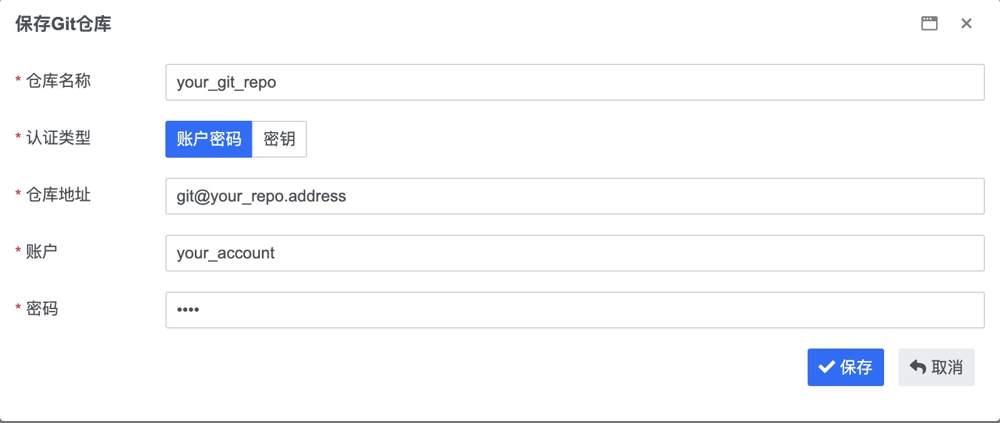
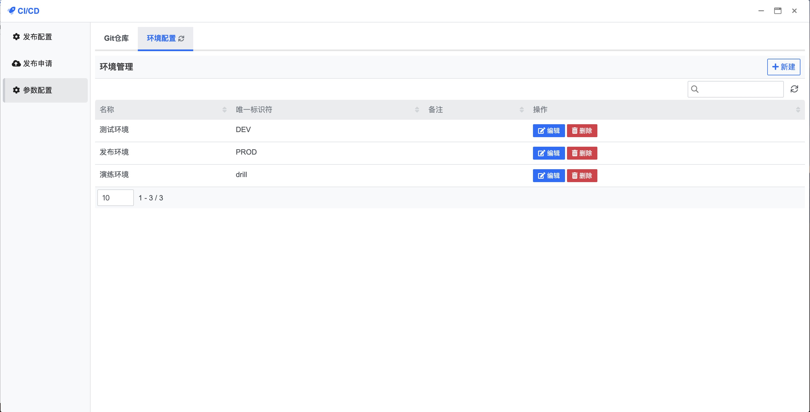
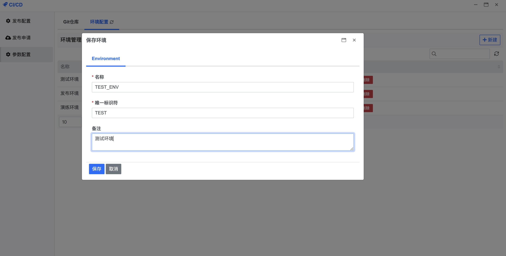
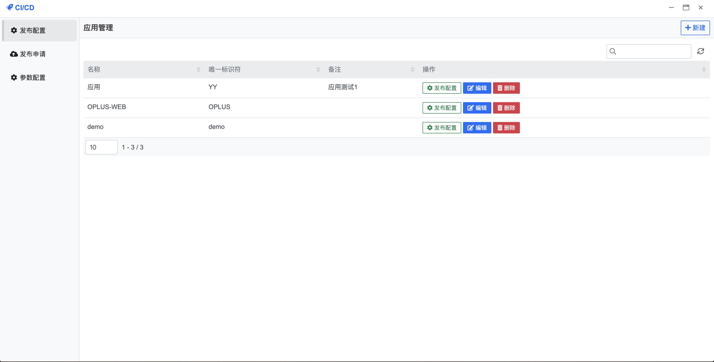
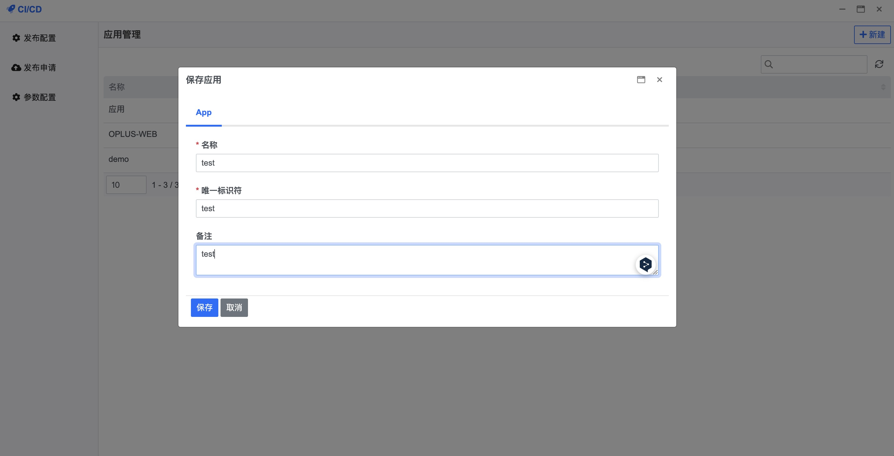
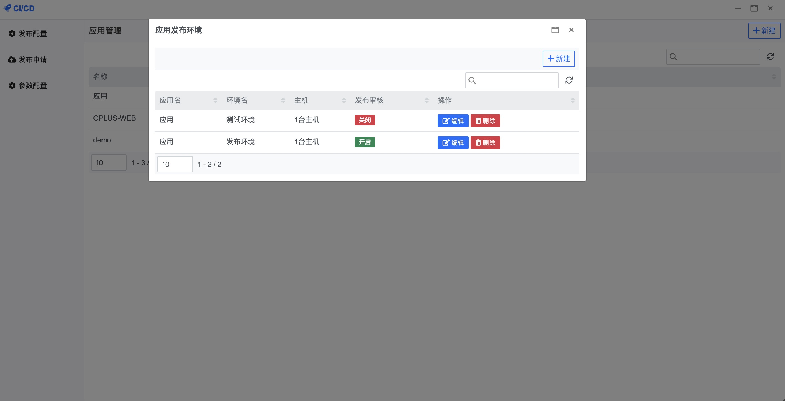
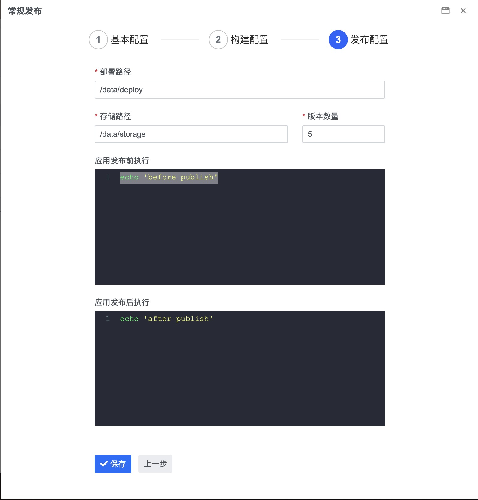
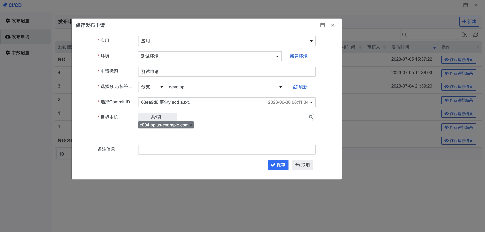
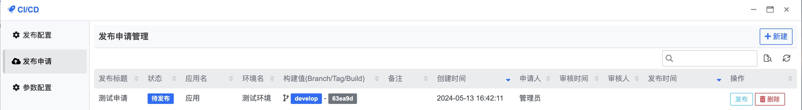

## 快速入门 {docsify-ignore}

**步骤1：进行 Git 仓库及环境配置**

首先从左侧菜单栏单击参数配置选项 如下图进入配置界面

在参数配置中, 单击右上角新建按钮, 在弹出的对话框中填写页面所展示的字段, 如下图

所有字段确认填写无误后单击保存按钮即可

在提示保存成功且列表中存在刚刚新增的记录后, 点击该条记录右侧操作栏的刷新按钮, 等待初始化, 该操作可能需要一定时间

接下来进行环境配置

在环境配置中, 单击右上角新建按钮, 在弹出的对话框中填写页面所展示的字段, 如下图

所有字段确认填写无误后单击保存按钮即可

**步骤2：进行应用发布配置**

首先从左侧菜单栏单击发布配置选项 如下图进入配置界面

在应用管理中, 单击右上角新建按钮, 在弹出的对话框中填写页面所展示的字段, 如下图

保存完成后 单击列表中的发布配置按钮

在弹出列表页面中, 单击右上角新建按钮

在弹出对话框中填写页面所展示的字段, 如下图

填写完毕单击保存按钮即可

**步骤3：填写应用发布申请**

首先从左侧菜单栏单击发布申请选项 如下图进入列表界面

在发布申请中, 单击右上角新建按钮, 在弹出的对话框中填写页面所展示的字段, 如下图

填写完毕后单击保存按钮, 若选择的应用环境无需审核, 在列表中单击发布按钮即可执行发布任务, 如下图

若需要审核, 等待管理员审核通过后, 再进行上图操作即可
