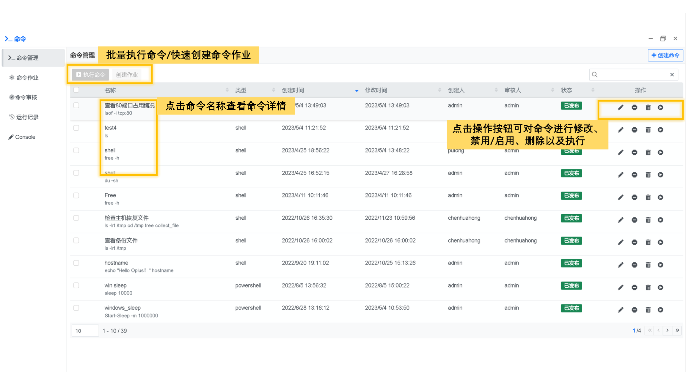
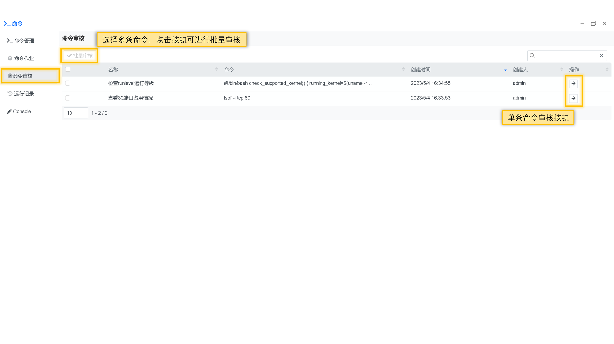
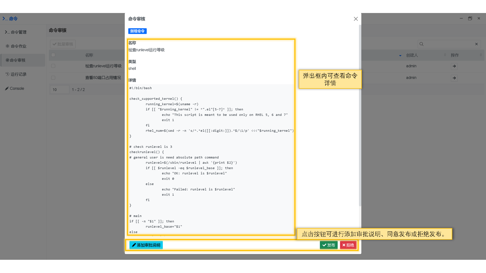
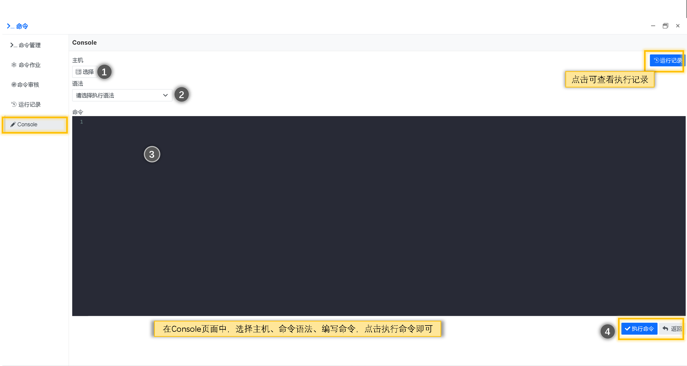

## 使用指南 {docsify-ignore}

### 命令列表
命令列表，展示命令名称、类型、创建时间、创建人、状态等信息。
在列表中点击命令名称可查看命令详情，点击操作按钮可对命令进行修改、禁用/启用、删除以及执行操作

### 命令作业
命令作业，由用户创建的一系列命令的集合，使得这些命令能够有序的执行，提高工作效率。

### 命令审核
命令审核用于审查和验证命令的可用性，其主要目的是确保用户只能执行安全、合法和授权的命令，
命令审核可以预防用户误操作、风险命令、人为疏忽或恶意攻击等风险，提高系统的可靠性和安全性。

### 运行记录
运行记录，记录命令的执行过程与结果。有输出结果、运行时间、运行状态、错误信息等。
运行记录可以帮助用户快速定位命令运行过程中的问题。

### Console
Console功能，及编及用，没用多余的操作，更快捷高效。
