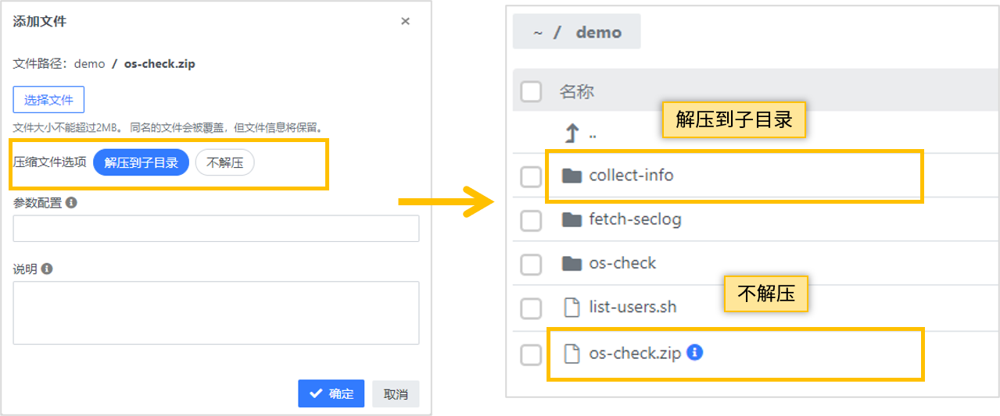

## 常见问题 {docsify-ignore}

### 脚本的参数配置
Q：上传脚本的时候，有一个参数配置的用途是什么？  
A：脚本的参数配置，可以用于设置脚本的命令行参数。在脚本测试运行，或者在“一键作业”模块创建作业的时候，
参数配置设置值会被作为参数。

### 如何更新文件信息
Q：如果只是想更新文件的描述或者参数，该怎么操作？  
A：如果我们只是想更新文件的描述或者参数时，只需在文件菜单选择【修改信息】菜单项，在对话框中对描述信息和配置参数进行重新编辑（无需重新选择文件上传）。

### 查看文件历史
Q：如何查看文件历史变化？  
A：点击修改日期展示列的时间标识，即可查看该文件的历史变化情况。

### 可以版本回退吗
Q：脚本库的文件可以回退到某个版本吗？  
A：目前文件变更历史只可以查看，还不支持版本回退。

### Playbook的格式
Q：Ansible Playbook由多个文件组成，怎样上传？  
A：Ansible Playbook支持两种形式保存在脚本库，一种是将playbook相关文件压缩成一个zip文件，
另一种是将playbook以一个文件夹形式保存在脚本库。我们建议使用后一种文件夹的形式，因为这样可以对里面的单个文件进行修改。
如果是以zip形式保存，在执行的时候，指定这个zip文件，如果是以文件夹形式保存，执行的时候要指定主yaml文件，一般是`site.yml`。

### 批量上传脚本
Q：如何批量上传脚本？  
A：可以把脚本压缩成一个zip文件，上传的时候选择【解压到子目录】


### 如何移动文件
Q：如何移动文件或文件夹？  
A：通过文件前面的复选框选择文件，在工具条点击按钮【剪切】，然后移动到目标文件夹，点击工具条按钮【粘贴】。

### 在主机清单中加入OPLUS服务器ip
Q：playbook脚本需要从oplus服务器上下载或上传文件，需要在hosts文件中硬编码加入oplus服务器ip？  
A：在playbook中的hosts文件加入`OPLUS_SERVER ansible_host={{OPLUS_SERVER}}`替换原本的oplus ip

原来的hosts文件内容：
```
# oplus服务器ip
81.71.132.71
[servers]
192.168.0.1
192.168.0.2
192.168.0.3
192.168.0.4
```
替换后的hosts文件内容：
```
OPLUS_SERVER ansible_host={{OPLUS_SERVER}}
[servers]
192.168.0.1
192.168.0.2
192.168.0.3
192.168.0.4
```

### 特别变量的使用
Q：开发指南中特别变量有什么用？  
A：若脚本作业中需要回传执行作业的`runId`或从执行用户的所属租户文件库上传下载/文件，就需要用到这些变量。

内置变量使用示例：
```yaml
# 以配置文件管理playbook示例
# 从文件库选取几个文件下发到目标主机的指定目录
# 使用内置变量后,无需传递传递参数变量 OPLUS_GFS_DIR 跟 OPLUS_SERVER 直接可在playbook中引用
# @param  file_list  逗号分隔的文件列表
# @param  dest_dir   目标目录
---
- name: test
  hosts: servers
  vars:
    ansible_tmp_dir: "/tmp/oplus/.tmp_file/"
  gather_facts: no
  tasks:
    - name: "创建ansible节点临时文件"
      file:
        path: "{{ansible_tmp_dir}}"
        state: directory
      recurse: yes
      run_once: yes
      delegate_to: localhost
    - name: 收集文件
      fetch:
        src: "{{OPLUS_GFS_DIR}}/{{item}}"
        dest: "{{ansible_tmp_dir}}"
        flat: True
      with_items: "{{file_list.split(',')}}"
      run_once: yes
      delegate_to: OPLUS_SERVER
    - name: 创建目标目录
      file:
        path: "{{dest_dir}}"
        state: directory
        recurse: yes
    - name: 上传文件
      copy:
        src: "{{ansible_tmp_dir}}{{item|basename}}"
        dest: "{{dest_dir}}"
        owner: root
        group: root
        mode: 755
      with_items: "{{file_list.split(',')}}"
```