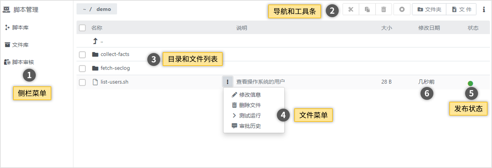
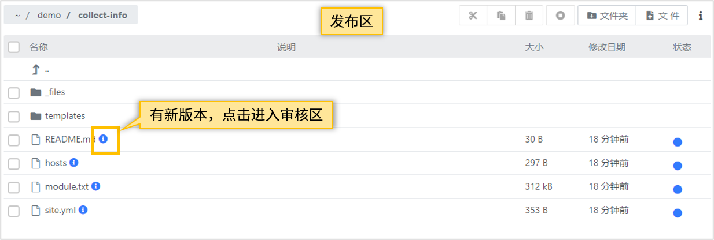
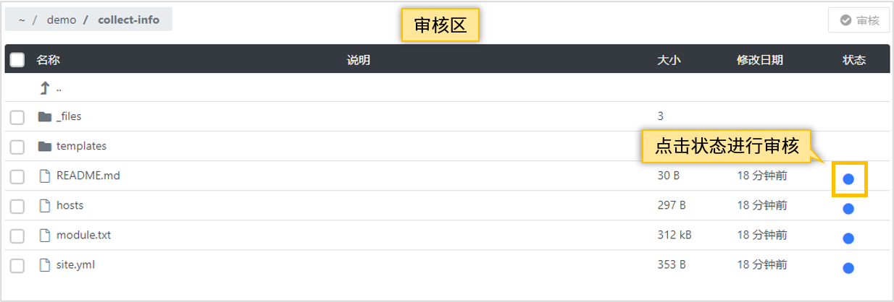
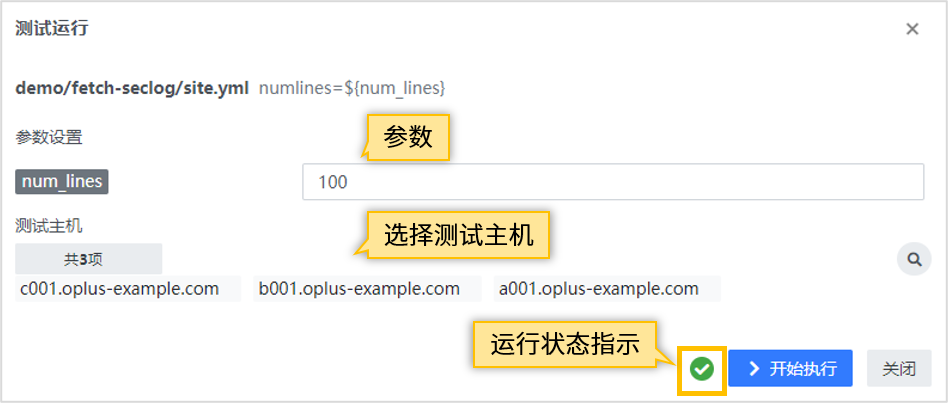

## 使用指南 {docsify-ignore}

### 功能概要

脚本库内部分为发布区和审核区两个区域。用户上传的文件先放在审核区，在审核通过后文件才会从审核区转移到生产区。
脚本库的管理流程如图。

脚本管理模块的主界面如图。

页面主要元素有：
1. 侧栏菜单，包括：
   - **脚本库**：脚本库发布区和审核区的文件展示。
   - **文件库**：普通文件上传管理展示。
   - **脚本审核**：进入审核区进行脚本审核，仅管理员可见。
2. 导航和工具条：可以进行上传文件、创建文件夹、文件编辑等操作。
3. 文件列表：列出脚本库或文件库的目录和文件
4. 文件菜单：对当前所选文件进行操作

### 脚本管理规范
> - 按照脚本的功能进行分类，不要随意丢放脚本，建立文件夹将不同脚本进行区分。
> - 脚本命名规范语义化，可以通过脚本名称了解该脚本的用途。
> - 上传脚本时，填写脚本说明，方便后期维护。

### 脚本上传

在脚本库页面点击上传文件按钮，打开添加文件对话框。参数说明：

- **选择文件**：点击按钮从浏览器客户端选择一个本地文件
- **压缩文件选项**：如果选择的文件是一个压缩包（目前仅支持ZIP格式压缩文件），将出现此选项。可以选择：
  - 解压到子目录：将压缩包解压后上传到子目录下
  - 不解压：将压缩包原文件上传
- **参数配置**（可选）：如果文件支持配置（例如命令执行参数）可以在这里填写
- **说明**（可选）：可以在这里填写文件的用途、目的、使用方法等描述信息，便于使用者理解这个文件

上传后对话框关闭，在文件列表中可以看到新上传的文件。

### 脚本审核

> 此操作需要管理员权限。
> 目前的检查依赖于人工完成，后续版本会增加辅助检查的手段。

脚本审核用于在脚本正式发布启用前对脚本进行功能、规范、安全等方面的检查。上传的脚本只有经过审核之后才会在脚本库发布，在审核通过之前放在脚本库的**审核区**。

#### 进入审核区
有两种方式进入审核区：
- 在侧栏菜单点击【脚本审核】
- 在脚本库中浏览文件，如果文件有新版本，点击新版本指示图标

#### 审核操作

可以针对单个文件进行审核，也可以对多个文件，或者一个目录进行审核。
- 单个文件：点击文件的状态进入审核
- 多个文件或目录：通过复选框选择多个文件或目录，点击上方的按钮【审核】进入审核

针对审核区的状态操作有：
- **发布**：文件移动到发布区，设为启用状态。
- **拒绝**：文件依然保留在审核区。设为拒绝状态时，需要填写备注说明，方便查看审核拒绝原因。
- **取消变更**：文件从审核区删除

### 脚本库的文件状态

脚本库中的文件有几种状态：

- **启用**：该文件已上线，可以正常使用。
- **停用**：该文件已被停用。停用的脚本不能执行、也不能在文件选择器、作业中调用。停用可以看将这个文件下线，但仍然保留在脚本库中，后期可以恢复启用。
  如果一个文件确定以后不再需要了，可以直接将文件删除。
- **新版本待审批**：用户修改了文件内容，或者上传了文件的新版本，但修改或新文件还没有审批，脚本库中的文件还是旧版本。
- **新版本被拒绝**：文件的新版本被拒绝启用，脚本库中的文件还是旧版本。

### 修改文件

点击文件菜单，选择菜单项【修改信息】，可以对文件的信息和内容进行修改。

> :pencil: **注意：**修改文件内容后，需要重新审核。

### 删除脚本

从脚本库删除脚本，会将脚本文件从发布区和审核区都删除，相关的数据库记录也将删除。

### 测试运行

### 查看修改历史

针对已经审核发布的脚本，点击文件列表的【修改日期】，将弹出最近的修改记录。点击其中一条记录，弹出对话框，显示详细的修改信息。
> 目前只支持查看历史版本，不支持版本回退

