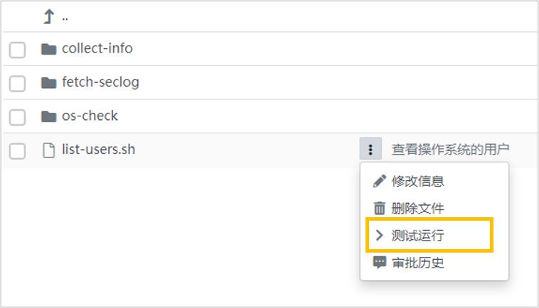
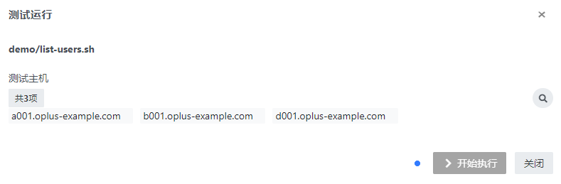
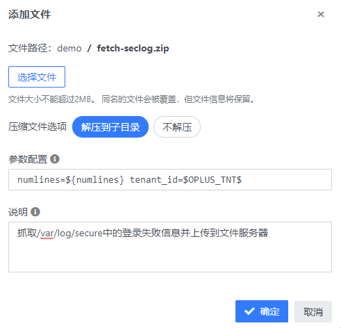

## 快速入门 {docsify-ignore}

我们通过几个示例来演示脚本模块的基本功能。

### 示例：列出远程主机的用户

**说明**：

在这个示例，我们往脚本库添加一个shell脚本。脚本功能是在远程主机上执行一条命令，列出当前系统的用户。通过这个示例，可以对以下内容有初步了解：

- 脚本库的概貌
- 如何上传、审批、执行脚本

**步骤1：准备脚本**

使用系统自带的`demo/list-users.sh`，或自行编辑一个shell脚本保存为`list-users.sh`，文件内容如下：

```bash
#!/bin/bash
cat /etc/passwd
```

**步骤2：在脚本库中准备文件夹（普通用户）**

登录系统，进入`http://{oplus_url}/#/gfs/r/$tnt/dir/`，页面展示出文件库根目录下的内容。
如果根目录下有名为`demo`的文件夹，可以跳过此步。点击右上方的按钮【文件夹】，在弹出的对话框中输入以下信息
- **文件夹名称**: demo

点击【确定】按钮，将创建文件夹并关闭对话框。

**步骤3：上传文件（普通用户）**

进入`demo`文件夹，点击页面右上方的按钮【文件】，在弹出对话框中输入以下信息：
- **选择文件**：选择`list-user.sh`
- **说明**：`查看操作系统的用户`

点击【确定】按钮，将上传文件并关闭对话框。

在文件列表中，可以看到刚上传的文件，文件名旁边有一个蓝色的圆点，表示这个文件待审核。
此时未经审核的文件存放在脚本库的审核区，需要管理员审批后才能进入正式的生产脚本库使用。

**步骤4：脚本审核（脚本管理员）**

以脚本管理员身份登录。在左侧导航选择菜单【脚本审核】，可以看到需要审核的目录和文件列表。
进入`demo`，看到刚才上传文件右侧的状态是“待审核”。点击状态，在弹出的对话框中选择【允许发布】，
点击按钮【确定】将关闭对话框，文件将正式发布到脚本库。

文件发布后，文件列表中的待审核文件消失。

**步骤5：测试运行（普通用户）**

以普通用户登录，进入脚本库，在`demo`目录下可以看到前面上传的文件状态已变为“已启用”。鼠标悬浮在文件名上，
点击右侧的按钮，在弹出菜单选择【测试运行】。



在测试运行对话框选择测试主机，点击按钮【开始执行】。


脚本开始在后台执行，按钮左边有图标指示当前的状态，需要等待十几秒钟等待作业完成。作业完成后，点击状态指示图标，可以查看执行的结果。


### 示例：收集远程主机日志

**说明**

这里示例，我们往脚本库添加一个playbook，脚本可以收集远程主机的`/var/log/secure`日志，并将收集到的日志上传到文件库。
通过这个示例，可以对以下内容有初步了解：

- 一次上传多个文件或一个目录
- 通过文件库作为一个内容的中转

**步骤1：准备playbook**

使用系统自带的Ansible Playbook `fetch-seclog.zip`，或者自行编辑下面两个文件`site.yml`和`hosts`，
并将这两个文件压缩成`fetch-seclog.zip`。

<!-- tabs:start -->
#### ** 文件 site.yml **
```yaml
#===============================================================================
# 抓取/var/log下的日志，将结果上传到文件服务器
# @param numlines 抓取的日志行数，默认500行
# @param host_group 如果不指定，默认使用servers组的主机
#===============================================================================
---
- name: "抓取日志"
  hosts: "{{host_group|default('servers')}}"
#  gather_facts: no
  vars:
    # 纳管机上的源文件路径
    var_srcfile: "/var/log/secure"
    # 抓取的日志行数
    var_numlines: "{{numlines|default(500)}}"
    # 纳管机上的目标目录
    var_destdir: "/tmp/{{var_srcfile | replace('/','_')}}"
  tasks:
    - name: "初始化变量"
      set_fact:
        # 保存在本地的目录，变量保存在localhost里面
        var_local_results_dir: "/tmp/oplus/host-results/{{var_srcfile | replace('/','_')}}"
      delegate_to: localhost
      delegate_facts: true
      run_once: true

    - name: "0. 准备目标目录"
      file:
        path: "{{var_destdir}}"
        # 确保远程主机上的目标目录存在
        state: directory

    - name: "1. 读取远程主机日志文件，保存在目标目录下"
      # 保存在目录{{var_destdir}}下，文件名为secure_{{ansible_nodename}}
      shell: tail -n {{var_numlines}} {{var_srcfile}} | grep "Failed password for" | sed 's/\x1B\[[0-9;]\+[A-Za-z]//g' > {{var_destdir}}/{{var_srcfile|basename}}_{{ansible_nodename}}

    - name: "2. 从远程主机取回检查结果至本地"
      fetch:
        src: "{{var_destdir}}/secure_{{ansible_nodename}}"
        dest: "{{hostvars.localhost.var_local_results_dir}}/"
        validate_checksum: no
        flat: yes

- name: "上传结果到文件服务器"
  hosts: "fileserver"
  gather_facts: no
  tasks:
    - name: "准备上传目录"
      file:
        path: "{{OPLUS_GFS_DIR}}/fetch-logs/"
        state: directory

    - name: "从本地上传文件至fileserver"
      copy:
        src: "{{hostvars.localhost.var_local_results_dir}}"
        dest: "{{OPLUS_GFS_DIR}}/fetch-logs/"
        force: true
```
#### ** 文件 hosts **
```ini
[servers]
#oplus-var:hosts

[fileserver]
#把下面的值替换为文件服务器的IP
127.0.0.1
```
> [!NOTE]
> 注意上面的`fileserver`地址要改成正确的oplus主机地址

<!-- tabs:end -->

**步骤2：上传文件**

将`fetch-seclog.zip`上传到脚本库的`demo`目录下，在上传对话框输入以下信息：

- **压缩文件选项**：`解压到子目录`
- **参数配置**： `numlines=${num_lines}`
- **说明**： `抓取/var/log/secure中的登录失败信息并上传到文件服务器`



点击按钮【确定】上传文件。上传完之后，可以看到`demo`下多了一个`fetch-seclog`的文件夹，里面有`site.yml`和`hosts`两个文件

**步骤3：审核脚本**

同之前示例。可以多个文件一次批量审批。

**步骤4：测试运行**

Playbook的主文件是`site.yml`，浏览到目录`demo/fetch-seclogs/site.yml`，点击菜单项【测试运行】。
在运行对话框中，比之前的示例多了一个参数设置，可以输入一个数字表示日志的行数。


脚本运行完后，点击左侧栏的【文件库】（或者输入`http://{oplus_url}/#/gfs/staticfs/$tnt/dir/`）进入文件库。
在目录`fetch-logs/var_log_secure`下可以看到所有主机的日志文件。

