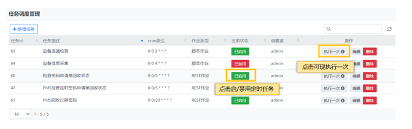
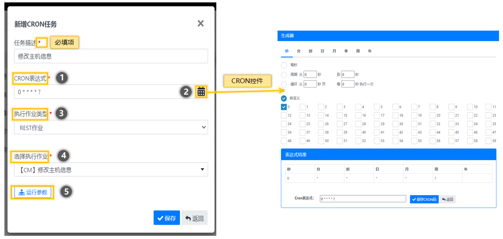
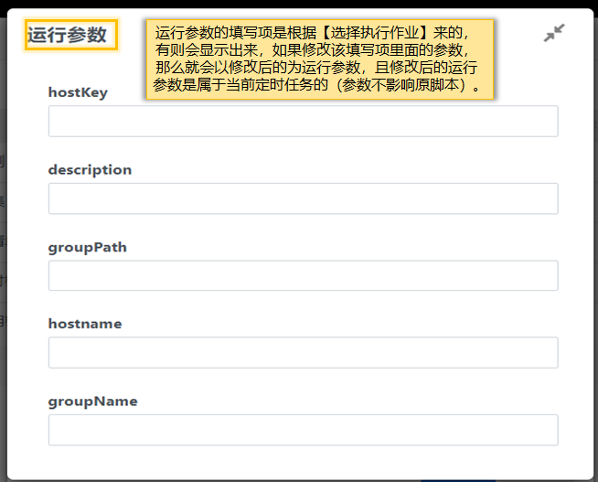

# 定时任务能力

定时任务能力又称任务调度，根据现有的脚本作业、REST作业、巡检作业进行任务调度，操作人员只需选择作业填写CRON表达式即可，CRON表达式提供了控件进行选择，降低了上手难度，且定时任务能力很好的提供了日期调度的机制（秒、分、时、日、月、季、周、年），从而实现单作业不同时间维度的调用。

#### 任务调度列表

#### 新增任务

##### ①.CRON表达式可手动填写或控件选择，手动填写需注意CRON规范。

##### ②.CRON控件提供了周期、循环、自定义、每秒 每分等等调度方式。

##### ③.执行作业类型包含三种脚本作业、REST作业、巡检作业。

##### ④.选择的执行作业类型后，会显示【执行作业类型】下对应的【选择执行作业】数据提供选择。 

##### ⑤. 点击运行参数后，会有显示对应【选择执行作业】的运行参数，该参数可修改保存，巡检作业无运行参数，不显示该按钮。

#### 运行参数

