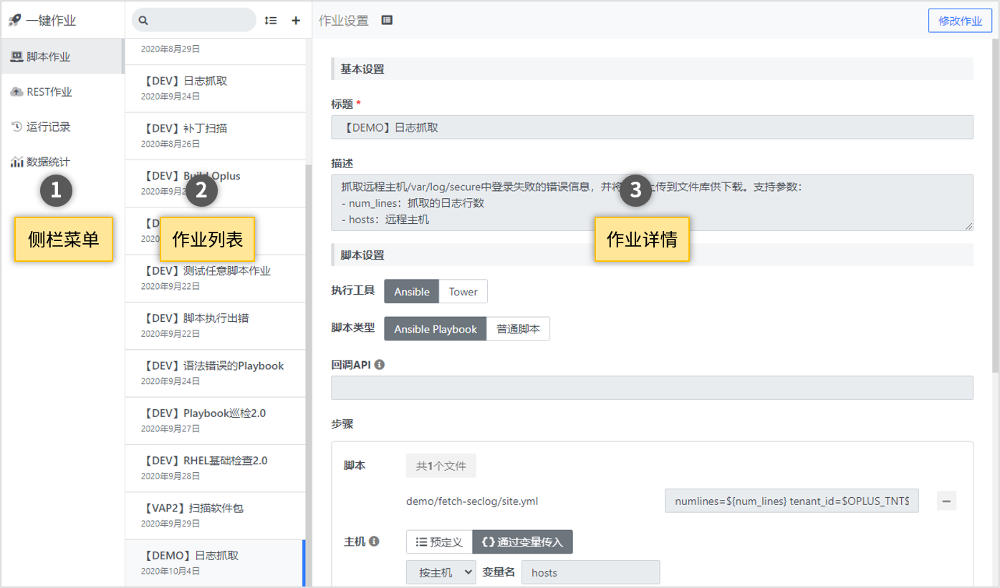
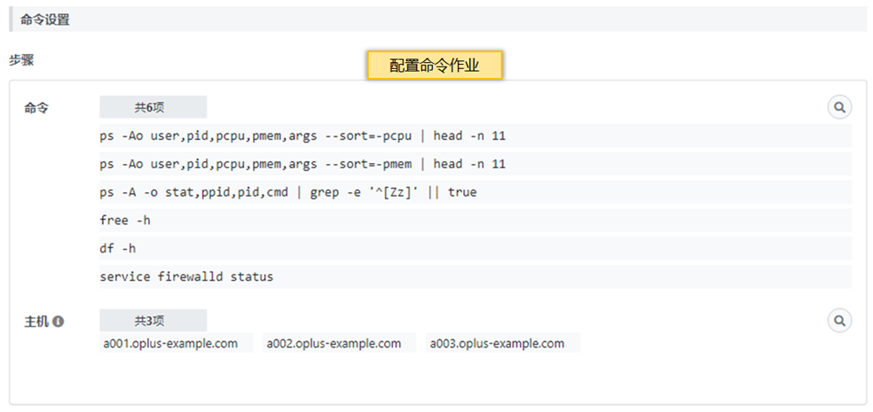
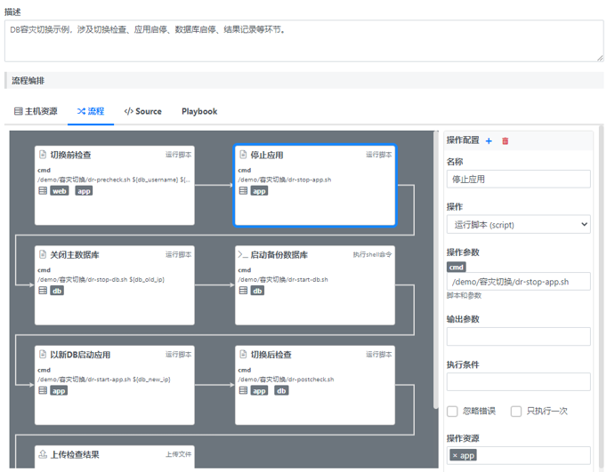
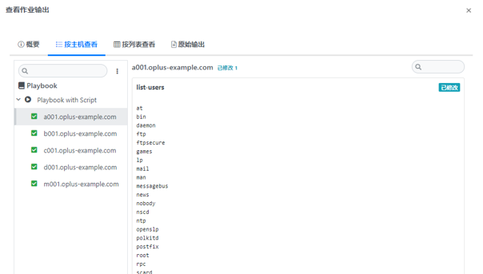
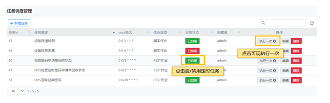

## 使用指南 {docsify-ignore}

### 作业列表 

主界面左侧显示当前类型的作业列表，右侧显示选中的作业详细设置。

### 新建或修改作业

在左侧作业列表上方点击按钮【+】，可以新建作业。

在右侧作业设置上方，点击按钮【修改作业】，可以对作业进行修改。

参见[作业设置](#作业设置)。

### 作业设置

:pencil: 不同类型的作业设置有不同，下面是各类作业的通用部分。

#### 基本设置

设置作业的最基础信息，包含以下属性：

- **标题**：标题文字将在作业列表中显示
- **描述**：用以说明作业的用途、使用方法、使用目的等介绍文字

#### 记录审计日志

可以设置是否在每次执行作业时记录日志。

- **模块名称**：用以标识属于哪个功能模块。例如漏洞扫描和补丁安装这两个作业，可以设置一个模块名称为“补丁管理”
- **操作名称**：用以标识这个作业代表的操作。例如漏洞扫描的作业，可以设置操作为“漏洞扫描”，补丁安装作业，设置操作名称为“补丁安装”。

#### 作业运行参数

作业运行时支持脚本参数、主机参数。
脚本参数可以自动从脚本的命令行定义中抽取，参数用`${参数名}`代替。

### 脚本作业设置

设置脚本的路径、参数、执行工具等信息。

- **执行工具**：用以执行脚本的工具，目前支持Ansible和Ansible Tower
- **脚本类型**：支持两类脚本
  * Ansible Playbook
  * 普通脚本：任意可执行脚本，例如shell、python
- **回调API**（可选）：回调API是一个完整的URL，此API会在脚本执行结束后调用。
如果设置了回调API，那么在脚本执行完成后，系统将调用此API，把脚本执行的数据传给API。
API可以对数据进行进一步处理。例如有一个脚本负责采集远程主机上的指标数据，需要对采集的数据进行入库、分析等处理，那么可以编写一个回调API，进行数据分析、入库的操作。
参考[回调API开发](jao/dev?id=回调api开发)
- **步骤**：如果是playbook类型的脚本，一个作业只支持**一个**步骤。

**步骤设置**

如果是普通脚本，一个作业可以支持多个步骤。adhoc类型的每个步骤包含一个或多个脚本，每个脚本可以在一台或者多台主机上执行。

- **脚本**：通过[脚本浏览器](gfs/file-selector)来选择脚本，脚本支持参数。
脚本参数支持`${变量名}`格式的变量。在执行作业的时候，变量会被同名的运行参数替换。 
普通脚本支持的参数形式，由脚本自身定义。
Playbook支持两种形式的参数。下面的例子中，`${param1}`和`${param2}`会在运行时被作业传入的参数替代。
  - **键值对格式**：`arg1=${param1} arg2=${param2}`
  - **JSON格式**：`{"arg1":${param1}, "arg2":${param2}}`

- **主机**：主机可以通过两种方式设定，静态主机（预定义）和动态主机（参数传入）。
    + **静态主机**：定义作业的时候，就固定好了主机，作业运行时按照预定义的主机上执行脚本。
    + **动态主机**：定义作业的时候，只是定义一个**主机变量**。这个变量值通过作业的运行参数来设定。

#### 参数和变量

参数和变量的目的是为了在作业运行时刻可以动态的改变某些作业设定，支持以下形式的变量。
- `${变量名}`：用`${`和`}`包括的变量，用在脚本的参数上。
- `主机变量名`：适用于动态主机，在作业运行时，根据运行时和变量名相同的参数值来确定要执行的主机。
- `%{系统配置参数}`：通过系统参数配置定义的参数，在脚本参数中可以使用
- `$系统内置变量$`：系统内置的变量，在脚本参数中可以使用，目前支持的内置变量有：
  - `$OPLUS_TNT$`：当前租户ID

### REST作业设置

REST作业设置只需要配置调用REST API的curl命令。

#### 参数和变量

见脚本作业设置

### 命令作业设置

命令作业设置需要选择配置好的原子命令，原子命令串联集一个作业命令。

### 流程作业设置 

流程作业的设置需要编排一个流程，将多个操作串联起来。

### 测试作业

在编辑模式下，点击【执行测试作业】可以试运行作业。

作业执行后，会显示作业的返回结果。

:bulb: **注意**：由于脚本作业是**异步**执行，所以返回值代表作业是否成功提交到了作业队列。点击【查看详细结果】，可以查看Ansible的执行输出。

### 删除作业

在编辑模式下，在作业设置的最下方，点击按钮【删除此作业】，可以删除作业。

### 运行日志

运行日志分为两种，一种是系统自带的运行记录，一种是每个作业自定义的审计日志。

运行记录是系统自带的，记录作业运行的状态和各种信息，每个作业执行时会自动记录以下信息：
* 作业ID
* 运行ID
* 操作人员
* 开始和结束时间
* 状态
* 运行参数
* 输出结果

操作日志是记录由开发人员自定义的消息，面向用户，更易读，模块化。

操作日志的信息包括：
* 运行ID

* 模块名称

* 操作名称

* 操作概要：简单字符串

* 操作详情：格式化的字符串。

点击一条记录可以查看该次作业运行的详情和输出。

### 定时任务

定时任务能力又称任务调度，根据现有的脚本作业、REST作业、巡检作业进行任务调度，操作人员只需选择作业填写CRON表达式即可，CRON表达式提供了控件进行选择，降低了上手难度。
且定时任务能力很好的提供了日期调度的机制（秒、分、时、日、月、季、周、年），从而实现单作业不同时间维度的调用。

#### 任务调度列表

#### 新增任务
1.	CRON表达式可手动填写或控件选择，手动填写需注意CRON规范。
2.	CRON控件提供了周期、循环、自定义、每秒 每分等等调度方式。
3.	执行作业类型包含三种脚本作业、REST作业、巡检作业。
4.	选择的执行作业类型后，会显示【执行作业类型】下对应的【选择执行作业】数据提供选择。 
5.	点击运行参数后，会有显示对应【选择执行作业】的运行参数，该参数可修改保存，巡检作业无运行参数，不显示该按钮。 

