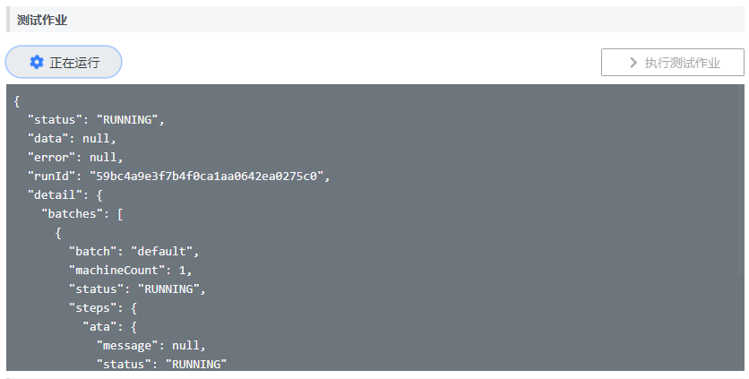
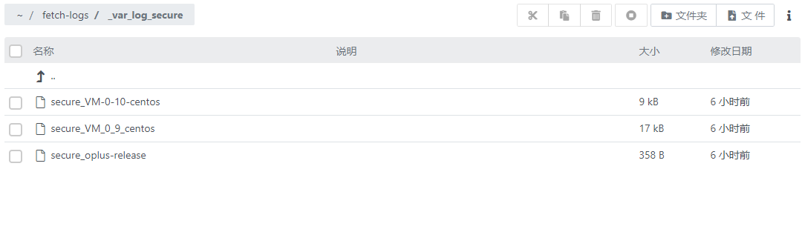

## 快速入门 {docsify-ignore}

### 示例：日志收集作业

**说明**

这个示例将创建一个脚本作业，使用脚本管理中用到的[日志采集脚本](gfs/quickstart)采集远程主机上的日志信息。
要求主机、采集日志行数可以作为参数，在执行作业时动态指定。通过这个示例可以了解：

- 作业功能的概貌
- 通过作业来执行一个脚本

**步骤1：准备脚本**

这里我们使用脚本示例中用到的Ansible Playbook `demo/fetch-seclog`。该Playbook支持参数：
- `numlines`：采集的日志行数（默认为500行）

**步骤2：创建作业**
1. 点击按钮【+】，新建一个作业，设置如下：
- **标题**：`日志抓取`
- **执行工具**：`Ansible`
- **脚本类型**：`Ansible Playbook`
- **步骤设置**
  * **脚本**：`demo/fetch-seclog/site.yml`
  * **脚本参数**：`numlines=${num_lines}`（脚本参数是脚本的配置参数，会自动带出）
  * **主机**：选择`通过变量传入`，主机类型下拉框选择`按主机`，变量名：`hosts`

2. 在作业运行参数，点击按钮【解析参数】，会自动添加2个参数`num_lines`，`hosts`。填写参数主要信息如下：

   | 参数名     | 默认值    | 显示名称（可选） | 描述（可选） |
   | ---------- | --------- | --------- | --------- |
   | `num_lines` | 1000       | 日志行数   | 从文件尾部算起的日志行数 |
   | `hosts`     | 127.0.0.1 | 主机 |  |

4. 点击按钮【保存修改】，保存作业。

**步骤3：测试运行**
1. 点击按钮【执行测试作业】，可以在下方看到作业执行结果。**由于脚本作业是异步执行，需要等待一段时间完成。**
   
2. 作业执行完成后，访问`http://{oplus-url}/#/gfs/staticfs/$tnt/dir/fetch-logs`，可以看到抓取的日志。
   

### 示例：创建一键日志收集工具

**说明**

基于上面的日志收集作业，创建一个可视化的操作界面。

**步骤1：创建页面**

1. 在导航菜单选择【自主页面】，进入自主页面模块

2. 点击按钮【新建】创建一个新页面

3. 设置页面标题为“一键日志收集”，保存。

**步骤2：页面配置**

1. 从左边的工具条，拖拽三个内容格以及“作业”、“主机选择”，“文件选择”三个组件到右边的画布，调整布局如图。
    

2. 设置“作业”组件属性如下：
   - **数据设定**
     * 选择作业：`日志抓取`
     * 参数hosts
       - 同步页面参数：`hosts`
       - 控件类型：`隐藏`

3. 设置“主机选择”组件属性如下：
   - **基础设定**
     * 同步页面参数：`hosts`
     * 参数值类型：`字符串`

4. 设置“文件选择”组件属性如下：
   - **基础设定**
     * 资料库类型：`文件服务器`
   - **样式**
     * 操作模式：`文件列表`

5. 保存页面

**步骤3：使用页面**

