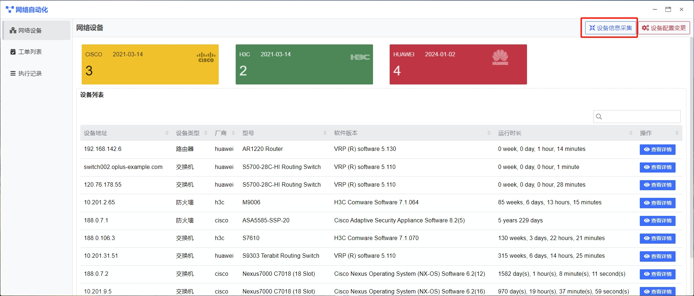
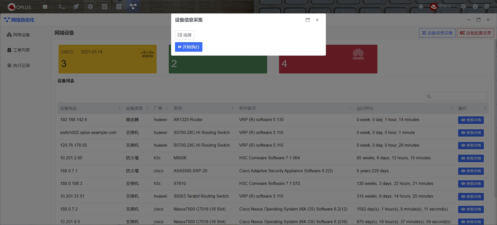
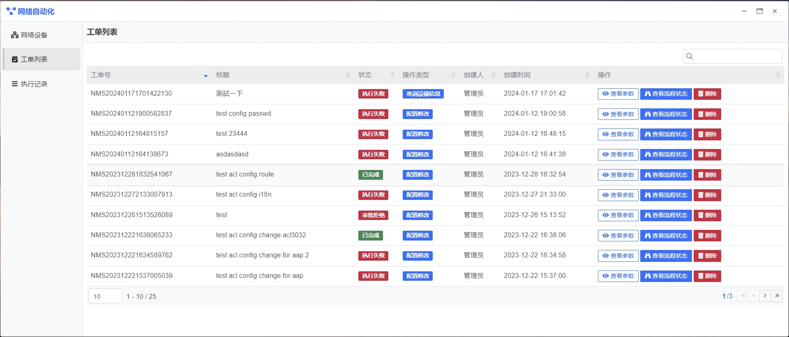

## 使用指南 {docsify-ignore}

### 功能概要

网络自动化主要功能包括设备信息展示、采集、设备配置信息修改等。

网络自动化界面如下图：

页面主要元素有：

1. 侧边栏：功能导航菜单

  - 网络设备：查看网络设备信息，对网络设备进行信息采集及配置修改
  - 工单列表：查看申请单信息，并审核配置修改的申请单
  - 执行记录：记录网络自动化的执行操作，支持查看操作详情

2. 功能操作：设备信息采集、设备配置变更
3. 数据指标：根据厂商类型分类统计当前的网络设备数量
4. 设备列表：显示设备信息列表

### 设备信息采集

在左侧栏导航点击【网络设备】，左上角点击【设备信息采集】按钮，进入设备选择界面

选择需要采集得设备信息，点击【确认】按钮执行设备信息采集。

执行完成后，在网络自动化首页可以看到所有执行过设备信息采集得网络设备的基础信息，包括：

- 设备地址
- 设备类型
- 厂商
- 型号
- 软件版本
- 运行时长

点击表格操作栏中的【查看详情】按钮，可进入详情查看页面，进入设备详细页面后，可看到如下信息：

- 设备基本信息（设备类型、厂商、型号、软件版本、运行时长、磁盘空间、内存大小）
- 接口列表
- 路由列表
- ACL配置
- 用户配置
- 系统配置
- 相邻的设备信息

### 设备配置变更

在左侧栏导航点击【网络设备】，左上角点击【设备配置变更】按钮，进入设备配置变更申请界面

**网络设备的配置变更需要管理员审核，管理员审核通过后才会执行本次修改配置的申请**

设备配置变更操作类型：

- **查询设备信息**： 查询指定设备的信息，查询的信息范围根据配置信息中输入的命令来返回。
  **示例**:
   
  `display version ##则返回设备基本信息`
  
  `display current-configuration ##返回当前配置`
- **配置修改**：修改指定设备的配置，修改范围根据配置信息中输入的命令来对设备配置进行调整
  
  **示例:**
  ***注意: 配置修改都是在管理界面中进行，所以在配置修改后，需要通过quit或者exit退出管理界面****
  - 修改ACL
  `acl 3000;
        rule 5 deny tcp source 192.168.1.3 0 destination-port eq www;
        quit;
   quit`
  - 新增用户
  `aaa;
      local-user test password cipher test; ##创建用户并设置密码
      local-user test privilege level 15;  ##设置用户权限
      local-user test service-type telnet terminal ssh; ##设置用户支持的登录方式
      exit;
   exit
  `

### 工单审核

在左侧导航栏选择【工单列表】按钮，进入工单审核界面，工单审核界面会展示所有的设备配置变更申请的记录，包含信息如下：

- 工单号
- 标题
- 状态
- 操作类型
- 创建人
- 创建时间

设备配置变更申请提交后，管理审批通过后，平台会自动执行配置修改的操作。在执行过程中，管理员可以手动终止执行流程。
审批拒绝后，申请流程终止，设备配置变更不会自动执行。
流程得执行结果可在【执行记录】中查看

### 执行记录

在左侧导航栏选择【执行记录】，进入执行日志页面,包括如下：

- **操作记录**：记录所有的设备信息采集，设备信息变更的操作。

可以点击记录中的状态栏查看执行详情

