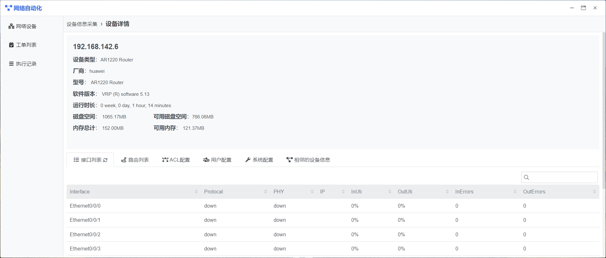
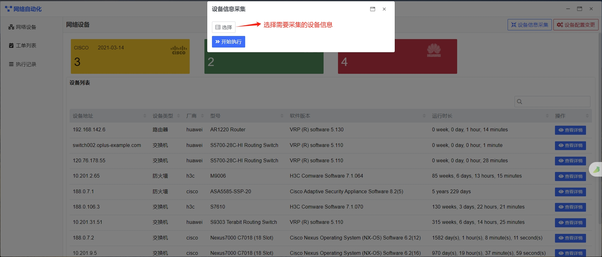
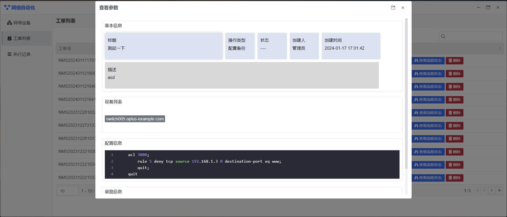
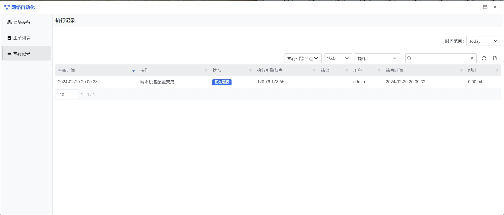
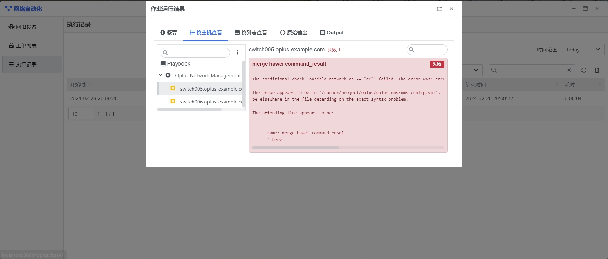

## 快速入门 {docsify-ignore}

我们在这里通过几个示例来演示网络自动化的基本功能。

### 示例：信息采集

**说明**

在这个示例，我们将对网络设备进行信息采集

**步骤1：查看网络设备信息**

登录系统，选择网络自动化应用，进入网络自动化首页，查看网络设备信息。

在设备信息列表中点击【查看详情】按钮，可查看设备详情

**步骤2：网络设备信息采集**
在首页上点击【设备信息采集】按钮，进入设备信息采集界面。选择需要采集的设备，然后点击【开始执行】按钮，系统会自动将任务下发，执行设备信息采集。同时可以在执行记录中查看到该操作的执行日志。

网络设备信息采集当前支持采集设备基本信息(设备类型、厂商、型号、软件版本、运行时长、磁盘空间、内存信息)，设备接口信息、路由列表、ACL配置信息、用户配置信息、系统配置信息、相邻的设备信息。

### 示例：网络设备配置变更

**说明**

在这个示例，我们会扫描出所选择主机中存在漏洞的信息，通过这个示例，可以对以下内容有一个初步了解：
在这个示例，我们会修改网络设备的配置，通过这个示例，可以对一下内容有一个初步了解：

- 如何修改网络设备的配置
- 支持修改网络设备的哪些配置

**步骤1：选择需要修改配置的设备，填写设备配置修改申请单**

登录系统，选择网络自动化应用，进入网络自动化首页，在首页中点击【设备配置变更】按钮，进入设备配置信息修改申请界面。

**申请单信息说明**

   - **标题(必填):** 申请单标题，用来概括本次申请变更的范围。
   - **操作类型(必填):**
        - **查询设备信息:** 自定义查询指定设备的信息，并更新平台中的设备信息
        - **配置修改:** 修改设备的相关配置信息，更改成功后，自动更新平台中的设备信息
   - **选择目标设备(必填):** 选择需要修改、查询的设备。
   - **账号(选填):** 填写连接设备的账号信息。
   - **密码(选填):** 填写连接设备的密码信息。
   - **Enable密码(选填):** 填写连接设备的特权密码信息。
   - **配置信息(必填):** 填写需要修改配置的相关命令，填写需要查询信息的相关命令。
       - **例：修改设置设备的ACL**
    
        `  acl 3000;
            rule 5 deny tcp source 192.168.1.3 0 destination-port eq www;
            quit;
         quit`
        
       - **例：查询设备的配置信息**
         `display current-configuration
   `
   - **描述(选填):** 填写申请单的描述。

信息填写完毕，点击【确认】按钮，提交网络设备变更申请。

**步骤2：申请单审核**
提交申请后，会自动生成配置修改申请单，通过左侧导航栏【工单列表】中可以查看当前需要审核的工单信息。

**申请单状态说明：**
   - **待审批:** 等待管理员审批。
   - **审批拒绝	:** 管理员拒绝此配置修改。
   - **手动终止	:** 管理员手动终止流程，配置变更未完成。
   - **执行失败	:** 管理审批通过后，平台自动执行变更操作失败。
   - **已完成:** 管理审批通过后，平台自动执行变更操作成功。

设备配置修改需要管理员审核通过后才会执行，在【工单列表】中，管理员可以选择审核通过、拒绝、查看参数、查看流程状态。
  - **审核通过：** 申请被管理员通过后，平台会根据申请单的信息，自动执行配置修改操作。
  - **拒绝：** 申请被管理员拒绝，申请流程终止。
  - **查看申请参数：** 管理员可查看申请单的详情。
  - **查看流程状态：** 管理员可查看当前申请对应的流程的具体状态。
 
 **查看申请参数**

**查看流程状态**  
  
  
 
### 示例：查看操作日志
通过左侧菜单栏【执行记录】可以查看网络自动化模块的执行记录，包括设备信息采集，设备配置变更等。

**查看操作记录**

**查看记录详情**  

