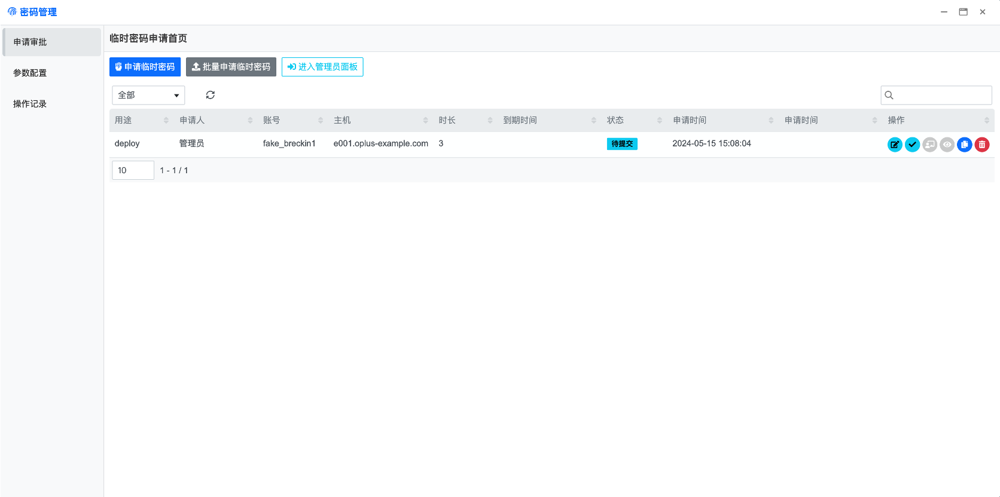
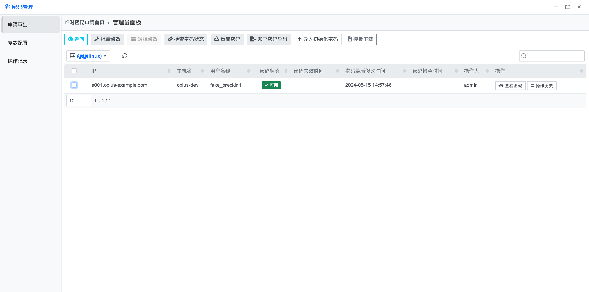
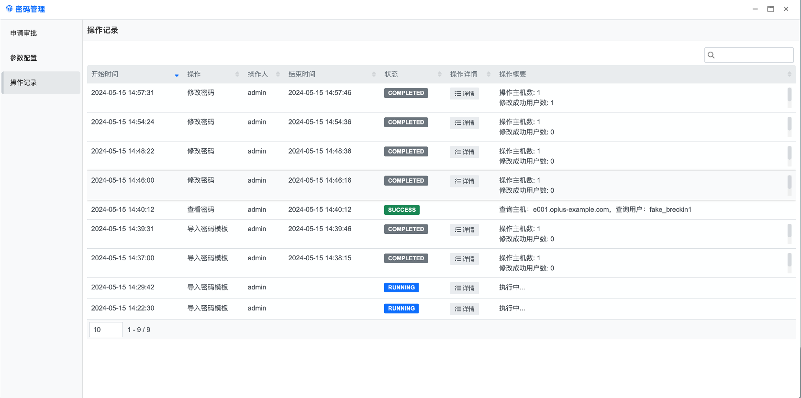

## 使用指南 {docsify-ignore}

基本流程如下：

### 申请审批

#### 临时密码申请

临时密码申请页面用于普通用户申请临时密码

***功能说明***

- 申请临时密码：运维人员填写临时密码申请单，待管理员审核通过之后，系统会根据申请单中的主机、账号生成临时密码，供普通用户使用。
- 批量申请临时密码：用于申请多台主机、多个不同账号的密码
- 进入管理员面板：管理员面板入口，只有具备密码管理管理员角色的用户可见

***表格操作列按钮说明（从左至右）***

- 编辑：编辑选中申请单，只有状态为**待提交**的申请单可以编辑

- 提交申请：提交申请单，提交之后状态会更新为**已提交**

- 审批：**管理员**可以处理状态为**已提交**的申请单，通过审批之后将会根据申请单中的主机、账号生成临时密码，申请单状态将会更新为**密码已生成**。拒绝审批申请单状态将会更新为**已拒绝**，已拒绝的申请单无法再次编辑。

- 查看临时密码：申请人可以通过此按钮查看状态为**密码已生成**的主机账号密码

- 删除：删除申请单，只有状态为**待提交**的申请单可以删除

  

#### 管理员面板

管理员可以在此页面管理主机账号密码

***功能说明***

- 返回：回到临时密码申请页面

- 批量修改：批量修改指定主机账号的密码

- 选择修改：通过选择表格中的条目，修改指定的主机账号密码

- 检查密码状态：将系统中保存的账号密码与主机上的账号密码进行对比，确认系统中保存的密码是否可用

- 重置密码：根据密码重置策略，使用初始密码或者生成随机密码重新设置主机上的账号密码

- 账号密码导出：导出系统管理的主机账号密码

- 导入初始密码：将需要修改的密码信息，按模板填写并上传。系统将根据文件中的信息，批量修改对应主机的用户密码。修改后的密码作为初始密码

- 模板下载：下载初始密码导入模板

  

### 参数配置

### 操作记录

