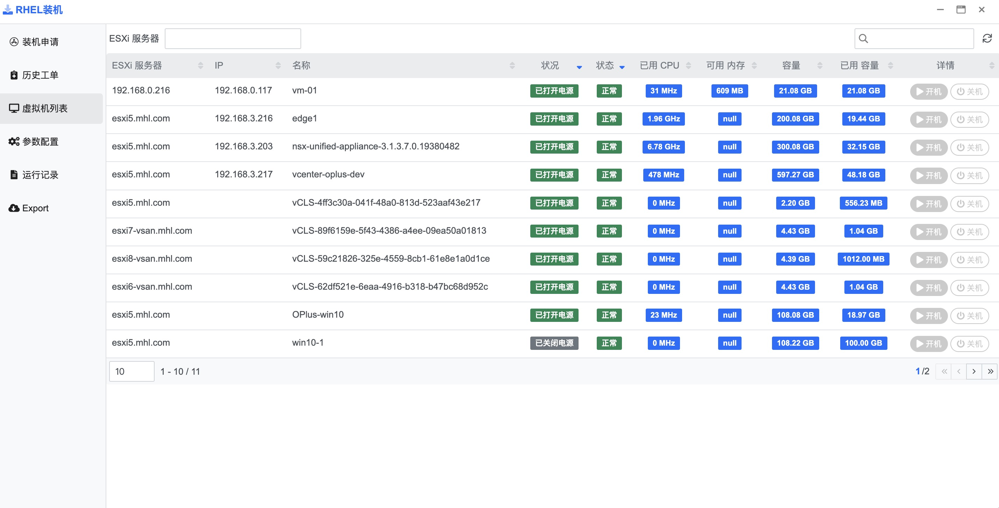

## 使用指南 {docsify-ignore}

### 功能概要

RHEL装机 主要功能包括装机工单填写及审批, 装机任务下发, 虚拟机列表及 vCenter Server 配置。

RHEL装机界面如下图：

### 装机申请

在左侧栏导航点击[装机申请]，单击右上角[创建申请]按钮新建工单

工单部分字段如下图所示

### 历史工单

在左侧栏导航点击[历史工单]，单击列表内[查看参数]可以查看工单详情, 单击列表内[流程执行状态]可以查看当前工单流程状态

### 虚拟机列表

在左侧栏导航点击[虚拟机列表]，进入虚拟机列表页面

### 参数配置

在左侧栏导航点击[参数配置]，进入参数配置页面

