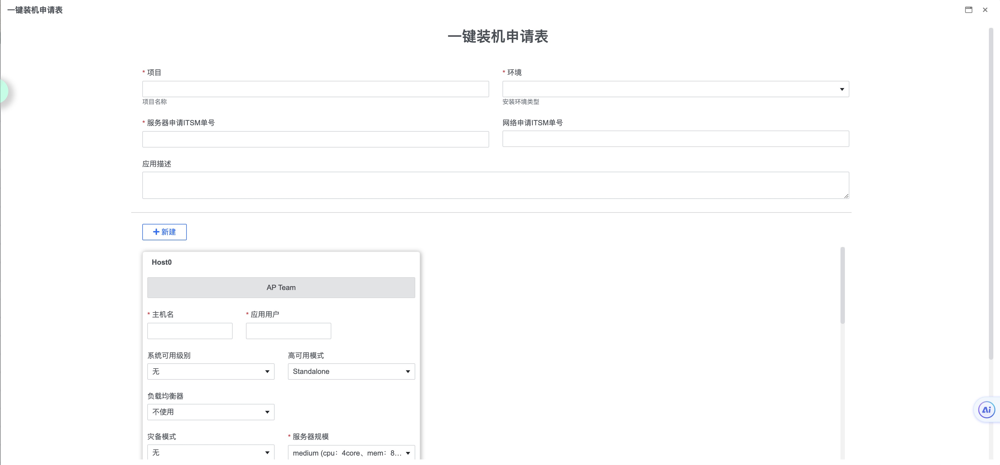
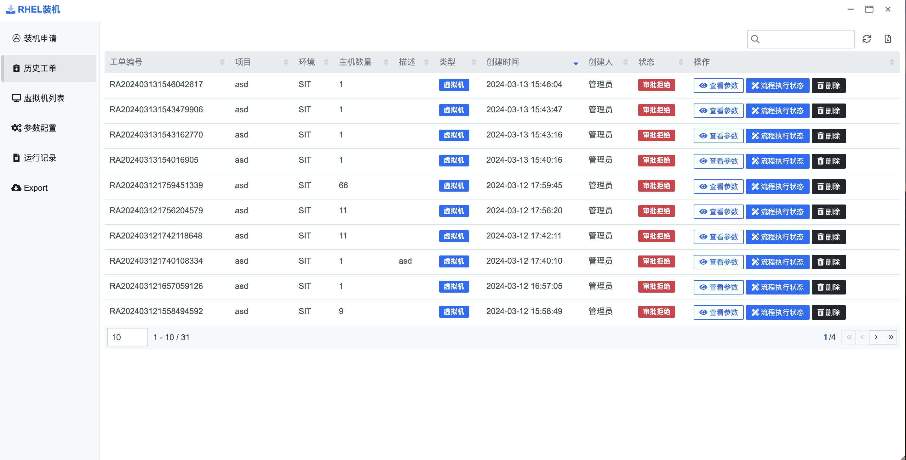

## 快速入门 {docsify-ignore}

**步骤1：进行 vCenter Server 配置**

首先从左侧菜单栏单击[参数配置]选项 如下图进入配置界面

在参数配置中, 单击右上角[新增 vCenter 服务器]按钮, 在弹出的对话框中填写页面所展示的字段, 如下图

所有字段确认填写无误后单击[测试连接]按钮, 若提示连接成功, 单击[保存]按钮即可, 若连接失败或超时, 请检查服务器及账号密码是否有误, 或服务器相应端口/防火墙策略未打开或放行

在提示保存成功且列表中存在刚刚新增的记录后, 查看该条记录状态为上线即为新增成功

**步骤2：填写装机申请工单**

首先从左侧菜单栏单击[装机申请]选项 如下图进入配置界面

在[装机申请]中, 单击右上角[创建申请]按钮, 在弹出的对话框中填写工单展示的所有必填/选填字段, 如下图

提交完成后 不同团队会根据流程流转进度在列表内展示工单, 该团队相关人员可以填写关联字段, 并根据工单其他字段决定是否审批该工单并流转到下一流程步骤

当所有团队完成该工单后, 流程将根据该工单自动下发装机任务, 工单详细参数/装机任务运行状态及流程运行状态可以在历史工单中查看

