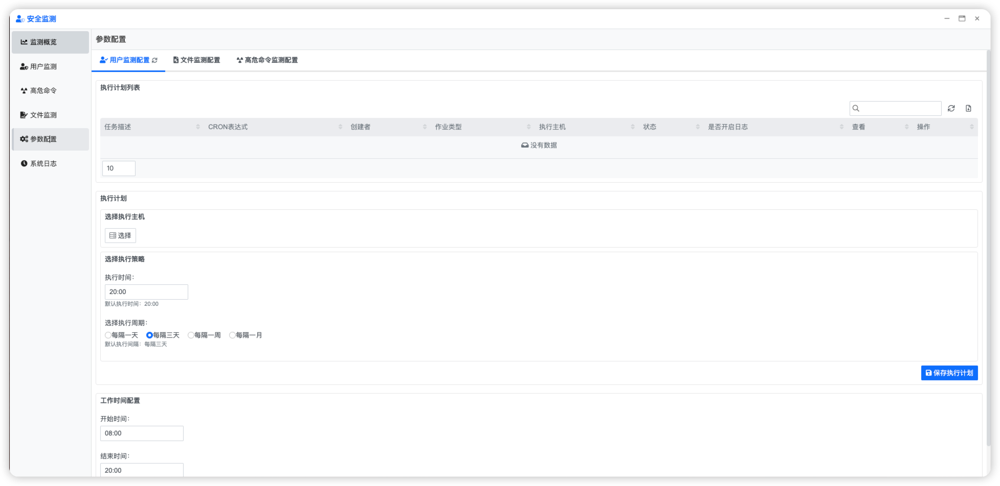
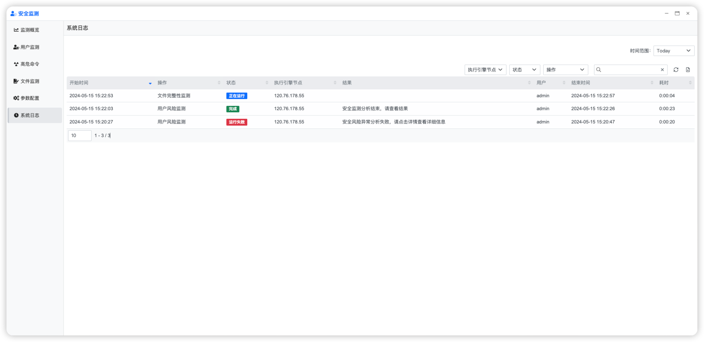

## 使用指南 {docsify-ignore}

### 功能概要

对Linux作业系统上的使用者和档进行风险监测

### 首页

### 用户扫描

在左侧导航栏选择【用户监测】按钮，进入用户监测页面，点击右上角可以手动发起用户风险检查

### 文件扫描

在左侧导航栏选择【文件监测】按钮，进入文件监测页面，点击右上角可以手动发起文件风险检查

### 参数配置

在左侧导航栏选择【参数配置】按钮，进入参数配置页面，可以配置用户监测和文件监测的相关参数

### 日志报告

在左侧导航栏选择【系统日志】按钮，进入系统日志页面，可以查看用户监测和文件监测的日志报告

