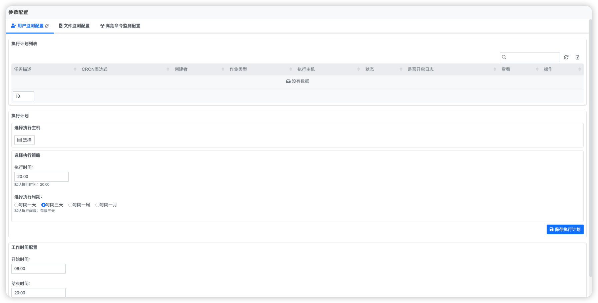
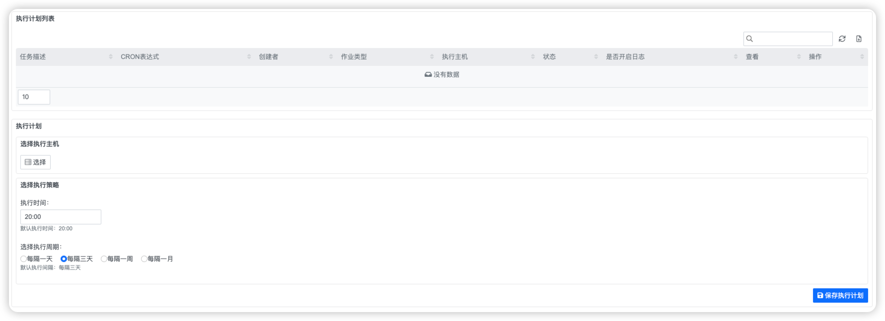

## 快速入门 {docsify-ignore}

我们在这里通过几个示例来演示安全监测基本功能。

### 示例：用户监测

**说明**

在这个示例，我们将对如何使用用户监测有一个基本的了解

**步骤1：参数配置**

登录系统，进入`http://{oplus_url}/oplus/base/#/applets/sfm`，页面进入安全监测首页，
在左侧导航栏选择【参数配置】按钮，进入参数配置页面，进入用户监测配置页面，可以看到如下配置项：

点击【选择】按钮，选择需要进行用户监测的主机

输入执行时间，例如：22:00（建议在夜间低频时段）

选择执行周期，可以选择【每隔一天】、【每隔三天】、【每隔一周】、【每隔一个月】

工作时间配置，指定工作时间段，例如：8:00-18:00

保存以上配置后，会根据设定的周期和工作时间进行用户监测

**步骤2：手动扫描**

在左侧导航栏选择【用户监测】按钮，进入用户监测页面，点击右上角【用户风险检查】按钮，系统会立即进行用户监测

### 示例：文件监测

**说明**

在这个示例，我们将对如何使用文件监测有一个基本的了解

**步骤1：参数配置**

登录系统，进入`http://{oplus_url}/oplus/base/#/applets/sfm`，页面进入安全监测首页，
在左侧导航栏选择【参数配置】按钮，进入参数配置页面，进入文件监测配置页面，可以看到如下配置项：

点击【选择】按钮，选择需要进行用户监测的主机

输入执行时间，例如：22:00（建议在夜间低频时段）

选择执行周期，可以选择【每隔一天】、【每隔三天】、【每隔一周】、【每隔一个月】

保存以上配置后，会根据设定的周期和工作时间进行文件监测

其他配置包括：aide保持默认配置即可

**步骤2：手动扫描**

在左侧导航栏选择【文件监测】按钮，进入文件监测页面，点击右上角【文件风险检查】按钮，系统会立即进行文件监测

