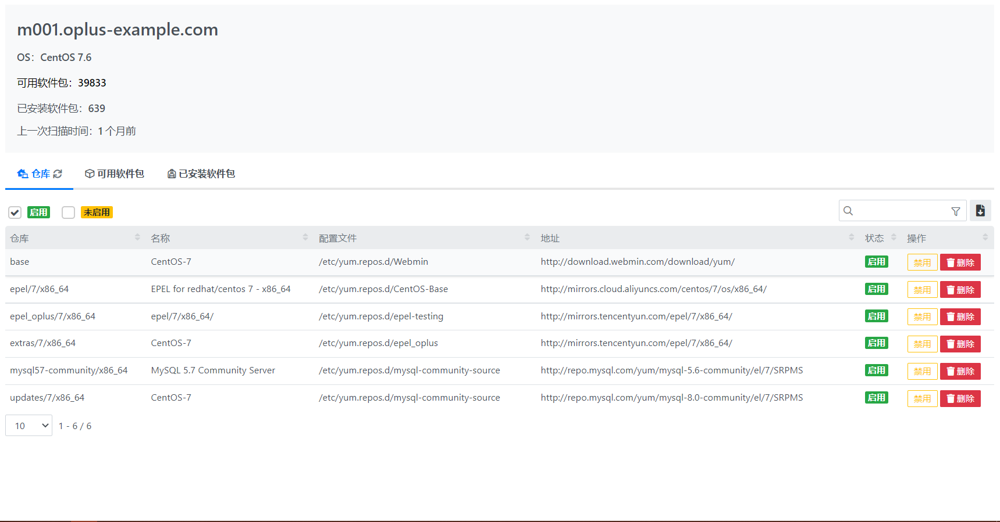
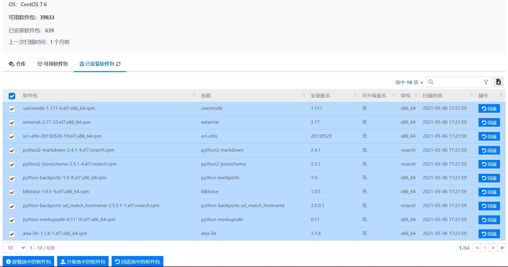
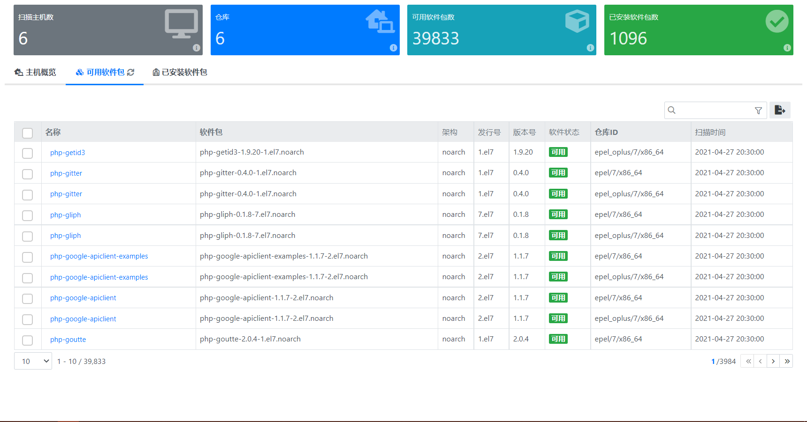
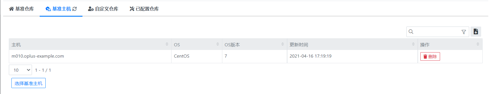
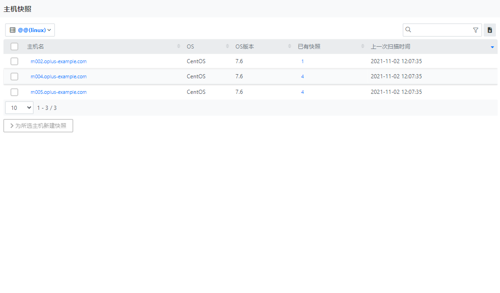
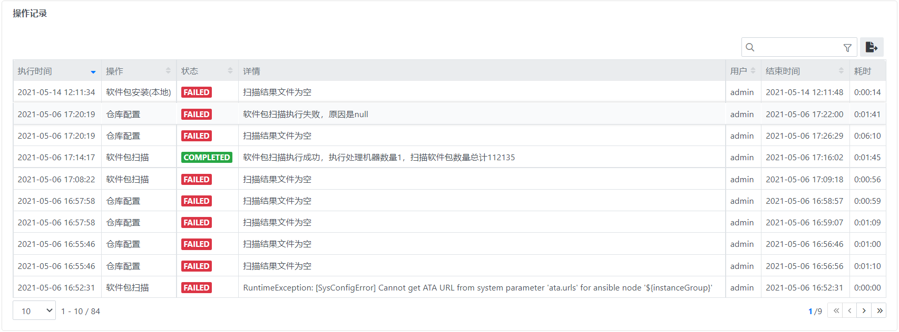

## 使用指南 {docsify-ignore}

### 功能概要

软件包管理分为软件包管理，Yum仓库管理几个功能模块，具体执行流程如下图：

软件包管理界面如下图：

页面主要元素有：

1. 侧边栏：功能导航菜单

    - 软件包：软件包数据概览，可对软件包进行安装、升级、回滚、卸载
    - 仓库：统一配置管理Yum仓库
    - 本地安装：针对Yum仓库中不存在离线软件包进行安装
    - 日志报告：对于所有操作记录，详细记录，方便回溯

2. 数据指标：对于软件包扫描，统计可用软件包个数和已配置仓库个数
3. 主机概览：展示主机扫描、软件包安装、升级、回滚、卸载等详细信息

### 软件包

1. 主机概览

- 单台主机扫描详情

显示该主机已配置仓库详情，包括：
    - 仓库
    - 仓库名
    - 配置文件
    - 仓库地址
    - 仓库状态（启用、停用）
    
- 单台主机可用软件包
显示当前所选主机已配置仓库中可用软件包，选择复选框后可安装所选软件包

  
  
- 单台主机已安装软件包
显示当前已选择主机中已安装软件包，选择复选框后可卸载，升级，回退软件包

  
2. 可用软件包

显示所有已扫描主机可用软件包详细信息，包括：
    - 软件包名
    - 软件包架构
    - 软件发行号
    - 软件版本号
    - 软件状态(可用/不可用)
    - 软件包所属仓库
    - 扫描时间
   
3. 已安装软件包

显示所有已扫描主机已安装软件包详细信息，包括：
    - 软件包名
    - 软件包架构
    - 软件包当前版本
    - 软件包可升级版本

### 仓库

> 软件仓库（Yum源）用于管理软件包，仓库中存放各种rpm的软件包以及软件包之间的依赖关系。每台主机上都可以配置自己的仓库，为避免仓库混乱，
> 建议使用统一的基准仓库。建议为每个操作系统版本配置一台基准主机，上面配置好适用于该系统版本的仓库。系统将扫描基准主机上的仓库配置信息，
> 做为基准仓库。

1. 基准仓库：为所配置基准主机中扫描的已配置的仓库详细信息，包括：

- 仓库ID
- 基准主机
- 系统版本
- 仓库配置文件
- 软件仓库所包含软件数量
- 软件仓库所包含软件大小
- 软件仓库配置地址
- 软件仓库状态：启用/停用
- 软件仓库更新时间：yum仓库更新时间
- 软件仓库信息更新时间：扫描仓库时间

2. 基准主机：为不同操作系统配置适合的软件仓库，将该主机设定为基准主机、

3. 自定义配置仓库：可以自定义配置软件仓库

4. 已配置仓库：显示已扫描主机上所有已配置的软件仓库

### 快照管理

快照是指对主机当前的状态做一个备份，系统支持对主机的软件包进行快照管理。当系统做一个快照时，会记录主机所安装的软件和版本。
在后面可以恢复这个快照，把主机的软件恢复到快照的版本。系统支持对一台主机做多个快照。

快照管理列表，列出了所有进行过快照的主机，以及快照的数量。

创建新的快照。选择快照内容为“已安装软件包”，点击按钮【开始创建快照】将为主机创建新的快照。

选择一个快照，会列出该快照的时间、内容，选择”已安装软件包“，点击按钮【从该快照回滚】，主机上的软件包将恢复为快照的版本。

### 本地安装

对于不在Yum源中的软件包，可以选择从本地安装。

OpenSSH软件编译和打包在线下完成，软件的升级安装通过平台完成，流程如图。
以RedHat 6系统的OpenSSH为例，RedHat 6的生命周期已经结束，厂商不提供8.6p1-1版本的升级包。通过官方源码编译打包成openssh-8.6p1-1.el6.x86_64.rpm，在平台进行安装。

### 日志报告

在左侧导航栏选择【日志报告】按钮，进入日志页面,包括如下：

用户以下的操作记录，会被系统记录保存：

- 软件包扫描
- 软件包安装
- 软件包卸载、更新、升级、回滚
- 配置基准仓库，扫描基准仓库信息
- 配置基准主机
- 本地软件包安装
