## 概览

值班表以日历的形式展示值班详情，分为月视图和周视图。系统管理员可以配置和调整值班。

## 操作界面

值班表入口

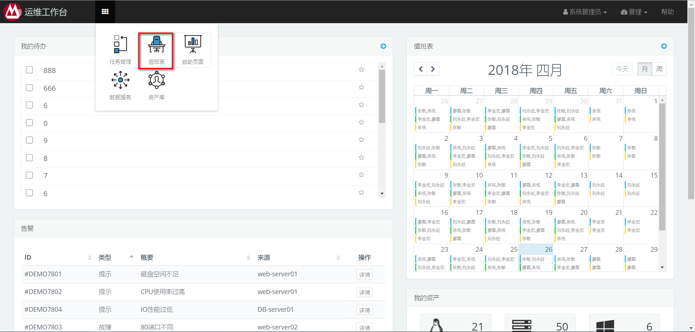

值班表主要包含“查看”和“配置”两个模块，非管理员用户看不到配置按钮

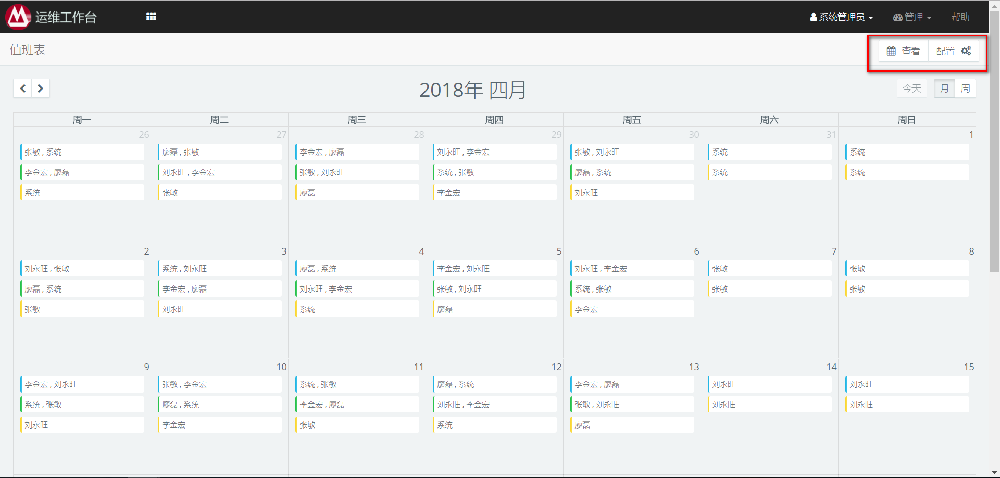

## 生成值班表
1：点击“配置”按钮打开配置界面，输入目标年份

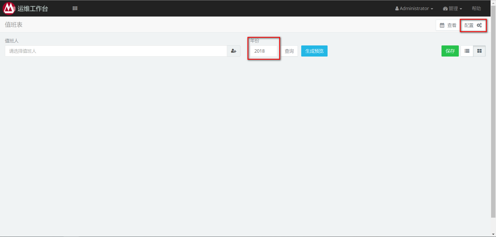

2：点击选择值班人按钮,选取值班人

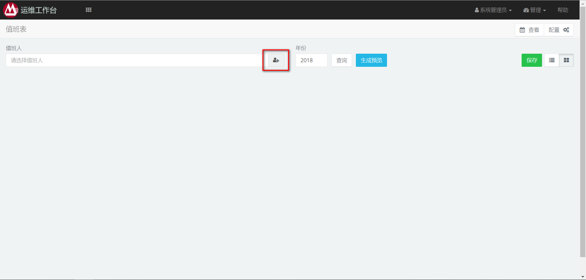

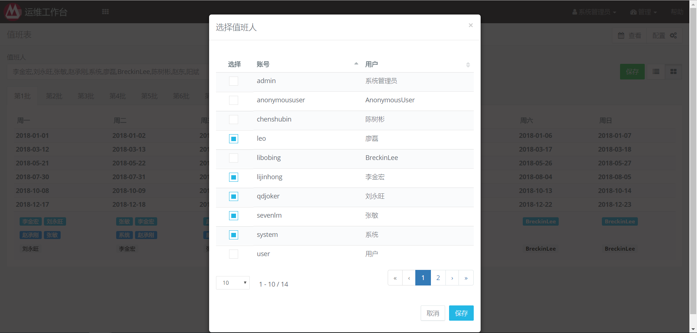

3：点击“生成预览”按钮

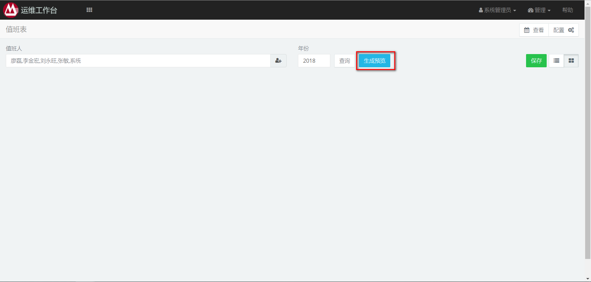

4：点击“保存”按钮

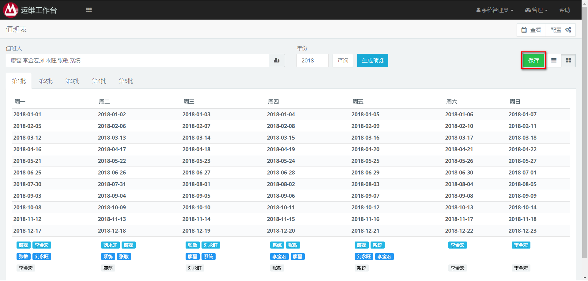

## 调整值班

只有系统管理员有权限调整值班

### 调整年度值班计划

1：打开配置界面，输入待调整的年份,点击查询按钮，查询已有配置

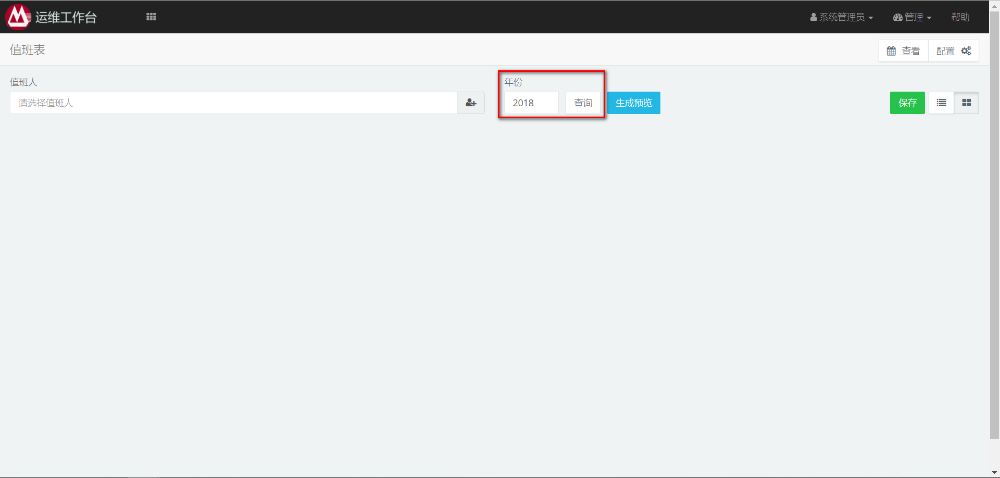

2：找到待调整的位置，点击现有值班人。从弹出的下拉列表选择一个已有值班人，假如要替换的值班人不在下拉列表内，点击选择其他值班人员选项，从弹出框的表格选择值班人。

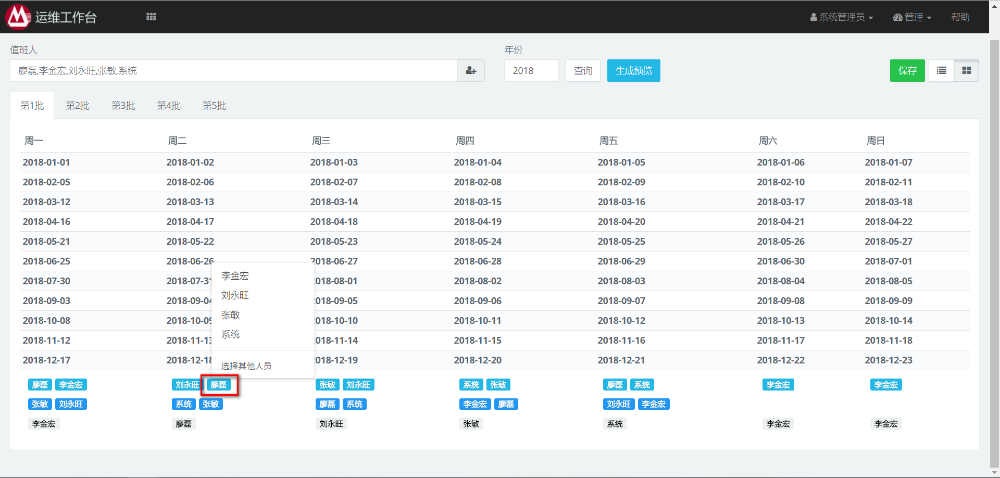

3：点击“保存”按钮

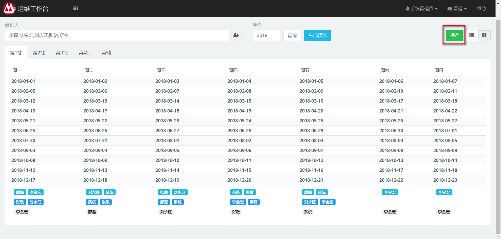

### 调整单日的值班

1：打开查看界面，找到待调整的位置

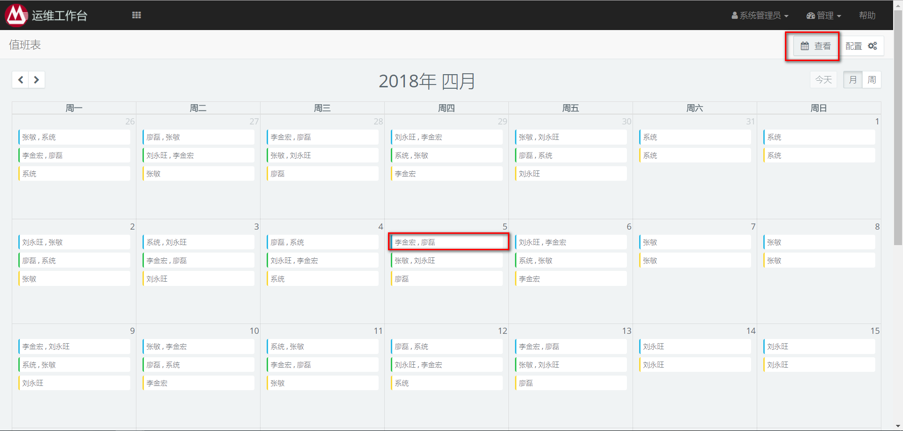

2: 点击现有值班人。在弹出框的下拉列表调整值班人。调整完成点击确认。

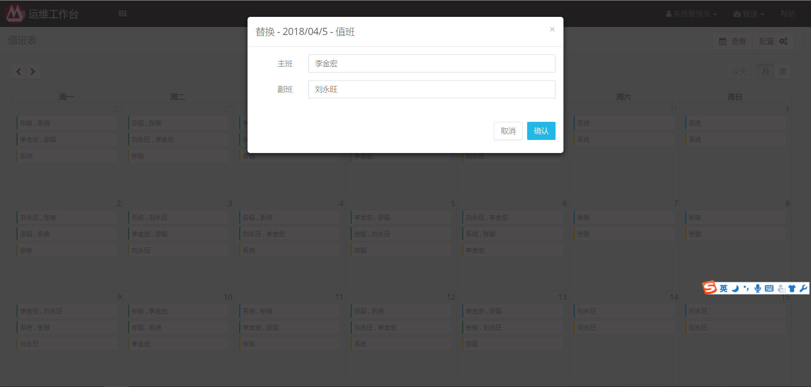

3：单日调整结果在配置界面同样可以看到

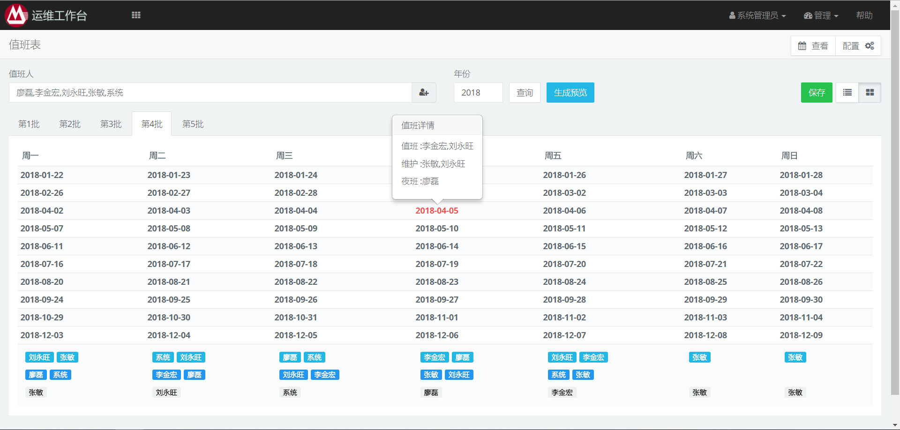
