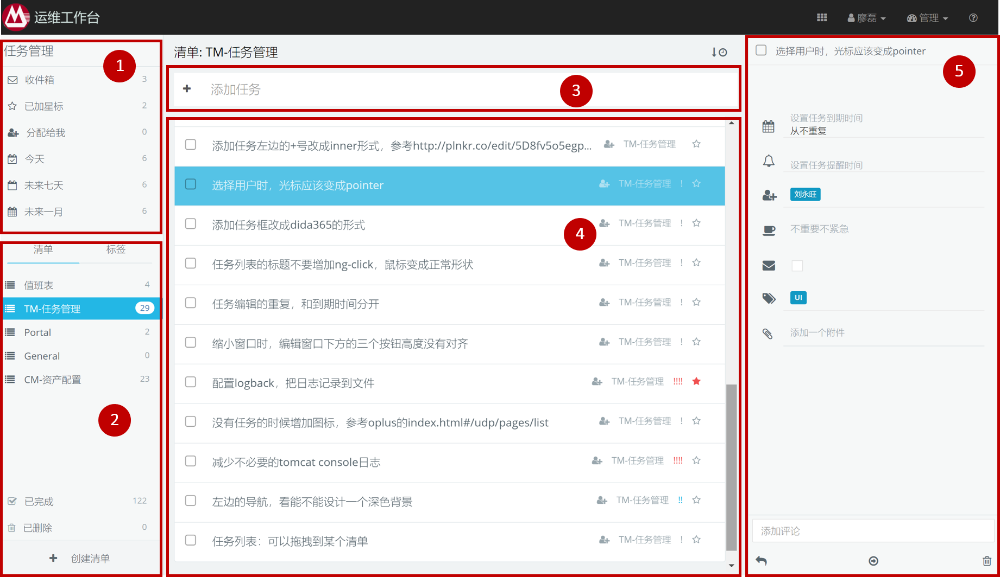
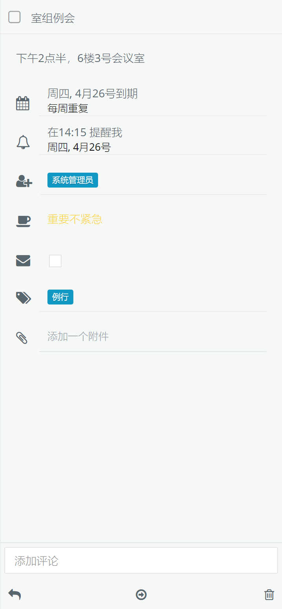

# 任务管理

任务管理提供一个适合团队的待办事项管理平台，通过有计划的安排任务来提高工作效率。主要功能包括：

* 支持多文本的任务内容，可以添加附件、备注
* 支持到期时间和提醒时间，多种提醒方式
* 团队协作，为任务指派协办人，协办人会在自己的收件箱看到任务
* 支持目录、清单、标签，可以按不同的角度来查看任务
* 可以按照今日、本周、本月、完成状态等不同视图查看任务
* 提供开放接口，支持和其它系统集成，例如ITIL

## 操作界面

任务管理的操作界面整体分为五块：

1. 任务导航：按时间分类
2. 任务导航：按清单和标签
3. 添加任务输入框
4. 任务列表
5. 查看和编辑任务详情

## 创建任务

在界面上方的输入框输入任务内容，按回车创建一个任务。
接下来可以编辑任务的详情情况，包括以下属性。

- **到期时间**：任务导航的时间分类根据任务的到期时间来过滤。
- **是否重复**：任务是一次性的，还是重复的
- **提醒时间**：到了提醒时间，浏览器将弹出提醒窗口，如果设置了邮件提醒，系统将发送邮件给任务的创建人和协办人。
- **协办人**：为任务指定协办人。协办人登录系统后，会在“分配给我”的分类下看到需要协办的任务，详见“[任务协办](#任务协办)”
- **重要紧急度**：系统按照时间四象限法定义了4种重要紧急类型：
    * 重要紧急
    * 紧急不重要
    * 重要不紧急
    * 不重要不紧急
- **邮件提醒**：提醒时间是否给创建人和协办人发送邮件
- **标签**：可以给任务设置多个标签，用于分类过滤显示
- **附件**：可以添加附件
- **评论**：可以增加评论

## 完成任务

当完成一个任务后，点击任务左边的方框，任务状态将变为完成。

## 任务协办

可以为任务指定协办人。协办人登录系统后，会在“分配给我”的分类下看到需要协办的任务。

协办人不能修改任务，也不能标记任务为完成。但可以给任务增加评论。