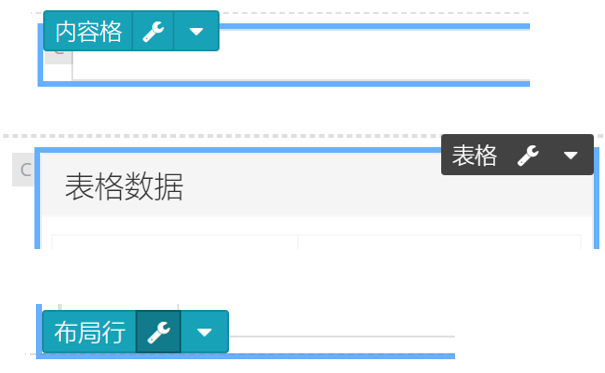

## 组件设置 {docsify-ignore}

鼠标悬浮在组件上，将出现工具条，工具条上有：

1. 组件类型名称：鼠标按住可以拖拽移动组件
2. 配置按钮：点击可以进入组件的配置页面
3. 下拉菜单按钮：点击将显示更多的操作选项，例如复制、剪切、粘贴、删除

组件的配置页面如下（表格组件）所示。

不同组件可配置的项目有差异，一般包括以下几类配置项：

* **数据设定**：选择数据集，配置查询参数，见“[数据设定](udp/config-dataset.md)”
* **字段设定**：配置要显示哪些字段，以及字段的显示格式
* **访问控制**：对组件进行访问控制，例如具有某些权限/角色的用户才可以看，见“[访问控制](udp/config-accesscontrol.md)”
* **显示样式**：组件的显示样式，例如标题、边框、颜色等
* **条件格式**：某些类型的组件（例如表格，KPI）可以设置条件显示不同的外观，参见KPI组件的“[条件格式](udp/widget-kpi.md#条件格式)”
* **属性代码**：用于查看配置属性的原始代码，一般用于调试。

  

