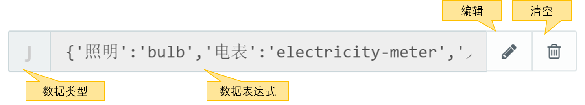

### 数据编辑器 {docsify-ignore}

数据编辑器可以编辑数据表达式，对数据进行灵活多样的转换和处理。可用于数据转换，从数据集获取数据，构造初始化数据等。



数据编辑器支持以下类型的数据表达式：

* 函数
* 字符串
* JSON
* YAML
* 按钮链接

在不同的控件设置，可用的数据类型有所不同，例如折线图的字段设置，数据编辑器支持函数、字符串；在表格控件的字段设置，数据编辑器支持函数、字符串和按钮链接。

#### 函数

支持单条或多条Javascript语句对数据进行转换。

**单条语句**

单条语句用于进行简单的数据处理，该语句的值会作为数据返回。例如：

- `Math.round(Math.random()*10)`：返回一个0-10的随机整数
- `$$.formatDate(new Date(),'YYYY-MM-DD hh:mm:ss')`：以字符串`2020-08-07 09:10:40`形式返回当前时间

**多条语句**

多条语句用于处理复杂的数据处理，需要使用`function(){...}`的函数体形式将语句包围，例如：

```javascript
function(){
    var date = new Date();
    var date2 = $$.addDate(date,1,"months");
    var str = $$.formatDate(date2,'YYYY/MM/DD');
    return str;
}
```

?> 注意，函数体必须通过`return`返回所需要的值

#### 字符串

#### YAML

YAML
- [YAML官方网站](http://yaml.org/)
- [简明的YAML 语言教程](http://www.ruanyifeng.com/blog/2016/07/yaml.html)
- [维基上的YAML介绍](https://en.wikipedia.org/wiki/YAML)
- [YAML JSON转换器](https://codebeautify.org/yaml-to-json-xml-csv)

#### 变量使用

在数据表达式中，可以用`${变量名}`的形式引用变量。

变量范围包括：
- 数据集变量：用`${数据集的变量属性}`表示
- 页面控件值：用`${@.页面控制参数名}`表示
- 全局变量：用`${#.全局变量名}`表示

不同控件或不同场景下支持的变量范围不同，请参考具体页面的数据编辑器提示。

如果一个变量没有赋值（对应javasript的`undefined`），这种变量称为未决变量（UnresolvedVar）。
在解析数据表达式的时候，如果遇到未决变量，整个表达式会解析失败。
如果希望避免出现UnresolvedVar，可以通过`${变量名 || 默认值}`的形式给变量赋予默认值。

如果默认值是一个字符串，需要用单引号`''`或者双引号`""`包围。

示例：

- `var username = ${username || "guest"}`
- `${is_enabled || false}`