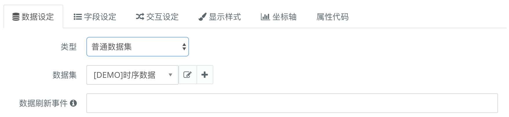
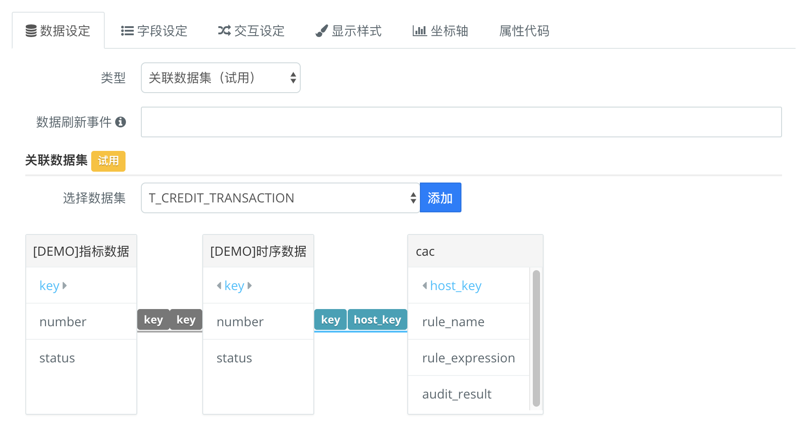
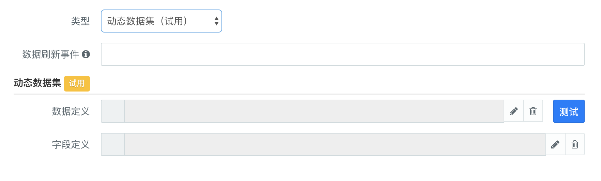
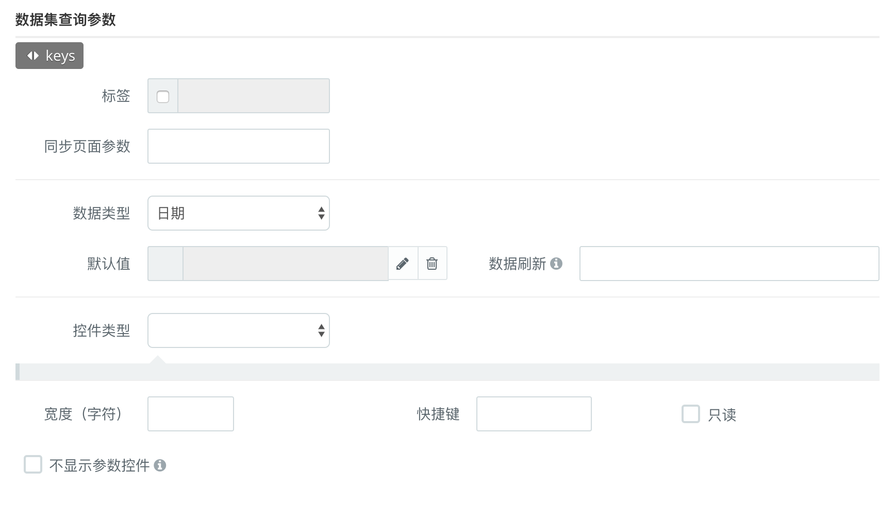

### 数据设定 {docsify-ignore}

组件通过数据设定，选择要展示的数据集。数据设定有如下配置项。

- **类型**：数据集类型，分为[普通数据集](#普通数据集)、[关联数据集](#关联数据集)、[自定义数据集](#自定义数据集)三种，不同类型数据集的配置项有差异。
- **数据刷新事件**：与定时器组件联合使用，可以实现定时刷新。
- **数据集查询参数**：当数据集支持查询参数的时候，可以对查询参数的形式进行配置。
如果选择的数据集不支持查询参数，这里将为空。
参考[数据集参数化查询](udp/dts-config-jdbc.md#参数化查询)

#### 普通数据集

#### 关联数据集

关联数据集可以通过设置关联字段得到多个数据集的交集

#### 自定义数据集

自定义数据集使用[数据编辑器](udp/data-convertor.md)来定义数据。

#### 数据集查询参数

| 功能           | 说明                                                         |
| -------------- | ------------------------------------------------------------ |
| 同步页面参数   | 可以和定义的页面参数绑定，当页面参数改变时，当前字段参数也改变 |
| 显示标签       | 字段参数控件的名称，通过复选框显示或者隐藏                   |
| 数据类型       | 可以选择数据类型，如日期、字符串等等，支持以函数或者字符串的形式定义默认值 |
| 控件类型       | 支持输入框、下拉框、日期选择等控件类型                       |
| 只读           | 通过复选框控制是否可以编辑                                   |
| 不显示参数控件 | 通过复选框控制，显示或者隐藏控件                             |
| 宽度           | 自定义宽度                                                   |
| 快捷键         | 自定义快捷键，编辑时可以快速定位到控件上                     |
