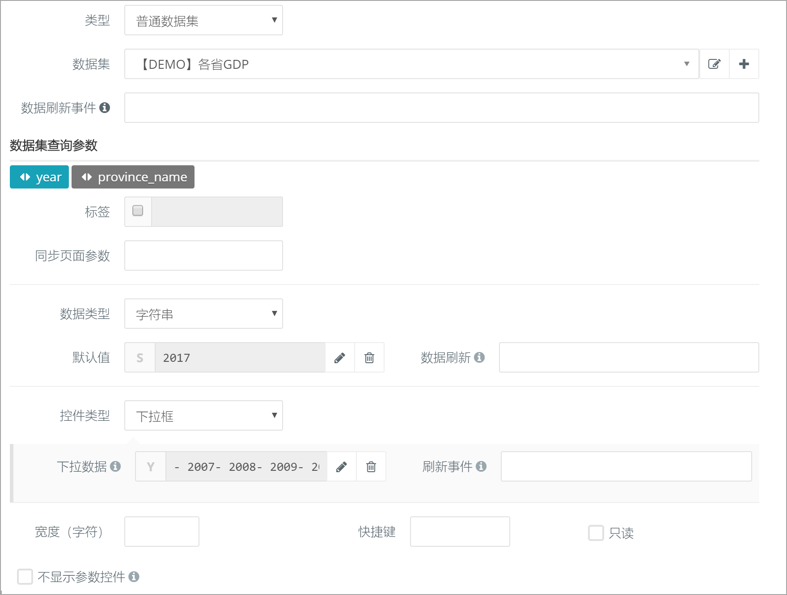
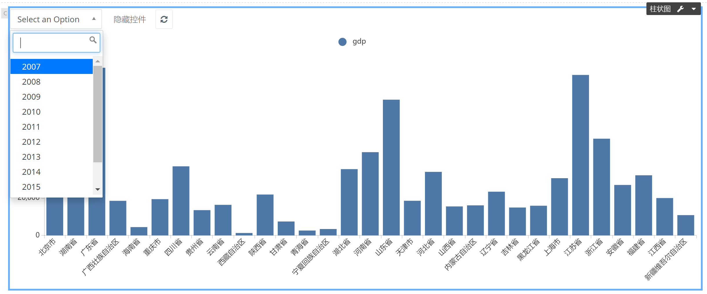

### 示例01：下拉框控制单个图形数据 {docsify-ignore}

#### 目标

下拉框显示年份，图形为各省当年GDP。

#### 步骤

第1步：页面添加一个【柱状图】组件。

第2步：【数据设定】如下：

   1. 数据集：`【DEMO】各省GDP`。该数据集可以查询某年、某省份的GDP，支持两个可选参数`year`、`province_name`。
      
   2. 数据集查询参数`year`
      - 默认值：2017
      - 控件类型：`下拉框`。用下拉框控件来显示这个参数。
      - 下拉数据：选择YAML，输入以下数据，表示一个从2007到2017的数组。
         ```yaml
         - 2007
         - 2008
         - 2009
         - 2010
         - 2011
         - 2012
         - 2013
         - 2014
         - 2015
         - 2016
         - 2017
         ```
         
      
   3. 数据集查询参数`province_name`

     - 控件类型：`隐藏`。因为不需要控制此参数，将其设为隐藏。

第3步：完成
 