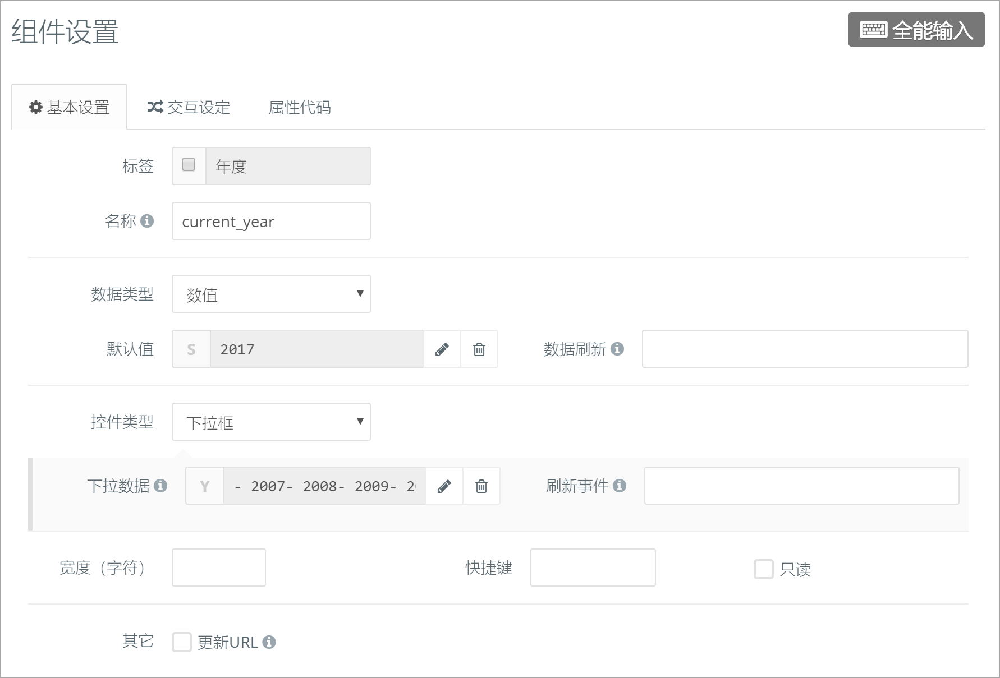
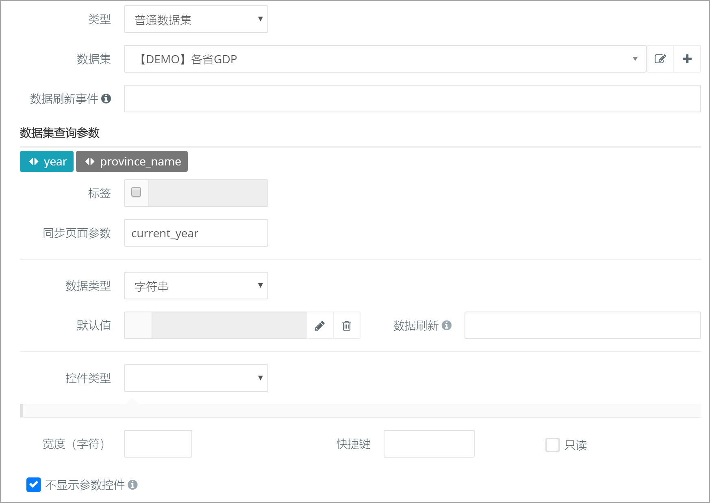

### 示例02：下拉框控制多个组件数据 {docsify-ignore}

#### 目标

下拉框显示年份，页面有两个饼图、柱状图两个组件，图形的数据需要跟随所选年份变化。

#### 步骤
在EX01中，下拉框是组件级别的控件，它属于柱状图组件。只能控制它所在的柱状图组件，无法控制饼图组件。为了控制页面多个组件，需要引入页面级别的组件。

第1步：页面进行简单布局，放置3个内容格，宽度分别为100%（12格），50%（6格），50%（6格），形成下面的品字形布局。

第2步：在三个内容格分别添加组件：全能输入、柱状图、饼图。

第3步：配置组件全能输入。

- 基本设置
  - 名称：`current_year`

  - 数据类型：`数值`

  - 控件类型：`下拉框`

  - 默认值：`2017`

  - 下拉数据：同EX01中的year设定

    

第4步：对饼图和柱状图进行基本设置，【数据设定】如下。

1. 数据集：`【DEMO】各省GDP`
2. 勾选`不显示参数控件`
3. 数据集查询参数`year`
   - 同步页面参数：`current_year`
   - 默认值：空
     

第5步：设置【字段设定】

- X轴：`province_name`
- Y轴：`gdp`

完成
