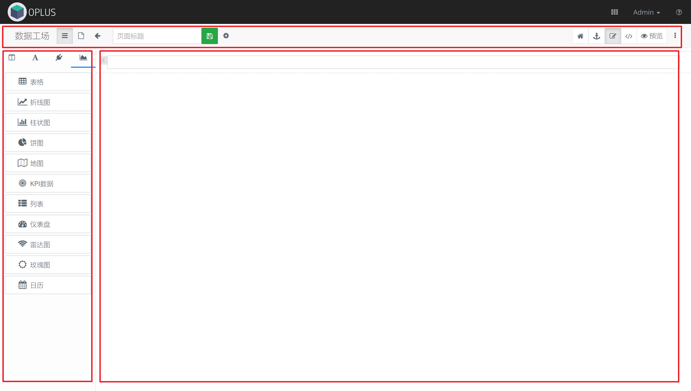
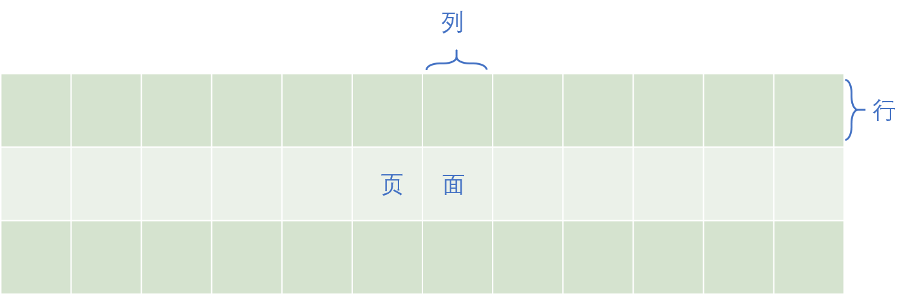
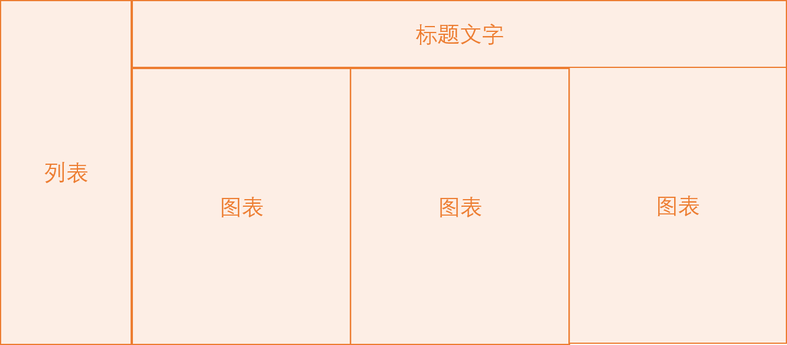
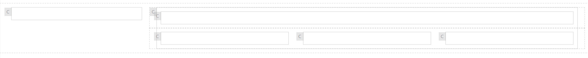
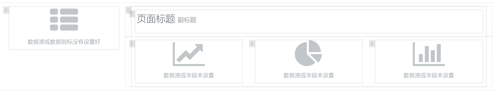
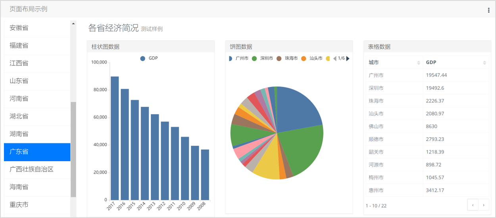
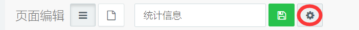

### 页面设计 {docsify-ignore}

#### 设计器界面

页面设计器分为三个主要区域：

* **工具栏**：位于顶部，用于显示/隐藏左侧组件栏，设定页面标题，进行页面设置

* **组件栏**：位于左侧，用于选择组件，拖放在页面画布区

* **画布区**：位于页面中央，是主要的页面编辑区域，包括页面布局、组件设置

##### 工具栏

工具栏包含以下元素：

* 组件栏切换按钮：用于切换侧栏的显隐。隐藏侧栏可以扩大画布区的可视面积。
* 页面标题：用于识别这个页面的可阅读的标题，会在页面列表和页面展示中展示。
  
**注意**：在页面展示时，系统对于展示标题会做如下处理：
  - 如果标题以`【...】`（实心方头括号）开头，括号以及之内的文字在显示标题中会被移除。
  - 如果标题中有`__`（连续双下划线），那么将取最后一个双下划线后面的内容作为显示标题。
  
例如，一个页面的标题为`【VAP】补丁扫描__安装补丁__选择目标服务器`，最终显示的标题为`选择目标服务器`。
    当页面很多的时候，可以利用这两个处理规则来管理页面。用`【】`来给页面分类，通过`__`来给页面分层级。
* 间隔按钮：当间隔按钮激活时，会扩大内容格在画布中的间隔，方便拖拽组件。
* 锚定按钮：显示页面各个组件的边框
* 编辑器切换按钮组：在可视化编辑器、源代码编辑、预览三种模式切换

#### 页面布局

##### 栅格布局

页面采用[栅格系统](https://v3.bootcss.com/css/#grid)进行布局。栅格系统用于通过一系列的行（row，布局行）与列（column，内容格）的组合来创建页面布局，组件可以放入这些创建好的布局中。

栅格系统的工作方式如下。

- 布局行（row）用于在水平方向创建一组列，最多为12列（column）
- 布局行（row）可以直接放置在页面容器中，也可以放置在列（column）
- 布局行（row）内只能放置列
- 组件只能放置于内容格（column），**不能**放置在布局行（row）
- 一个页面至少包含一个布局行和一个内容格

##### 布局示例

我们设计一个左右布局的页面，左边是列表导航，右上是标题文字，右边下方放置三个图形组件，如下图所示。

页面布局分解如下图，它由3个布局行，5个内容格组成：

1. 行A：空白页面自带的布局行，直接放置在页面上。它包含2个内容格：内容格A1，内容格A2
2. 行A2B：放置在内容格A2内。它包含1个内容格A2B1。
3. 行A2C：放置在内容格A2内，行A2B下方。它包含3个内容格A2C1、A2C2、A2C3。

布局布局操作步骤如下。

页面实际布局结果如下图，此时还没有将组件放入内容格。

将相应的组件放入内容格后如下图，此时组件还未进行配置。

组件配置完成之后效果如图。

##### 布局组件操作

从布局控件中，点**布局行**并拖动到主画布中，即可添加一行：

从布局控件中，点**内容格**并拖动到第一行内，即可添加一列：

#### 页面颜色

页面默认采用白底黑字，可以通过下面的方式修改背景和字体颜色。

1. 点击**页面设置**按钮，弹出**页面设置**弹窗

2. 点击**显示设置**。可以在“页面主题色”中选择预定义的主题颜色，也可以选择自定义来自由选择颜色。
3. 选择**自定义**，在右侧会弹出**背景色**和**字体颜色**图标

