## 快速入门 {docsify-ignore}

这里通过一个示例让用户快速了解数据工场的基本使用。本例将用表格、折线图、柱状图和饼图的形式展示一个MySQL数据库中的数据。

通过这个例子，你将了解以下内容：

1. 如何读取数据库中的数据
2. 如何创建页面
3. 如何将数据在页面展示
4. 如何设置内容布局

本示例使用的是系统的demo数据库，里面包含了用作示例的运维工单申请等数据。

用户按照以下步骤示例，快速创建表格、折线图、柱状图和饼图，并能理解大致的布局规则。

**第一步：创建数据源**

1. 从顶部管理栏中通过【设置】，进入平台设置界面，左侧菜单选择【数据源】模块。点击按钮【+】新建数据源。

2. 进入数据源新建页面,可以选择数据源类型，包括JDBC数据库、多数据集、REST API。在这里选择【JDBC数据库】.
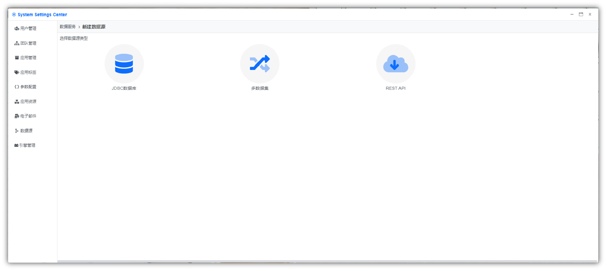

3. 编辑数据源的属性，各个字段输入值见下表。
输入完成后点击【测试连通性】测试数据库是否可以连通。提示连通成功后点击【保存】。 
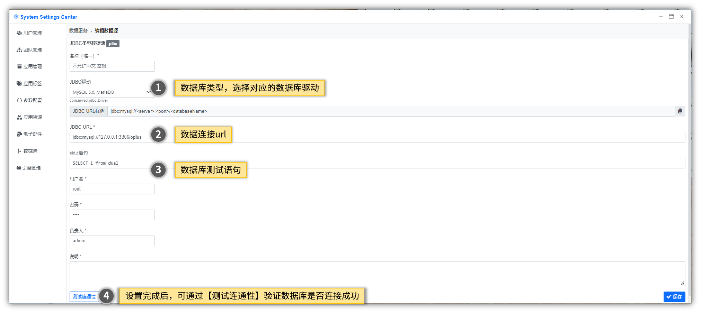   
   
属性名|值|说明  
---|---|---  
name|`oplus_demo`|必填，可随意命名，但必须唯一  
JDBC Driver|`MySQL 5.x, MariaDB`| 单选必填,支持选项包括MySQL 5.x, MariaDB、Microsoft SQL Server、IBM DB2、Voltdb、Apache Hive、Gauss
JDBC URL|`jdbc:mysql://localhost:3306/oplus`|   
验证语句|`select 1 from dual`|   
用户名|`oplus`|    
密码|`******`| 
负责人|`admin`| 
说明|`oplus测试数据集`| 

**第二步：创建应用**
1. 在应用管理界面中新建一个应用。
   

2. 新建一个应用，需要设置应用名称、应用内容和导航、应用权限等。
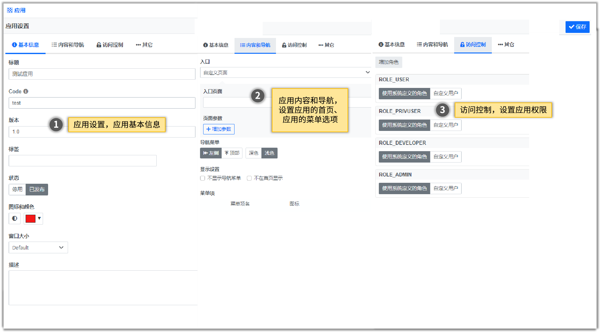

3. 应用设置-应用基本信息说明

属性名|值|说明  
---|---|--- 
标题|`测试应用`| 必填，可随意命名，但必须唯一
Code|`test`| 必填，可随意命名，但必须唯一
版本|`1.0`|   
标签|``|  选填，支持多选    
状态|`已发布`| 单选 
窗口大小|`Default`| 设置应用打开的窗口大小
描述|``| 

4.应用设置-应用内容和导航说明
* 入口页面： 选择设置应用的首页。
* 导航菜单： 设置应用的菜单的位置与显示形式。
* 显示设置： 不显示导航菜单、不在首页显示。
* 菜单项： 设置应用的菜单栏，并指定菜单对应的页面。

5. 基本信息填写完成后，点击【保存】，创建应用成功，可在应用管理页面中查看到新增的应用。

**第三步：创建数据集**

1. 返回应用管理首页，编辑应用信息，进入应用设置界面。
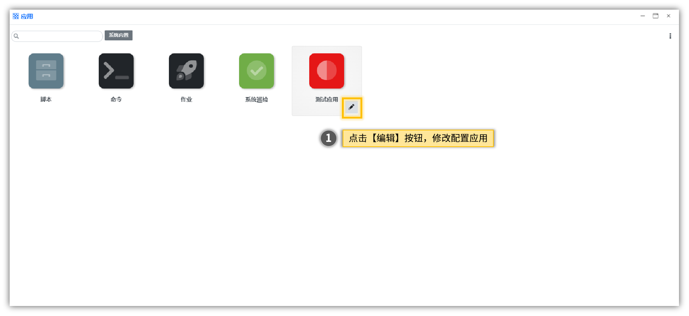

2. 在应用设置中，点击左侧的菜单栏，创建属于该应用的数据集。
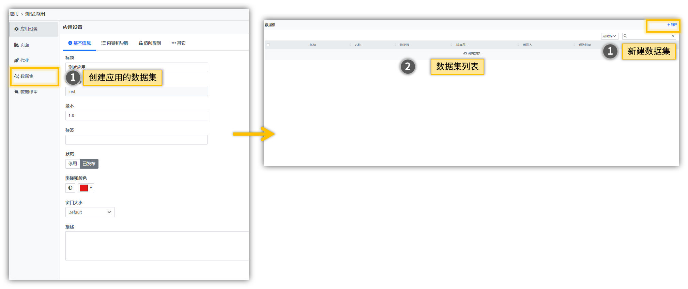

3. 填写数据集名称，指定数据库，输入查询所需要的SQL。配置完成之后点击【保存】按钮，然后【执行测试查询】即可看到SQL执行结果。

| 属性    | 值                              | 说明             |
| ------- | ------------------------------- | ---------------- |
| code    | `TEST_DEMO`               | 数据集的唯一标识 |
| 名称    | `【TEST】测试数据集`                      |                  |
| 说明    |                                  | 选填             |
| 查询SQL | `SELECT *  FROM gmcc_service_request` |                  |

4. 查看数据集。通过左侧菜单栏，点击【数据集】选项，可查看当前应用中所有的数据集。点击**操作栏中的修改按钮**可以查看数据集详情。

**第四步：创建页面**
1. 返回应用管理页面，编辑应用信息，进入应用设置界面。在左侧功能导航菜单中点击【页面】，进入应用页面管理首页。然后点击右上角【新建】按钮进入自定义编辑页面，弹出的**选择页面布局**框中选择空白页面。  
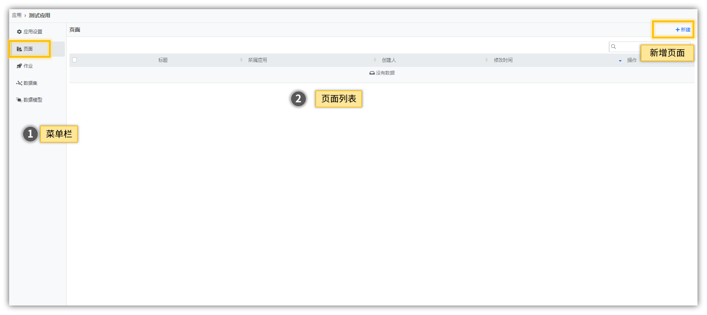
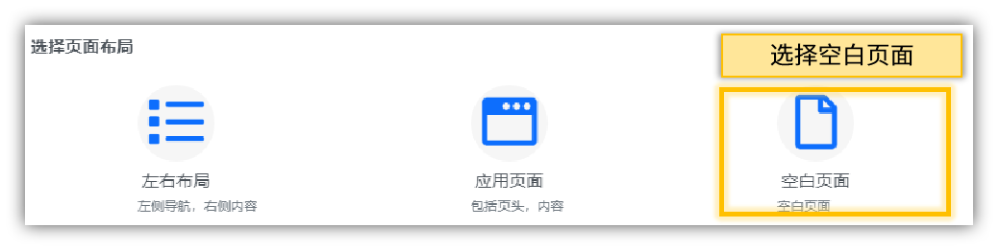

2. 编辑标题，这里可以输入任意文字，例如`快速入门页面`

3. 从左边的工具栏拖拽2个内容格进页面，加上页面原先自带的1格内容格，现在页面上一共有3个内容格。

4. 将三个内容的宽度分别设为12格，5格，7格。这样，将形成一个类似品字形的布局。
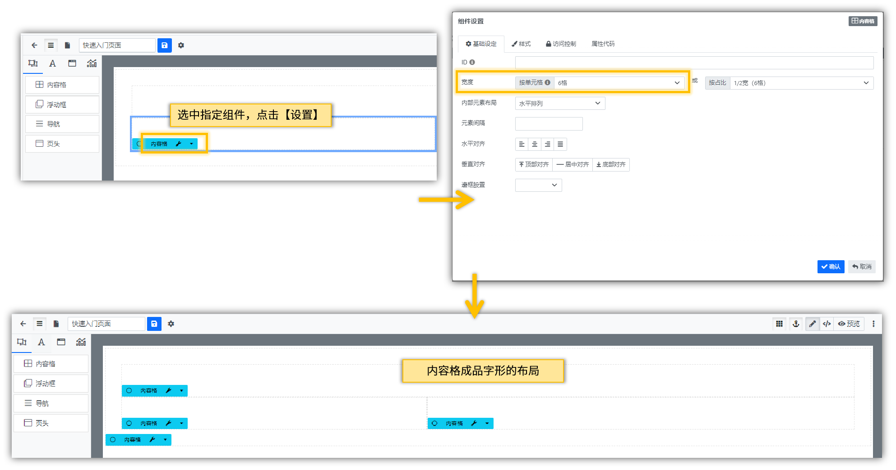

**第五步：添加组件**

从左边的工具栏分别将表格、 饼图、柱状图组件拖拽放入，并点击各个组件的**配置**按钮进行配置。   
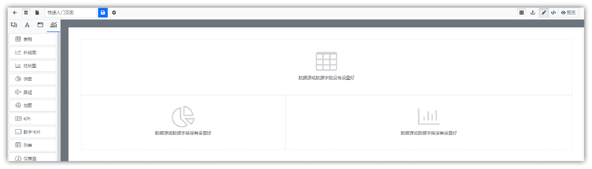

**表格组件设置**

1. 数据设定：【数据集】选择上面创建的`【TEST】测试数据集`
2. 字段设定：点击【添加所有列】
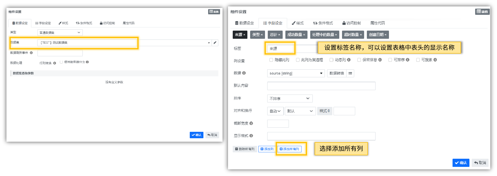

点击【确定】保存设置，关闭对话框。

**饼图组件设置**

1. 数据设定：【数据集】选择上面创建的`【TEST】测试数据集`
2. 字段设定：
   - X轴/数据：下拉框选择`category`。表示饼图以地区作为分类
   - 数据指标/数据：下拉框选择`num_completed`。表示以字段`num_completed`的值作为饼图区块的数据。
3. 样式：
   - 图形色调:默认 or Office 2016, 表示饼图图例的所显示的颜色。
   - 图例：右方,图例是否隐藏: 是，表示饼图中的图例显示位置及是否需要显示在图表中。
   - 尺寸：高度为300px。
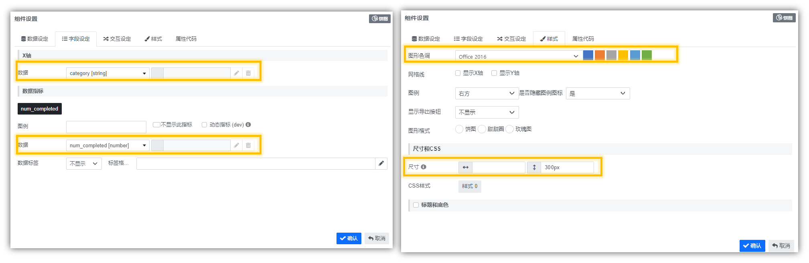

点击【确定】保存设置，关闭对话框。

**柱状图组件设置**

1. 数据设定：【数据集】选择上面创建的`【TEST】测试数据集`
2. 字段设定：
   - X轴/数据：下拉框选择`category`。表示柱状图以地区作为X轴分类
   - X轴/标签角度：`45`。让X轴的地名倾斜45度便于阅读长的地名。
   - 数据指标/数据：下拉框选择`num_completed`。表示以字段`num_completed`的值作为Y轴的数据。

点击【确定】保存设置，关闭对话框。
    
**第六步：结果展示**

编辑完成之后，保存页面。在页面右上角可以点击预览已生成的页面，也可以跳转新窗口中预览。

**第七步：为新建的应用【测试应用】配置首页及菜单栏**
1. 在应用页面中，选择`测试应用`，点击编辑按钮，进入应用设置页面。
2. 在`应用设置`中点击【内容和导航】,为应用配置首页及菜单栏。
   - 入口：选择自定义页面
   - 入口页面： 在下拉框中选择`快速入门页面`，
   - 导航菜单： 左侧
   - 菜单项： 点击右侧的【+】新增菜单项，在菜单项名中填写`测试菜单`， 关联页面选择`快速入门页面`

3. 点击右上角的保存，然后在应用页面中点击`测试应用`，即可打开应用，并查看应用中的相关页面信息。 
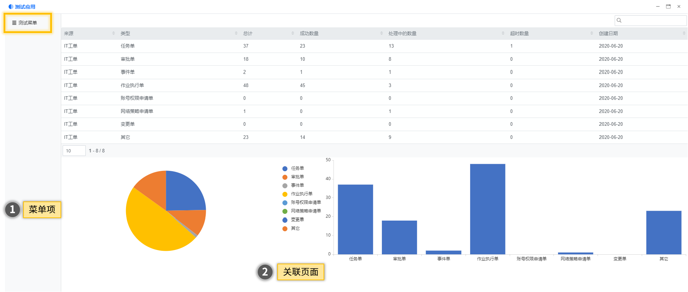
