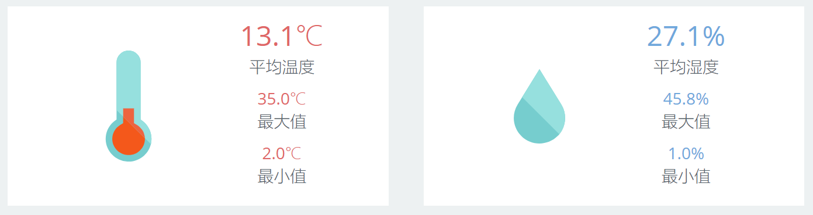

### 数字卡片 {docsify-ignore}

#### 组件用途
数字卡片用于突出显示醒目的数值或状态指标，在一个卡片里，建议不要超过3个指标。
数字卡片和[KPI](udp/widget-kpi.md)有类似之处，KPI控件也是由一些列卡片组成，但KPI中的每张卡片只显示一个指标。

#### 组件设置
数字卡片的构成元素包括：
* 图标（一个）：增强卡片的视觉效果
* 数据指标（多个）：显示关键的信息
    * 名称：文本
    * 数据：数值，或者状态文本
    

!> 图标目前只支持目录`content/medialib/`下面的静态图片

?> 注意：当一个数据集返回多条记录的时候，数字卡片只取第一条记录。