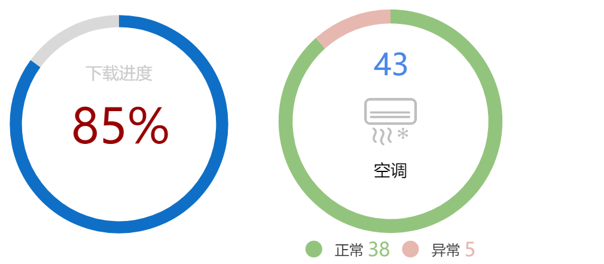

### 环形图 {docsify-ignore}

#### 组件用途

环形图显示一组比例数据，可以用于展示不同的比例（和[甜甜圈图](udp/widget-piechart)类似），或者用于展示进度百分比。用于展示比例的时候，建议不超过5个分类。

#### 组件设置

环形图的构成元素包括：
* 图标：增强卡片的视觉效果
* 主要文字：在环形中央显示的醒目文字，例如总和数字、状态、进度百分比
* 次要文字：在环形中央显示的描述文字，例如说明这个图形的用途
* 数据指标（多个）：不同的组成比例
    * 名称：文本
    * 数据：数值

!> 图标目前只支持目录`content/medialib/icons/`下面的静态图片

一个图中可以显示多个环形。当一个数据集中返回多条记录的时候，每条记录都会绘制一个环形。
