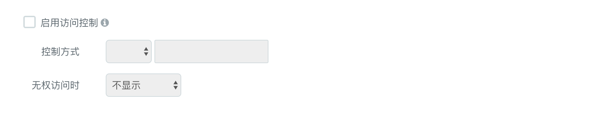

### 表格 {docsify-ignore}

#### 组件用途

表格是最常用的显示组件，用于直观展示一批数据的多个属性。

#### 组件设置
##### 字段设定


| 设置 | 说明 |
|--|--|
| 标签 | 表格展示的列名，支持隐藏、复选框 |
| 字段 | 表格列展示的值，支持自定义展现形式，例如按钮、链接等等 |
| 默认内容 | 默认展示的值 |
| 排序 |  支持升序和降序两种排序方式|
| 对齐 | 支持内容靠左、靠右、居中三中对齐方式以及内容换行 |
| 显示格式 | 数值类型的字段可转化为百分比形式 |
| 删除所有列 | 删除添加的所有列 |
| 添加列 |  添加一个空白列|
| 添加所有列 | 将所使用的数据集中的所有字段添加到列 |

##### 访问控制


| 设置 | 说明 |
|--|--|
| 启用访问控制 | 根据复选决定是否启动访问控制 |
| 控制方式 | 角色和权限两种控制方式 |
| 无权访问时 | 隐藏、禁用、提示信息三种无权访问时的组件形式 |

##### 显示样式


| 设置 | 说明 |
|--|--|
| 高度 | 支持px、vh两种单位设置高度 |
| 边框和底色 |  |
| 列宽度 | 支持根据内容长度动态调整宽度 |
| 表格控件 | 可以隐藏默认的过滤菜单 |
| 分页样式 | 是否选择分页以及支持锁定分页大小 |

##### 标题和底色

Box模式可以给组件增加背景色、标题

##### 条件格式
参考 [kpi](udp/widget-kpi.md) 中的条件格式

##### 属性代码
供开发人员快速修改组件设置

#### 常见问题

##### 如何增加复选框？

在【列设置】中选择**“此列为复选框”**。当一个列设置为复选框的时候，表格每行的第一列将显示为复选框。选中复选框后，该行将高亮显示，同时在表格上方将出现一个下拉框，显示为**“选中N项”**的字样。
点击下拉框，可以看到选中的项目，并可以在下拉框中移除某些项目。

##### 如何为复选框选中的值设置不同的显示标签？

复选框有**“属性值”**和**“显示标签”**两个数据。

- 属性值表示选中复选框后的值
- 显示标签表示选中复选框后，在下拉框中显示的文本。

例如有一个用户列表，包含`id`、`username`、`department`几个字段，我们希望选中复选框后，可以把传递字段`id`的值，同时在选中下拉框中显示选中的用户名（字段`username`）。

| [ ] | ID | 用户名 | 部门 |
| ---- | ------ | ---- | ---- |
| [ ] | admin | 管理员 | IT |
| [ ] | zhangsan | 张三 | Dev |
| [ ] | lisi | 李四 | Ops |

##### 如何隐藏或者禁止某行的复选框

如果要隐藏或禁止某一行的复选框，复选框的属性值需要返回一个格式为`{$state:string}`的object，`$state`取值可以是`hidden`（隐藏）或`disabled`（禁止）。

例如`id`为`admin`的行不允许用户选择，属性值设为`${id}==="admin"?{$state:"hidden"}:${id}`。即，如果这行数据的`id`为`admin`，返回一个object，否则返回`id`。

##### 当表格列的内容太长的时候如何处理

表格列的内容默认是不换行的，每列的宽度会自动适应内容长度。当列宽太大时，表格会产生水平的滚动条，不方便用户阅读。

例如表格有一列“使用说明”，内容包含多达500个字符，我们可以用下面两种方案进行处理。

方案一：换行。在【字段设定/对齐和换行】中选择 **“适应列头换行”**。

方案二：截断。在【字段设定/截断宽度】输入要显示的字符数，超出此数值的内容将用省略号...显示。
在表格中点击此单元格，将弹出对话框显示完整的内容。

##### 如何设置动态列

动态列是指表格的列是动态生成的，一个动态列最终可能会生成多个列。
默认情况下，如果一个列设置成了动态列，在表格渲染的时候，这个动态列会自动生成多个列，展示数据集返回数据的所有字段，每列显示一个字段值，列标题为字段名。

动态生成列的显示样式无法像普通列一样，在配置界面上直接配置。需要通过【动态列定义】来完成。
动态列定义，实际上是定义一套规则，对动态生成的列进行处理。这套规则是定义在一个的数组列表中，数组的每个元素代表一个列的定义，格式如下：
```json
{
  "field": "",       -- 列对应的字段名
  "label": "",       -- 列显示名，默认为字段名
  "show": true       -- 是否显示，默认true
  "hide": false      -- 是否隐藏，默认false
  "css": "",         -- CSS样式
  "seq": 0,          -- 显示顺序，数字越小越靠前
  "converter": "",   -- 显示数据转换
  "orderable": true, -- 允许搜索，默认true
  "sortable": true   -- 允许排序，默认true
}

```