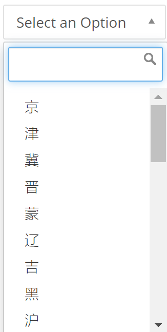

### 全能输入 {docsify-ignore}

#### 组件用途

全能输入包含了输入框、下拉框、联想输入、日期选择等页面输入控件，用于设定页面级别的数据值。

#### 组件设置

不同控件类型的属性设置可能会不同，关键的属性如下。

| 属性     | 说明                                                     |
| -------- | ------------------------------------------------------------ |
| 数据类型 | 数据值的类型，不同的字符串、数值、日期、数组                   |
| 控件类型 | 决定组件的展现形式，输入框、下拉框、联想输入、日期选择       |
| 名称     | 组件的数据值会保存为页面的参数，可以通过`${@.名称}`的形式进行引用 |
| 默认值   | 默认的数据值以及其刷新事件                                                 |
| 数据定义 | 部分控件适用。<br />下拉框：定义列表项<br />联想输入：定义建议的候选项。 |

其它设置

| 属性     | 说明                                                     |
| -------- | ------------------------------------------------------------ |
| 宽度     | 组件宽度                                                      |
| 只读     | 设为只读状态                                                   |
| 快捷键   | 配合Alt一起使用，例如快捷键为s，按Alt+s可以快速将鼠标定位在控件上 |

#### 下拉框

##### 从数据集获取数据作为下拉列表的值

示例：从表`demo_cn_province`中获取字段`short_name`和`province_name`的值，填充到下拉框列表，其中`province_name`的值作为列表项的真实值，`short_name`作为列表项的显示标签。

方法：

1. 建立一个数据集`DEMO_LIST_ITEMS`，查询语句为`SELECT short_name, province_name FROM demo_cn_province`，用于获取所需的两个值。
2. 编辑下拉框控件的【下拉数据】，选择【函数】，输入`$$.qdata("DEMO_LIST_ITEMS",{},["province_name","short_name"])`。
   * `$$.qdata()`函数查询数据集，异步返回一个二维数组。二维数组可以用于构建下拉列表的数据。
   * `"DEMO_GDP_YEAR"`是上面建立的数据集代码。
   * `{}`：表示这个数据集不需要查询参数
   * `["province_name","short_name"]`：返回一个二维数组，第一个值取`province_name`字段，用作列表值；第二个值取`short_name`字段，用作显示标签。
3. 结果如图
   


#### 时间控件

##### 将默认时间设为一周前

默认值选择`函数`，输入`$$.addDate(null,-7,'days')`，或者`$$.addDate(null,-1,'weeks')`

##### 制作下一个月、上一个月的按钮联动时间选择器

**目标**

页面上放置两个时间控件：开始时间和结束时间，另外有两个按钮：上一个月和下一个月。
点击按钮可以将开始时间和结束时间分别分别向前和向后推移一个月。


**方法和步骤**

1. 从工具栏中选取两个全能输入组件和两个按钮组件，按布局摆放好。
2. 全能输入组件设置：
    * 控件类型：`日期选择`
    * 名称：任意设定，例如开始时间为`beginTime`，结束时间为`endTime`
3. 按钮【上一个月】组件设置：
    * 标签文字：`上一个月`
    * **交互设定**，添加动作**页面参数赋值**。点击【添加参数】增加两个参数如下：
        * 名称：`beginTime`，值（函数）：`$$.addDate(${@.beginTime},-1,"months")`
        * 名称：`endTime`，值（函数）：`$$.addDate(${@.endTime},-1,"months")`
4. 按钮【下一个月】组件设置：
    * 标签文字：`下一个月`
    * **交互设定**，添加动作**页面参数赋值**。点击【添加参数】增加两个参数如下：
        * 名称：`beginTime`，值（函数）：`$$.addDate(${@.beginTime},1,"months")`
        * 名称：`endTime`，值（函数）：`$$.addDate(${@.endTime},1,"months")`
        

    ?> 函数通过`${@.}`的形式来引用组件的值。
5. 完成

#### 组件外观

##### 修改输入控件的标签位置

控件的标签默认是放置在控件的上方，如果希望将标签放置在控件的左边，
可以进入控件所在**内容格**设置，【显示样式/CSS样式】中加入`form-inline`。

#### 数据
##### 设置下拉框的选项

可以通过函数或者YAML格式设置，选项的数据是一个二维数组。
如下将创建三条选项记录，每条记录包含一个数组，数组第一个元素表示记录的值，第二个元素是记录的显示标签。

```yaml
- [a, 选项A]
- [b, 选项B]
- [c, 选项C]
```
等同于下面的函数（一个JSON）

```javascript
[["a","选项A"],["b","选项B"],["c","选项C"]]
```

也可以采用一维数组，这时候每条记录的值和显示标签是一样

```yaml
- a
- b
- c
```
等同于函数
```javascript
["a","b","c"]
```

