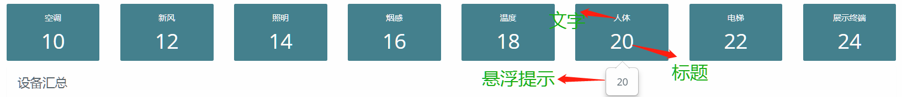
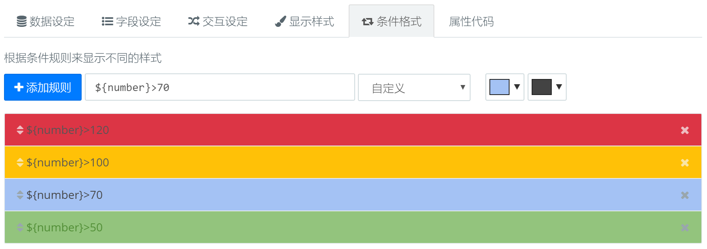

### KPI {docsify-ignore}

#### 组件用途

KPI控件显示一组卡片，每张卡片展示一个数据（数值或者状态），用于展示关键指标（Key Performance Indicator）。
卡片的背景色也可以用于数据指示，例如用绿色表示正常，黄色表示告警，红色表示危险。

  

#### 组件设置

KPI控件的卡片由以下元素构成：

* 文字：显示描述性的文字
* 标题：显示醒目的关键数据，例如数值、状态
* 图标：目前只支持[Font Awesome 4.7.0图标](http://www.fontawesome.com.cn/faicons/)，例如`fa-rocket`，`fa-cube`
* 悬停提示：详细的说明内容

##### 条件格式

通过定义条件规则，卡片的颜色可以根据数据动态变化。控件将数据集返回的每条数据与定义的规则进行比较，如果匹配，将使用规则定义的颜色。

?> 规则顺序很重要，如果有多条规则都匹配，那么第一条匹配的规则将生效，后面的规则将不再执行。

#### 相似控件
[列表](udp/widget-list.md)    
