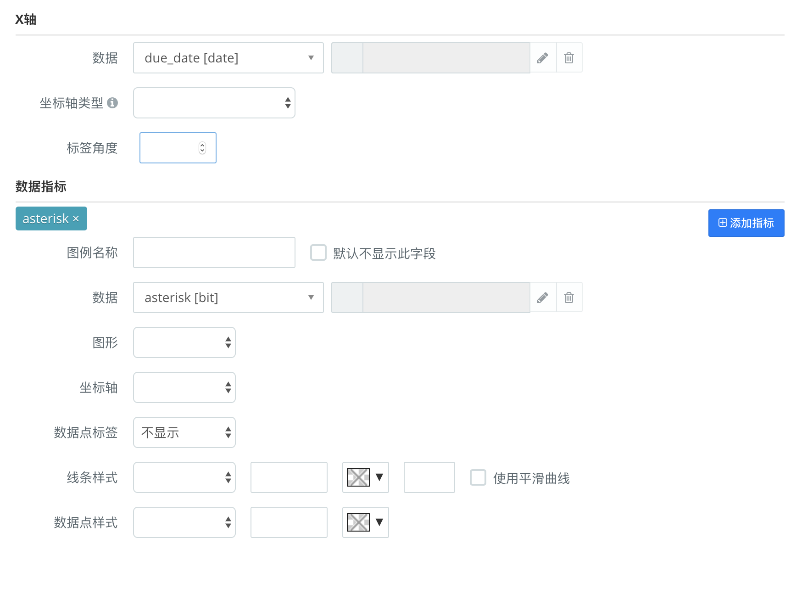
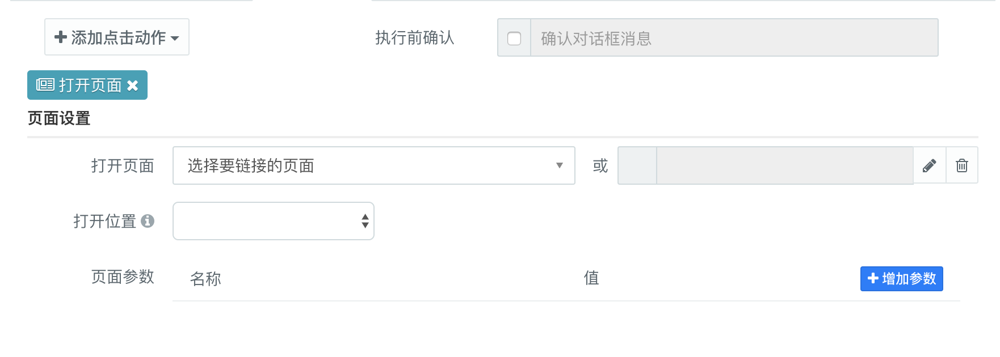
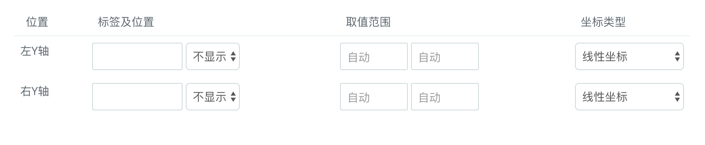

### 折线图 {docsify-ignore}

#### 组件用途
折线图主要用来展示数据相随着时间推移的趋势或变化。

#### 组件设置
##### 数据设定
参考[数据设定](udp/config-dataset.md)

##### 字段设定

##### x轴 
| 功能 | 说明 |
|--|--|
| 数据 | x轴的数据，通常为一个时间序列 |
| 坐标轴类型 | 支持将坐标轴类型设置为时间轴 |
| 标签角度 | 设置x轴上标签的角度 |

##### 数据指标

| 功能 | 说明 |
|--|--|
| 图例名称 | 设置图例显示的名称 |
| 数据| y轴对应的数据 |
| 图形| 支持在折线图和柱状图相互转换 |
| 坐标轴 | 设置y轴显示的位置(左、右) |
| 数据点标签 | 是否显示数据点标签 |
| 线条样式 | 设置线条形状、宽度、透明度、颜色以及是否使用平滑曲线 |
| 数据点样式 | 设置数据点形状、宽度、颜色 |

#### 交互设定

#### 显示样式

| 功能 | 说明 |
|--|--|
| 图形色调| 设置图形整体色调,系统内置了多个配色供选择 |
| 坐标网格线| 如图所示 |
| 图例| 支持显示或隐藏图例 |
| 缩放 | 如图所示 |

##### 坐标轴

   

