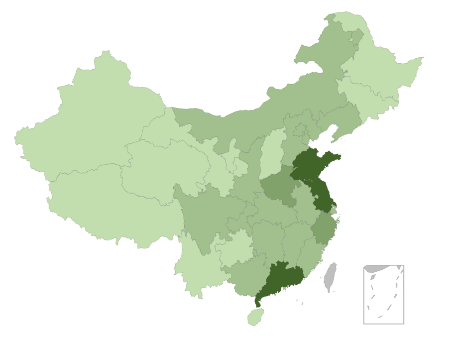
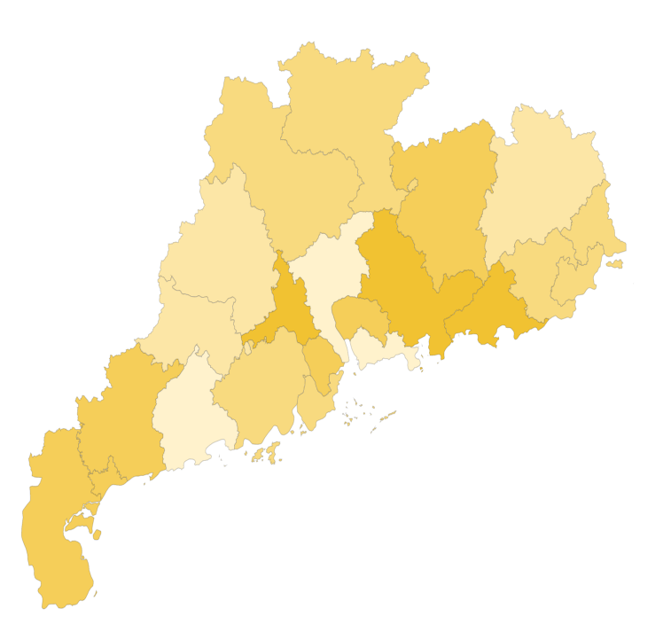

### 地图 {docsify-ignore}

#### 组件用途

系统提供了三种主要地图：中国全国地图、中国各省地图、世界地图。
在地图上支持以下两种数据展示方式：
1. 根据各个区域（例如各省、地区）的数据，展示不同深浅的颜色
2. 根据具体的地点（例如城市，坐标）的数据，展示不同颜色、大小的数据点

#### 组件设置

- **地图类型**：选择世界地图、中国地图、各省地图
- **地点**
  - **数据**：选择数据集的字段作为地点的数据来源，这个字段应该包含地名
  - **地名格式**：
    对于全国地图，简称指不包含市、省、自治区的名称，例如：
    - 简称：`北京`、`广东`、`广西`、`黑龙江`、`内蒙古`、`新疆`、`宁夏`、`西藏`
    - 全称：`北京市`、`广东省`、`广西壮族自治区`、`黑龙江省`、`内蒙古自治区`、
    `新疆维吾尔自治区`、`宁夏回族自治区`、`西藏自治区`
    
    对于各省地图，简称指不包含市的名称，例如：
    - 简称：`广州`、`深圳`、`阿坝`、`甘孜`
    - 全称：`广州市`、`深圳市`、`阿坝藏族羌族自治州`，`甘孜藏族自治州`
    
- **数据指标**
  - **图形**：数据以何种形式呈现在地图上。
    - **区块**：在地图上以不同颜色的区块显示。使用这种形式，地点数据是一个区域。
    - **散点**：在地图上以不同颜色、大小的散点显示，使用这种形式，地点数据是是一个具体的点。
    
    同一个地点在不同的地图上，可能代表不同的形式，例如同样是`广州`，在全国地图上它是一个点，在广东省地图上，它可能是一个区域（广州市行政区）

#### 数据示例

示例：制作一个全国地图，在地图上用不同深浅的颜色标记出各省的常住人口数量。

为此我们需要准备如下格式的数据，包括两个字段：`DISTRICT`和`PEOPLE`。

[^数据来源]: http://data.stats.gov.cn/easyquery.htm?cn=E0103

| DISTRICT         | PEOPLE |
| ---------------- | ------ |
| 北京市           | 2173   |
| 天津市           | 1562   |
| 河北省           | 7470   |
| 山西省           | 3682   |
| 内蒙古自治区     | 2520   |
| 辽宁省           | 4378   |
| 吉林省           | 2733   |
| 黑龙江省         | 3799   |
| 上海市           | 2420   |
| 江苏省           | 7999   |
| 浙江省           | 5590   |
| 安徽省           | 6196   |
| 福建省           | 3874   |
| 江西省           | 4592   |
| 山东省           | 9947   |
| 河南省           | 9532   |
| 湖北省           | 5885   |
| 湖南省           | 6822   |
| 广东省           | 10999  |
| 广西壮族自治区   | 4838   |
| 海南省           | 917    |
| 重庆市           | 3048   |
| 四川省           | 8262   |
| 贵州省           | 3555   |
| 云南省           | 4771   |
| 西藏自治区       | 331    |
| 陕西省           | 3813   |
| 甘肃省           | 2610   |
| 青海省           | 593    |
| 宁夏回族自治区   | 675    |
| 新疆维吾尔自治区 | 2398   |