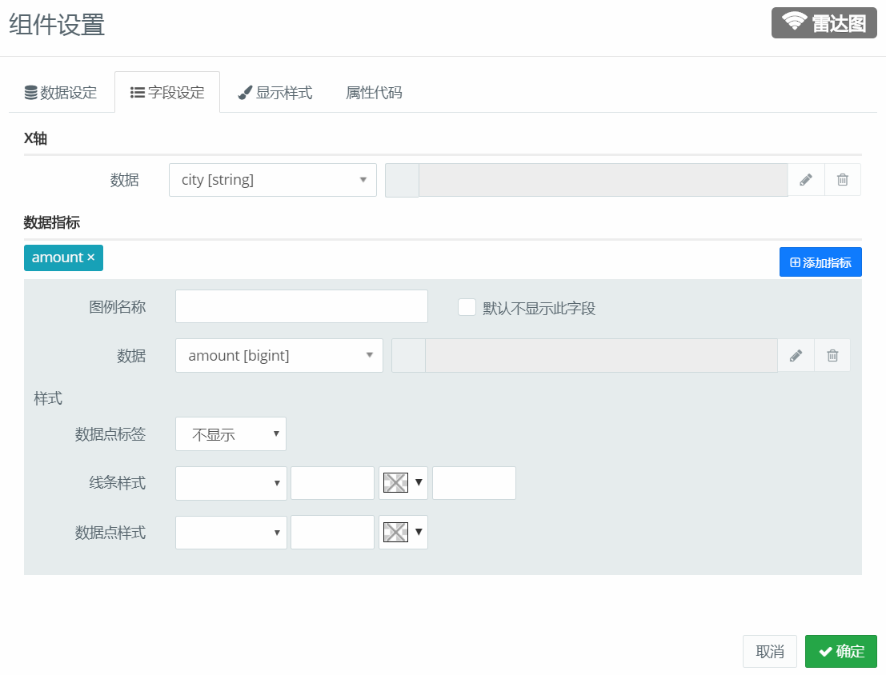

### 雷达图 {docsify-ignore} 

#### 组件用途

  

雷达图（Radar Chart）又被叫做蜘蛛网图，适用于显示三个或更多的维度的变量。雷达图是以在同一点开始的轴上显示的三个或更多个变量的二维图表的形式来显示多元数据的方法，其中轴的相对位置和角度通常是无意义的。

雷达图的每个变量都有一个从中心向外发射的轴线，所有的轴之间的夹角相等，同时每个轴有相同的刻度，将轴到轴的刻度用网格线链接作为辅助元素，连接每个变量在其各自的轴线的数据点成一条多边形。

#### 组件设置

##### 字段设定

##### 显示样式
目前只支持设置图形色调

