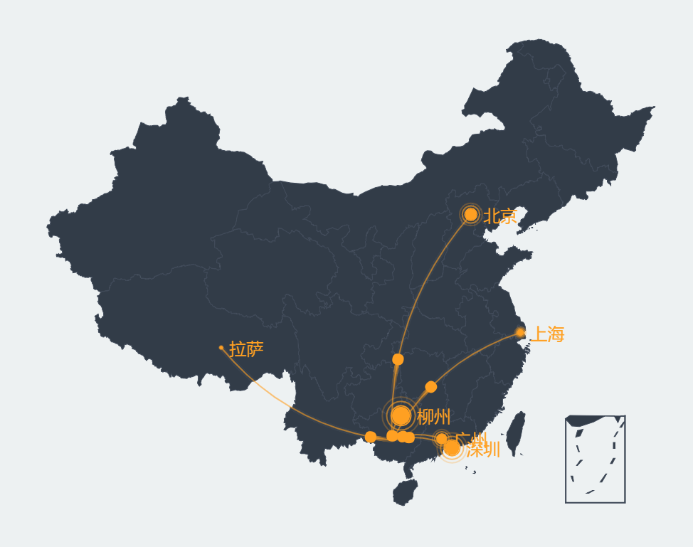

### 飞行路径 {docsify-ignore}

#### 组件用途

路径组件可以在地图上展示多点之间的连线，用来展示地点之间的关联。
应用场景如航班路线，不同地点之间的网络请求。
图形通过连线来表示地点之间的关联，通过点的半径来表示连线的数值大小。

#### 组件设置

- **起点**：连线的起点位置。
- **终点**：连线的终点位置。
- **数值**：连线的数值，将影响点的大小。

