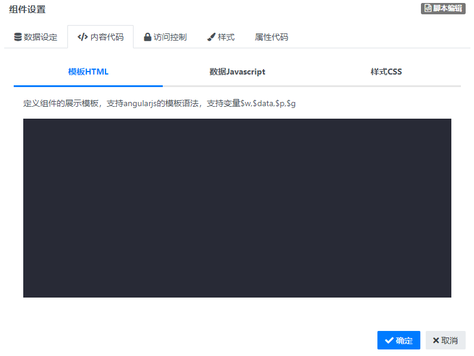

### 脚本编辑 {docsify-ignore}

#### 组件用途

自定义编写HTML、JS、CSS代码定义组件的展示模板，支持angularJs的模板语法。

#### 组件设置

输入Javascript代码，内置以下变量：

$w ：定义在模板中使用的值

$data：数据集的数据结果，格式为{total:number,records:[]}

$p：引用其它页面参数

$g：引用全局参数
