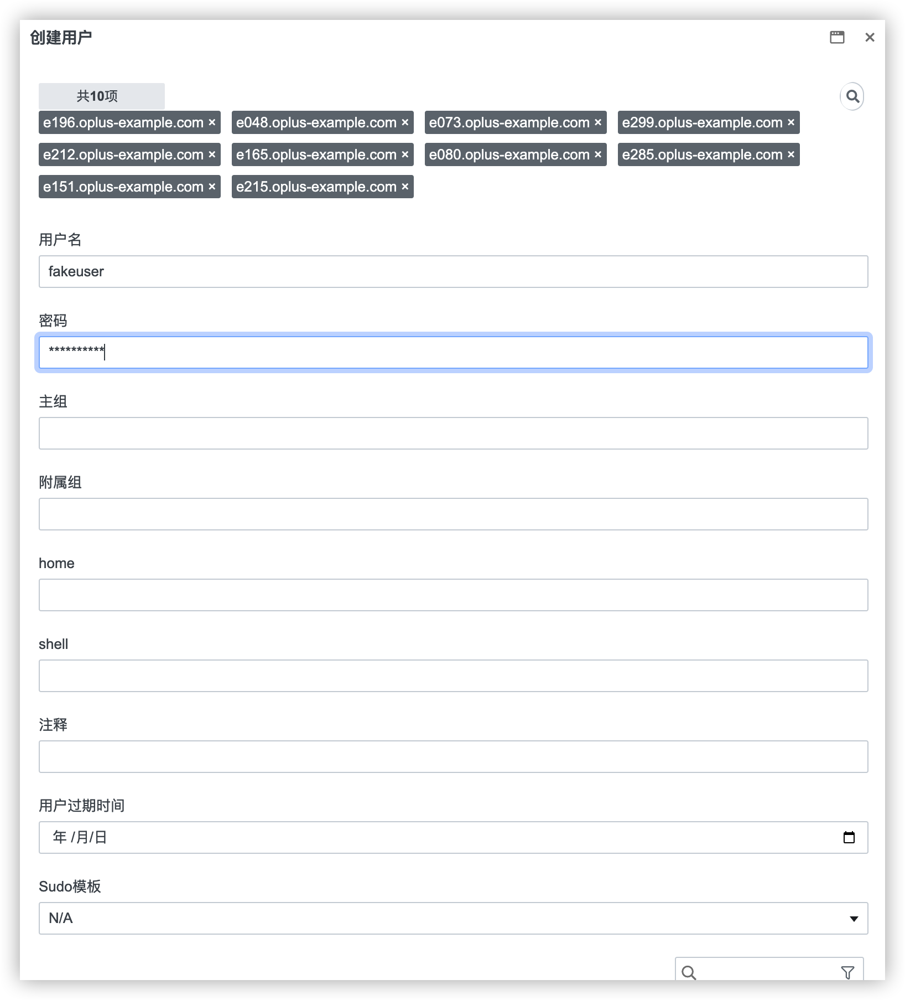
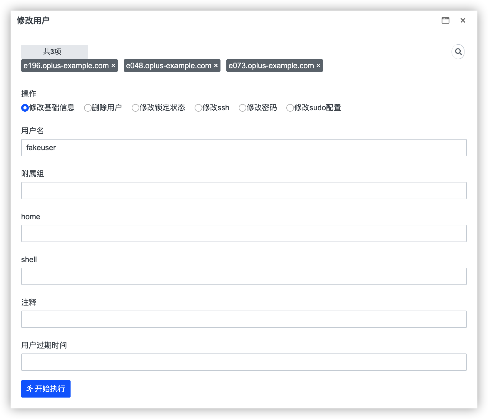
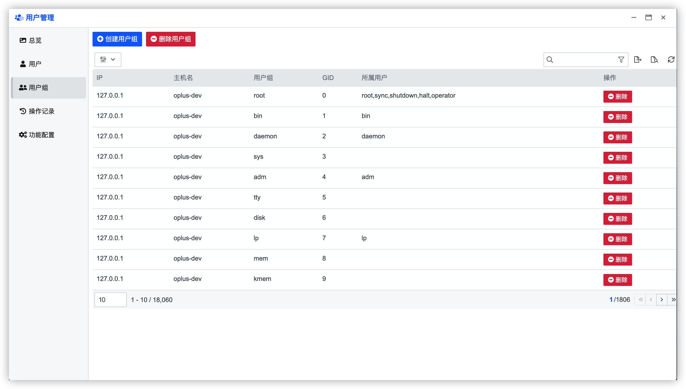

## 使用指南 {docsify-ignore}

### 总览

***总览页面通过图表的形式，使用不同维度的指标项，汇总展示当前系统管理的所有用户和用户组***

**KPI图表**

各指标业务含义如下：

- 主机：当前扫描用户成功的主机数量

- 用户：当前系统内所有用户名去重后的数量

- 异常用户：根据异常用户规则识别出来的异常用户数量

  > 异常用户规则
  >
  > 1（严重）普通用户UID，GID不允许为0
  >
  > 2（一般）Redhat5、6普通用户UID、GID不允许小于500，Redhat7、8普通用户UID、GID不允许小于1000
  >
  > 3（提示）用户登陆异常

- 用户组：当前系统内所有用户组名去重后的数量

- 近一月操作：用户管理模块最近一个月操作的数量

- 操作失败数：用户管理模块历史操作失败的数量

  

**十五天内操作统计**

最近一次操作的时间作为结束时间，往前十五天内的操作统计折线图

**三天内操作统计**

最近一次操作的时间作为结束时间，往前三天内的操作统计列表

### 用户

***用户页面可以进行用户扫描、批量创建、修改用户信息，以及提供详尽的用户信息列表***

**用户信息列表**

展示当前已扫描成功的用户数据，可以根据IP、用户名、锁定状态、用户类型过滤

**扫描主机**

点击“扫描主机”按钮，打开弹窗，选择需要扫描用户的主机，点击“开始执行“后，系统会开始扫描选中主机上的用户和用户组信息。

**创建用户**

点击“创建用户”按钮，打开弹窗。选中主机后，输入用户相关的信息，即可在对应主机上创建用户。

> 注意：主机、用户名和密码为必填项，其他参数为选填。

**编辑用户**

点击表格中用户名或者“编辑用户”按钮，都可以对用户进行编辑。

### 用户组

***用户组页面提供对用户组常用的一些操作***

### 操作记录

***操作记录展示了用户在用户管理里面的每次操作，方便回溯以及审计***

### 功能配置

***功能配置页面提供sudo模板和计划任务配置，方便管理sudo权限以及自定义扫描用户周期***

> sudo模板：一组sudo命令的集合，通过配置sudo模板可以方便配置不同用户的权限

