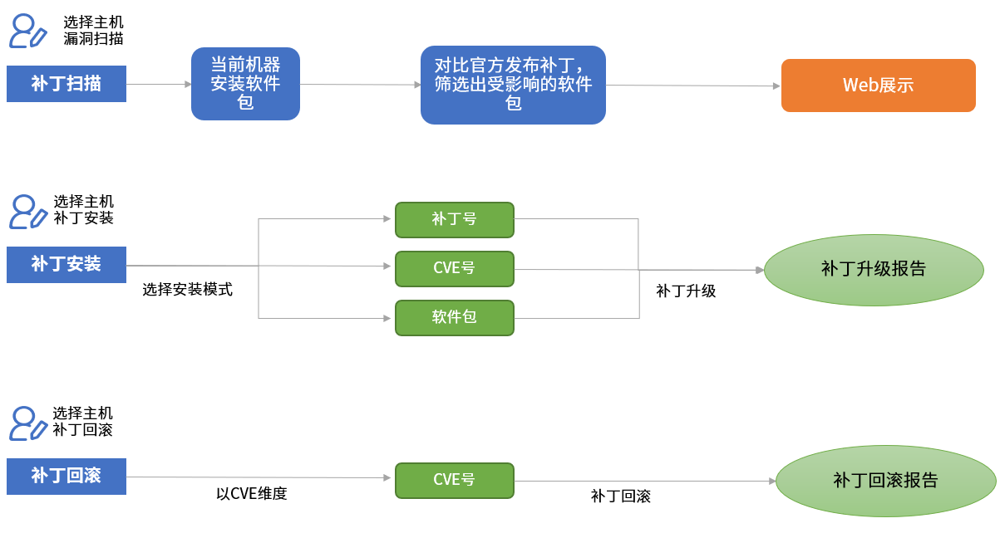
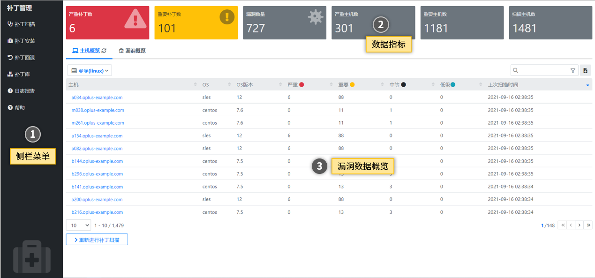
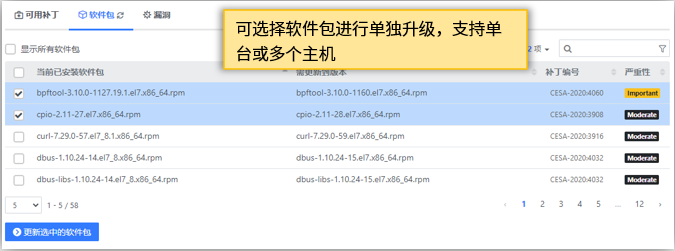
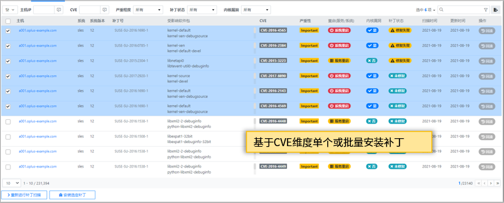
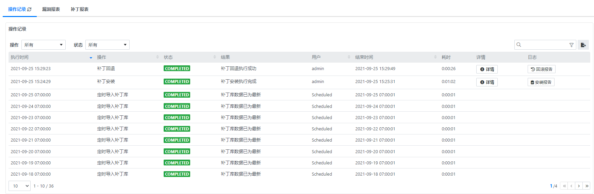

## 使用指南 {docsify-ignore}

### 功能概要

补丁管理分为补丁扫描、补丁安装、补丁回退几个功能模块，具体执行流程如下图：

补丁管理界面如下图：

页面主要元素有：

1. 侧边栏：功能导航菜单

  - 补丁扫描：用于扫描漏洞和展示漏洞扫描详细信息和漏洞扫描指标数据
  - 补丁安装：对于漏洞扫描出补丁，进行补丁升级
  - 补丁回退：对于已升级安装补丁，进行补丁回退
  - 日志报告：对于所有操作记录，详细记录，方便回溯

2. 数据指标：对于漏洞扫描，统计各个严重程度补丁数量和各个严重程度的主机
3. 数据漏洞概览：展示主机扫描、补丁安装、补丁回退、日志报告等信息概览

### 补丁扫描

在左侧栏导航点击【补丁扫描】，右下角点击【重新进行补丁扫描】按钮，进入主机选择界面

选择需要执行漏洞扫描主机，点击【确认】按钮执行漏洞扫描。

执行完成后，在补丁扫描首页可以看到所有执行过补丁扫描的主机概要信息，包括：

- 主机
- 操作系统
- 操作系统版本
- 存在严重程度漏洞数量
- 存在重要程度漏洞数量
- 存在中等程度漏洞数量
- 上次扫描时间

点击对应主机，可进入详情查看页面，进入主机详细页面后，可看到如下信息：

- **可用补丁**：该主机可升级的漏洞编号以及关联CVE信息，以及该补丁相关联的软件包信息等概要信息
- **软件包**：该主机当前已安装软件包和存在漏洞可升级到的软件包，以及关联补丁号
- **漏洞**：该主机当前存在的漏洞编号(CVE号)

### 补丁安装

多种补丁升级方式如下：

- **补丁号升级**：在可用补丁页面，选择所需升级的补丁号，通过补丁号安装补丁
  
- **软件包升级**：在软件包页面，选择所需升级的软件包，将所选软件包升级到需要升级到的版本
  
- **CVE号升级**：在漏洞管理页面，通过筛选CVE号，选择通过CVE号安装补丁
  

### 补丁回退

在左侧导航栏选择【补丁回退】按钮，进入补丁回退界面，补丁回退界面会展示每一次的补丁升级的记录，包含信息如下：

- 更新主机
- 更新软件列表
- 更新时间

选择需要进行补丁回退操作的记录，点击对应记录中操作【回退】按钮，进行补丁回退。

### 补丁库

在左侧导航栏选择【补丁库】按钮，进入补丁库页面，顶部为不同操作系统补丁库定义的概要信息，点击不同操作系统，补丁库列表
页面会展示与之相对应的信息，补丁库列表页面会展示详细的补丁库信息，在补丁号一列点击补丁号可查看与之相对应的补丁详细信息，在关联 CVE列点击CVE号，显示与之相对应的CVE详细信息。

补丁库更新机制如下：

- **定时同步**：补丁库会定时同步官方最新发布补丁信息
- **手动同步**：点击右下角【检查补丁更新】按钮，手动导入补丁

### 日志报告

在左侧导航栏选择【日志报告】按钮，进入日志页面,包括如下：

- **操作记录**：记录所有补丁管理中执行的操作
- **漏洞报表**：查看目前所有已扫描主机的漏洞扫描情况以漏洞编号(CVE号)为维度展现
- **补丁报表**：查看目前所有已扫描主机的漏洞扫描情况以补丁号为维度展现

