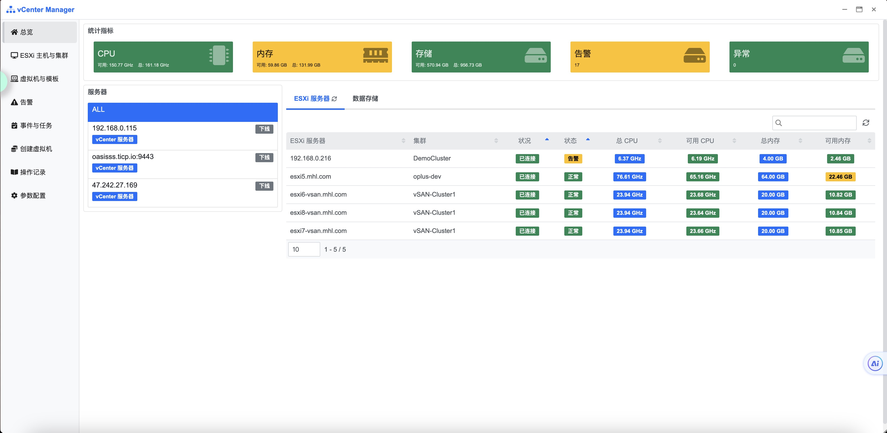
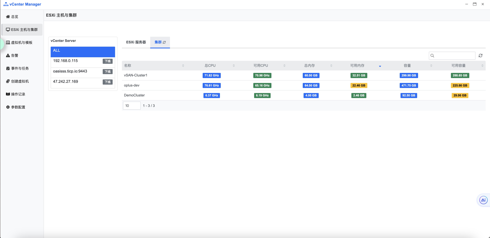
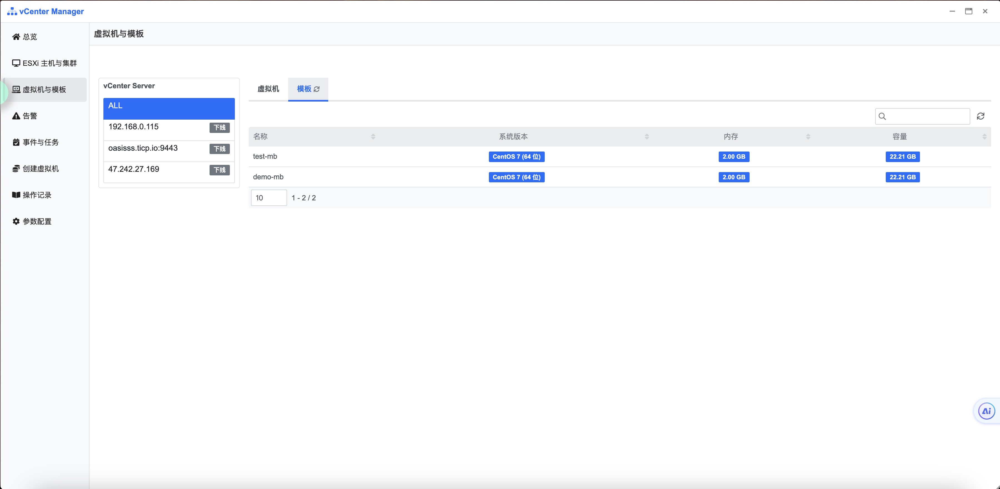
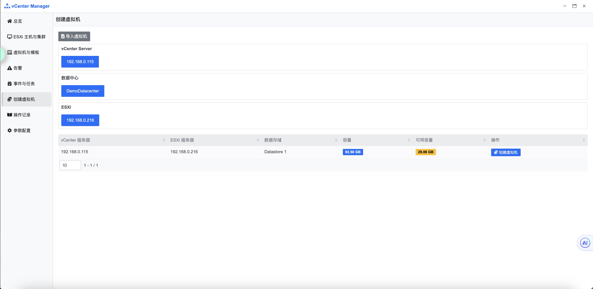

## 使用指南 {docsify-ignore}

### 功能概要

vCenter Server 主要功能包括查看 <ESXi / Cluster / Datastore / VMs / Template / 告警 / 事件 / 任务> 的各项指标以及对 vCenter Server 的各项配置。

vCenter Server 界面如下图：

### 总览

在左侧栏导航点击[总览]，上方展示不同指标卡片, 部分可以点击跳转至相关页面, 下方左侧服务器列表可以点击进行筛选, 下方右侧展示 [ESXi] 及 [Datastore] 的指标数据

### ESXi主机与集群

在左侧栏导航点击[ESXi主机与集群]，左侧服务器列表可以点击进行筛选, 右侧展示 [ESXi] 及 [集群] 的指标数据

### 虚拟机与模板

在左侧栏导航点击[虚拟机与模板]，左侧服务器列表可以点击进行筛选, 右侧展示 [虚拟机] 及 [模板] 的指标数据

### 告警

在左侧栏导航点击[告警]，左侧服务器列表可以点击进行筛选, 右侧展示 [告警] 的指标数据

### 事件与任务

在左侧栏导航点击[事件与任务]，左侧服务器列表可以点击进行筛选, 右侧展示 [事件] 及 [任务] 的指标数据

### 创建虚拟机

在左侧栏导航点击[创建虚拟机]，在右侧选择 [vCenter Server] - [数据中心] - [ESXi] - 在列表中选择[Datastore] 并点击[创建虚拟机]按钮

在跳转的页面内填写页面展示的字段 如图

单击开始创建即可下发新建任务

### 操作记录

在左侧栏导航点击[操作记录]，上方[执行日志]展示历史装机任务列表, 下方[操作日志]展示在当前功能内的操作日志

### 参数配置

在左侧栏导航点击[参数配置]，右侧表格展示当前所有已配置的 vCenter Server

