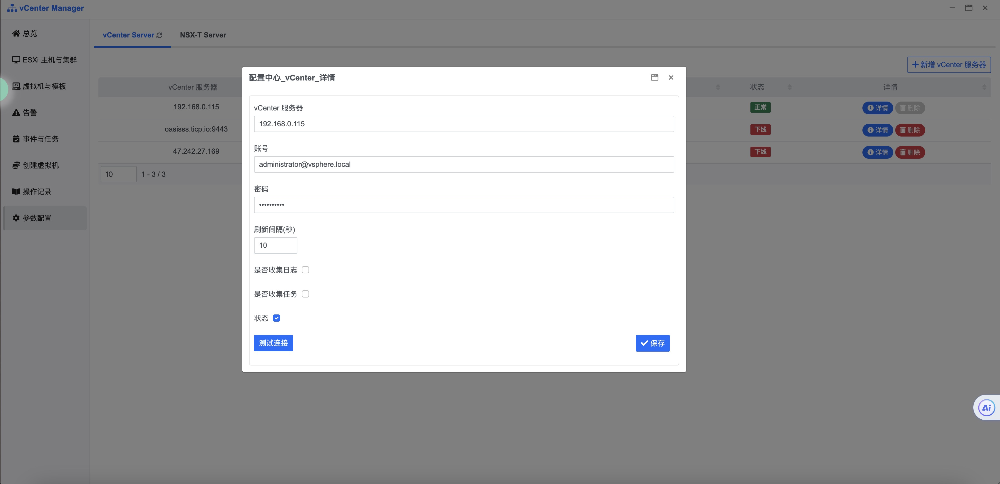

## 快速入门 {docsify-ignore}

**步骤1：进行 vCenter Server 配置**

首先从左侧菜单栏单击[参数配置]选项 如下图进入配置界面

在参数配置中, 单击右上角[新增 vCenter 服务器]按钮, 在弹出的对话框中填写页面所展示的字段, 如下图

所有字段确认填写无误后单击[测试连接]按钮, 若提示连接成功, 单击[保存]按钮即可, 若连接失败或超时, 请检查服务器及账号密码是否有误, 或服务器相应端口/防火墙策略未打开或放行

在提示保存成功且列表中存在刚刚新增的记录后, 查看该条记录状态为上线即为新增成功

新增配置成功后, 后台实时自动同步当前所有已上线的 vCenter Server 所有指标项, 首次初始化加载可能需要一些时间

**步骤2：创建虚拟机**

如果需要进行创建虚拟机操作, 请按以下操作进行

在左侧栏导航点击[创建虚拟机]，在右侧选择 [vCenter Server] - [数据中心] - [ESXi] - 在列表中选择[Datastore] 并点击[创建虚拟机]按钮

在跳转的页面内填写页面展示的字段 如图

单击开始创建即可下发新建任务