<p class="opx-doc-title" style="text-align:center;font-size:3rem;background-color:#eee; padding:0.25em 0.5em; font-weight:bold">OPSmind使用指南</p>

<p class="opx-doc-version" style="text-align:right; padding-right:1em;">版本 3.0</p>

<p class="opx-doc-version" style="text-align:right; padding-right:1em;">修订日期 2024-05-15</p>

<div class="page-break"></div>

[TOC]

# OPSmind简介 


OPSmind是一个无代理模式的的自动化运维平台，可以助力完成系统巡检、漏洞扫描、软件包安装、用户权限管理、信息采集等运维工作的自动化。

OPSmind把IT运维长期经验，通过标准化功能场景提供给用户。同时OPSmind提供了强大的开发能力，用户可以通过低代码的开发方式进行功能定制，轻松打造符合自身特性的自动化功能。

OPSmind建立在业界领先的自动化运维工具Ansible之上，保留了Ansible开放、模块丰富、维护简便、扩展灵活的优势，又在上面进行了大量功能扩展，让Ansible使用更简便和规范，自动化操作更直观和场景化。OPSmind采用无代理、模块化的架构，可以适用不同规模的IT环境。这种非侵入式的架构，可以在不替换现有运维架构的情况下，广泛兼容现有的多种运维系统和工具，最大程度保护现有的IT投资。

## 多类型设备接入

依托Ansible强大的设备管理能力，OPSmind可以对物理机、虚拟机、网络设备等进行统一的自动化接入和管理。
* 可以通过Excel等形式导入现有的设备信息，实现资产台账统一管理。
* 提供标签、分组、动态条件等方式对设备进行多维度查询和管理。
* 自动化采集设备信息，为企业CMDB或资产管理系统供准确可靠的数据。
* 支持自定义资产模型，灵活适配不同类型的设备信息。

## 统一的脚本和命令管理

OPSmind可以对运维脚本和命令进行统一的规范化管理，提高复用率，降低维护成本，使得脚本、命令等成为IT资产的一部分。
* 为脚本扩展了目录、描述、参数等信息，方便脚本的管理和使用。
* 支持脚本和命令的版本控制，记录所有的修改记录。
* 支持审核发布流程，对脚本和命令进行上线管控，防止危险和恶意操作。
* 可以将常用的操作按场景定义成命令组合，在应急处理时可以快速执行，获取诊断信息。

## 自动化作业

OPSmind可以通过作业的形式来编排脚本、命令、Web Service等任务和流程，完成复杂的配置变更、数据采集、发布部署等自动化工作。
* 通过拖拽方式完成操作流程的编排。
* 提供便利的工具查看执行进度和结果。
* 支持作业的定时和自动运行。
* 支持多个Ansible节点，可以通过水平扩展提高执行效率和实现跨网段设备管理。

## 低代码开发

OPSmind提供强大的开发功能，以可视化的方式制作数据看板、报表、监视大屏、操作表单等常用的运维前端界面，解决运维中频繁的数据展示和用户交互需求。
* 可以从MySQL、Oracle、DB2、SQLServer、REST API等多种数据源获取数据并在页面展示。
* 支持布局、表单输入、表格、图形、作业等40多种展示和操作组件。
* 无需编程，采用所见即所得的可视化开发模式，运维人员经过简单培训可自行进行开发。
* 运维功能的开发不再受限于开发人员，和传统的代码开发相比，上线周期缩短60%以上。


# 资产管理 

资产管理对企业资产进行不同维护管理，包括自动化资产和非自动化资产

主要功能：

- **资产信息**：对导入的资产进行查询和管理操作
- **资产模型**：对资产模型进行查询和管理操作
- **数据管理**：对资产数据管理，包括分组、标签、资产导入、资产导出
- **自动化配置**：对导入的资产进行自动化配置，包括纳管、ansible配置等
- **异常设备**：列举连通异常设备，对异常设备重新检测，导出异常设备信息等
- **资产权限**：按照资产分组及用户所属团队给予资产不同的权限，包括：可读、可写、可执行权限


## 快速入门 

### 示例：资产纳管

**步骤1：在【资产信息】页面点击【自动化录入】按钮，填写信息，录入一台linux服务器**


**步骤2：在【自动化配置】搜索已录入的的服务器，点击【表格】【操作】栏的编辑按钮，填写linux服务器上root用户以及密码**


**步骤3：在【异常设备】页面点击【检查连通性】按钮，选择已录入的服务器进行连通状态检查**


**步骤4：在【操作记录】页面查看【设备连通性检测】执行结果**


**步骤5：在【异常设备】页面点击【采集信息】按钮，选择已录入的服务器进行信息采集**


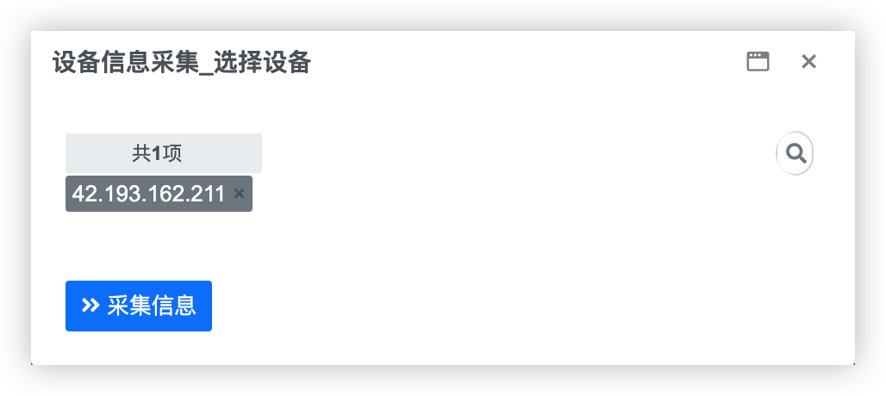


**步骤6：在【操作记录】页面查看【资产信息采集】执行结果**

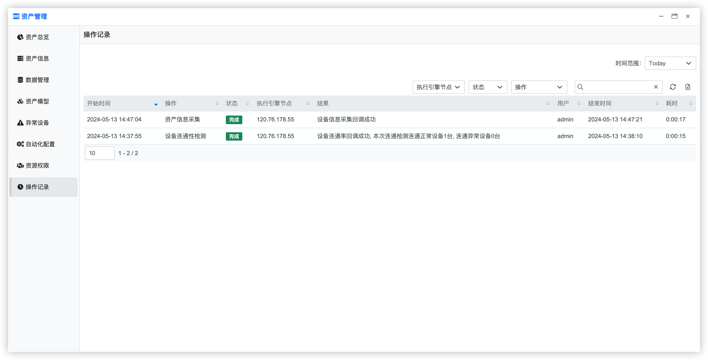


**步骤7：在【资产信息】页面可以看到服务器的详细信息已经变化**


***至此，已完成资产的纳管，可以在【系统巡检】【补丁管理】【用户管理】等自动化场景模块中对已纳管服务器进行管理***


## 使用指南 

### 功能概要

资产管理分为资产信息、资产模型、数据管理、自动化配置、异常设备几个功能模块，具体使用流程如下图：


资产管理界面如下图：


侧栏菜单，包括：

- 资产总览：当前管理资产的总体展示
- 资产信息：对导入的资产进行查询和管理操作
- 数据管理：对资产数据管理，包括分组、标签、资产导入、资产导出
- 资产模型：对资产模型进行查询和管理操作
- 异常设备：列举连通异常设备，对异常设备重新检测，导出异常设备信息等
- 自动化配置：对导入的资产进行自动化配置，包括纳管、`Ansible`配置等
- 资源权限：按照资产分组及用户所属团队给予资产不同的权限，包括：可读、可写、可执行权限
- 操作记录：展示用户在资产管理

### 资产信息

在左侧栏导航点击【资产信息】，进入资产界面，可对资产进行编辑、分组、标签、资产上下线管理


### 数据管理

在左侧导航栏选择【数据管理】，进入数据管理界面，数据管理页面展示的以分组、标签、条件为维度的资产数据管理，并对分组、标签、条件进行管理，同时可导入导出资产信息


### 资产模型

- 在左侧栏导航点击【资产模型】，进入资产模型界面，可对资产模型进行管理

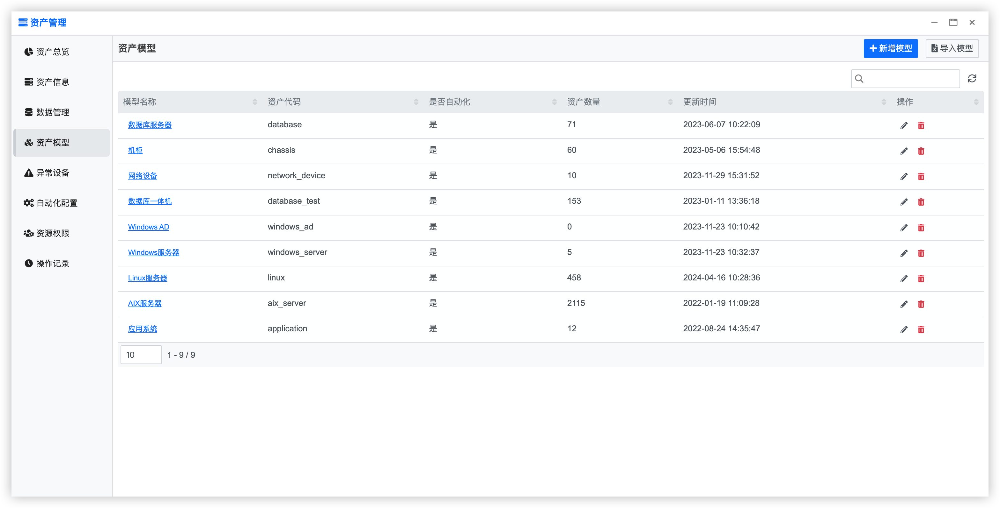

- 模型录入/修改：

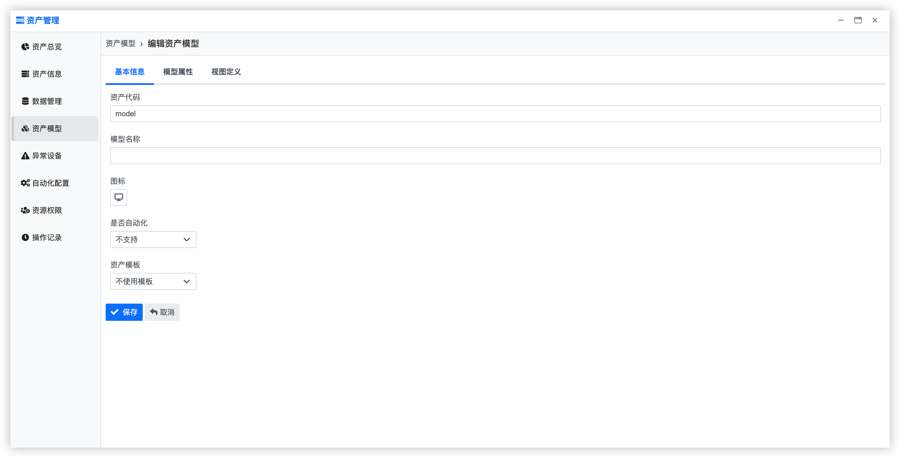

- 模型属性设置：

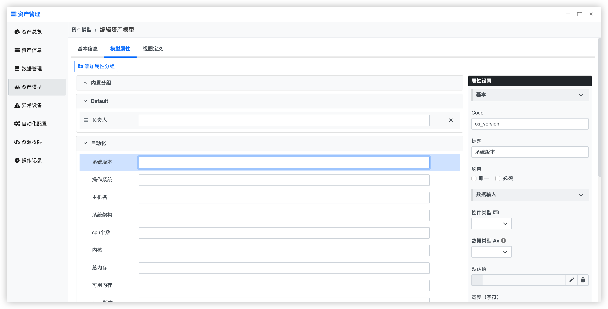

**注意：**资产模型分为自动化模型和非自动化模型

- 视图定义

资产的展示分为两块，一种是资产管理首页、另一种的执行作业所用的设备选择器。两种展示和方式都以表格形式展现。可在资产模型配置的视图解析中配置表格显示的字段，字段顺序。

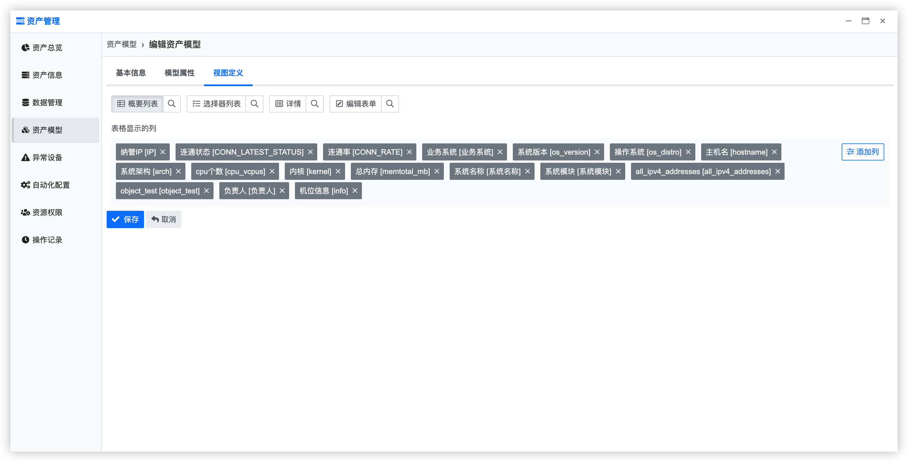


### 自动化配置

在左侧导航栏选择【自动化配置】，进入自动化配置界面，该页面分为自动化配置信息和`Ansilbe`连接配置。

`Ansible`连接配置是针对`OPSmind`支持的自动化设备类型默认配置进行修改


自动化配置是针对每一个自动化资产的默认连接配置进行修改

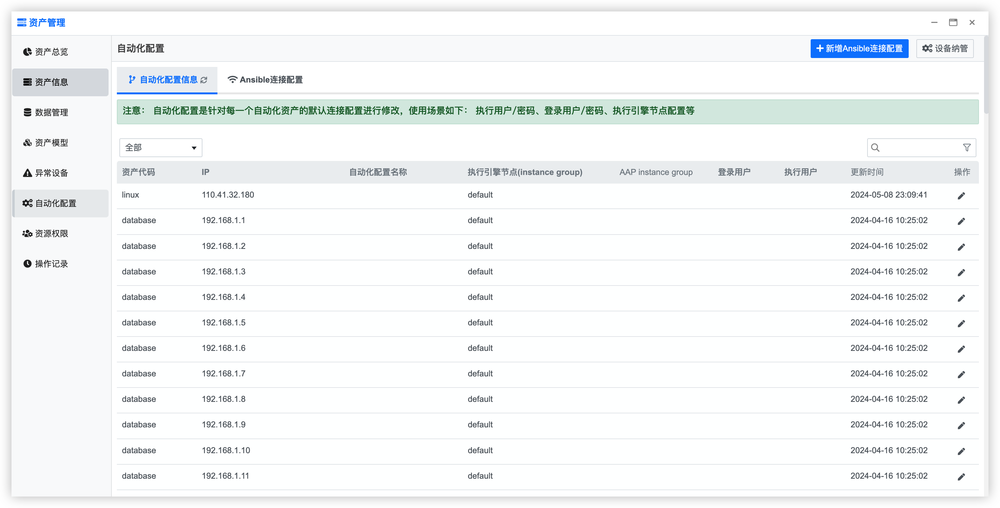


### 异常设备
在左侧导航栏选择【异常设备】按钮，进入异常设备页面，该页面展示的是所有连接最近一次连通测试失败的，或者连通率小于百分之五十的设备信息。此页面可手动执行设备连通性检查，手动采集设备资产信息，并且可以导出异常的设备信息。

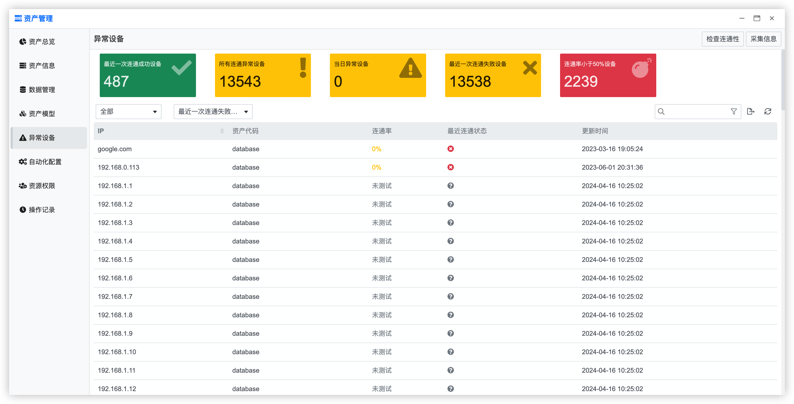


### 资源权限
 资产分为以下权限

| 设备名   | 设备代码             |
| ----- | ---------------- |
| `R`   | 读          |
| `RW` | 读写   |
| `RWX` | 读写可执行    |

资产权限维度为团队和资产分组，若某一个某一个团队拥有某个分组的权限，那么团队内的所有人都拥有该分组的权限

拥有团队管理员角色的用户可以为各个团队分配分组权限


## 设置和管理 

### 权限配置

|           | 匿名用户 | 登录用户 | 资产模块管理员 |
| --------- | ---- | ---- | ------- |
| 查看资产信息    | -    | Y    | Y       |
| 资产信息管理    | -    | -    | Y       |
| 查看资产模型    | -    | Y    | Y       |
| 资产模型管理    | -    | -    | Y       |
| 查看数据管理    |      | Y    | Y       |
| 数据管理      | -    | -    | Y       |
| 查看自动化配置信息 | -    | Y    | Y       |
| 管理自动化配置信息 | -    | Y    | Y       |
| 查看异常设备    | -    | -    | Y       |
| 执行自动化操作   | -    | -    | Y       |


## 常见问题 


# 脚本管理

脚本是运维的基础工具，脚本管理通过集中的脚本库，对各种自动化运维脚本进行统一管理，
包括脚本上传、审核发布、测试运行、下线等。

脚本管理提供两个服务类型：脚本库和文件库。

脚本库提供一个集中存放脚本的地方，管理文本型的脚本（例如shell/perl/python脚本、Ansible playbook、配置文件等），脚本库具有如下特点：
- **按场景组织脚本**：按照不同的应用场景和功能，把脚本存放在对应目录下，管理清晰定位明确；
- **直观了解脚本**：可以为脚本添加描述，说明脚本目的、使用方法、参数等信息，使用者可以直观知道脚本的用途，不需要通过文件名来猜测；
- **上线管控**：只有经过审核的脚本才能进入生产脚本库，杜绝随意上传和执行脚本；
- **版本控制**：脚本库保留每一次的脚本内容修改历史，可以追踪修改记录；

文件库提供轻量的Web文件访问功能，可以进行简单的文件上传、下载和查看。
文件库不具备版本控制，它主要是为了给脚本提供一些便利功能，在后面的示例中会提到。


## 快速入门 

我们通过几个示例来演示脚本模块的基本功能。

### 示例：列出远程主机的用户

**说明**：

在这个示例，我们往脚本库添加一个shell脚本。脚本功能是在远程主机上执行一条命令，列出当前系统的用户。通过这个示例，可以对以下内容有初步了解：

- 脚本库的概貌
- 如何上传、审批、执行脚本

**步骤1：准备脚本**

使用系统自带的`demo/list-users.sh`，或自行编辑一个shell脚本保存为`list-users.sh`，文件内容如下：

```bash
#!/bin/bash
cat /etc/passwd
```

**步骤2：在脚本库中准备文件夹（普通用户）**

登录系统，进入`http://{oplus_url}/#/gfs/r/$tnt/dir/`，页面展示出文件库根目录下的内容。
如果根目录下有名为`demo`的文件夹，可以跳过此步。点击右上方的按钮【文件夹】，在弹出的对话框中输入以下信息
- **文件夹名称**: demo

点击【确定】按钮，将创建文件夹并关闭对话框。

**步骤3：上传文件（普通用户）**

进入`demo`文件夹，点击页面右上方的按钮【文件】，在弹出对话框中输入以下信息：
- **选择文件**：选择`list-user.sh`
- **说明**：`查看操作系统的用户`

点击【确定】按钮，将上传文件并关闭对话框。

在文件列表中，可以看到刚上传的文件，文件名旁边有一个蓝色的圆点，表示这个文件待审核。
此时未经审核的文件存放在脚本库的审核区，需要管理员审批后才能进入正式的生产脚本库使用。

**步骤4：脚本审核（脚本管理员）**

以脚本管理员身份登录。在左侧导航选择菜单【脚本审核】，可以看到需要审核的目录和文件列表。
进入`demo`，看到刚才上传文件右侧的状态是“待审核”。点击状态，在弹出的对话框中选择【允许发布】，
点击按钮【确定】将关闭对话框，文件将正式发布到脚本库。

文件发布后，文件列表中的待审核文件消失。

**步骤5：测试运行（普通用户）**

以普通用户登录，进入脚本库，在`demo`目录下可以看到前面上传的文件状态已变为“已启用”。鼠标悬浮在文件名上，
点击右侧的按钮，在弹出菜单选择【测试运行】。


在测试运行对话框选择测试主机，点击按钮【开始执行】。


脚本开始在后台执行，按钮左边有图标指示当前的状态，需要等待十几秒钟等待作业完成。作业完成后，点击状态指示图标，可以查看执行的结果。
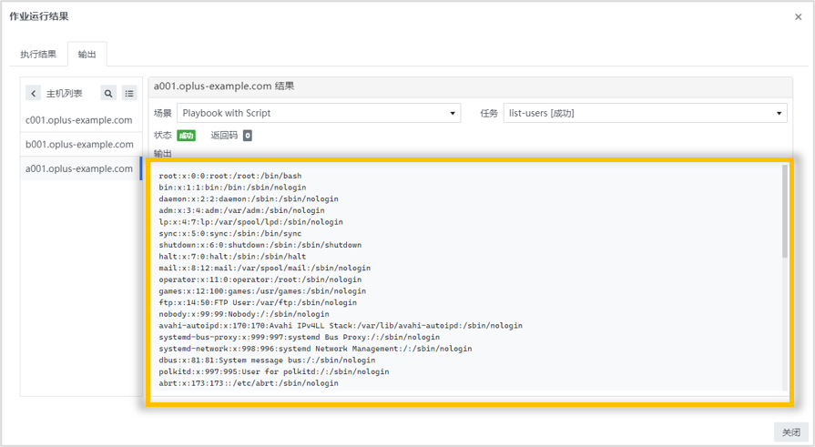

### 示例：收集远程主机日志

**说明**

这里示例，我们往脚本库添加一个playbook，脚本可以收集远程主机的`/var/log/secure`日志，并将收集到的日志上传到文件库。
通过这个示例，可以对以下内容有初步了解：

- 一次上传多个文件或一个目录
- 通过文件库作为一个内容的中转

**步骤1：准备playbook**

使用系统自带的Ansible Playbook `fetch-seclog.zip`，或者自行编辑下面两个文件`site.yml`和`hosts`，
并将这两个文件压缩成`fetch-seclog.zip`。

<!-- tabs:start -->
#### ** 文件 site.yml **
```yaml
#===============================================================================
# 抓取/var/log下的日志，将结果上传到文件服务器
# @param numlines 抓取的日志行数，默认500行
# @param host_group 如果不指定，默认使用servers组的主机
#===============================================================================
---
- name: "抓取日志"
  hosts: "{{host_group|default('servers')}}"
#  gather_facts: no
  vars:
    # 纳管机上的源文件路径
    var_srcfile: "/var/log/secure"
    # 抓取的日志行数
    var_numlines: "{{numlines|default(500)}}"
    # 纳管机上的目标目录
    var_destdir: "/tmp/{{var_srcfile | replace('/','_')}}"
  tasks:
    - name: "初始化变量"
      set_fact:
        # 保存在本地的目录，变量保存在localhost里面
        var_local_results_dir: "/tmp/oplus/host-results/{{var_srcfile | replace('/','_')}}"
      delegate_to: localhost
      delegate_facts: true
      run_once: true

    - name: "0. 准备目标目录"
      file:
        path: "{{var_destdir}}"
        # 确保远程主机上的目标目录存在
        state: directory

    - name: "1. 读取远程主机日志文件，保存在目标目录下"
      # 保存在目录{{var_destdir}}下，文件名为secure_{{ansible_nodename}}
      shell: tail -n {{var_numlines}} {{var_srcfile}} | grep "Failed password for" | sed 's/\x1B\[[0-9;]\+[A-Za-z]//g' > {{var_destdir}}/{{var_srcfile|basename}}_{{ansible_nodename}}

    - name: "2. 从远程主机取回检查结果至本地"
      fetch:
        src: "{{var_destdir}}/secure_{{ansible_nodename}}"
        dest: "{{hostvars.localhost.var_local_results_dir}}/"
        validate_checksum: no
        flat: yes

- name: "上传结果到文件服务器"
  hosts: "fileserver"
  gather_facts: no
  tasks:
    - name: "准备上传目录"
      file:
        path: "{{OPLUS_GFS_DIR}}/fetch-logs/"
        state: directory

    - name: "从本地上传文件至fileserver"
      copy:
        src: "{{hostvars.localhost.var_local_results_dir}}"
        dest: "{{OPLUS_GFS_DIR}}/fetch-logs/"
        force: true
```
#### ** 文件 hosts **
```ini
[servers]
#oplus-var:hosts

[fileserver]
#把下面的值替换为文件服务器的IP
127.0.0.1
```
> [!NOTE]
> 注意上面的`fileserver`地址要改成正确的oplus主机地址

<!-- tabs:end -->

**步骤2：上传文件**

将`fetch-seclog.zip`上传到脚本库的`demo`目录下，在上传对话框输入以下信息：

- **压缩文件选项**：`解压到子目录`
- **参数配置**： `numlines=${num_lines}`
- **说明**： `抓取/var/log/secure中的登录失败信息并上传到文件服务器`


点击按钮【确定】上传文件。上传完之后，可以看到`demo`下多了一个`fetch-seclog`的文件夹，里面有`site.yml`和`hosts`两个文件

**步骤3：审核脚本**

同之前示例。可以多个文件一次批量审批。

**步骤4：测试运行**

Playbook的主文件是`site.yml`，浏览到目录`demo/fetch-seclogs/site.yml`，点击菜单项【测试运行】。
在运行对话框中，比之前的示例多了一个参数设置，可以输入一个数字表示日志的行数。

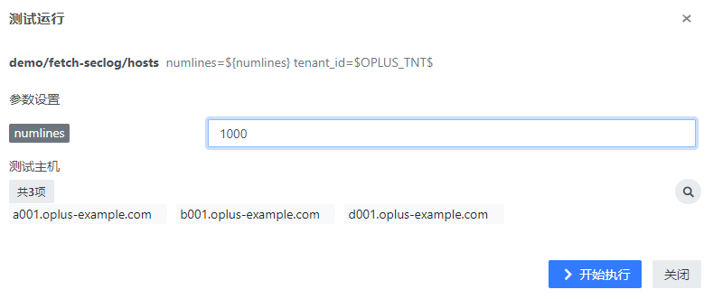

脚本运行完后，点击左侧栏的【文件库】（或者输入`http://{oplus_url}/#/gfs/staticfs/$tnt/dir/`）进入文件库。
在目录`fetch-logs/var_log_secure`下可以看到所有主机的日志文件。


## 使用指南 

### 功能概要

脚本库内部分为发布区和审核区两个区域。用户上传的文件先放在审核区，在审核通过后文件才会从审核区转移到生产区。
脚本库的管理流程如图。


脚本管理模块的主界面如图。


页面主要元素有：
1. 侧栏菜单，包括：
   - **脚本库**：脚本库发布区和审核区的文件展示。
   - **文件库**：普通文件上传管理展示。
   - **脚本审核**：进入审核区进行脚本审核，仅管理员可见。
2. 导航和工具条：可以进行上传文件、创建文件夹、文件编辑等操作。
3. 文件列表：列出脚本库或文件库的目录和文件
4. 文件菜单：对当前所选文件进行操作

### 脚本管理规范
> - 按照脚本的功能进行分类，不要随意丢放脚本，建立文件夹将不同脚本进行区分。
> - 脚本命名规范语义化，可以通过脚本名称了解该脚本的用途。
> - 上传脚本时，填写脚本说明，方便后期维护。

### 脚本上传

在脚本库页面点击上传文件按钮，打开添加文件对话框。参数说明：

- **选择文件**：点击按钮从浏览器客户端选择一个本地文件
- **压缩文件选项**：如果选择的文件是一个压缩包（目前仅支持ZIP格式压缩文件），将出现此选项。可以选择：
  - 解压到子目录：将压缩包解压后上传到子目录下
  - 不解压：将压缩包原文件上传
- **参数配置**（可选）：如果文件支持配置（例如命令执行参数）可以在这里填写
- **说明**（可选）：可以在这里填写文件的用途、目的、使用方法等描述信息，便于使用者理解这个文件

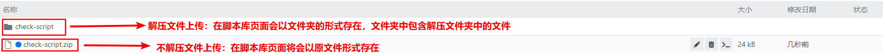

上传后对话框关闭，在文件列表中可以看到新上传的文件。


### 脚本审核

> 此操作需要管理员权限。
> 目前的检查依赖于人工完成，后续版本会增加辅助检查的手段。

脚本审核用于在脚本正式发布启用前对脚本进行功能、规范、安全等方面的检查。上传的脚本只有经过审核之后才会在脚本库发布，在审核通过之前放在脚本库的**审核区**。

#### 进入审核区
有两种方式进入审核区：
- 在侧栏菜单点击【脚本审核】
- 在脚本库中浏览文件，如果文件有新版本，点击新版本指示图标


#### 审核操作

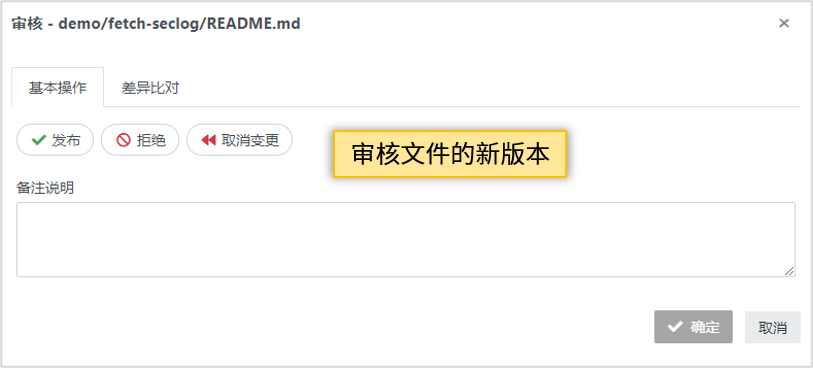

可以针对单个文件进行审核，也可以对多个文件，或者一个目录进行审核。
- 单个文件：点击文件的状态进入审核
- 多个文件或目录：通过复选框选择多个文件或目录，点击上方的按钮【审核】进入审核

针对审核区的状态操作有：
- **发布**：文件移动到发布区，设为启用状态。
- **拒绝**：文件依然保留在审核区。设为拒绝状态时，需要填写备注说明，方便查看审核拒绝原因。
- **取消变更**：文件从审核区删除

### 脚本库的文件状态

脚本库中的文件有几种状态：

- **启用**：该文件已上线，可以正常使用。
- **停用**：该文件已被停用。停用的脚本不能执行、也不能在文件选择器、作业中调用。停用可以看将这个文件下线，但仍然保留在脚本库中，后期可以恢复启用。
  如果一个文件确定以后不再需要了，可以直接将文件删除。
- **新版本待审批**：用户修改了文件内容，或者上传了文件的新版本，但修改或新文件还没有审批，脚本库中的文件还是旧版本。
- **新版本被拒绝**：文件的新版本被拒绝启用，脚本库中的文件还是旧版本。

### 修改文件

点击文件菜单，选择菜单项【修改信息】，可以对文件的信息和内容进行修改。

> :pencil: **注意：**修改文件内容后，需要重新审核。

### 删除脚本

从脚本库删除脚本，会将脚本文件从发布区和审核区都删除，相关的数据库记录也将删除。

### 测试运行


### 查看修改历史

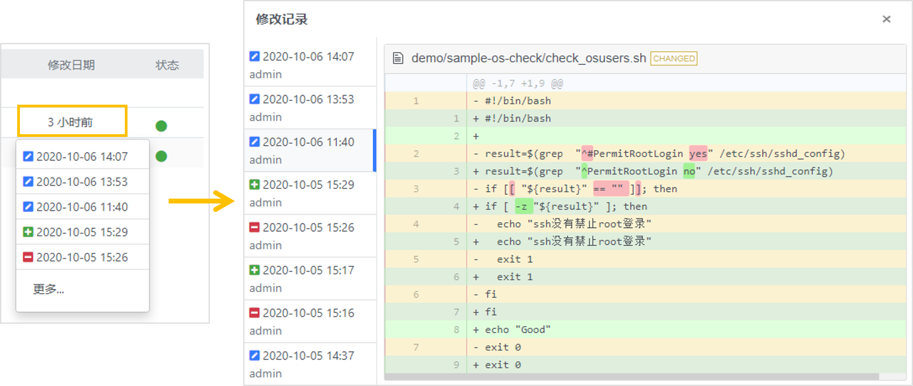
针对已经审核发布的脚本，点击文件列表的【修改日期】，将弹出最近的修改记录。点击其中一条记录，弹出对话框，显示详细的修改信息。
> 目前只支持查看历史版本，不支持版本回退


## 设置和管理 

### 权限配置

|                  | 匿名用户 | 登录用户 | 模块普通用户 | 模块管理员 |
| ---------------- | -------- | -------- | -------------- | --------- |
| 查看文件列表 | -        | -       | Y              |Y|
| 查看文件内容 | -        | -       | Y              |Y|
| 下载文件 | -        | -       | Y              |Y|
| 新建（上传）   | -        | -        | Y              |Y|
| 修改/删除/取消自己上传的文件 | -        | -        | Y              |Y|
| 修改文件（信息和内容）  | -        | -        | -             |Y|
| 删除 | - | - | - |Y|
| 审核 | - | - | - |Y|
| 执行 | - | - | Y |Y|
| 取消未批变更（删除审核区文件） | - | - | - |Y|


## 开发指南 

### 特别变量

在执行Playbook的时候，系统会增加以下特别变量：
- `OPLUS_GFS_DIR`：文件库的目录路径，位于OPSmind主机的`/opt/oplus/assets/gfs/fs-repos/<tenant_id>`。
- `OPLUS_SERVER`: oplus服务器ip
- `OPLUS_TNT`: 租户ID
- `OPLUS_RUN_ID`: 一键作业的runId

### 使用文件库

在编写脚本时，经常会遇到如下场景：
- 收集多个远程主机上的信息（例如日志，或基础指标数据），并将收集到的信息保存成文件供下载使用。
- 将一个大的文件分发到多台远程主机上。

实现这类场景有多种方法，我们这里介绍使用文件库的方法。

#### 场景：将远程主机的文件上传到文件库

这里以Ansible所在的主机作为中间节点，先将远程主机上的文件`fetch`到Ansible主机，
再将文件从Ansible主机`copy`到文件库的`OPLUS_GFS_DIR`目录下。

inventory文件`hosts`
```ini
[servers]
#需要下载文件的远程主机

[fileserver]
#----在这里定义文件库的IP，放在fileserver主机组下面
127.0.0.1 
```

Playbook的`site.yml`文件
```yaml
- name: "从远程主机下载"
  hosts: "servers"
  tasks:
    - name: "从远程主机取回检查结果至本地"
      fetch:
        src: "/path/to/file/on/remote/host"
        dest: "/tmp/staging/"
        validate_checksum: no

- name: "上传到文件服务器"
  #----使用fileserver主机组
  hosts: "fileserver"
  gather_facts: no
  tasks:
    - name: "从本地上传文件至fileserver的results目录"
      copy:
        src: "/tmp/staging"
        #----通过特别变量OPLUS_GFS_DIR引用文件库目录
        dest: "{{OPLUS_GFS_DIR}}/results/"
        force: true
```


## 常见问题 

### 脚本的参数配置
Q：上传脚本的时候，有一个参数配置的用途是什么？  
A：脚本的参数配置，可以用于设置脚本的命令行参数。在脚本测试运行，或者在“一键作业”模块创建作业的时候，
参数配置设置值会被作为参数。

### 如何更新文件信息
Q：如果只是想更新文件的描述或者参数，该怎么操作？  
A：如果我们只是想更新文件的描述或者参数时，只需在文件菜单选择【修改信息】菜单项，在对话框中对描述信息和配置参数进行重新编辑（无需重新选择文件上传）。

### 查看文件历史
Q：如何查看文件历史变化？  
A：点击修改日期展示列的时间标识，即可查看该文件的历史变化情况。

### 可以版本回退吗
Q：脚本库的文件可以回退到某个版本吗？  
A：目前文件变更历史只可以查看，还不支持版本回退。

### Playbook的格式
Q：Ansible Playbook由多个文件组成，怎样上传？  
A：Ansible Playbook支持两种形式保存在脚本库，一种是将playbook相关文件压缩成一个zip文件，
另一种是将playbook以一个文件夹形式保存在脚本库。我们建议使用后一种文件夹的形式，因为这样可以对里面的单个文件进行修改。
如果是以zip形式保存，在执行的时候，指定这个zip文件，如果是以文件夹形式保存，执行的时候要指定主yaml文件，一般是`site.yml`。

### 批量上传脚本
Q：如何批量上传脚本？  
A：可以把脚本压缩成一个zip文件，上传的时候选择【解压到子目录】


### 如何移动文件
Q：如何移动文件或文件夹？  
A：通过文件前面的复选框选择文件，在工具条点击按钮【剪切】，然后移动到目标文件夹，点击工具条按钮【粘贴】。

### 在主机清单中加入OPLUS服务器ip
Q：playbook脚本需要从oplus服务器上下载或上传文件，需要在hosts文件中硬编码加入oplus服务器ip？  
A：在playbook中的hosts文件加入`OPLUS_SERVER ansible_host={{OPLUS_SERVER}}`替换原本的oplus ip

原来的hosts文件内容：
```
# oplus服务器ip
81.71.132.71
[servers]
192.168.0.1
192.168.0.2
192.168.0.3
192.168.0.4
```
替换后的hosts文件内容：
```
OPLUS_SERVER ansible_host={{OPLUS_SERVER}}
[servers]
192.168.0.1
192.168.0.2
192.168.0.3
192.168.0.4
```

### 特别变量的使用
Q：开发指南中特别变量有什么用？  
A：若脚本作业中需要回传执行作业的`runId`或从执行用户的所属租户文件库上传下载/文件，就需要用到这些变量。

内置变量使用示例：
```yaml
# 以配置文件管理playbook示例
# 从文件库选取几个文件下发到目标主机的指定目录
# 使用内置变量后,无需传递传递参数变量 OPLUS_GFS_DIR 跟 OPLUS_SERVER 直接可在playbook中引用
# @param  file_list  逗号分隔的文件列表
# @param  dest_dir   目标目录
---
- name: test
  hosts: servers
  vars:
    ansible_tmp_dir: "/tmp/oplus/.tmp_file/"
  gather_facts: no
  tasks:
    - name: "创建ansible节点临时文件"
      file:
        path: "{{ansible_tmp_dir}}"
        state: directory
      recurse: yes
      run_once: yes
      delegate_to: localhost
    - name: 收集文件
      fetch:
        src: "{{OPLUS_GFS_DIR}}/{{item}}"
        dest: "{{ansible_tmp_dir}}"
        flat: True
      with_items: "{{file_list.split(',')}}"
      run_once: yes
      delegate_to: OPLUS_SERVER
    - name: 创建目标目录
      file:
        path: "{{dest_dir}}"
        state: directory
        recurse: yes
    - name: 上传文件
      copy:
        src: "{{ansible_tmp_dir}}{{item|basename}}"
        dest: "{{dest_dir}}"
        owner: root
        group: root
        mode: 755
      with_items: "{{file_list.split(',')}}"
```


# 命令管理

命令管理是指管理和维护在计算机系统中可执行的命令列表。在操作系统中，用户可以使用不同的命令来执行各种任务，从打印文档到更改设置，一切都需要使用正确的命令。因此，在命令管理方面，必须确保所有可用命令都得到正确的维护和管理。

命令支持的语法：
- **cmd**、 **shell**、 **python**、 **playbook**、 **powershell**

命令依托Ansible来完成远程脚本或命令操作，Ansible的Playbook相比普通脚本具有明显的优势，例如：
- 借助社区海量的Ansible功能模块，可以极大的提升脚本的编写效率
- Playbook灵活的语法和层次结构，减少了脚本编写的随意性，使得脚本便于阅读理解，降低维护成本
- Ansible模块的幂等特性，增强脚本稳定性和适应性
- 可以灵活的根据参数、标签、环境对工作流程进行编排和执行控制
- 实现基础架构即代码，将配置代码化并进行版本控制


 运维人员可预定义一些命令，再经过审核人员对命令进行审核，通过Ansible在远程主机批量执行，
完成各项服务状态查询、数据采集、配置变更等任务。 保证命令的可用性、安全性。
命令管理功能的易用性很强，省去了编写playbook的麻烦，使运维人员处理任务更加简易。


## 快速入门 

**步骤1：创建命令**
   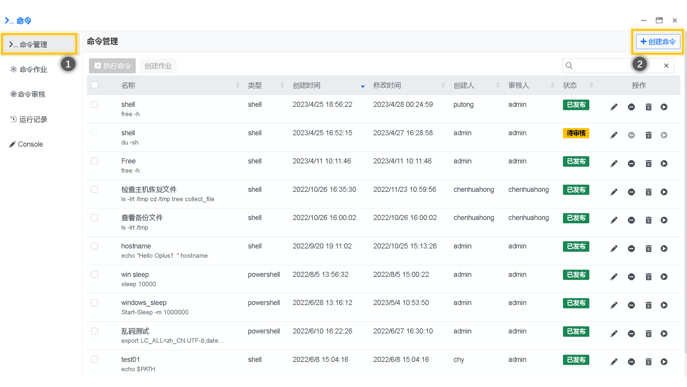

   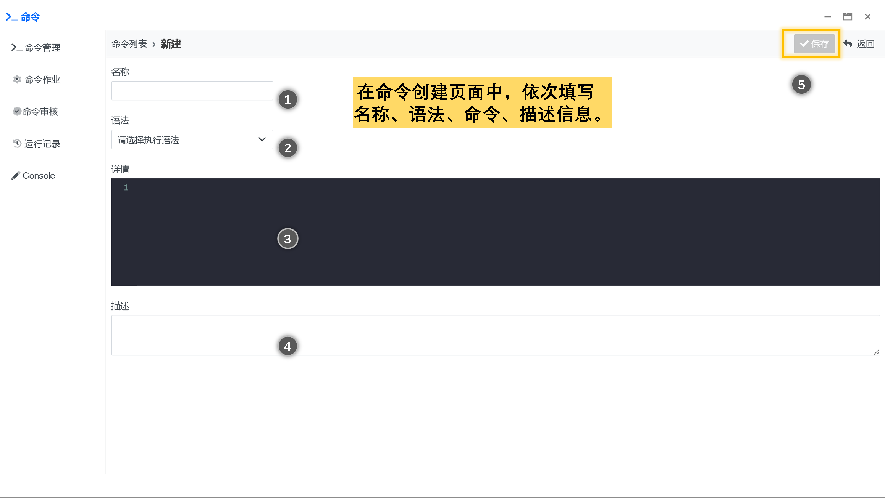

**步骤2：命令审核**
   

**步骤3：执行命令**
   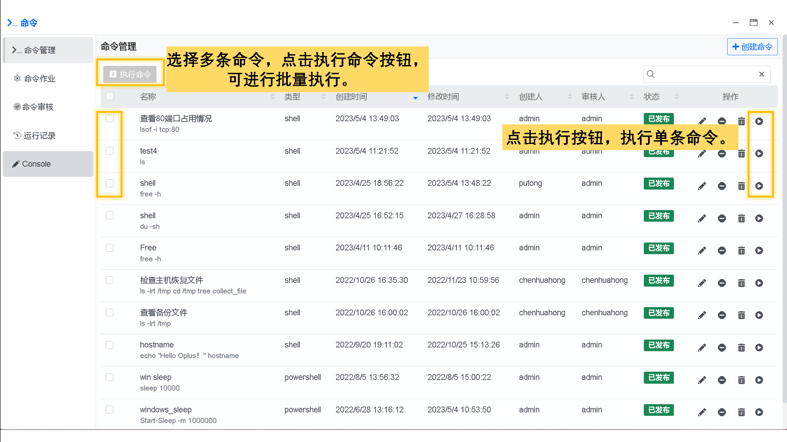


## 使用指南 

### 命令列表
命令列表，展示命令名称、类型、创建时间、创建人、状态等信息。
在列表中点击命令名称可查看命令详情，点击操作按钮可对命令进行修改、禁用/启用、删除以及执行操作


### 命令作业
命令作业，由用户创建的一系列命令的集合，使得这些命令能够有序的执行，提高工作效率。
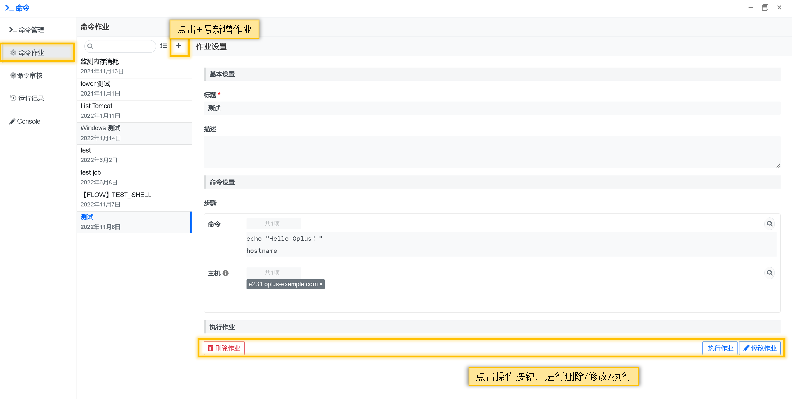

### 命令审核
命令审核用于审查和验证命令的可用性，其主要目的是确保用户只能执行安全、合法和授权的命令，
命令审核可以预防用户误操作、风险命令、人为疏忽或恶意攻击等风险，提高系统的可靠性和安全性。


### 运行记录
运行记录，记录命令的执行过程与结果。有输出结果、运行时间、运行状态、错误信息等。
运行记录可以帮助用户快速定位命令运行过程中的问题。
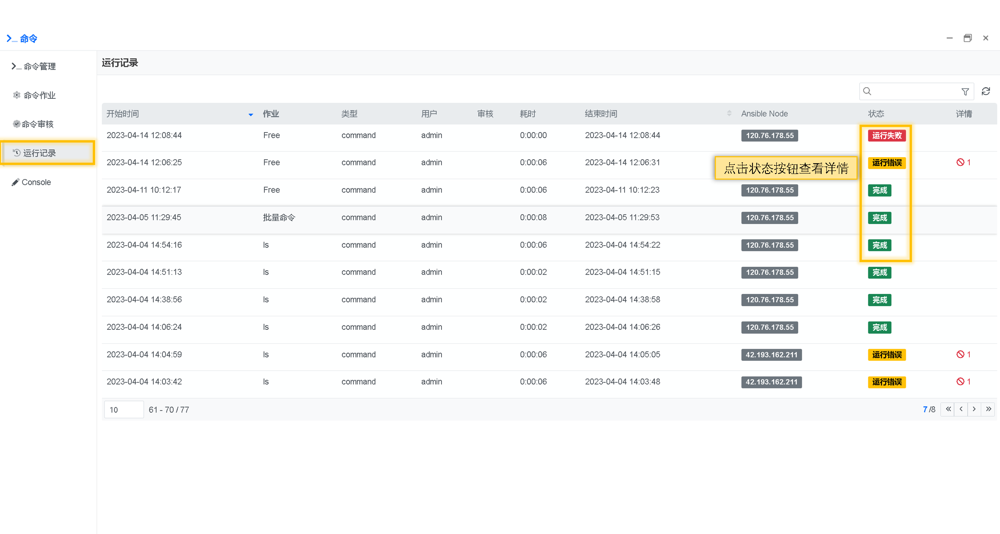
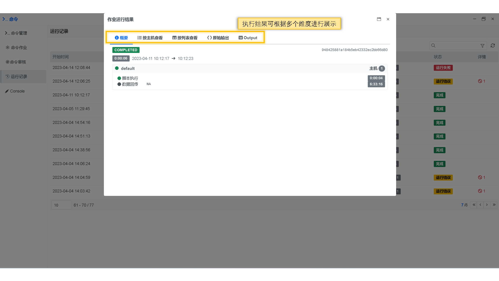

### Console
Console功能，及编及用，没用多余的操作，更快捷高效。


## 设置和管理 

### 权限配置

|         | 用户 | 审核人员 | 系统管理员 |
|---------|--|----|-------|
| 查看命令列表  | Y | Y  | Y     |
| 编辑命令    | Y | Y  | Y     |
| 修改命令    | Y | Y   | Y     |
| 删除命令    | Y | Y   | Y     |
| 执行命令    | Y | Y  | Y     |
| 禁用/启用命令 | - | Y  | Y     |
| 审核命令    | - | Y  | Y     |


# 一键作业

一键作业通过执行脚本、调用Web Service、操作数据等方式，对接外部的主机或系统，完成配置变更、数据采集、系统集成等任务。
作业可以提供统一的RESTful API，来屏蔽后端脚本、Web Service、数据库操作等复杂的差异化的操作。结合一键作业和自助页面，用户可以制作各种可视化的一键工具。

当前作业支持的类型有：

- **脚本作业**：通过Ansible在远程主机批量执行脚本，完成数据采集、配置变更等任务。
- **REST作业**：调用远程的REST API，实现周边系统的对接。
- **命令作业**：在目标主机上执行多个命令组合的作业任务
- **流程作业**：将多个原子的操作串联起来完成一个流程操作序列。

脚本作业依托Ansible来完成远程脚本或命令操作，Ansible的Playbook相比普通脚本具有明显的优势，例如：
- 借助社区海量的Ansible功能模块，可以极大的提升脚本的编写效率
- Playbook灵活的语法和层次结构，减少了脚本编写的随意性，使得脚本便于阅读理解，降低维护成本
- Ansible模块的幂等特性，增强脚本稳定性和适应性
- 可以灵活的根据参数、标签、环境对工作流程进行编排和执行控制
- 实现基础架构即代码，将配置代码化并进行版本控制


## 快速入门 

### 示例：日志收集作业

**说明**

这个示例将创建一个脚本作业，使用脚本管理中用到的[日志采集脚本](gfs/quickstart)采集远程主机上的日志信息。
要求主机、采集日志行数可以作为参数，在执行作业时动态指定。通过这个示例可以了解：

- 作业功能的概貌
- 通过作业来执行一个脚本

**步骤1：准备脚本**

这里我们使用脚本示例中用到的Ansible Playbook `demo/fetch-seclog`。该Playbook支持参数：
- `numlines`：采集的日志行数（默认为500行）

**步骤2：创建作业**
1. 点击按钮【+】，新建一个作业，设置如下：
- **标题**：`日志抓取`
- **执行工具**：`Ansible`
- **脚本类型**：`Ansible Playbook`
- **步骤设置**
  * **脚本**：`demo/fetch-seclog/site.yml`
  * **脚本参数**：`numlines=${num_lines}`（脚本参数是脚本的配置参数，会自动带出）
  * **主机**：选择`通过变量传入`，主机类型下拉框选择`按主机`，变量名：`hosts`

2. 在作业运行参数，点击按钮【解析参数】，会自动添加2个参数`num_lines`，`hosts`。填写参数主要信息如下：

   | 参数名     | 默认值    | 显示名称（可选） | 描述（可选） |
   | ---------- | --------- | --------- | --------- |
   | `num_lines` | 1000       | 日志行数   | 从文件尾部算起的日志行数 |
   | `hosts`     | 127.0.0.1 | 主机 |  |

4. 点击按钮【保存修改】，保存作业。

**步骤3：测试运行**
1. 点击按钮【执行测试作业】，可以在下方看到作业执行结果。**由于脚本作业是异步执行，需要等待一段时间完成。**
   
2. 作业执行完成后，访问`http://{oplus-url}/#/gfs/staticfs/$tnt/dir/fetch-logs`，可以看到抓取的日志。
   


### 示例：创建一键日志收集工具

**说明**

基于上面的日志收集作业，创建一个可视化的操作界面。

**步骤1：创建页面**

1. 在导航菜单选择【自主页面】，进入自主页面模块

2. 点击按钮【新建】创建一个新页面

3. 设置页面标题为“一键日志收集”，保存。

**步骤2：页面配置**

1. 从左边的工具条，拖拽三个内容格以及“作业”、“主机选择”，“文件选择”三个组件到右边的画布，调整布局如图。
    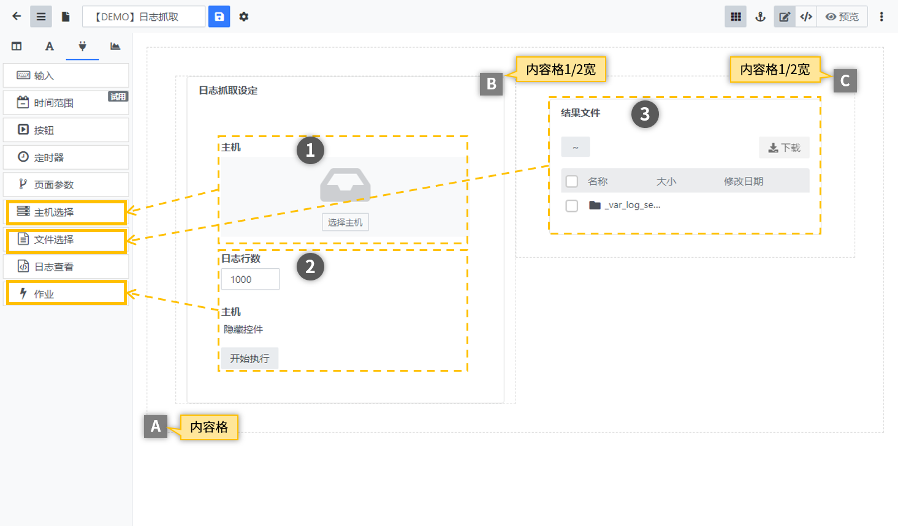

2. 设置“作业”组件属性如下：
   - **数据设定**
     * 选择作业：`日志抓取`
     * 参数hosts
       - 同步页面参数：`hosts`
       - 控件类型：`隐藏`

3. 设置“主机选择”组件属性如下：
   - **基础设定**
     * 同步页面参数：`hosts`
     * 参数值类型：`字符串`

4. 设置“文件选择”组件属性如下：
   - **基础设定**
     * 资料库类型：`文件服务器`
   - **样式**
     * 操作模式：`文件列表`

5. 保存页面

**步骤3：使用页面**

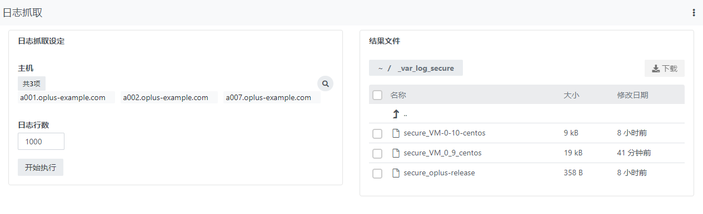


## 使用指南 

### 作业列表 

主界面左侧显示当前类型的作业列表，右侧显示选中的作业详细设置。


### 新建或修改作业

在左侧作业列表上方点击按钮【+】，可以新建作业。

在右侧作业设置上方，点击按钮【修改作业】，可以对作业进行修改。

参见[作业设置](#作业设置)。

### 作业设置

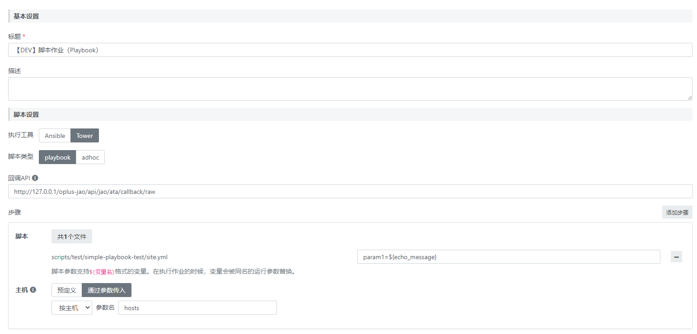
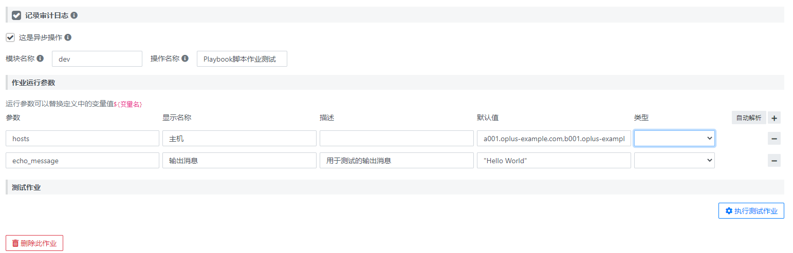


:pencil: 不同类型的作业设置有不同，下面是各类作业的通用部分。

#### 基本设置

设置作业的最基础信息，包含以下属性：

- **标题**：标题文字将在作业列表中显示
- **描述**：用以说明作业的用途、使用方法、使用目的等介绍文字

#### 记录审计日志

可以设置是否在每次执行作业时记录日志。

- **模块名称**：用以标识属于哪个功能模块。例如漏洞扫描和补丁安装这两个作业，可以设置一个模块名称为“补丁管理”
- **操作名称**：用以标识这个作业代表的操作。例如漏洞扫描的作业，可以设置操作为“漏洞扫描”，补丁安装作业，设置操作名称为“补丁安装”。

#### 作业运行参数

作业运行时支持脚本参数、主机参数。
脚本参数可以自动从脚本的命令行定义中抽取，参数用`${参数名}`代替。

### 脚本作业设置

设置脚本的路径、参数、执行工具等信息。

- **执行工具**：用以执行脚本的工具，目前支持Ansible和Ansible Tower
- **脚本类型**：支持两类脚本
  * Ansible Playbook
  * 普通脚本：任意可执行脚本，例如shell、python
- **回调API**（可选）：回调API是一个完整的URL，此API会在脚本执行结束后调用。
如果设置了回调API，那么在脚本执行完成后，系统将调用此API，把脚本执行的数据传给API。
API可以对数据进行进一步处理。例如有一个脚本负责采集远程主机上的指标数据，需要对采集的数据进行入库、分析等处理，那么可以编写一个回调API，进行数据分析、入库的操作。
参考[回调API开发](jao/dev?id=回调api开发)
- **步骤**：如果是playbook类型的脚本，一个作业只支持**一个**步骤。

**步骤设置**

如果是普通脚本，一个作业可以支持多个步骤。adhoc类型的每个步骤包含一个或多个脚本，每个脚本可以在一台或者多台主机上执行。

- **脚本**：通过[脚本浏览器](gfs/file-selector)来选择脚本，脚本支持参数。
脚本参数支持`${变量名}`格式的变量。在执行作业的时候，变量会被同名的运行参数替换。 
普通脚本支持的参数形式，由脚本自身定义。
Playbook支持两种形式的参数。下面的例子中，`${param1}`和`${param2}`会在运行时被作业传入的参数替代。
  - **键值对格式**：`arg1=${param1} arg2=${param2}`
  - **JSON格式**：`{"arg1":${param1}, "arg2":${param2}}`

- **主机**：主机可以通过两种方式设定，静态主机（预定义）和动态主机（参数传入）。
    + **静态主机**：定义作业的时候，就固定好了主机，作业运行时按照预定义的主机上执行脚本。
    + **动态主机**：定义作业的时候，只是定义一个**主机变量**。这个变量值通过作业的运行参数来设定。

#### 参数和变量

参数和变量的目的是为了在作业运行时刻可以动态的改变某些作业设定，支持以下形式的变量。
- `${变量名}`：用`${`和`}`包括的变量，用在脚本的参数上。
- `主机变量名`：适用于动态主机，在作业运行时，根据运行时和变量名相同的参数值来确定要执行的主机。
- `%{系统配置参数}`：通过系统参数配置定义的参数，在脚本参数中可以使用
- `$系统内置变量$`：系统内置的变量，在脚本参数中可以使用，目前支持的内置变量有：
  - `$OPLUS_TNT$`：当前租户ID

### REST作业设置

REST作业设置只需要配置调用REST API的curl命令。

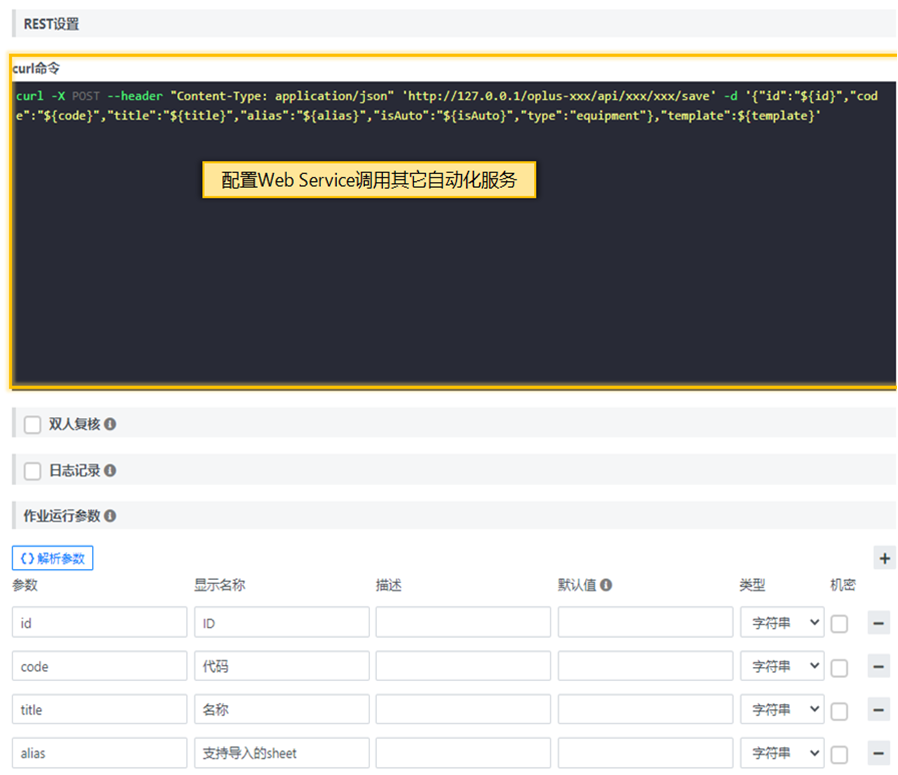

#### 参数和变量

见脚本作业设置

### 命令作业设置

命令作业设置需要选择配置好的原子命令，原子命令串联集一个作业命令。


### 流程作业设置 

流程作业的设置需要编排一个流程，将多个操作串联起来。


### 测试作业

在编辑模式下，点击【执行测试作业】可以试运行作业。

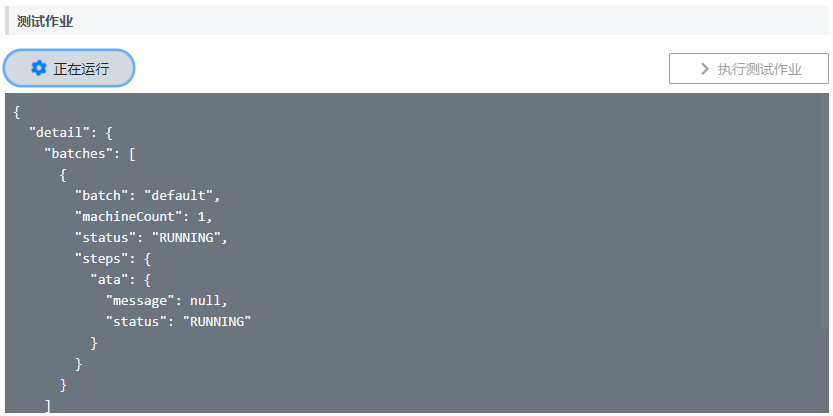

作业执行后，会显示作业的返回结果。

:bulb: **注意**：由于脚本作业是**异步**执行，所以返回值代表作业是否成功提交到了作业队列。点击【查看详细结果】，可以查看Ansible的执行输出。

### 删除作业

在编辑模式下，在作业设置的最下方，点击按钮【删除此作业】，可以删除作业。

### 运行日志

运行日志分为两种，一种是系统自带的运行记录，一种是每个作业自定义的审计日志。

运行记录是系统自带的，记录作业运行的状态和各种信息，每个作业执行时会自动记录以下信息：
* 作业ID
* 运行ID
* 操作人员
* 开始和结束时间
* 状态
* 运行参数
* 输出结果

操作日志是记录由开发人员自定义的消息，面向用户，更易读，模块化。

操作日志的信息包括：
* 运行ID

* 模块名称

* 操作名称

* 操作概要：简单字符串

* 操作详情：格式化的字符串。

点击一条记录可以查看该次作业运行的详情和输出。


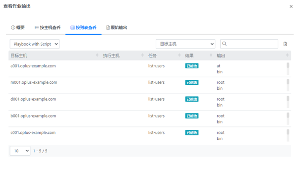

### 定时任务

定时任务能力又称任务调度，根据现有的脚本作业、REST作业、巡检作业进行任务调度，操作人员只需选择作业填写CRON表达式即可，CRON表达式提供了控件进行选择，降低了上手难度。
且定时任务能力很好的提供了日期调度的机制（秒、分、时、日、月、季、周、年），从而实现单作业不同时间维度的调用。

#### 任务调度列表


#### 新增任务
1.	CRON表达式可手动填写或控件选择，手动填写需注意CRON规范。
2.	CRON控件提供了周期、循环、自定义、每秒 每分等等调度方式。
3.	执行作业类型包含三种脚本作业、REST作业、巡检作业。
4.	选择的执行作业类型后，会显示【执行作业类型】下对应的【选择执行作业】数据提供选择。 
5.	点击运行参数后，会有显示对应【选择执行作业】的运行参数，该参数可修改保存，巡检作业无运行参数，不显示该按钮。 

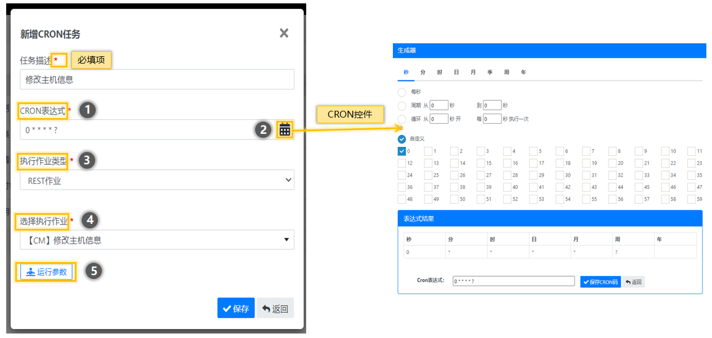


## 设置和管理 

### 权限配置

|              | 匿名用户 | 登录用户 | 作业模块管理员 |
| ------------ | -------- | -------- | -------------- |
| 查看作业列表 | -        | Y        | Y              |
| 查看作业定义 | -        | Y        | Y              |
| 执行测试作业 | -        | -        | Y              |
| 新建作业     | -        | -        | Y              |
| 修改作业     | -        | -        | Y              |
| 删除作业     | -        | -        | Y              |


## 开发指南 

### Ansible Playbook编写

Playbook可以以zip包或目录的形式提供。一个最简单的playbook结构如下：

```
simple-playbook/
  |--hosts              --> 可选
  +--site.yml           --> 必须  
```

hosts文件是可选的，一般在需要对多个主机组进行操作的时候需要用到。在hosts中，可以使用`#oplus-var:hosts`作为占位符。
一键作业在执行的时候，会把占位符替换成作业对应的主机。

例如`fetch-seclog`，
```ini
[servers]
#通过`#oplus-var:hosts`占位符来设定主机，在执行的时候会被替换成传入的主机
#oplus-var:hosts

[fileserver]
#文件服务器的IP，固定值
127.0.0.1
```

### 回调API开发

回调API是一个RESTful API URL，用于接收作业执行完成后回传的数据。API需要能够支持如下格式的请求：

```bash
curl -X POST '<callback_url>' -d '<callback_data>' -H 'Content-Type:application/json;charset=UTF-8' -H 'Tenant-Id:<tenant_id>'
```
其中：
- `<callback_url>`: 回调API的URL
- `<tenant_id>`: 作业回传的租户ID
- `<callback_data>`: 作业回传的结果数据，格式如下：

`<callback_data>` 有三种格式，取决于Playbook的输出。

1. 格式一：
```json
{
  "runId": "string",
  "batches": [
     {
        "runId": "string",
        "batchId": "string",
        "output": "string"
     }
  ]
}
```
- `batches[].output`：playbook的原始输出，格式为`AnsibleOutput`的JSON字符串。

2. 格式二：如果Playbook包含名为`$OPLUS_RESULT$`的任务，那么这个任务的输出将被作为回调数据

````json
{
  "runId": "string",
  "batches": [
     {
        "result": *
     }
  ]
}
````

- `runId`: 作业运行的ID
- `batches`: 作业的批次，一个作业可能会包含多个批次结果，每个元素代表一批结果数据
- `batches[].result`: 一批结果数据，类型由API定义。一键作业会把脚本输出的`$OPLUS_RESULT$`部分作为最终结果，放在各个批次的`result`字段里面。

`$OPLUS_RSEULT:merge$`


## 常见问题 

### 执行脚本还是执行作业
Q：如果要运行一个脚本，是在脚本管理中运行，还是在作业中运行？  
A：首先我们要了解，执行脚本只是一种类型的作业，即脚本作业。
脚本管理中的脚本执行功能，主要是为了测试脚本功能的运行，相当于是一个临时的脚本作业。
在作业中定义的脚本执行，具有更丰富的功能，例如设定执行参数默认值，设定日志等，更重要的是，定义好的作业可以在“自助页面”模块中使用，可以方便的实现操作界面

### 配置错误

1. 在使用Tower的时候，脚本作业选择Ansible作为引擎，有些场景会出现下面错误
```
Using a SSH password instead of a key is not possible because Host Key checking is enabled and sshpass does not support this. Please add this host's fingerprint to your known_hosts file to manage this host.
```

2. 使用Tower，Playbook在`localhost`执行某些模块（例如`template`）出现sudo错误，
```
sudo: effective uid is not 0, is /usr/bin/sudo on a file system with the 'nosuid' option set or an NFS file system without root privileges?
```
原因是Tower是用`awx`用户来执行ansible，对于localhost的操作一般是使用`ansible_connection=local`，而不是ssh，
这种情况下无法像操作一般远程主机那样ssh然后sudo，ansible还是用`awx`用户在本地操作。
解决方案：给awx用户赋予sudo权限。

3. Tower环境下，Playbook在localhost`/tmp`目录下写的文件找不到。 
Tower的[Job Isolation](https://docs.ansible.com/ansible-tower/latest/html/userguide/security.html#playbook-access-and-information-sharing)设置会隐藏task的/tmp目录
> [!NOTE]
> By default, process isolation hides the following directories from the above tasks:
> `/etc/tower` - to prevent exposing Tower configuration
> `/var/lib/awx` - with the exception of the current project being used (for regular job templates)
> `/var/log`
> `/tmp` (or whatever the system temp directory is) - with the exception of the processes’ own temp files.


# 系统巡检 

巡检可以对远程主机进行安全合规、系统和应用健康等方面的检查。
OPSmind通过在远程主机上执行脚本或命令完成巡检。巡检的主要功能包括：

- **定义巡检模板**：在哪些机器上，执行哪些脚本

- **执行方式**：人工点击、任务调度定期执行

- **执行结果**：页面视图展示、导出excel文件

- **通知方式**：邮件发送指标KPI视图及excel附件

  

**名词定义**

- **巡检模板**：用来定义一个巡检，要在哪些主机上执行哪些脚本，用什么规则来判断结果。
- **巡检作业**：是巡检模板的运行历史记录，每执行一次模板会产生一个作业。巡检作业保存了运行时刻的模板名称、主机、脚本等运行时信息。
  如果在后面修改了模板的名称、主机、脚本、规则等信息，已有巡检作业对应的信息（名称、主机、脚本等）不会改变。
- **检查项**： 代表一个具体的检查对象或内容，例如磁盘使用率检查、密码强度设定检查，一个巡检由多个检查项构成。


## 快速入门 

**说明**

在这个示例将演示一个巡检的创建、执行、查看结果完整过程，通过示例可以了解：
- 巡检的创建过程
- 巡检的执行和查看结果

**步骤1： 准备巡检脚本**

使用Ansible Playbook `oplus/oplus-cac/rhel-system-check/site.yml`。

**步骤2：创建巡检模板**

进入巡检模版点击按钮【新建模板】，进入模板创建的页面，输入以下主要信息：

- **名称**：RHEL系统基础巡检
- **描述**：执行系统巡检
- **图标**：icon
- **脚本**：点击选择文件，打开脚本选择器，选择`oplus/oplus-cac/rhel-system-check/site.yml`
- **主机**：点击打开主机选择器，下拉选择设备类型后再选择若干台主机

点击按钮【保存】，完成模板的创建。

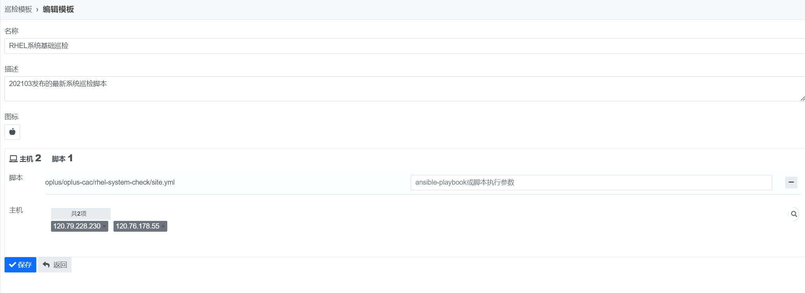

**步骤3：执行巡检作业**

回到【巡检模板】页面，找到上面创建的模板，点击按钮【>】。系统将进入执行前确认页面。
点击按钮【执行巡检】，系统将跳转到检查结果界面。

**步骤4：查看检查结果**

巡检执行需要二十几秒，当执行状态为完成时(通过点击表格右上方的旋转图标刷新)，可以查看检查结果。点击按钮【查看结果】。

巡检项视图分为两种可点击按钮【切换到列表视图】进行切换，默认视图为网格


## 使用指南 

### 功能概要
巡检的主要功能包括：巡检模板、巡检结果、巡检配置、邮件配置。

巡检的主界面如下，以卡片的形式展示各个巡检模板的概况。


### 巡检模板

1. 点击侧栏菜单【巡检模板】进入巡检模板列表

2. 点击页面右上角的新建模版进行新增模版，点击列表中的按钮可执行（点击执行时可进入执行界面，可从新选择主机执行）、修改、删除模版。

3. 模板的信息包括：

   - **名称**：概述巡检的简称，不超过50字。

   - **描述**：可选，巡检的用途、目的、使用方法等说明信息。

   - **图标**：可选。

   - **脚本**：巡检的脚本来自于[脚本库](gfs/guide)。点击选择文件，从脚本选择对话框中选择脚本。

   - **主机**：执行巡检脚本的目标机器。点击主机选择器，从主机选择对话框中选择要执行的主机（先选设备类型再选主机）。


> 注意：需要先在脚本库上传巡检脚本，脚本审核通过后才可以使用。  
> Playbook如果是以zip包形式上传的，选择zip文件；如果是以解压目录形式上传，选择对应的YAML文件，例如`site.yml`


### 检查结果

1. 点击左侧菜单栏“检查结果”，进入结果列表

   

2. 检查结果页面

   **模板列表**：列出所有执行过的巡检模板（默认显示全部），没有执行过的模板不会列出来（可排序）。

   **结果列表**：选择一个巡检模板，会列出该模板的所有执行记录。点击一条执行记录，可以查看当次巡检的结果。

3. 检查结果详情页面

   - 图右上角导出结果、可将巡检结果导出成excel（excel的列包含主机信息、可以根据巡检配置一起导出）

   - 结果大致分文三块，详情板块、指标板块、巡检项板块。

     **详情板块**：包含了执行状态（点击状态可查看详细的执行日志）、开始时间-结束时间、主机数、脚本路径。  

     **指标板块**：包含了KPI、主机概览、巡检概览、主机白名单操作（勾选主机设置白名单，下次执行该模版跳过白名单主机）。

     **巡检项板块**：

     ​	巡检项白名单：通过点击网格中的巡检项进入巡检项详情，再点击左下角的添加白名单即可设置巡检项白名单。

     ​	切换视图：默认以网格的形式展示、可通过`点击按钮【切换列表视图】`切换表格形式平铺展示。

   > 注意：主机白名单跟巡检项白名单不同点在于一个是主机维度`范围大`、巡检项维度`范围小`，共同点 生效范围为当前模版。

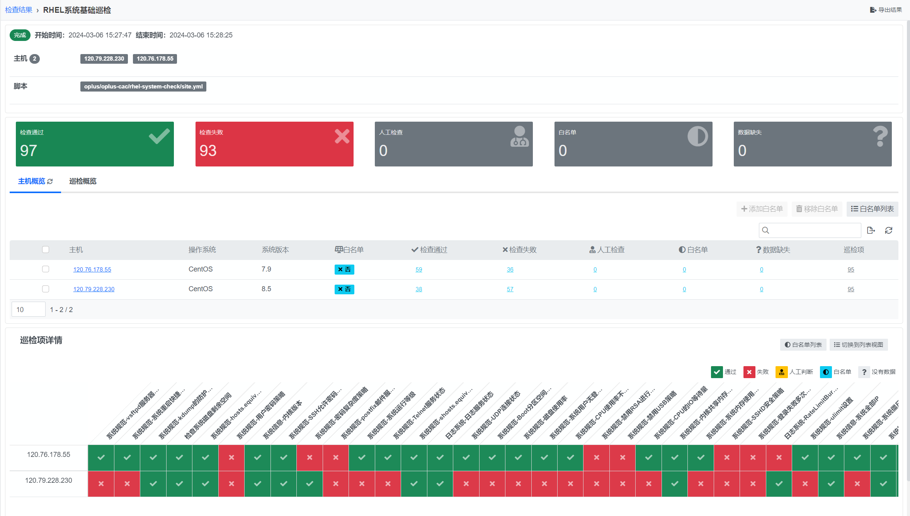


- **检查项状态**


- **通过**：检查项有明确的检查标准，并且检查结果符合标准
- **失败**：检查项有明确的检查标准，并且检查结果不符合标准
- **人工判断**：检查项没有明确的检查标准，需要人工查看检查结果数据来判断结果通过与否。
- **白名单**：检查项被设置成白名单后，该模版下次执行时 设置成白名单的检查下则会跳过。
- **缺数据**：检查过程中出现错误，例如主机无法连接，造成该检查项未检查，缺少相关的检查结果。


### 巡检配置

点击左侧菜单栏【巡检配置】，进入资产导出配置界面。

在巡检结果导出excel时，根据你巡检模版执行时选择的主机，通过主机类型（例如Linux）关联当前页面所显示的Linux服务器、并将勾选的字段一并导出在excel中。


### 邮件配置

点击左侧菜单栏【邮件配置】，进入邮件配置界面。

通过发送邮件开关进行控制是否发送邮件，发送邮件分为两种`【手动执行完成后发送、任务调度执行完成后发送】`


- 发送邮件的邮件服务器配置在哪？

  **答**： 【System Settings Center】-> 【电子邮件】 

  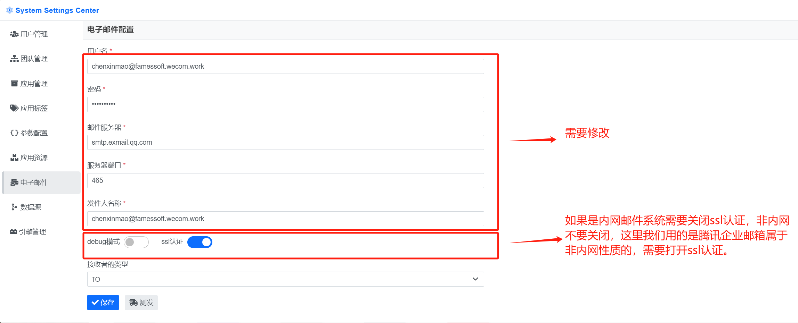

- 收件人怎么填写？

  **答**：在巡检【邮件配置】列表中的`收件人列表`按钮

  ​	每个巡检模版都对应了一个收件人列表（可以有多个收件人），状态分为正常、禁用（只有正常状态的才会发送邮件）

  

- 发送的内容是什么？

  **答**：在巡检【邮件配置】列表中的`内容自定义`按钮

  ​	每个巡检模版都对应有自定义的内容，自定义内容可以为空

  ​	**自定义标题**：对应邮件的标题（默认标题是巡检模版名称）

  ​	**自定义内容：**对应邮件的内容（默认内容有巡检模版执行人跟执行时间、一个可视化的KPI、一个巡检的excel附件)

  ​	**巡检状态：**启用，巡检结果中的巡检项没有失败项则会在邮件标题前面加上【成功】有失败项【失败】，禁用则不加【xxxx】

  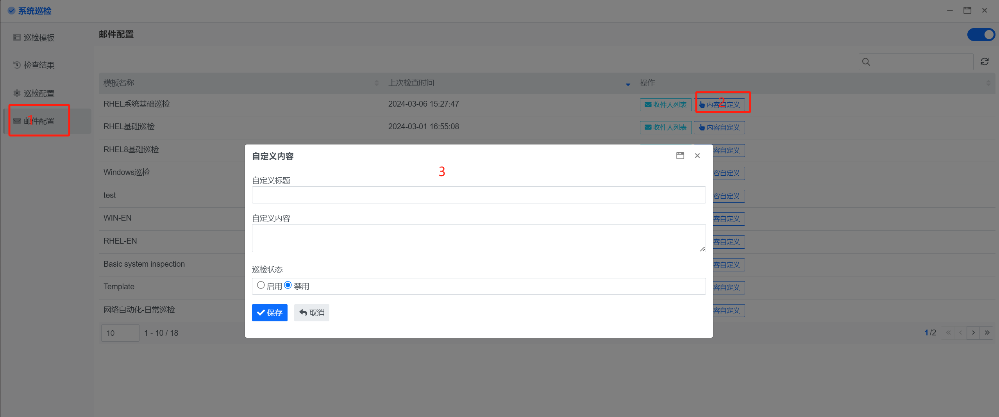

- 任务调度在哪？

  **答**：【作业】-> 【任务调度】

  

  

  > **注意**：任务调度多巡检执行需要注意的点有，多巡检邮件标题名称在上图`框3`下面的运行参数填写（没有则发送默认的）、多巡检收件人怎么弄的（多个模版的收件人合并，每个人都发一份）、多巡检是将两个巡检的excel合并成一个excel文件。

  

  


## 开发指南 

### 巡检脚本的编写

#### 编写规范
巡检脚本由Ansible playbook编写，编写的规范如下：

- 通过task来组织检查项
    1. 不是所有的task都是检查项，只有name以`[RULE]`前缀开头的task才会被认为是检查项。
    采用前缀的原因是因为有时候需要多个task才能完成一项检查。
    2. task可以通过任意Ansible模块（例如shell、command、script、stat等）来完成检查工作。
    3. 一个检查项结果的状态判断规则如下：
      - 如果task的结果`failed`为`true`，那么该检查项为`失败`
      - 否则，有两种情形：
        * 如果task的输出`stdout`或者`msg`，以`[CHECK]`开头，那么该检查项为`人工判断`
        * 否则，检查项为`通过`
    4. task的输出（`stdout`、`stderr`或`msg`，Ansible不同的模块使用的输出属性不同）会作为检查项的输出值。
    
检查项的task编写示例
```yaml
- name: "[RULE]主机名必须大写"
  #----通过一个表达式判断task是否failed
  failed_when: "ansible_hostname | regex_search('[a-z]')"
  #----把hostname的值作为检查项的输出
  debug:
    msg: "{{ansible_hostname}}"
  changed_when: false
  ignore_errors: true

  #----这个不是检查项，task name没有以[RULE]开头
- name: "列出crontab"
  shell: crontab -l
  register: crontab_result
  ignore_errors: true

- name: "[RULE]检查crontab"
  #----把前一个任务的输出作为检查项输出，同时标记[CHECK]，表明检查项结果为“人工核查”
  debug:
    msg: "[CHECK]Crontab:\n{{crontab_result.stdout}}"
  ignore_errors: true
```
注意上面的每个任务都加了一个`ignore_errors: true`，表示即使该task失败了，还要继续下一个检查任务。

- 通过脚本来组织检查项
    1. 检查项的名字应在脚本第一行输出`####CHECK_ITEM:<检查项名>`，如`echo "####CHECK_ITEM:系统运行时长"`，那么该检查项为`系统运行时长`。
    若脚本不按`####CHECK_ITEM:<检查项名>`输出检查项名，那么默认检查项名为脚本名。
    2. 与task组织检查项为`人工判断`的要求一致，脚本在检查项名输出之后，以`[CHECK]`开头，那么该检查项为`人工判断`。
    3. 检查项的结果根据脚本返回码来判断，脚本返回`0`，则表示`通过`或`人工判断`，脚本返回`1`，则表示`失败`。
    4. 除检查项名`####CHECK_ITEM:<检查项名>`之外的脚本输出作为检查项的输出值。
    5. 脚本组织配置示例：

在playbook的参数文件`group_vars/all`添加对应的脚本：
```yaml
scripts:
  #----script：脚本名字
  #----argline（可选）：脚本参数
  #----condition（可选）：执行该检查项的条件
  - script: check_repo_cento.sh
    argline: -repo=public -type=boot
    condition: "{{ansible_distribution == 'CentOS'}}"
  - script: check_uptime.sh
```
获取`系统运行时长`的检查脚本示例：
```shell script
#!/bin/bash
#----输出检查项名
echo "####CHECK_ITEM:系统运行时长"

check_supported_kernel() {
    running_kernel=$(uname -r)
    if [[ "$running_kernel" != *".el"[5-7]* ]]; then
        echo "This script is meant to be used only on RHEL 5, 6 and 7"
        exit 1
    fi
    rhel_num=$(sed -r -n 's/^.*el([[:digit:]]).*$/\1/p' <<<"$running_kernel")
}

check_uptime() {
    sysuptime=$(uptime |awk -F ',' '{print $1}' |sed 's/^[ \t]*//g')
    updays=$(cat /proc/uptime| awk -F. '{run_days=$1 / 86400;printf("%d",run_days)}')

    if [ $updays -lt 365 ]; then
        echo -e "OK: System running time not over a year."
        echo -e $sysuptime
        exit 0
    else
        echo -e "Failed: System running time over a year."
        echo -e $sysuptime
        #----通过脚本返回码设置检查结果
        exit 1
    fi
}

# main
check_supported_kernel
check_uptime
```

#### playbook示例  
[playbook巡检模板](http://81.71.132.81/oplus-doc/system-check-template.zip)包含以下检查项：
1. 获取主机名，主机名必须大写
2. 列出系统的crontab，结果需要人工判断是否合规
3. 检查系统运行时长，通过脚本`check_uptime.sh`来完成检查


## 常见问题 

### 巡检和监控
Q：可以用监控工具来做巡检吗？  
A：本质上来说，巡检也是属于监控的一种，属于一种低频率的监控。一般IT运维的监控工具侧重于基础指标的高频实时监控，
而对于一些非标准的复杂操作（例如文件配置的比对）支持灵活度欠佳。巡检作为实时监控的补充，一般选择开发友好，灵活性高的方式来实现。


# 补丁管理 

补丁管理支持企业常用Linux，包括RHEL，CentOS，SUSE进行补丁库管理、补丁扫描和补丁安装以及补丁回退。

主要功能：

- **补丁库**：系统内置补丁库定义（CVE,补丁号），实时同步官网最新补丁信息
- **补丁扫描**：列出主机存在的漏洞和可升级补丁安装包
- **补丁安装**：根据补丁号或软件包进行补丁安装
- **补丁回退**：根据补丁记录进行安装补丁回退
- **详细报表**：CVE漏洞报表，补丁扫描、安装、回退报表

补丁管理提供高效扫描主机所存在漏洞，快速根据补丁号，CVE号等信息搜索定位漏洞进行补丁升级，多个维度信息展示，多种补丁升级方式，详细的操作记录。


## 快速入门 

我们在这里通过几个示例来演示补丁管理基本功能。

### 示例：补丁库

**说明**

在这个示例，我们将对补丁库内容有一个基本了解

**步骤1：查看补丁库**

登录系统，进入`http://{oplus_url}/oplus/base/#/applets/vap`，页面进入补丁管理首页，
在左侧导航栏选择【补丁库】按钮，进入补丁库页面，上方显示为各个操作系统补丁库指标数据（操作系统版本、补丁库数量、补丁库更新时间），
在上方指标数据中点击对应不同操作系统，展示下与之相对应操作系统的补丁库定义，
下方补丁库列表页面显示所有补丁库详细数据，勾选不同严重级别【严重】【重要】【中等】【低级】进行数据筛选，
在补丁号一列，点击补丁号显示与之相对应的补丁号详细信息，点击关联CVE的CVE号，展示CVE详细信息。

### 示例：补丁扫描

**说明**

在这个示例，我们会扫描出所选择主机中存在漏洞的信息，通过这个示例，可以对以下内容有一个初步了解：

- 如何进行补丁扫描
- 补丁扫描信息从那几个维度进行展示

**步骤1：选择主机补丁扫描**

登录系统，进入`http://{oplus_url}/oplus/base/#/applets/vap`，页面进入补丁管理首页
在左侧导航栏选择【补丁管理】按钮，进入补丁管理首页，在左下角选择【重新进行补丁扫描】按钮，会进入补丁扫描选择主机界面，
点击页面中央的【选择】按钮，页面会显示所有系统中已存在的主机信息，可以通过顶部【按分组】【按标签】【按条件】按钮进行主机信息的筛选，
选择好主机后点击右下角【确认】按钮进入所选主机确认页面，确认所选主机无误后，点击【开始扫描】按钮后，补丁开始进行后台扫描。

**步骤2：查看补丁扫描结果**

在左侧导航栏选择【日志报告】按钮，进行日志报告页面，可以看到刚刚执行的漏洞扫描记录。

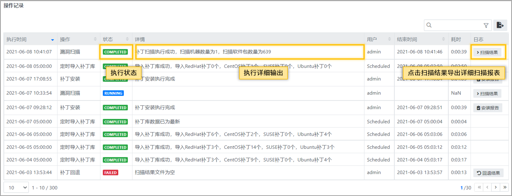

点击左侧导航栏选择【补丁扫描】按钮，主机概览页面会显示刚刚执行补丁扫描的详细信息，可以通过该页面看到如下信息：

- 主机
- 操作系统
- 操作系统版本
- 严重程度漏洞数量
- 重要程度漏洞数量
- 中等程度漏洞数量
- 上次扫描时间

点击对应主机，可查看该主机漏洞扫描的详细信息，例如：该主机可用补丁、该主机可升级软件包、该主机存在漏洞

### 示例：补丁安装

**说明**

在这个示例，我们会对上一个示例中扫描出的漏洞进行补丁安装，通过这个示例，可以对以下内容有一个初步了解：

- 如何通过多个维度安装补丁

**步骤1：选择补丁安装方式**

可从多个维度对所扫描漏洞进行升级，支持如下方式：

- 补丁号
- 软件包
- CVE号

**步骤2：通过补丁号升级补丁**

在左侧导航栏点击【补丁安装】按钮，进入补丁安装界面，勾选相应的补丁号，也可以右上角搜索栏查询或勾选【严重】【重要】【中等】【低级】过滤所需的补丁，
勾选完成后选择左下角【安装选中补丁】按钮进入补丁安装界面，选择相应所需的更新主机，点击【开始更新】按钮，执行补丁安装。

**步骤3：通过软件包升级补丁**

在左侧导航栏点击【补丁扫描】按钮，在主机概览页面，点击需要更新补丁的主机，进入主机详情页面，在可用补丁页面可以直接选择通过补丁号的方式安装，点击
上方【软件包】标签切换到软件包页面，勾选需要安装的软件包，点击右下角【更新选中的软件包按钮】，完成软件包的升级。

**步骤4：通过CVE号升级补丁**

在左侧导航栏点击【补丁扫描】按钮，在漏洞概览页面，通过各种筛选条件，筛选出需要升级的主机信息，选择筛选后的主机，点击【安装选中补丁】，跳转至安装
补丁前信息确认页面，确定所选信息无误后，执行补丁安装。

### 示例：补丁回退

**说明**

在这个示例，我们会对已经安装完成的补丁进行回退操作，通过这个示例，对于补丁升级完成需要回退有一个初步了解

**步骤1：选择需要回退的补丁**

在左侧导航栏选择【补丁回退】按钮，进入补丁回退页面，列表展示信息已安装次数为维度，记录补丁安装记录，记录涵盖
所更新主机信息，更新软件包信息，更新时间等概况，选择需要回退某一次的补丁升级的记录，在操作列，点击【回退】按钮
进行补丁回退操作。

**步骤2：查看补丁回退记录**

对于补丁回退，有的软件升级后不支持回退操作，所以具体的回退结果还需查看日志报告，在日志报告界面，选择相应的执行记录，
在日志列点击【回退结果】查看补丁回退操作的执行情况。


## 使用指南 

### 功能概要

补丁管理分为补丁扫描、补丁安装、补丁回退几个功能模块，具体执行流程如下图：


补丁管理界面如下图：


页面主要元素有：

1. 侧边栏：功能导航菜单

  - 补丁扫描：用于扫描漏洞和展示漏洞扫描详细信息和漏洞扫描指标数据
  - 补丁安装：对于漏洞扫描出补丁，进行补丁升级
  - 补丁回退：对于已升级安装补丁，进行补丁回退
  - 日志报告：对于所有操作记录，详细记录，方便回溯

2. 数据指标：对于漏洞扫描，统计各个严重程度补丁数量和各个严重程度的主机
3. 数据漏洞概览：展示主机扫描、补丁安装、补丁回退、日志报告等信息概览

### 补丁扫描

在左侧栏导航点击【补丁扫描】，右下角点击【重新进行补丁扫描】按钮，进入主机选择界面


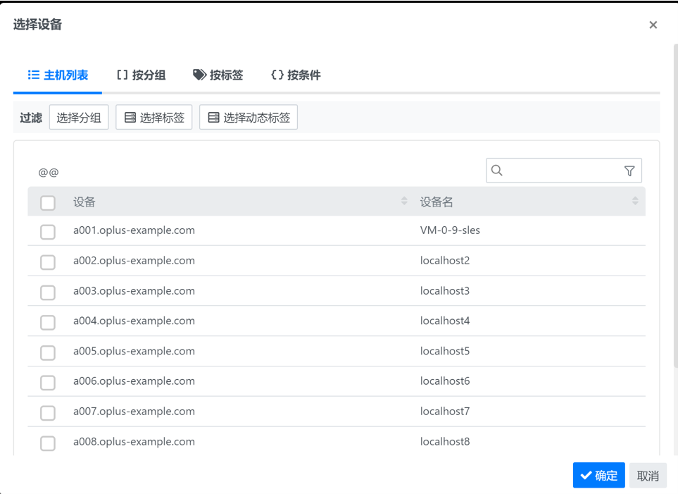

选择需要执行漏洞扫描主机，点击【确认】按钮执行漏洞扫描。

执行完成后，在补丁扫描首页可以看到所有执行过补丁扫描的主机概要信息，包括：

- 主机
- 操作系统
- 操作系统版本
- 存在严重程度漏洞数量
- 存在重要程度漏洞数量
- 存在中等程度漏洞数量
- 上次扫描时间

点击对应主机，可进入详情查看页面，进入主机详细页面后，可看到如下信息：

- **可用补丁**：该主机可升级的漏洞编号以及关联CVE信息，以及该补丁相关联的软件包信息等概要信息
- **软件包**：该主机当前已安装软件包和存在漏洞可升级到的软件包，以及关联补丁号
- **漏洞**：该主机当前存在的漏洞编号(CVE号)

### 补丁安装

多种补丁升级方式如下：

- **补丁号升级**：在可用补丁页面，选择所需升级的补丁号，通过补丁号安装补丁
  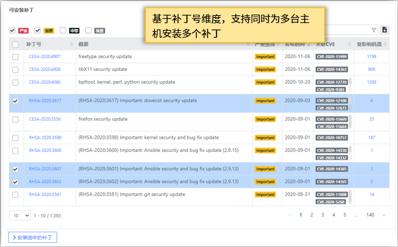
- **软件包升级**：在软件包页面，选择所需升级的软件包，将所选软件包升级到需要升级到的版本
  
- **CVE号升级**：在漏洞管理页面，通过筛选CVE号，选择通过CVE号安装补丁
  

### 补丁回退

在左侧导航栏选择【补丁回退】按钮，进入补丁回退界面，补丁回退界面会展示每一次的补丁升级的记录，包含信息如下：

- 更新主机
- 更新软件列表
- 更新时间

选择需要进行补丁回退操作的记录，点击对应记录中操作【回退】按钮，进行补丁回退。

### 补丁库

在左侧导航栏选择【补丁库】按钮，进入补丁库页面，顶部为不同操作系统补丁库定义的概要信息，点击不同操作系统，补丁库列表
页面会展示与之相对应的信息，补丁库列表页面会展示详细的补丁库信息，在补丁号一列点击补丁号可查看与之相对应的补丁详细信息，在关联 CVE列点击CVE号，显示与之相对应的CVE详细信息。

补丁库更新机制如下：

- **定时同步**：补丁库会定时同步官方最新发布补丁信息
- **手动同步**：点击右下角【检查补丁更新】按钮，手动导入补丁

### 日志报告

在左侧导航栏选择【日志报告】按钮，进入日志页面,包括如下：


- **操作记录**：记录所有补丁管理中执行的操作
- **漏洞报表**：查看目前所有已扫描主机的漏洞扫描情况以漏洞编号(CVE号)为维度展现
- **补丁报表**：查看目前所有已扫描主机的漏洞扫描情况以补丁号为维度展现


## 设置和管理 

### 权限配置

|        | 匿名用户 | 登录用户 | 补丁模块管理员 |
|--------|------|------|---------|
| 查看补丁扫描 | -    | Y    | Y       |
| 执行补丁扫描 | -    | -    | Y       |
| 执行补丁安装 | -    | -    | Y       |
| 查看补丁回退 | -    | Y    | Y       |
| 执行补丁回退 | -    | -    | Y       |
| 查看补丁库  | -    | Y    | Y       |
| 补丁库更新  | -    | -    | Y       |
| 查看日志报告 | -    | Y    | Y       |


## 常见问题 

### 补丁扫描
Q：执行补丁扫描，执行完成，在补丁扫描首页未展示扫描信息？  
A：首先，查看日志报告中补丁扫描操作的日志记录，对应执行状态是否是COMPLETED,如果显示状态为COMPLETED,查看详情是否显示
有类似补丁扫描执行成功，扫描机器数量为1 扫描软件包数量为1000 的字样。

### 补丁安装
Q：执行补丁安装，执行完成，再次查看补丁扫描结果补丁仍存在？   
A：首先，查看日志报告中补丁安装操作的日志记录，对应执行状态是否是COMPLETED，如果执行状态不是COMPLETED，排除可能出现的问题，
主机未联通，执行补丁安装出错等原因。

### 补丁回退
Q：执行补丁回退，执行完成，查看结果补丁未成功回退？  
A：首先，明确一点是一些软件升级成功后是不支持回退的，所以先确定要回退的软件是否支持降级回退，如果不支持，那么执行补丁回退无效，
如果支持降级，通过查看补丁回退的日志记录排查问题。


# 自助页面 

数据工场是一个强大的多功能数据应用开发平台，它可以

* 多种类交付：Web页面、仪表盘、展示门户、报表、大屏、  RESTful API
* 低技术依赖：内置灵活便捷的工具，大大降低用户的技术门槛
* 高用户覆盖：无需专业IT开发技能，开发、运维、业务、管理人员都可以使用
* 简单易用：拖拽生成原型 → 条件设置 → 界面调整 → 完成
* 高效率：比传统定制化开发节省80%以上的时间
* 解放生产力：从传统开发的数据获取、页面编写等繁琐的工作解放出来


数据工场可以把多种形式的数据进行查询和转换，变成新的数据形态。它可以在多种场景下使用，例如：

- 快速数据展示：文件或者数据库中的数据，需要一个快速的方式通过网页展示
- 报表工具：需要一个灵活易用的数据查询和展示工具
- 数据接口：需要把现有数据暴露给其它系统调用，例如设备列表，工单信息，待办事项。
- 自定义表单：需要一个简单的方式开发表单页面用以执行任务或者收集数据
- 大屏展示：轻松制作具有实时数据的监控大屏


数据工场由两部分组成：**数据服务**和**自助页面**。

- **数据服务**用以从各种类型的数据源查询和处理数据组成数据集
- **自助页面**将数据集在页面以不同形式呈现。


## 快速入门 

这里通过一个示例让用户快速了解数据工场的基本使用。本例将用表格、折线图、柱状图和饼图的形式展示一个MySQL数据库中的数据。

通过这个例子，你将了解以下内容：

1. 如何读取数据库中的数据
2. 如何创建页面
3. 如何将数据在页面展示
4. 如何设置内容布局

本示例使用的是系统的demo数据库，里面包含了用作示例的运维工单申请等数据。

用户按照以下步骤示例，快速创建表格、折线图、柱状图和饼图，并能理解大致的布局规则。

**第一步：创建数据源**

1. 从顶部管理栏中通过【设置】，进入平台设置界面，左侧菜单选择【数据源】模块。点击按钮【+】新建数据源。

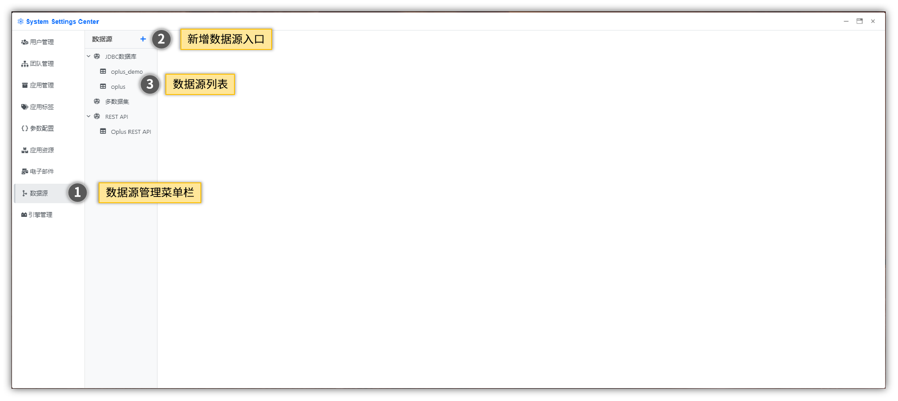

2. 进入数据源新建页面,可以选择数据源类型，包括JDBC数据库、多数据集、REST API。在这里选择【JDBC数据库】.


3. 编辑数据源的属性，各个字段输入值见下表。
输入完成后点击【测试连通性】测试数据库是否可以连通。提示连通成功后点击【保存】。 
   
   
属性名|值|说明  
---|---|---  
name|`oplus_demo`|必填，可随意命名，但必须唯一  
JDBC Driver|`MySQL 5.x, MariaDB`| 单选必填,支持选项包括MySQL 5.x, MariaDB、Microsoft SQL Server、IBM DB2、Voltdb、Apache Hive、Gauss
JDBC URL|`jdbc:mysql://localhost:3306/oplus`|   
验证语句|`select 1 from dual`|   
用户名|`oplus`|    
密码|`******`| 
负责人|`admin`| 
说明|`oplus测试数据集`| 

**第二步：创建应用**
1. 在应用管理界面中新建一个应用。
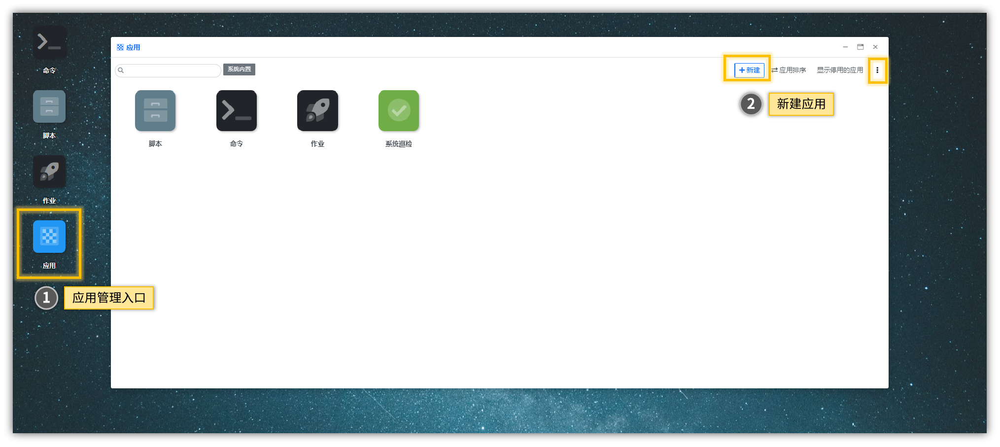   

2. 新建一个应用，需要设置应用名称、应用内容和导航、应用权限等。


3. 应用设置-应用基本信息说明

属性名|值|说明  
---|---|--- 
标题|`测试应用`| 必填，可随意命名，但必须唯一
Code|`test`| 必填，可随意命名，但必须唯一
版本|`1.0`|   
标签|``|  选填，支持多选    
状态|`已发布`| 单选 
窗口大小|`Default`| 设置应用打开的窗口大小
描述|``| 

4.应用设置-应用内容和导航说明
* 入口页面： 选择设置应用的首页。
* 导航菜单： 设置应用的菜单的位置与显示形式。
* 显示设置： 不显示导航菜单、不在首页显示。
* 菜单项： 设置应用的菜单栏，并指定菜单对应的页面。

5. 基本信息填写完成后，点击【保存】，创建应用成功，可在应用管理页面中查看到新增的应用。
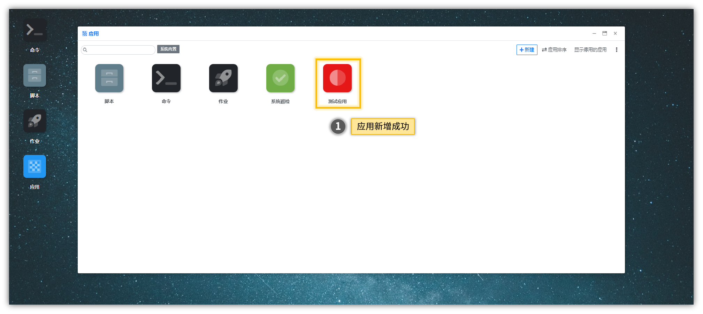


**第三步：创建数据集**

1. 返回应用管理首页，编辑应用信息，进入应用设置界面。


2. 在应用设置中，点击左侧的菜单栏，创建属于该应用的数据集。


3. 填写数据集名称，指定数据库，输入查询所需要的SQL。配置完成之后点击【保存】按钮，然后【执行测试查询】即可看到SQL执行结果。
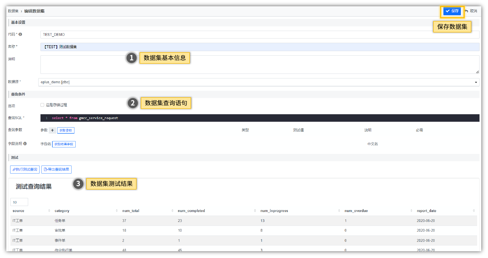

| 属性    | 值                              | 说明             |
| ------- | ------------------------------- | ---------------- |
| code    | `TEST_DEMO`               | 数据集的唯一标识 |
| 名称    | `【TEST】测试数据集`                      |                  |
| 说明    |                                  | 选填             |
| 查询SQL | `SELECT *  FROM gmcc_service_request` |                  |


4. 查看数据集。通过左侧菜单栏，点击【数据集】选项，可查看当前应用中所有的数据集。点击**操作栏中的修改按钮**可以查看数据集详情。
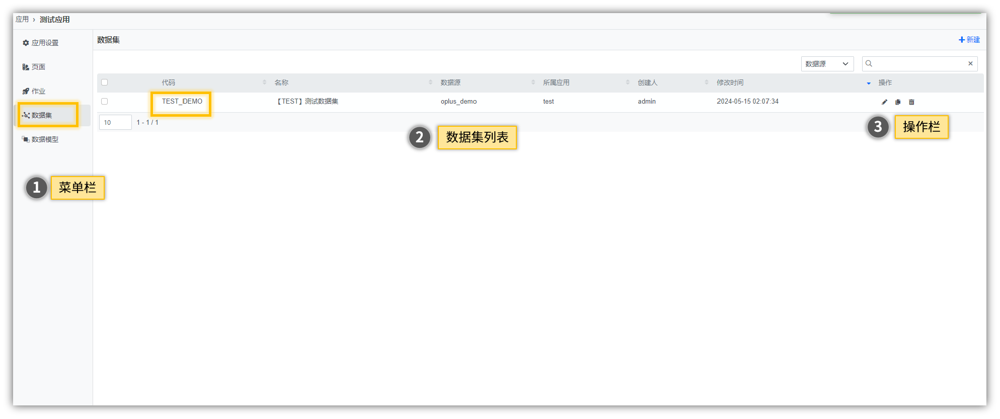

**第四步：创建页面**
1. 返回应用管理页面，编辑应用信息，进入应用设置界面。在左侧功能导航菜单中点击【页面】，进入应用页面管理首页。然后点击右上角【新建】按钮进入自定义编辑页面，弹出的**选择页面布局**框中选择空白页面。  


2. 编辑标题，这里可以输入任意文字，例如`快速入门页面`
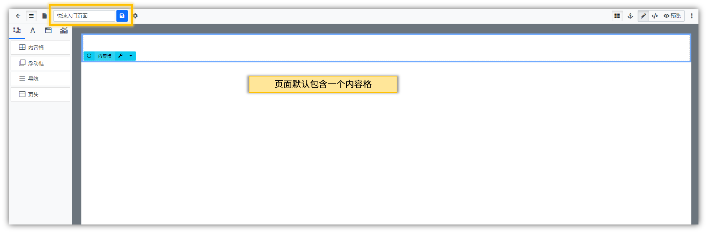
3. 从左边的工具栏拖拽2个内容格进页面，加上页面原先自带的1格内容格，现在页面上一共有3个内容格。
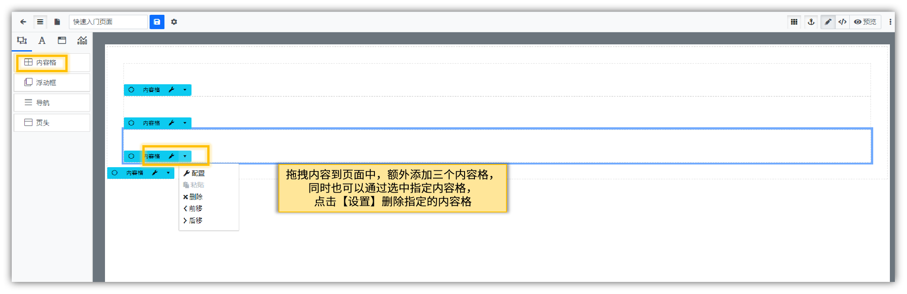
4. 将三个内容的宽度分别设为12格，5格，7格。这样，将形成一个类似品字形的布局。


**第五步：添加组件**

从左边的工具栏分别将表格、 饼图、柱状图组件拖拽放入，并点击各个组件的**配置**按钮进行配置。   


**表格组件设置**

1. 数据设定：【数据集】选择上面创建的`【TEST】测试数据集`
2. 字段设定：点击【添加所有列】


点击【确定】保存设置，关闭对话框。

**饼图组件设置**

1. 数据设定：【数据集】选择上面创建的`【TEST】测试数据集`
2. 字段设定：
   - X轴/数据：下拉框选择`category`。表示饼图以地区作为分类
   - 数据指标/数据：下拉框选择`num_completed`。表示以字段`num_completed`的值作为饼图区块的数据。
3. 样式：
   - 图形色调:默认 or Office 2016, 表示饼图图例的所显示的颜色。
   - 图例：右方,图例是否隐藏: 是，表示饼图中的图例显示位置及是否需要显示在图表中。
   - 尺寸：高度为300px。


点击【确定】保存设置，关闭对话框。

**柱状图组件设置**

1. 数据设定：【数据集】选择上面创建的`【TEST】测试数据集`
2. 字段设定：
   - X轴/数据：下拉框选择`category`。表示柱状图以地区作为X轴分类
   - X轴/标签角度：`45`。让X轴的地名倾斜45度便于阅读长的地名。
   - 数据指标/数据：下拉框选择`num_completed`。表示以字段`num_completed`的值作为Y轴的数据。

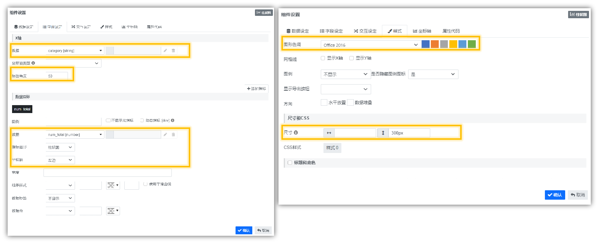

点击【确定】保存设置，关闭对话框。
    
**第六步：结果展示**

编辑完成之后，保存页面。在页面右上角可以点击预览已生成的页面，也可以跳转新窗口中预览。

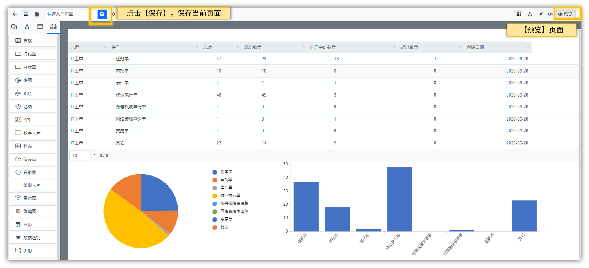

**第七步：为新建的应用【测试应用】配置首页及菜单栏**
1. 在应用页面中，选择`测试应用`，点击编辑按钮，进入应用设置页面。
2. 在`应用设置`中点击【内容和导航】,为应用配置首页及菜单栏。
   - 入口：选择自定义页面
   - 入口页面： 在下拉框中选择`快速入门页面`，
   - 导航菜单： 左侧
   - 菜单项： 点击右侧的【+】新增菜单项，在菜单项名中填写`测试菜单`， 关联页面选择`快速入门页面`
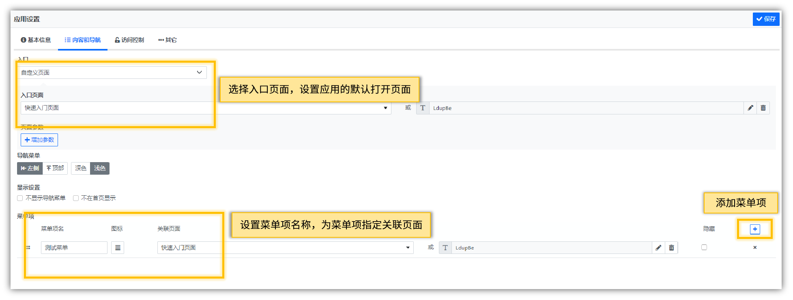

3. 点击右上角的保存，然后在应用页面中点击`测试应用`，即可打开应用，并查看应用中的相关页面信息。 


## 使用指南 


### 页面设计 

#### 设计器界面


页面设计器分为三个主要区域：

* **工具栏**：位于顶部，用于显示/隐藏左侧组件栏，设定页面标题，进行页面设置

* **组件栏**：位于左侧，用于选择组件，拖放在页面画布区

* **画布区**：位于页面中央，是主要的页面编辑区域，包括页面布局、组件设置

##### 工具栏

工具栏包含以下元素：

* 组件栏切换按钮：用于切换侧栏的显隐。隐藏侧栏可以扩大画布区的可视面积。
* 页面标题：用于识别这个页面的可阅读的标题，会在页面列表和页面展示中展示。
  
**注意**：在页面展示时，系统对于展示标题会做如下处理：
  - 如果标题以`【...】`（实心方头括号）开头，括号以及之内的文字在显示标题中会被移除。
  - 如果标题中有`__`（连续双下划线），那么将取最后一个双下划线后面的内容作为显示标题。
  
例如，一个页面的标题为`【VAP】补丁扫描__安装补丁__选择目标服务器`，最终显示的标题为`选择目标服务器`。
    当页面很多的时候，可以利用这两个处理规则来管理页面。用`【】`来给页面分类，通过`__`来给页面分层级。
* 间隔按钮：当间隔按钮激活时，会扩大内容格在画布中的间隔，方便拖拽组件。
* 锚定按钮：显示页面各个组件的边框
* 编辑器切换按钮组：在可视化编辑器、源代码编辑、预览三种模式切换

#### 页面布局

##### 栅格布局

页面采用[栅格系统](https://v3.bootcss.com/css/#grid)进行布局。栅格系统用于通过一系列的行（row，布局行）与列（column，内容格）的组合来创建页面布局，组件可以放入这些创建好的布局中。


栅格系统的工作方式如下。

- 布局行（row）用于在水平方向创建一组列，最多为12列（column）
- 布局行（row）可以直接放置在页面容器中，也可以放置在列（column）
- 布局行（row）内只能放置列
- 组件只能放置于内容格（column），**不能**放置在布局行（row）
- 一个页面至少包含一个布局行和一个内容格

##### 布局示例

我们设计一个左右布局的页面，左边是列表导航，右上是标题文字，右边下方放置三个图形组件，如下图所示。


页面布局分解如下图，它由3个布局行，5个内容格组成：

1. 行A：空白页面自带的布局行，直接放置在页面上。它包含2个内容格：内容格A1，内容格A2
2. 行A2B：放置在内容格A2内。它包含1个内容格A2B1。
3. 行A2C：放置在内容格A2内，行A2B下方。它包含3个内容格A2C1、A2C2、A2C3。

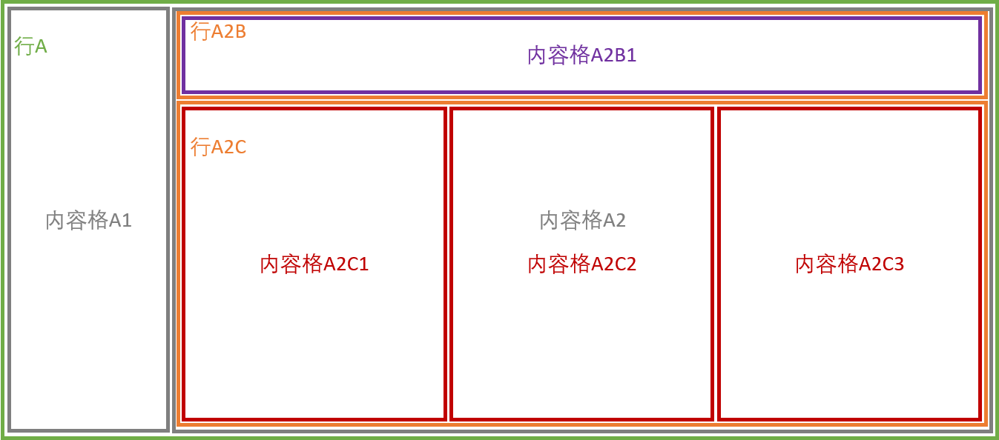

布局布局操作步骤如下。

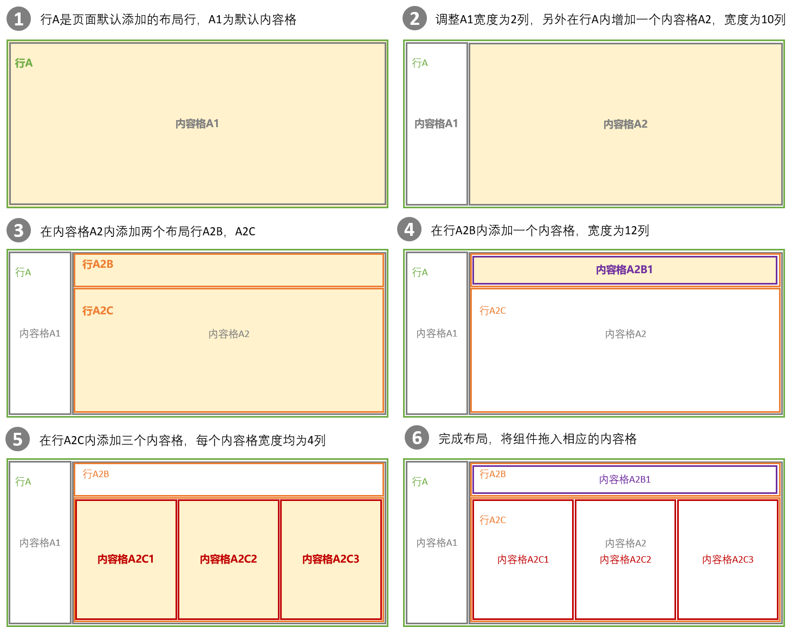

页面实际布局结果如下图，此时还没有将组件放入内容格。


将相应的组件放入内容格后如下图，此时组件还未进行配置。


组件配置完成之后效果如图。


##### 布局组件操作

从布局控件中，点**布局行**并拖动到主画布中，即可添加一行：
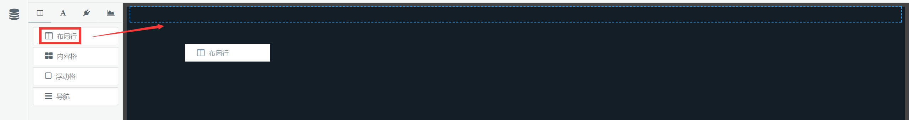

从布局控件中，点**内容格**并拖动到第一行内，即可添加一列：
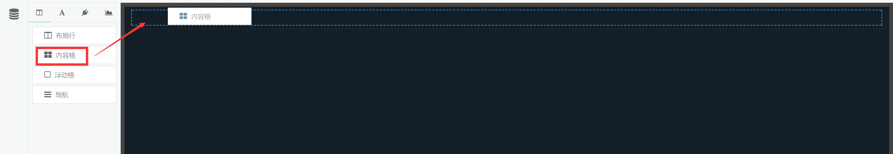

#### 页面颜色

页面默认采用白底黑字，可以通过下面的方式修改背景和字体颜色。

1. 点击**页面设置**按钮，弹出**页面设置**弹窗

2. 点击**显示设置**。可以在“页面主题色”中选择预定义的主题颜色，也可以选择自定义来自由选择颜色。
3. 选择**自定义**，在右侧会弹出**背景色**和**字体颜色**图标
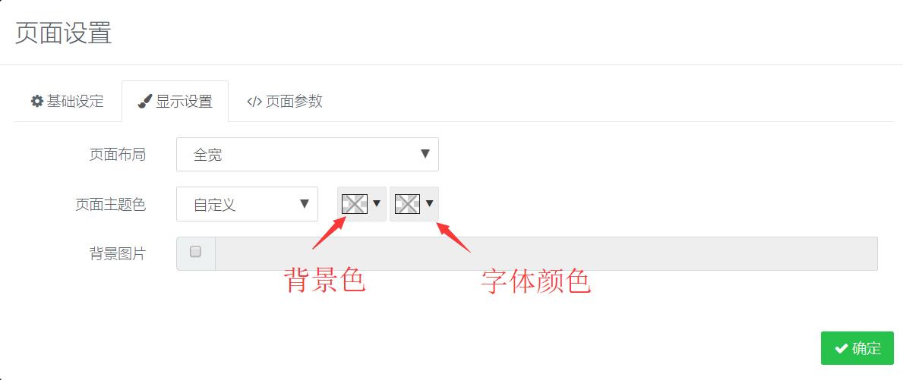


### 组件使用 


特别参数

* `@.页面参数`
* `#.全局参数`


## 组件 

自助页面提供了多种组件用于页面制作。

**布局类**
* 内容格
* 浮动格
* 布局行
* 布局列
* 导航条

**文本类**
* [富文本](udp/widget__wysiwyg.md)：可视化的HTML编辑器
* [脚本编辑](udp/widget__script.md)：通过HTML、CSS、JavaScript灵活的嵌入内容

**图形：趋势、分类**
* [折线图](udp/widget__linechart.md)：用于时间轴、趋势类数据展示
* [直方图](udp/widget__barchart.md)：用于分类、比较数据展示

**图形：占比、进度**
* [饼图](udp/widget__piechart.md)：用于数据占比
* [环形图](udp/widget__circle.md)：用于进度、数据占比
* [仪表盘](udp/widget__gauge.md)
* [玫瑰图](udp/widget__rose.md)

**指标类**
* [数字卡片](udp/widget__card.md)：用于醒目的指标数据
* [KPI](udp/widget__kpi.md)
* [雷达图](udp/widget__radar.md)

**列表类**
* [表格](udp/widget__datatable.md)
* 列表

**地图类**
* [地图](udp/widget__map.md)
* [飞行路径](udp/widget__route.md)

**表单类**
* [全能输入](udp/widget__input.md)：文本输入、时间选择、下拉框等表单输入元素
* 按钮
* [定时器](udp/widget__timer.md)：定时产生事件，用于刷新数据
* [作业](udp/widget__job.md)

**其它**
* [日历](udp/widget__calendar.md)
* [页面参数](udp/widget__param.md)


### 表格 

#### 组件用途

表格是最常用的显示组件，用于直观展示一批数据的多个属性。

#### 组件设置
##### 字段设定

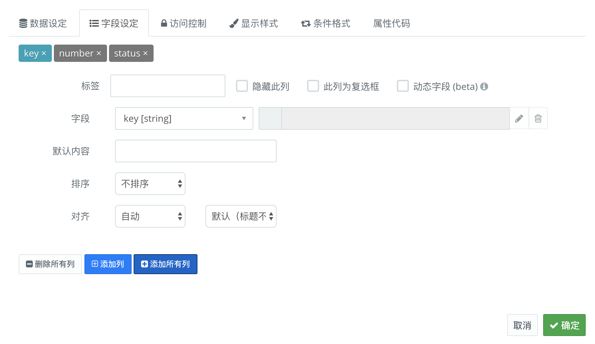

| 设置 | 说明 |
|--|--|
| 标签 | 表格展示的列名，支持隐藏、复选框 |
| 字段 | 表格列展示的值，支持自定义展现形式，例如按钮、链接等等 |
| 默认内容 | 默认展示的值 |
| 排序 |  支持升序和降序两种排序方式|
| 对齐 | 支持内容靠左、靠右、居中三中对齐方式以及内容换行 |
| 显示格式 | 数值类型的字段可转化为百分比形式 |
| 删除所有列 | 删除添加的所有列 |
| 添加列 |  添加一个空白列|
| 添加所有列 | 将所使用的数据集中的所有字段添加到列 |

##### 访问控制


| 设置 | 说明 |
|--|--|
| 启用访问控制 | 根据复选决定是否启动访问控制 |
| 控制方式 | 角色和权限两种控制方式 |
| 无权访问时 | 隐藏、禁用、提示信息三种无权访问时的组件形式 |

##### 显示样式


| 设置 | 说明 |
|--|--|
| 高度 | 支持px、vh两种单位设置高度 |
| 边框和底色 |  |
| 列宽度 | 支持根据内容长度动态调整宽度 |
| 表格控件 | 可以隐藏默认的过滤菜单 |
| 分页样式 | 是否选择分页以及支持锁定分页大小 |

##### 标题和底色

Box模式可以给组件增加背景色、标题

##### 条件格式
参考 [kpi](udp/widget-kpi.md) 中的条件格式

##### 属性代码
供开发人员快速修改组件设置

#### 常见问题

##### 如何增加复选框？

在【列设置】中选择**“此列为复选框”**。当一个列设置为复选框的时候，表格每行的第一列将显示为复选框。选中复选框后，该行将高亮显示，同时在表格上方将出现一个下拉框，显示为**“选中N项”**的字样。
点击下拉框，可以看到选中的项目，并可以在下拉框中移除某些项目。

##### 如何为复选框选中的值设置不同的显示标签？

复选框有**“属性值”**和**“显示标签”**两个数据。

- 属性值表示选中复选框后的值
- 显示标签表示选中复选框后，在下拉框中显示的文本。

例如有一个用户列表，包含`id`、`username`、`department`几个字段，我们希望选中复选框后，可以把传递字段`id`的值，同时在选中下拉框中显示选中的用户名（字段`username`）。

| [ ] | ID | 用户名 | 部门 |
| ---- | ------ | ---- | ---- |
| [ ] | admin | 管理员 | IT |
| [ ] | zhangsan | 张三 | Dev |
| [ ] | lisi | 李四 | Ops |

##### 如何隐藏或者禁止某行的复选框

如果要隐藏或禁止某一行的复选框，复选框的属性值需要返回一个格式为`{$state:string}`的object，`$state`取值可以是`hidden`（隐藏）或`disabled`（禁止）。

例如`id`为`admin`的行不允许用户选择，属性值设为`${id}==="admin"?{$state:"hidden"}:${id}`。即，如果这行数据的`id`为`admin`，返回一个object，否则返回`id`。

##### 当表格列的内容太长的时候如何处理

表格列的内容默认是不换行的，每列的宽度会自动适应内容长度。当列宽太大时，表格会产生水平的滚动条，不方便用户阅读。

例如表格有一列“使用说明”，内容包含多达500个字符，我们可以用下面两种方案进行处理。

方案一：换行。在【字段设定/对齐和换行】中选择 **“适应列头换行”**。

方案二：截断。在【字段设定/截断宽度】输入要显示的字符数，超出此数值的内容将用省略号...显示。
在表格中点击此单元格，将弹出对话框显示完整的内容。

##### 如何设置动态列

动态列是指表格的列是动态生成的，一个动态列最终可能会生成多个列。
默认情况下，如果一个列设置成了动态列，在表格渲染的时候，这个动态列会自动生成多个列，展示数据集返回数据的所有字段，每列显示一个字段值，列标题为字段名。

动态生成列的显示样式无法像普通列一样，在配置界面上直接配置。需要通过【动态列定义】来完成。
动态列定义，实际上是定义一套规则，对动态生成的列进行处理。这套规则是定义在一个的数组列表中，数组的每个元素代表一个列的定义，格式如下：
```json
{
  "field": "",       -- 列对应的字段名
  "label": "",       -- 列显示名，默认为字段名
  "show": true       -- 是否显示，默认true
  "hide": false      -- 是否隐藏，默认false
  "css": "",         -- CSS样式
  "seq": 0,          -- 显示顺序，数字越小越靠前
  "converter": "",   -- 显示数据转换
  "orderable": true, -- 允许搜索，默认true
  "sortable": true   -- 允许排序，默认true
}

```


### 全能输入 

#### 组件用途

全能输入包含了输入框、下拉框、联想输入、日期选择等页面输入控件，用于设定页面级别的数据值。

#### 组件设置

不同控件类型的属性设置可能会不同，关键的属性如下。

| 属性     | 说明                                                     |
| -------- | ------------------------------------------------------------ |
| 数据类型 | 数据值的类型，不同的字符串、数值、日期、数组                   |
| 控件类型 | 决定组件的展现形式，输入框、下拉框、联想输入、日期选择       |
| 名称     | 组件的数据值会保存为页面的参数，可以通过`${@.名称}`的形式进行引用 |
| 默认值   | 默认的数据值以及其刷新事件                                                 |
| 数据定义 | 部分控件适用。<br />下拉框：定义列表项<br />联想输入：定义建议的候选项。 |

其它设置

| 属性     | 说明                                                     |
| -------- | ------------------------------------------------------------ |
| 宽度     | 组件宽度                                                      |
| 只读     | 设为只读状态                                                   |
| 快捷键   | 配合Alt一起使用，例如快捷键为s，按Alt+s可以快速将鼠标定位在控件上 |

#### 下拉框

##### 从数据集获取数据作为下拉列表的值

示例：从表`demo_cn_province`中获取字段`short_name`和`province_name`的值，填充到下拉框列表，其中`province_name`的值作为列表项的真实值，`short_name`作为列表项的显示标签。

方法：

1. 建立一个数据集`DEMO_LIST_ITEMS`，查询语句为`SELECT short_name, province_name FROM demo_cn_province`，用于获取所需的两个值。
2. 编辑下拉框控件的【下拉数据】，选择【函数】，输入`$$.qdata("DEMO_LIST_ITEMS",{},["province_name","short_name"])`。
   * `$$.qdata()`函数查询数据集，异步返回一个二维数组。二维数组可以用于构建下拉列表的数据。
   * `"DEMO_GDP_YEAR"`是上面建立的数据集代码。
   * `{}`：表示这个数据集不需要查询参数
   * `["province_name","short_name"]`：返回一个二维数组，第一个值取`province_name`字段，用作列表值；第二个值取`short_name`字段，用作显示标签。
3. 结果如图
   


#### 时间控件

##### 将默认时间设为一周前

默认值选择`函数`，输入`$$.addDate(null,-7,'days')`，或者`$$.addDate(null,-1,'weeks')`

##### 制作下一个月、上一个月的按钮联动时间选择器

**目标**

页面上放置两个时间控件：开始时间和结束时间，另外有两个按钮：上一个月和下一个月。
点击按钮可以将开始时间和结束时间分别分别向前和向后推移一个月。
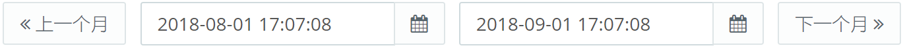

**方法和步骤**

1. 从工具栏中选取两个全能输入组件和两个按钮组件，按布局摆放好。
2. 全能输入组件设置：
    * 控件类型：`日期选择`
    * 名称：任意设定，例如开始时间为`beginTime`，结束时间为`endTime`
3. 按钮【上一个月】组件设置：
    * 标签文字：`上一个月`
    * **交互设定**，添加动作**页面参数赋值**。点击【添加参数】增加两个参数如下：
        * 名称：`beginTime`，值（函数）：`$$.addDate(${@.beginTime},-1,"months")`
        * 名称：`endTime`，值（函数）：`$$.addDate(${@.endTime},-1,"months")`
4. 按钮【下一个月】组件设置：
    * 标签文字：`下一个月`
    * **交互设定**，添加动作**页面参数赋值**。点击【添加参数】增加两个参数如下：
        * 名称：`beginTime`，值（函数）：`$$.addDate(${@.beginTime},1,"months")`
        * 名称：`endTime`，值（函数）：`$$.addDate(${@.endTime},1,"months")`
        

    ?> 函数通过`${@.}`的形式来引用组件的值。
5. 完成

#### 组件外观

##### 修改输入控件的标签位置

控件的标签默认是放置在控件的上方，如果希望将标签放置在控件的左边，
可以进入控件所在**内容格**设置，【显示样式/CSS样式】中加入`form-inline`。

#### 数据
##### 设置下拉框的选项

可以通过函数或者YAML格式设置，选项的数据是一个二维数组。
如下将创建三条选项记录，每条记录包含一个数组，数组第一个元素表示记录的值，第二个元素是记录的显示标签。

```yaml
- [a, 选项A]
- [b, 选项B]
- [c, 选项C]
```
等同于下面的函数（一个JSON）

```javascript
[["a","选项A"],["b","选项B"],["c","选项C"]]
```

也可以采用一维数组，这时候每条记录的值和显示标签是一样

```yaml
- a
- b
- c
```
等同于函数
```javascript
["a","b","c"]
```


### 折线图 

#### 组件用途
折线图主要用来展示数据相随着时间推移的趋势或变化。

#### 组件设置
##### 数据设定
参考[数据设定](udp/config-dataset.md)

##### 字段设定


##### x轴 
| 功能 | 说明 |
|--|--|
| 数据 | x轴的数据，通常为一个时间序列 |
| 坐标轴类型 | 支持将坐标轴类型设置为时间轴 |
| 标签角度 | 设置x轴上标签的角度 |

##### 数据指标

| 功能 | 说明 |
|--|--|
| 图例名称 | 设置图例显示的名称 |
| 数据| y轴对应的数据 |
| 图形| 支持在折线图和柱状图相互转换 |
| 坐标轴 | 设置y轴显示的位置(左、右) |
| 数据点标签 | 是否显示数据点标签 |
| 线条样式 | 设置线条形状、宽度、透明度、颜色以及是否使用平滑曲线 |
| 数据点样式 | 设置数据点形状、宽度、颜色 |

#### 交互设定


#### 显示样式


| 功能 | 说明 |
|--|--|
| 图形色调| 设置图形整体色调,系统内置了多个配色供选择 |
| 坐标网格线| 如图所示 |
| 图例| 支持显示或隐藏图例 |
| 缩放 | 如图所示 |

##### 坐标轴


   


### 柱状图 

#### 组件用途
柱状图是最常见的图表类型，通过使用水平或垂直方向柱子的高度来显示不同类别的数值，其中柱状图的一个轴显示正在比较的类别，而另一个轴代表对应的刻度值。

#### 组件设置
柱状图的配置和折线图配置基本一致，参考[折线图](udp/widget-linechart.md)


### 饼图 

#### 组件用途

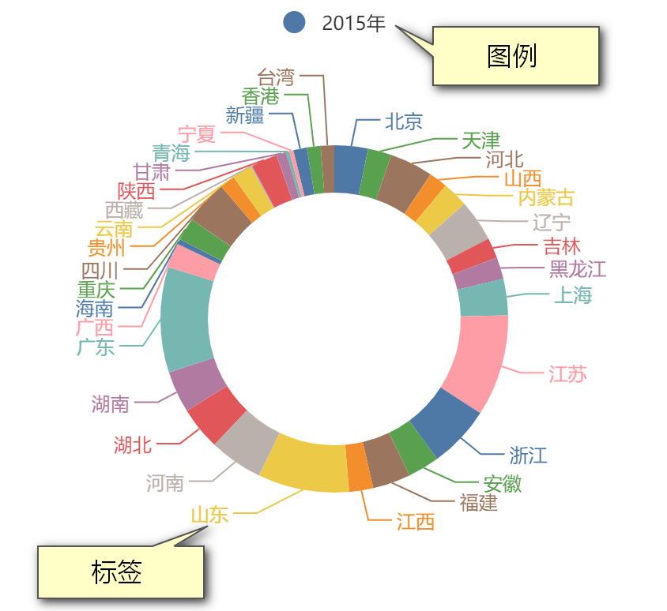  

饼图主要用于展现不同类别数值相对于总数的占比情况。图中每个分块（扇区）的弧长表示该类别的占比大小，所有分块数据总和为100%。

#### 组件设置

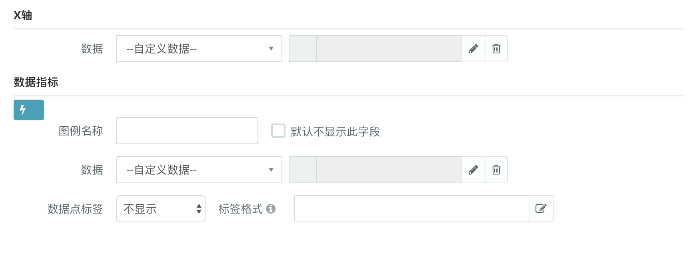

- **X轴**：设定用于分类的字段
- **数据指标**：代表每个类别数值的字段

以下面的数据集为例。如果要展示各个地区GDP占全国GDP的比重，X轴选择`province`，数据指标字段选择`gdp`

当前饼图只支持一个数据指标。如果要展示某个地区三个产业占该地区GDP的比重，当前版本的数据工场要使用[环形图](udp/widget-circle.md)。

示例数据集

| `year` | `province`         | `gdp`   | `first_industry` | `second_industry` | `third_industry` |
| ---- | ---------------- | ----- | -------------- | --------------- | -------------- |
| 2017 | 北京市           | 28015 | 120            | 5327            | 22568          |
| 2017 | 天津市           | 18549 | 169            | 7594            | 10787          |
| 2017 | 河北省           | 34016 | 3130           | 15846           | 15040          |
| 2017 | 山西省           | 15528 | 719            | 6779            | 8030           |
| 2017 | 内蒙古自治区     | 16096 | 1650           | 6400            | 8047           |
| 2017 | 辽宁省           | 23409 | 1902           | 9200            | 12307          |
| 2017 | 吉林省           | 14945 | 1095           | 6999            | 6851           |
| 2017 | 黑龙江省         | 15903 | 2965           | 4061            | 8877           |
| 2017 | 上海市           | 30633 | 111            | 9331            | 21192          |
| 2017 | 江苏省           | 85870 | 4045           | 38655           | 43170          |
| 2017 | 浙江省           | 51768 | 1934           | 22232           | 27602          |
| 2017 | 安徽省           | 27018 | 2582           | 12838           | 11597          |
| 2017 | 福建省           | 32182 | 2215           | 15354           | 14613          |
| 2017 | 江西省           | 20006 | 1835           | 9628            | 8543           |
| 2017 | 山东省           | 72634 | 4833           | 32943           | 34859          |
| 2017 | 河南省           | 44553 | 4139           | 21106           | 19308          |
| 2017 | 湖北省           | 35478 | 3529           | 15442           | 16507          |
| 2017 | 湖南省           | 33903 | 2998           | 14145           | 16759          |
| 2017 | 广东省           | 89705 | 3611           | 38008           | 48086          |
| 2017 | 广西壮族自治区   | 18523 | 2878           | 7451            | 8194           |
| 2017 | 海南省           | 4463  | 963            | 996             | 2503           |
| 2017 | 重庆市           | 19425 | 1276           | 8585            | 9564           |
| 2017 | 四川省           | 36980 | 4262           | 14328           | 18390          |
| 2017 | 贵州省           | 13541 | 2032           | 5428            | 6080           |
| 2017 | 云南省           | 16376 | 2338           | 6205            | 7833           |
| 2017 | 西藏自治区       | 1311  | 123            | 514             | 675            |
| 2017 | 陕西省           | 21899 | 1741           | 10883           | 9274           |
| 2017 | 甘肃省           | 7460  | 860            | 2562            | 4038           |
| 2017 | 青海省           | 2625  | 238            | 1162            | 1224           |
| 2017 | 宁夏回族自治区   | 3444  | 251            | 1581            | 1612           |
| 2017 | 新疆维吾尔自治区 | 10882 | 1552           | 4331            | 4999           |

#### 显示样式


| 功能 | 说明 |
|----|----|
| 图形色调| 设置图形整体色调,系统内置了多个配色供选择 |
| 坐标网格线| 如图 |
| 图例| 是否显示图例 |
| 图形格式 | 内置三种图形供选择 |


### 按钮 

#### 组件用途

#### 组件设置


### 定时器 

#### 组件用途
定时（最小间隔单位为1秒）产生事件，其它控件可以根据事件产生动作。
例如，定时器每5秒发出一个名称为`refresh`的事件，页面的折线图数据刷新事件设为`refresh`，
这样每隔5秒折线图将更新一次数据。

#### 组件设置

场景：页面上有一个名为`timer01`的定时器和一个按钮，定时器设为自动开启，现在需要点击按钮之后，将定时器关闭。

实现方法：在按钮的交互设置中，执行操作为页面参数赋值，增加参数`timer01`，参数值设为`false`


### 富文本 

#### 组件用途

提供所见即所得的HTML编辑器，可以插入文本、表格、图片等多种HTML元素。


#### 组件设置

可以通过`[[@.页面参数]]`的形式引用参数

!> 图片只能使用HTTP方式引用，暂时还不支持图片等媒体上传。


### 页面参数 

#### 组件用途

页面参数组件用于获取数据，保存在一个只读的参数中。

在编辑状态下，组件显示为一个标签。在页面查看状态下，组件不显示。

#### 组件设置

页面参数组件的构成元素为：
- **名称**：标识该参数值，在一个页面中，名称必须**唯一**。
参数值可以通过`${@.参数名称}`的形式被页面其它组件引用。
- **参数值**：定义参数的值，支持函数和YAML两种形式
- **数据刷新**：定义数据刷新事件的名称，当产生此事件时，参数组件将重新执行**参数值**

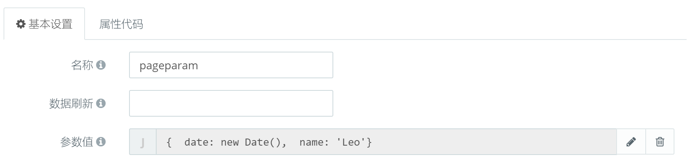

#### 示例

##### 定义简单的参数

例如参数名称为`pageparam`，参数值函数为`{date:new Date(), name:"Leo"}`，
那么通过`${@.pageparam.date}`可以获取系统当前时间

##### 从数据集中获取参数值

参数值函数为
```
$$.qdata()
```


### 脚本编辑 

#### 组件用途

自定义编写HTML、JS、CSS代码定义组件的展示模板，支持angularJs的模板语法。


#### 组件设置

输入Javascript代码，内置以下变量：

$w ：定义在模板中使用的值

$data：数据集的数据结果，格式为{total:number,records:[]}

$p：引用其它页面参数

$g：引用全局参数


### 环形图 

#### 组件用途

环形图显示一组比例数据，可以用于展示不同的比例（和[甜甜圈图](udp/widget-piechart)类似），或者用于展示进度百分比。用于展示比例的时候，建议不超过5个分类。


#### 组件设置

环形图的构成元素包括：
* 图标：增强卡片的视觉效果
* 主要文字：在环形中央显示的醒目文字，例如总和数字、状态、进度百分比
* 次要文字：在环形中央显示的描述文字，例如说明这个图形的用途
* 数据指标（多个）：不同的组成比例
    * 名称：文本
    * 数据：数值

!> 图标目前只支持目录`content/medialib/icons/`下面的静态图片

一个图中可以显示多个环形。当一个数据集中返回多条记录的时候，每条记录都会绘制一个环形。


### 仪表盘 

#### 组件用途

  

#### 组件设置


### 雷达图  

#### 组件用途

  

雷达图（Radar Chart）又被叫做蜘蛛网图，适用于显示三个或更多的维度的变量。雷达图是以在同一点开始的轴上显示的三个或更多个变量的二维图表的形式来显示多元数据的方法，其中轴的相对位置和角度通常是无意义的。

雷达图的每个变量都有一个从中心向外发射的轴线，所有的轴之间的夹角相等，同时每个轴有相同的刻度，将轴到轴的刻度用网格线链接作为辅助元素，连接每个变量在其各自的轴线的数据点成一条多边形。

#### 组件设置

##### 字段设定


##### 显示样式
目前只支持设置图形色调


### 玫瑰图 

#### 组件用途

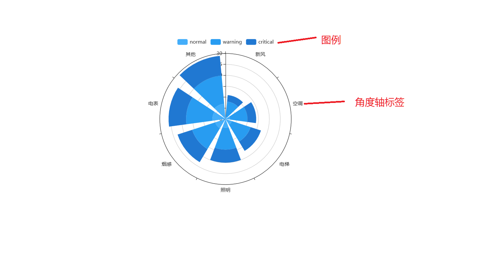  

#### 组件设置

##### 字段设定


##### 显示样式
目前只支持设置图形色调


### KPI 

#### 组件用途

KPI控件显示一组卡片，每张卡片展示一个数据（数值或者状态），用于展示关键指标（Key Performance Indicator）。
卡片的背景色也可以用于数据指示，例如用绿色表示正常，黄色表示告警，红色表示危险。

  

#### 组件设置

KPI控件的卡片由以下元素构成：

* 文字：显示描述性的文字
* 标题：显示醒目的关键数据，例如数值、状态
* 图标：目前只支持[Font Awesome 4.7.0图标](http://www.fontawesome.com.cn/faicons/)，例如`fa-rocket`，`fa-cube`
* 悬停提示：详细的说明内容

##### 条件格式

通过定义条件规则，卡片的颜色可以根据数据动态变化。控件将数据集返回的每条数据与定义的规则进行比较，如果匹配，将使用规则定义的颜色。

?> 规则顺序很重要，如果有多条规则都匹配，那么第一条匹配的规则将生效，后面的规则将不再执行。


#### 相似控件
[列表](udp/widget-list.md)    


### 数字卡片 

#### 组件用途
数字卡片用于突出显示醒目的数值或状态指标，在一个卡片里，建议不要超过3个指标。
数字卡片和[KPI](udp/widget-kpi.md)有类似之处，KPI控件也是由一些列卡片组成，但KPI中的每张卡片只显示一个指标。


#### 组件设置
数字卡片的构成元素包括：
* 图标（一个）：增强卡片的视觉效果
* 数据指标（多个）：显示关键的信息
    * 名称：文本
    * 数据：数值，或者状态文本
    


!> 图标目前只支持目录`content/medialib/`下面的静态图片

?> 注意：当一个数据集返回多条记录的时候，数字卡片只取第一条记录。


### 地图 

#### 组件用途

系统提供了三种主要地图：中国全国地图、中国各省地图、世界地图。
在地图上支持以下两种数据展示方式：
1. 根据各个区域（例如各省、地区）的数据，展示不同深浅的颜色
2. 根据具体的地点（例如城市，坐标）的数据，展示不同颜色、大小的数据点


#### 组件设置

- **地图类型**：选择世界地图、中国地图、各省地图
- **地点**
  - **数据**：选择数据集的字段作为地点的数据来源，这个字段应该包含地名
  - **地名格式**：
    对于全国地图，简称指不包含市、省、自治区的名称，例如：
    - 简称：`北京`、`广东`、`广西`、`黑龙江`、`内蒙古`、`新疆`、`宁夏`、`西藏`
    - 全称：`北京市`、`广东省`、`广西壮族自治区`、`黑龙江省`、`内蒙古自治区`、
    `新疆维吾尔自治区`、`宁夏回族自治区`、`西藏自治区`
    
    对于各省地图，简称指不包含市的名称，例如：
    - 简称：`广州`、`深圳`、`阿坝`、`甘孜`
    - 全称：`广州市`、`深圳市`、`阿坝藏族羌族自治州`，`甘孜藏族自治州`
    
- **数据指标**
  - **图形**：数据以何种形式呈现在地图上。
    - **区块**：在地图上以不同颜色的区块显示。使用这种形式，地点数据是一个区域。
    - **散点**：在地图上以不同颜色、大小的散点显示，使用这种形式，地点数据是是一个具体的点。
    
    同一个地点在不同的地图上，可能代表不同的形式，例如同样是`广州`，在全国地图上它是一个点，在广东省地图上，它可能是一个区域（广州市行政区）


#### 数据示例

示例：制作一个全国地图，在地图上用不同深浅的颜色标记出各省的常住人口数量。

为此我们需要准备如下格式的数据，包括两个字段：`DISTRICT`和`PEOPLE`。

[^数据来源]: http://data.stats.gov.cn/easyquery.htm?cn=E0103


| DISTRICT         | PEOPLE |
| ---------------- | ------ |
| 北京市           | 2173   |
| 天津市           | 1562   |
| 河北省           | 7470   |
| 山西省           | 3682   |
| 内蒙古自治区     | 2520   |
| 辽宁省           | 4378   |
| 吉林省           | 2733   |
| 黑龙江省         | 3799   |
| 上海市           | 2420   |
| 江苏省           | 7999   |
| 浙江省           | 5590   |
| 安徽省           | 6196   |
| 福建省           | 3874   |
| 江西省           | 4592   |
| 山东省           | 9947   |
| 河南省           | 9532   |
| 湖北省           | 5885   |
| 湖南省           | 6822   |
| 广东省           | 10999  |
| 广西壮族自治区   | 4838   |
| 海南省           | 917    |
| 重庆市           | 3048   |
| 四川省           | 8262   |
| 贵州省           | 3555   |
| 云南省           | 4771   |
| 西藏自治区       | 331    |
| 陕西省           | 3813   |
| 甘肃省           | 2610   |
| 青海省           | 593    |
| 宁夏回族自治区   | 675    |
| 新疆维吾尔自治区 | 2398   |


### 飞行路径 

#### 组件用途

路径组件可以在地图上展示多点之间的连线，用来展示地点之间的关联。
应用场景如航班路线，不同地点之间的网络请求。
图形通过连线来表示地点之间的关联，通过点的半径来表示连线的数值大小。


#### 组件设置

- **起点**：连线的起点位置。
- **终点**：连线的终点位置。
- **数值**：连线的数值，将影响点的大小。


## 组件设置 

鼠标悬浮在组件上，将出现工具条，工具条上有：

1. 组件类型名称：鼠标按住可以拖拽移动组件
2. 配置按钮：点击可以进入组件的配置页面
3. 下拉菜单按钮：点击将显示更多的操作选项，例如复制、剪切、粘贴、删除


组件的配置页面如下（表格组件）所示。

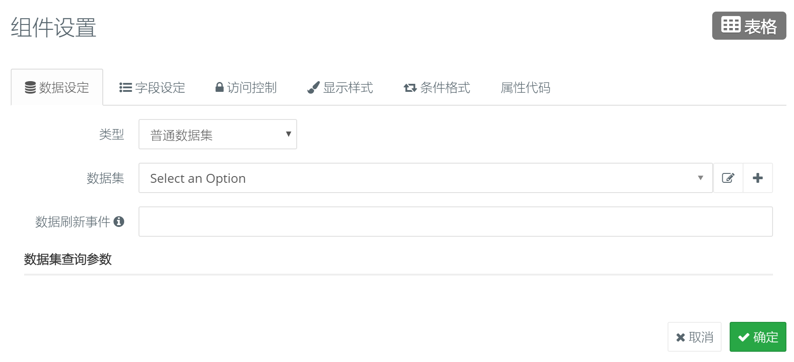

不同组件可配置的项目有差异，一般包括以下几类配置项：

* **数据设定**：选择数据集，配置查询参数，见“[数据设定](udp/config-dataset.md)”
* **字段设定**：配置要显示哪些字段，以及字段的显示格式
* **访问控制**：对组件进行访问控制，例如具有某些权限/角色的用户才可以看，见“[访问控制](udp/config-accesscontrol.md)”
* **显示样式**：组件的显示样式，例如标题、边框、颜色等
* **条件格式**：某些类型的组件（例如表格，KPI）可以设置条件显示不同的外观，参见KPI组件的“[条件格式](udp/widget-kpi.md#条件格式)”
* **属性代码**：用于查看配置属性的原始代码，一般用于调试。

  


### 数据设定 

组件通过数据设定，选择要展示的数据集。数据设定有如下配置项。

- **类型**：数据集类型，分为[普通数据集](#普通数据集)、[关联数据集](#关联数据集)、[自定义数据集](#自定义数据集)三种，不同类型数据集的配置项有差异。
- **数据刷新事件**：与定时器组件联合使用，可以实现定时刷新。
- **数据集查询参数**：当数据集支持查询参数的时候，可以对查询参数的形式进行配置。
如果选择的数据集不支持查询参数，这里将为空。
参考[数据集参数化查询](udp/dts-config-jdbc.md#参数化查询)


#### 普通数据集


#### 关联数据集


关联数据集可以通过设置关联字段得到多个数据集的交集

#### 自定义数据集

自定义数据集使用[数据编辑器](udp/data-convertor.md)来定义数据。


#### 数据集查询参数


| 功能           | 说明                                                         |
| -------------- | ------------------------------------------------------------ |
| 同步页面参数   | 可以和定义的页面参数绑定，当页面参数改变时，当前字段参数也改变 |
| 显示标签       | 字段参数控件的名称，通过复选框显示或者隐藏                   |
| 数据类型       | 可以选择数据类型，如日期、字符串等等，支持以函数或者字符串的形式定义默认值 |
| 控件类型       | 支持输入框、下拉框、日期选择等控件类型                       |
| 只读           | 通过复选框控制是否可以编辑                                   |
| 不显示参数控件 | 通过复选框控制，显示或者隐藏控件                             |
| 宽度           | 自定义宽度                                                   |
| 快捷键         | 自定义快捷键，编辑时可以快速定位到控件上                     |


### 数据编辑器 

数据编辑器可以编辑数据表达式，对数据进行灵活多样的转换和处理。可用于数据转换，从数据集获取数据，构造初始化数据等。


数据编辑器支持以下类型的数据表达式：

* 函数
* 字符串
* JSON
* YAML
* 按钮链接

在不同的控件设置，可用的数据类型有所不同，例如折线图的字段设置，数据编辑器支持函数、字符串；在表格控件的字段设置，数据编辑器支持函数、字符串和按钮链接。

#### 函数

支持单条或多条Javascript语句对数据进行转换。

**单条语句**

单条语句用于进行简单的数据处理，该语句的值会作为数据返回。例如：

- `Math.round(Math.random()*10)`：返回一个0-10的随机整数
- `$$.formatDate(new Date(),'YYYY-MM-DD hh:mm:ss')`：以字符串`2020-08-07 09:10:40`形式返回当前时间

**多条语句**

多条语句用于处理复杂的数据处理，需要使用`function(){...}`的函数体形式将语句包围，例如：

```javascript
function(){
    var date = new Date();
    var date2 = $$.addDate(date,1,"months");
    var str = $$.formatDate(date2,'YYYY/MM/DD');
    return str;
}
```

?> 注意，函数体必须通过`return`返回所需要的值

#### 字符串

#### YAML

YAML
- [YAML官方网站](http://yaml.org/)
- [简明的YAML 语言教程](http://www.ruanyifeng.com/blog/2016/07/yaml.html)
- [维基上的YAML介绍](https://en.wikipedia.org/wiki/YAML)
- [YAML JSON转换器](https://codebeautify.org/yaml-to-json-xml-csv)

#### 变量使用

在数据表达式中，可以用`${变量名}`的形式引用变量。

变量范围包括：
- 数据集变量：用`${数据集的变量属性}`表示
- 页面控件值：用`${@.页面控制参数名}`表示
- 全局变量：用`${#.全局变量名}`表示

不同控件或不同场景下支持的变量范围不同，请参考具体页面的数据编辑器提示。

如果一个变量没有赋值（对应javasript的`undefined`），这种变量称为未决变量（UnresolvedVar）。
在解析数据表达式的时候，如果遇到未决变量，整个表达式会解析失败。
如果希望避免出现UnresolvedVar，可以通过`${变量名 || 默认值}`的形式给变量赋予默认值。

如果默认值是一个字符串，需要用单引号`''`或者双引号`""`包围。

示例：

- `var username = ${username || "guest"}`
- `${is_enabled || false}`


### 组件的交互动作 

组件支持以下的交互动作
- **打开页面**：打开一个系统内定义的页面
- **打开URL链接**：打开一个任意的URL
- **触发事件**：触发一个页面的事件
- **调用Ajax请求**：调用一个Ajax请求
- **页面参数赋值**：为页面的参数控件赋值
- **执行作业**：执行一个作业


一个组件可以添加一个或者多个交互动作。
如果有多个交互动作，当一个动作失败，后续的动作将不执行。


### 组件之间的联动 

组件联动指的是一个组件的数据发生变化，其它组件跟随发生变化。例如：
1. 两个父子下拉框组件，父下拉框显示省份，子下拉框显示对应省份下面的城市。
2. 页面左边一个列表组件显示所有城市列表，右边有表格和图形显示所选城市的数据。


### 组件访问控制 

在这里可以控制对组件的访问和改变组件的状态，例如：
1. 特定角色的用户可以看到（使用）本组件
2. 特定权限的用户可以看到（使用）本组件
3. 根据数据集的数据改变组件的状态
4. 根据页面的参数改变组件的状态


## 开发指南 


### 示例01：下拉框控制单个图形数据 

#### 目标

下拉框显示年份，图形为各省当年GDP。

#### 步骤

第1步：页面添加一个【柱状图】组件。

第2步：【数据设定】如下：

   1. 数据集：`【DEMO】各省GDP`。该数据集可以查询某年、某省份的GDP，支持两个可选参数`year`、`province_name`。
      
   2. 数据集查询参数`year`
      - 默认值：2017
      - 控件类型：`下拉框`。用下拉框控件来显示这个参数。
      - 下拉数据：选择YAML，输入以下数据，表示一个从2007到2017的数组。
         ```yaml
         - 2007
         - 2008
         - 2009
         - 2010
         - 2011
         - 2012
         - 2013
         - 2014
         - 2015
         - 2016
         - 2017
         ```
         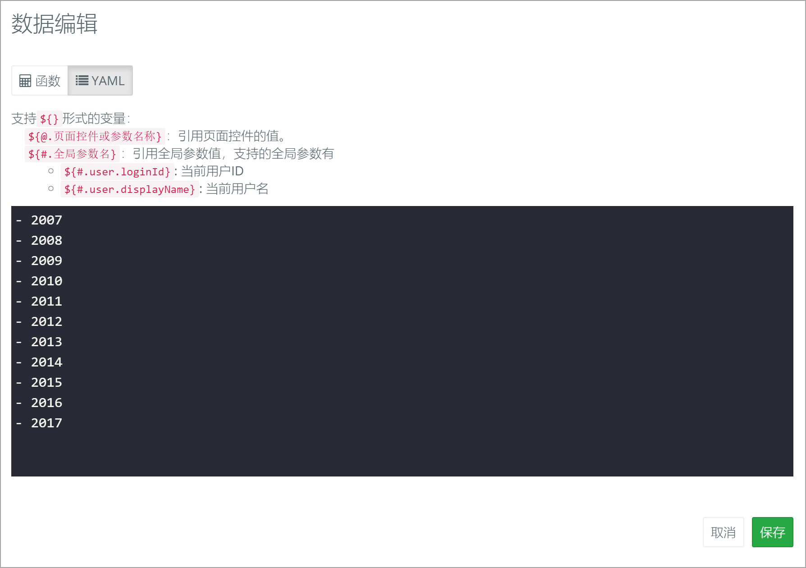
      
   3. 数据集查询参数`province_name`

     - 控件类型：`隐藏`。因为不需要控制此参数，将其设为隐藏。

第3步：完成
 


### 示例02：下拉框控制多个组件数据 

#### 目标

下拉框显示年份，页面有两个饼图、柱状图两个组件，图形的数据需要跟随所选年份变化。

#### 步骤
在EX01中，下拉框是组件级别的控件，它属于柱状图组件。只能控制它所在的柱状图组件，无法控制饼图组件。为了控制页面多个组件，需要引入页面级别的组件。

第1步：页面进行简单布局，放置3个内容格，宽度分别为100%（12格），50%（6格），50%（6格），形成下面的品字形布局。


第2步：在三个内容格分别添加组件：全能输入、柱状图、饼图。

第3步：配置组件全能输入。

- 基本设置
  - 名称：`current_year`

  - 数据类型：`数值`

  - 控件类型：`下拉框`

  - 默认值：`2017`

  - 下拉数据：同EX01中的year设定

    

第4步：对饼图和柱状图进行基本设置，【数据设定】如下。

1. 数据集：`【DEMO】各省GDP`
2. 勾选`不显示参数控件`
3. 数据集查询参数`year`
   - 同步页面参数：`current_year`
   - 默认值：空
     

第5步：设置【字段设定】

- X轴：`province_name`
- Y轴：`gdp`

完成
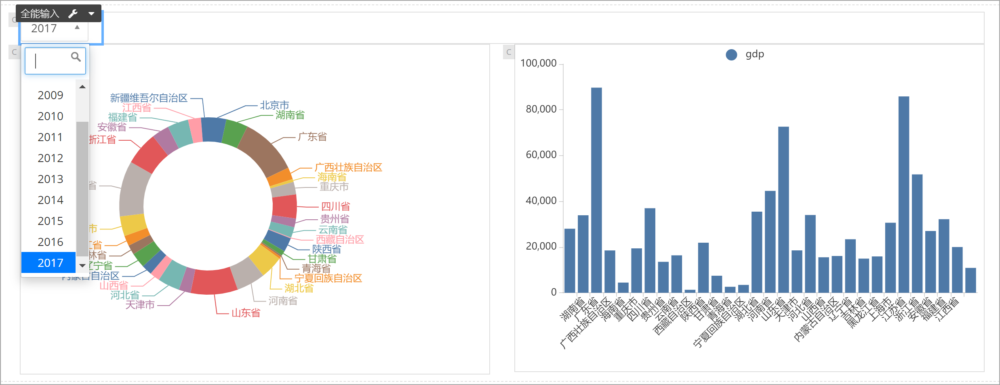


### 示例03：弹出对话框 


## 常见问题 

### 如何学习使用数据工厂？

1. 对照[快速入门](udp/quickstart.md)章节，跟随步骤，使用示例数据实际操作一次。
2. 针对每种组件查看相应的配置指南。
3. 如果遇到难题，联系我们

### 图表控件可以配置按钮吗？
不可以。但是可以在页面加入按钮组件。

### **组件设置**中每个输入框都必填？    
只需要填写主要信息就可以。
       
### 是否可以调整**布局行**的宽度和高度？
布局行的高度和宽度不能调整，它是根据图表或其他控件自动撑开的。图表控件可以用鼠标调整高度，宽度是根据内容格所占格子（百分比）决定的。

### 怎么配置双Y轴？
**组件设置**中**字段设定**，**数据指标**即代表Y轴，选择要展示的两个字段，然后**坐标轴**那里一个选择左边，一个选择右边，就会是双y轴的效果。

### 一个图表怎么同时配置柱状图和折线图？
**组件设置**中**字段设定**，**数据指标**即代表Y轴，选择要展示的两个字段（可以是相同的字段），然后**图形**那里可以选择柱状图或折线图。

### 怎么对数据进行刷新？
在图表【设置组件】->【数据设定】中有个【数据刷新事件】的input输入框，随意命名刷新事件名称（如`refresh_event`），
然后在自定义按钮的【触发事件】中，事件名和数据刷新事件名一致即可。   

### 什么是页面参数，如何使用?
见[页面参数](udp/widget-param.md)

### YAML格式
- [YAML官方网站](http://yaml.org/)
- [简明的YAML 语言教程](http://www.ruanyifeng.com/blog/2016/07/yaml.html)
- [维基上的YAML介绍](https://en.wikipedia.org/wiki/YAML)
- [YAML JSON转换器](https://codebeautify.org/yaml-to-json-xml-csv)


# 数据服务 

数据服务（Data Service，简称为dts）提供一个统一、高可用的数据访问接口，通过数据服务API，客户端可以方便的查询后端各种类型的数据源。

- **数据源**: 数据源定义了数据的源头，数据来自哪里。一个数据源可以是一个关系型数据库，一个NoSQL数据库，或者一个Web Service。
- **数据集**: 根据查询条件从一个数据源中查询的数据集合。数据集=数据源+查询语言
- **查询语言**: 数据源可以识别的语言，根据此语言所表达的查询条件，数据源可以给出相应的查询结果。查询语言和数据源类型相关，一种语言往往只支持一类数据源，例如SQL（Structured Query Language）只能用在关系型数据库上。

数据服务支持以下类型的数据源：

* JDBC：支持JDBC的各种关系型数据库，例如Oracle、MySQL、DB2、SQLServer
* ~~数据文件：上传CSV和Excel格式文件作为数据来源 -~~
* Web Service：调用外部的RESTful API获取数据
* MongoDB：MongoDB数据库
* HBase：HBase数据库
* ElasticSearch：[ElasticSearch](https://www.elastic.co/)搜索引擎


数据服务具有以下优点：

* 数据和展示分离，数据易于维护和复用
* 后端通过增强SQL查询，提供巨大的数据操作灵活性，并将学习成本降到最低。
* 对于NoSQL和ElasticSearch，同时支持强大的原生查询和易用的SQL查询。
* 前端提供数据转换函数，可以对数据进行各种形式的转换
* 支持不同数据集的数据聚合，可以完成动态基线等复杂场景
* 提供REST API，供其它系统集成和消费数据


## 快速入门 


## 使用指南 


### JDBC数据源 

JDBC数据源用于连接提供[JDBC](https://baike.baidu.com/item/jdbc)接口的数据库，一般的关系型数据库（例如Oracle、DB2、MySQL、Microsoft SQL Server），都支持JDBC接口。JDBC数据源采用[SQL](http://www.runoob.com/sql/sql-tutorial.html)（结构化查询语言，Structured Query Language）从数据库中查询结果得到数据集。

数据工场对SQL加入了一些增强功能，包括[参数化查询](#参数化查询)、[动态查询](#动态查询)。


#### 数据源配置

配置一个JDBC数据源的基本步骤：

1. 在【数据服务】模块，点击【新建数据源】。
2. 数据源类型选择【JDBC数据库】。
3. 填写数据源相关属性。
  - **名称**：数据源的名称，在系统中必须唯一
  - **JDBC驱动**：数据库的JDBC驱动程序（类名）。不同类型的数据库对应不同的驱动程序，系统内置了常用的JDBC数据库驱动。如果遇到系统没有的数据库，请联系管理员。
  - **JDBC URL**：选择JDBC驱动后，界面上将显示该驱动对应的URL样例， JDBC的URL
  - **验证语句**：用于测试数据库连通性的SQL验证语句，一般情况下无需修改。
  - **用户名**：数据库的用户名
  - **密码**：数据库的密码
  - **说明**：可选，此数据源的用途、备注等说明信息

4. 点击【保存】后，点击【测试连通性】，测试上面的属性是否可以连通数据库。如果数据库连接成功，将出现成功的提示信息。

#### 数据集配置

配置数据集的基本步骤：

1. 数据集属性
    * **代码**：标识此数据集的唯一代码，数据集保存之后不能修改。数据集代码只能用大写字母`A-Z`，下划线`_`，数字`0-9`。
    * **名称**：可供阅读的名称，保存之后可以修改。
    * **说明**：可选，数据集用途、使用等备注信息。
    * **数据源**：该数据集对应的数据源
    * **是否存储过程**：标识查询SQL是否查询存储过程
    * **查询SQL**：用于查询数据的SQL语句，参见[SQL编写](#SQL编写)。
    * **查询参数**：SQL支持参数化查询，在这里可以给每个参数添加更详细的信息，例如类型、默认值、说明。
        * 【获取参数】：可以解析SQL语句中的参数，自动列出
    * **字段说明**：可选，为数据集的字段（查询结果）添加描述，一般数据库的结果字段都是英文，可以通过字段说明为字段添加字段对应的中文名称，方便使用者理解。这样在自助页面选择数据集字段的时候，可以看到中文名称。

2. 点击按钮【执行测试查询】进行测试，如果得到结果无误，点击按钮【保存】即可。

#### SQL编写

JDBC的数据集采用SQL语法来查询数据库的数据。

#### 参数化查询

SQL语句中的WHERE子句可以使用外部传入的查询参数，这样同一条SQL可以根据传入参数的不同，得到不同的结果。查询参数使用**冒号加参数名**的格式`:param_name`，例如下面的SQL

```sql
SELECT * FROM USERS WHERE USER_ID=:userId
```

这里的`:userId`是一个查询参数，调用数据集的时候，需要从外部传入。

#### 动态查询

SQL的查询参数可以设为动态参数，当该参数值为空时将忽略此条件。这样SQL可以根据参数的有无，拼接不同的查询条件，实现动态查询。

可选参数使用`(param=(:param_name))`的形式，注意这里有内外两个括号。

* 内层的括号 **(**`:param_name`**) **表示这是一个动态参数

* 外层的括号 **(**`param=(:param_name)`**) **表示如果动态参数为空，则忽略此括号内的条件

例如下面的SQL

```sql
SELECT * FROM USERS WHERE (SEX=(:sex)) AND (DEPARTMENT=(:department))
```

注意里面的`(SEX=(:sex))`和`(DEPARTMENT=(:department))`，参数`:sex`和`:department`都是动态参数，根据参数不同，可以拼接成不同的SQL如下：

| 参数:sex | 参数department | 输出SQL                                                 |
| -------- | -------------- | ------------------------------------------------------- |
| `F`      | `IT`           | `SELECT * FROM USERS WHERE SEX='F' AND DEPARTMENT='IT'` |
| `F`      | 空             | `SELECT * FROM USERS WHERE SEX='F'`                     |
| 空       | `IT`           | `SELECT * FROM USERS WHERE DEPARTMENT='IT'`             |
| 空       | 空             | `SELECT * FROM USERS`                                   |

可以看到，同样的一条SQL，由于传入的参数不同，可以组合出不同的查询语句。


### REST数据源 

REST API数据源可以远程调用[REST](https://en.wikipedia.org/wiki/Representational_state_transfer) 服务获取数据。REST服务应返回JSON类型的数据格式。  

#### 数据源配置
在【数据服务】模块，点击【新建数据源】，数据源类型选择【REST API】。

填写数据源相关属性。

  - **名称**：数据源的名称，在系统中必须唯一

#### 数据集配置

数据集属性
  - **代码**：标识此数据集的唯一代码，数据集保存之后不能修改。数据集代码只能用大写字母`A-Z`，下划线`_`，数字`0-9`。
  - **名称**：可供阅读的名称，保存之后可以修改。
  - **说明**：可选，数据集用途、使用等备注信息。
  - **数据源**：该数据集对应的数据源
  - **编码格式**：
  - **是否转换为unicode**：
  - **查询语句**：用于查询数据的curl语句
  - **查询参数**：REST支持参数化查询，在这里可以给每个参数添加更详细的信息，例如类型、默认值、说明。
    * 【获取参数】：可以解析查询语句中的参数，自动列出
  - **字段说明**：可选，为数据集的字段（查询结果）添加描述，一般数据库的结果字段都是英文，可以通过字段说明为字段添加字段对应的中文名称，方便使用者理解。这样在自助页面选择数据集字段的时候，可以看到中文名称。
  - **是否取指定结果**：
  - **数组结果key**：

#### 查询语言

REST API数据集采用curl作为查询语言。

查询语句中支持参数，参数采用`${参数名}`的格式。

#### curl参考

- http://www.codingpedia.org/ama/how-to-test-a-rest-api-from-command-line-with-curl/
- http://www.ruanyifeng.com/blog/2011/09/curl.html
- https://curl.haxx.se/docs/httpscripting.html


## 设置和管理 


## 开发指南 

### 数据服务

数据集查询使用需要使用租户ID时：

- `$OPLUS_TNT$`: 无需硬编码指定当前租户id，使用`$OPLUS_TNT$`变量即可，在查询时会自动替换为当前登录用户所在的租户ID

主机选择器，数据集宏使用:

- `$plugin_find_host(:hostKeys)$` 当使用主机选择器，进行数据集过滤查询时，使用数据集宏`$plugin_find_host()$`，其中`:hostKeys`为主机选择器所选主机，分组，标签等参数集合，名称可自定义,
  宏的返回结果为hostkeys

示例：
```sql
SELECT
    ch.hostname,
	ch.host_key,
    sp.os_distro,
    sp.os_version,
	sp.scan_date
FROM
	spm_pkg sp
INNER JOIN cm2_host ch
ON ch.host_key = sp.host_key
WHERE
sp.host_key in ($plugin_find_host(:hostKeys)$)
AND
(case when (:ids is null or LENGTH(trim(:ids)) = 0)
              then false else find_in_set(sp.repo_id,(SELECT
	GROUP_CONCAT(spr.refid) refids
FROM
	spm_pkg_repo spr
WHERE
(CASE WHEN (:ids is null or LENGTH(trim(:ids )) = 0 ) THEN false ELSE find_in_set(spr.id,:ids ) END ))) end)
AND sp.tenant_id = $OPLUS_TNT$
GROUP BY sp.host_key
ORDER BY sp.scan_date DESC
```


## 常见问题 


# 软件包管理 

软件管理支持企业常用Linux，包括RHEL，CentOS进行软件包和Yum仓库管理。

主要包括四个功能模块：

- **软件包**：对主机进行软件包扫描，集中统一管理软件包安装、升级、卸载
- **Yum仓库**：主机进行软件仓库配置管理，统一管理Yum镜像源和配置
- **本地安装**：对离线软件包进行安装
- **日志记录**：对所有的操作记录详细的日志记录

为解决软件在安装、升级、卸载时带来的风险性和复杂性，平台将软件包同镜像源统一管理起来，方便统一更换镜像源或批量对主机进行软件操作，通过软件包管理。


## 快速入门 

我们在这里通过几个示例来演示补丁管理基本功能。

### 示例：Yum仓库

**说明**

在这个示例，我们将对配置Yum仓库有一定的了解

**步骤1：选择基准主机**

登录系统，进入`http://{oplus_url}/oplus/base/#/applets/spm`，页面进入软件包管理首页，
在左侧导航栏选择【仓库】按钮，进入仓库管理页面，点击【基准主机】Tab按钮进入基准主机配置界面，点击【选择基准主机】按钮，将所选择的主机设定为基准
主机（基准主机的选定标准：涵盖所有已纳管主机的操作系统以及Yum仓库）。

**步骤2：扫描基准主机Yum仓库**

点击【基准仓库】Tab按钮进入基准仓库配置界面，点击底部的【重新扫描仓库信息】按钮，将对上一步骤中设定的基准主机进行扫描，将基准主机中所有设定的
Yum仓库扫描出来。

**步骤3：自定义仓库**

点击【自定义仓库】Tab按钮进入自定义仓库配置界面，点击【仓库录入】按钮或【仓库导入按钮】，按规定要求格式填写Yum仓库的配置信息导入，选择需要配置
Yum仓库的主机进行配置。

### 示例：软件包管理

在这个示例，我们将对软件包管理有一定的了解

**步骤1：扫描软件包**

在左侧导航栏选择【软件包】按钮，进入软件包管理页面，点击【主机概览】Tab按钮，点击底部【重新进行软件包扫描】按钮，选择所需扫描的主机，进行软件包扫描。

**步骤2：软件安装**

点击【可用软件包】Tab按钮，在可用软件包列表中搜索所需安装的软件包，支持同时为多台主机安装多个软件包。

**步骤3：软件升级**

点击【已安装软件包】Tab按钮，在已安装软件包列表中勾选可升级，列表显示当前安装软件的版本以及支持升级软件版本，选择所需升级的软件包进行升级。

**步骤4：软件卸载**

点击【已安装软件包】Tab按钮，在已安装软件包列表中勾选所需卸载的软件包，进行软件包卸载。


## 使用指南 

### 功能概要

软件包管理分为软件包管理，Yum仓库管理几个功能模块，具体执行流程如下图：


软件包管理界面如下图：

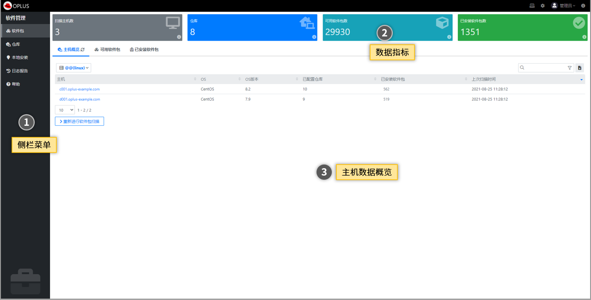

页面主要元素有：

1. 侧边栏：功能导航菜单

    - 软件包：软件包数据概览，可对软件包进行安装、升级、回滚、卸载
    - 仓库：统一配置管理Yum仓库
    - 本地安装：针对Yum仓库中不存在离线软件包进行安装
    - 日志报告：对于所有操作记录，详细记录，方便回溯

2. 数据指标：对于软件包扫描，统计可用软件包个数和已配置仓库个数
3. 主机概览：展示主机扫描、软件包安装、升级、回滚、卸载等详细信息

### 软件包

1. 主机概览

- 单台主机扫描详情

显示该主机已配置仓库详情，包括：
    - 仓库
    - 仓库名
    - 配置文件
    - 仓库地址
    - 仓库状态（启用、停用）
    
- 单台主机可用软件包
显示当前所选主机已配置仓库中可用软件包，选择复选框后可安装所选软件包
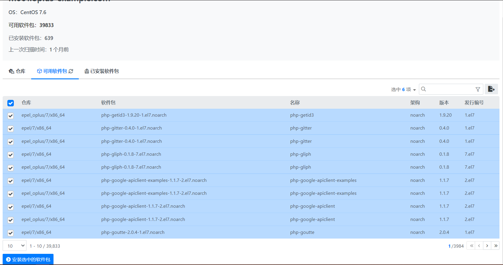
  
  
- 单台主机已安装软件包
显示当前已选择主机中已安装软件包，选择复选框后可卸载，升级，回退软件包

  
2. 可用软件包

显示所有已扫描主机可用软件包详细信息，包括：
    - 软件包名
    - 软件包架构
    - 软件发行号
    - 软件版本号
    - 软件状态(可用/不可用)
    - 软件包所属仓库
    - 扫描时间
   
3. 已安装软件包
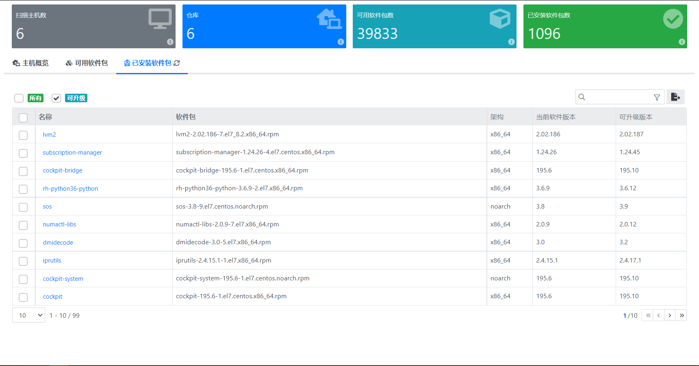
显示所有已扫描主机已安装软件包详细信息，包括：
    - 软件包名
    - 软件包架构
    - 软件包当前版本
    - 软件包可升级版本

### 仓库

> 软件仓库（Yum源）用于管理软件包，仓库中存放各种rpm的软件包以及软件包之间的依赖关系。每台主机上都可以配置自己的仓库，为避免仓库混乱，
> 建议使用统一的基准仓库。建议为每个操作系统版本配置一台基准主机，上面配置好适用于该系统版本的仓库。系统将扫描基准主机上的仓库配置信息，
> 做为基准仓库。

1. 基准仓库：为所配置基准主机中扫描的已配置的仓库详细信息，包括：

- 仓库ID
- 基准主机
- 系统版本
- 仓库配置文件
- 软件仓库所包含软件数量
- 软件仓库所包含软件大小
- 软件仓库配置地址
- 软件仓库状态：启用/停用
- 软件仓库更新时间：yum仓库更新时间
- 软件仓库信息更新时间：扫描仓库时间

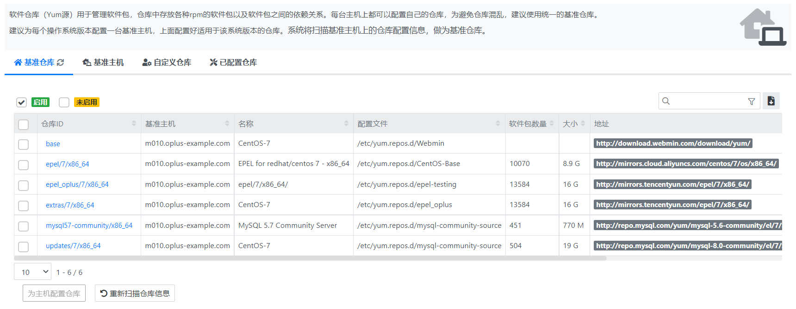

2. 基准主机：为不同操作系统配置适合的软件仓库，将该主机设定为基准主机、


3. 自定义配置仓库：可以自定义配置软件仓库

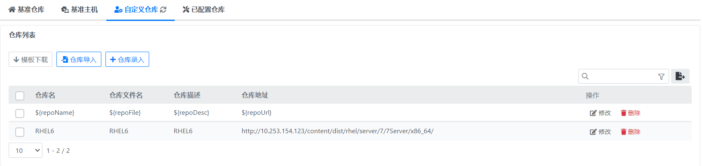

4. 已配置仓库：显示已扫描主机上所有已配置的软件仓库

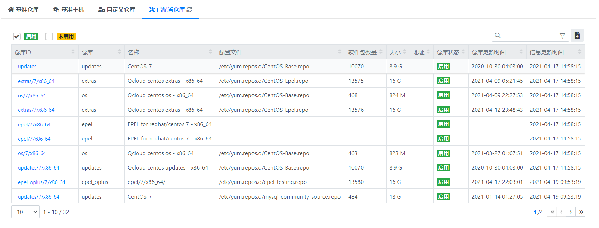

### 快照管理

快照是指对主机当前的状态做一个备份，系统支持对主机的软件包进行快照管理。当系统做一个快照时，会记录主机所安装的软件和版本。
在后面可以恢复这个快照，把主机的软件恢复到快照的版本。系统支持对一台主机做多个快照。

快照管理列表，列出了所有进行过快照的主机，以及快照的数量。


创建新的快照。选择快照内容为“已安装软件包”，点击按钮【开始创建快照】将为主机创建新的快照。


选择一个快照，会列出该快照的时间、内容，选择”已安装软件包“，点击按钮【从该快照回滚】，主机上的软件包将恢复为快照的版本。
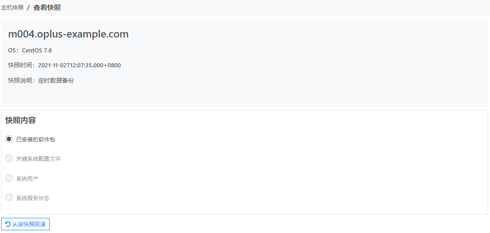

### 本地安装

对于不在Yum源中的软件包，可以选择从本地安装。

OpenSSH软件编译和打包在线下完成，软件的升级安装通过平台完成，流程如图。
以RedHat 6系统的OpenSSH为例，RedHat 6的生命周期已经结束，厂商不提供8.6p1-1版本的升级包。通过官方源码编译打包成openssh-8.6p1-1.el6.x86_64.rpm，在平台进行安装。


### 日志报告

在左侧导航栏选择【日志报告】按钮，进入日志页面,包括如下：


用户以下的操作记录，会被系统记录保存：

- 软件包扫描
- 软件包安装
- 软件包卸载、更新、升级、回滚
- 配置基准仓库，扫描基准仓库信息
- 配置基准主机
- 本地软件包安装


## 设置和管理 

### 权限配置

|         | 匿名用户 | 登录用户 | 软件包模块管理员 |
|---------|------|------|----------|
| 查看软件包   | -    | Y    | Y        |
| 查看Yum仓库 | -    | Y    | Y        |
| 软件包安装   | -    | -    | Y        |
| 软件包升级   | -    | Y    | Y        |
| 软件包卸载   | -    | -    | Y        |
| Yum仓库配置 | -    | -    | Y        |
| Yum仓库删除 | -    | -    | Y        |
| 查看日志报告  | -    | Y    | Y        |


## 常见问题 


# CI/CD 

CICD，全称为持续集成（Continuous Integration）、持续交付（Continuous Delivery）和持续部署（Continuous Deployment）。它代表了在软件开发过程中的一种协作方法论，旨在通过自动化和频繁地集成、构建、测试和部署软件来提高软件交付的速度和质量。

主要功能：

- **发布配置**：支持创建不同环境下的不同应用, 并且预定义应用将发布到的主机, 构建制品的代码仓库, 及代码检出前后执行操作, 文件过滤, 部署/存储路径, 存储版本, 及当前应用环境发布制品是否需要审核
- **发布申请**：用户可以申请不同应用环境的应用发布, 制品代码仓库支持选择 Git 仓库 [分支-Commit/标签], 
- **参数配置**：参数配置包含 Git 仓库的配置及应用环境配置


## 快速入门 

**步骤1：进行 Git 仓库及环境配置**

首先从左侧菜单栏单击参数配置选项 如下图进入配置界面


在参数配置中, 单击右上角新建按钮, 在弹出的对话框中填写页面所展示的字段, 如下图


所有字段确认填写无误后单击保存按钮即可

在提示保存成功且列表中存在刚刚新增的记录后, 点击该条记录右侧操作栏的刷新按钮, 等待初始化, 该操作可能需要一定时间

接下来进行环境配置


在环境配置中, 单击右上角新建按钮, 在弹出的对话框中填写页面所展示的字段, 如下图


所有字段确认填写无误后单击保存按钮即可

**步骤2：进行应用发布配置**

首先从左侧菜单栏单击发布配置选项 如下图进入配置界面


在应用管理中, 单击右上角新建按钮, 在弹出的对话框中填写页面所展示的字段, 如下图


保存完成后 单击列表中的发布配置按钮

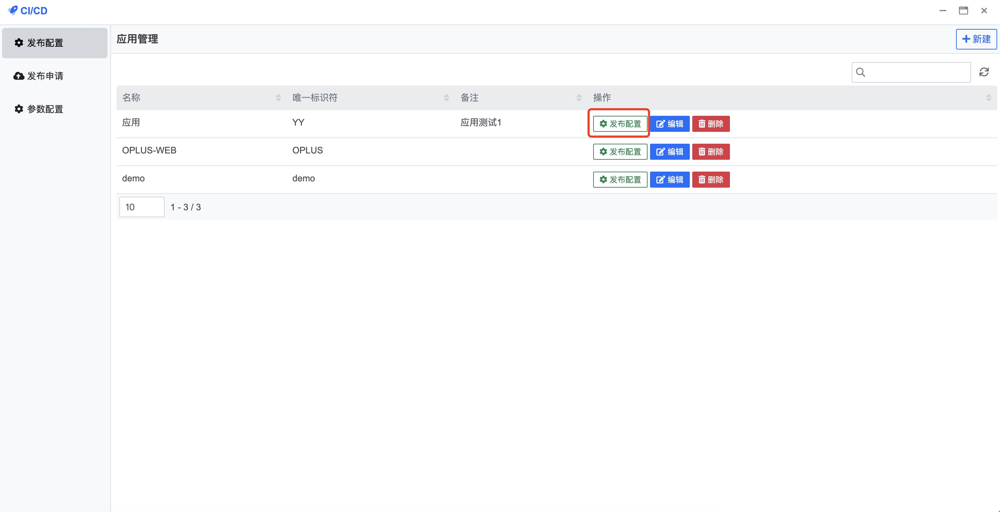

在弹出列表页面中, 单击右上角新建按钮


在弹出对话框中填写页面所展示的字段, 如下图

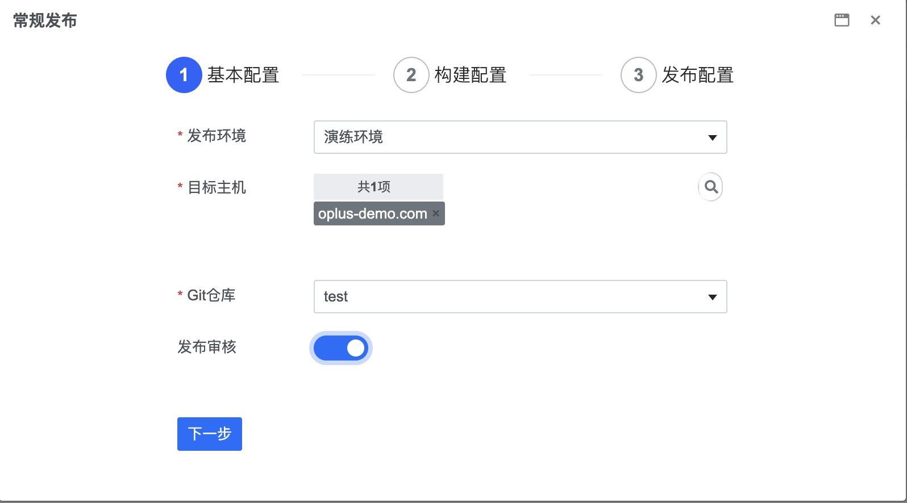
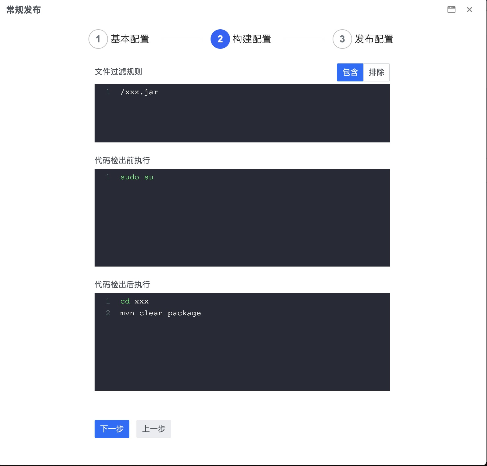


填写完毕单击保存按钮即可

**步骤3：填写应用发布申请**

首先从左侧菜单栏单击发布申请选项 如下图进入列表界面

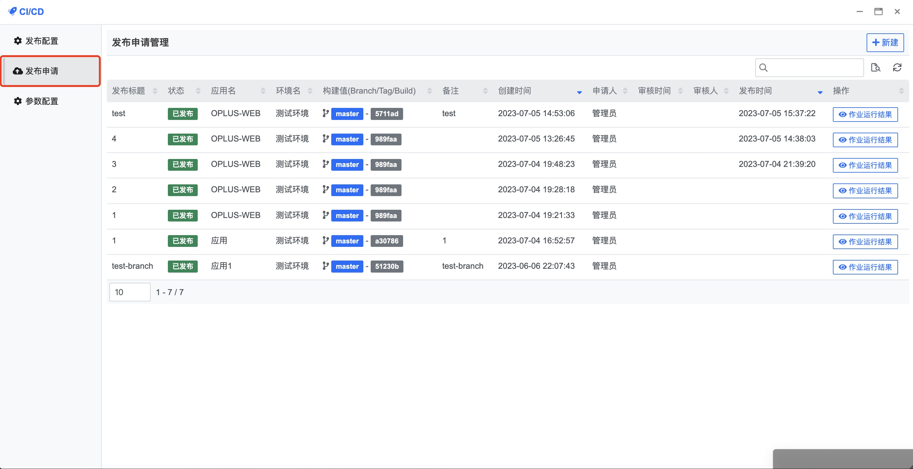

在发布申请中, 单击右上角新建按钮, 在弹出的对话框中填写页面所展示的字段, 如下图


填写完毕后单击保存按钮, 若选择的应用环境无需审核, 在列表中单击发布按钮即可执行发布任务, 如下图


若需要审核, 等待管理员审核通过后, 再进行上图操作即可


## 使用指南 

### 功能概要

CI/CD 主要功能包括应用构建发布的配置及发布的申请。

CI/CD 界面如下图：


### 发布配置

在左侧栏导航点击[发布配置]，如当前存在应用, 单击列表右侧[发布配置]按钮，进入发布配置列表, 如不存在应用, 单击右上角[新建]按钮新建应用


### 发布申请

在左侧栏导航点击[发布申请]，单击右上角[新建]按钮可以创建新应用发布申请, 单击列表内[作业运行结果]可以查看发布进度


### 参数配置

在左侧栏导航点击[参数配置]，进入参数配置页面

 - **Git 仓库配置**： 

在[参数配置]页面顶部 Tab 页进入[Git 仓库配置]页面


 - **环境配置**： 

在[参数配置]页面顶部 Tab 页进入[环境配置]页面


## 设置和管理 

### 权限配置

|        | 匿名用户 | 登录用户 | 管理员 |
|--------|------|------|---------|
| Git 仓库配置 | -    | -    | Y       |
| 环境配置 | -    | -    | Y       |
| 应用配置 | -    | -    | Y       |
| 应用发布配置 | -    | -    | Y       |
| 发布申请 | -    | Y    | Y       |
| 发布审核 | -    | -    | Y       |


## 常见问题 


# 网络自动化 

网络自动化支持自动采集华为、CISCO的网络设备信息，并支持对设备的配置进行修改。

主要功能：

- **设备信息采集**：支持批量的网络设备基本信息采集，包括设备基本信息、接口信息、ACL配置信息、用户信息等。
- **设备配置变更**：支持批量的修改、调整网络设备的配置，包括ACL配置、interface配置、用户配置等。
- **工单审核**：在提交修改设备配置申请后，自动生成配置修改的申请单，需要管理员审批后，修改配置操作才会执行。
- **执行记录**：可查看网络自动化的相关操作的记录。


## 快速入门 

我们在这里通过几个示例来演示网络自动化的基本功能。

### 示例：信息采集

**说明**

在这个示例，我们将对网络设备进行信息采集

**步骤1：查看网络设备信息**

登录系统，选择网络自动化应用，进入网络自动化首页，查看网络设备信息。
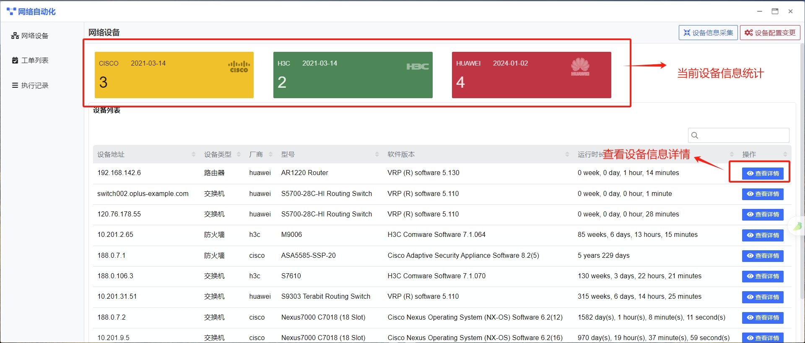

在设备信息列表中点击【查看详情】按钮，可查看设备详情


**步骤2：网络设备信息采集**
在首页上点击【设备信息采集】按钮，进入设备信息采集界面。选择需要采集的设备，然后点击【开始执行】按钮，系统会自动将任务下发，执行设备信息采集。同时可以在执行记录中查看到该操作的执行日志。


网络设备信息采集当前支持采集设备基本信息(设备类型、厂商、型号、软件版本、运行时长、磁盘空间、内存信息)，设备接口信息、路由列表、ACL配置信息、用户配置信息、系统配置信息、相邻的设备信息。

### 示例：网络设备配置变更

**说明**

在这个示例，我们会扫描出所选择主机中存在漏洞的信息，通过这个示例，可以对以下内容有一个初步了解：
在这个示例，我们会修改网络设备的配置，通过这个示例，可以对一下内容有一个初步了解：

- 如何修改网络设备的配置
- 支持修改网络设备的哪些配置

**步骤1：选择需要修改配置的设备，填写设备配置修改申请单**

登录系统，选择网络自动化应用，进入网络自动化首页，在首页中点击【设备配置变更】按钮，进入设备配置信息修改申请界面。

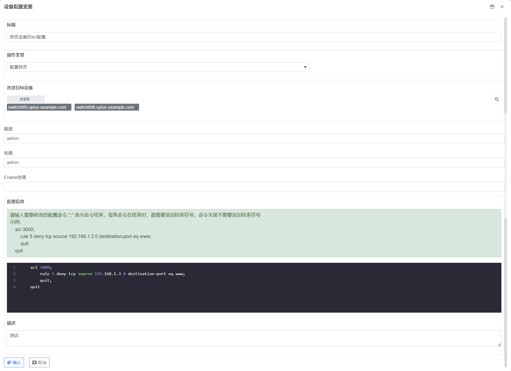

**申请单信息说明**

   - **标题(必填):** 申请单标题，用来概括本次申请变更的范围。
   - **操作类型(必填):**
        - **查询设备信息:** 自定义查询指定设备的信息，并更新平台中的设备信息
        - **配置修改:** 修改设备的相关配置信息，更改成功后，自动更新平台中的设备信息
   - **选择目标设备(必填):** 选择需要修改、查询的设备。
   - **账号(选填):** 填写连接设备的账号信息。
   - **密码(选填):** 填写连接设备的密码信息。
   - **Enable密码(选填):** 填写连接设备的特权密码信息。
   - **配置信息(必填):** 填写需要修改配置的相关命令，填写需要查询信息的相关命令。
       - **例：修改设置设备的ACL**
    
        `  acl 3000;
            rule 5 deny tcp source 192.168.1.3 0 destination-port eq www;
            quit;
         quit`
        
       - **例：查询设备的配置信息**
         `display current-configuration
   `
   - **描述(选填):** 填写申请单的描述。

信息填写完毕，点击【确认】按钮，提交网络设备变更申请。

**步骤2：申请单审核**
提交申请后，会自动生成配置修改申请单，通过左侧导航栏【工单列表】中可以查看当前需要审核的工单信息。

**申请单状态说明：**
   - **待审批:** 等待管理员审批。
   - **审批拒绝	:** 管理员拒绝此配置修改。
   - **手动终止	:** 管理员手动终止流程，配置变更未完成。
   - **执行失败	:** 管理审批通过后，平台自动执行变更操作失败。
   - **已完成:** 管理审批通过后，平台自动执行变更操作成功。

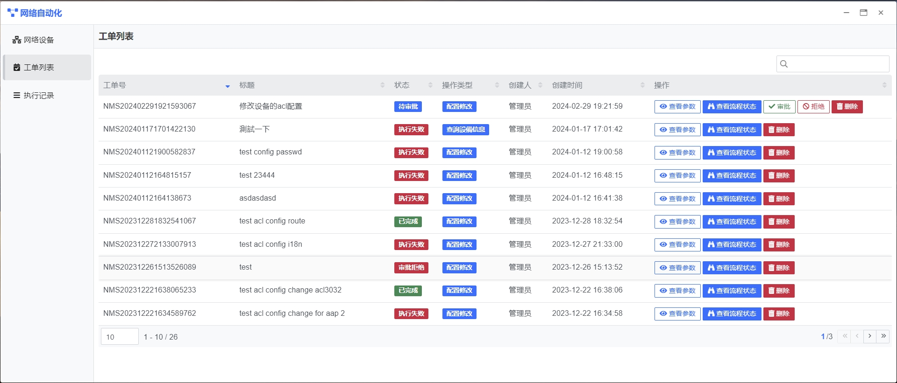

设备配置修改需要管理员审核通过后才会执行，在【工单列表】中，管理员可以选择审核通过、拒绝、查看参数、查看流程状态。
  - **审核通过：** 申请被管理员通过后，平台会根据申请单的信息，自动执行配置修改操作。
  - **拒绝：** 申请被管理员拒绝，申请流程终止。
  - **查看申请参数：** 管理员可查看申请单的详情。
  - **查看流程状态：** 管理员可查看当前申请对应的流程的具体状态。
 
 **查看申请参数**


**查看流程状态**  
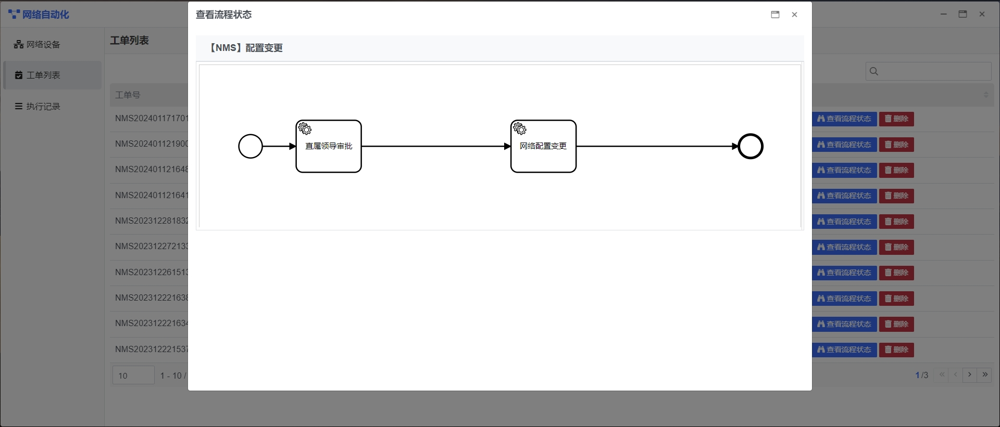  
  
 
### 示例：查看操作日志
通过左侧菜单栏【执行记录】可以查看网络自动化模块的执行记录，包括设备信息采集，设备配置变更等。

**查看操作记录**


**查看记录详情**  


## 使用指南 

### 功能概要

网络自动化主要功能包括设备信息展示、采集、设备配置信息修改等。


网络自动化界面如下图：

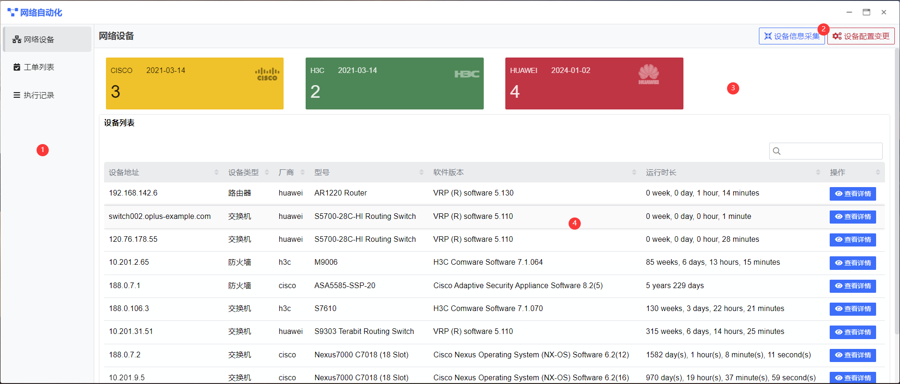

页面主要元素有：

1. 侧边栏：功能导航菜单

  - 网络设备：查看网络设备信息，对网络设备进行信息采集及配置修改
  - 工单列表：查看申请单信息，并审核配置修改的申请单
  - 执行记录：记录网络自动化的执行操作，支持查看操作详情

2. 功能操作：设备信息采集、设备配置变更
3. 数据指标：根据厂商类型分类统计当前的网络设备数量
4. 设备列表：显示设备信息列表

### 设备信息采集

在左侧栏导航点击【网络设备】，左上角点击【设备信息采集】按钮，进入设备选择界面


选择需要采集得设备信息，点击【确认】按钮执行设备信息采集。

执行完成后，在网络自动化首页可以看到所有执行过设备信息采集得网络设备的基础信息，包括：

- 设备地址
- 设备类型
- 厂商
- 型号
- 软件版本
- 运行时长

点击表格操作栏中的【查看详情】按钮，可进入详情查看页面，进入设备详细页面后，可看到如下信息：

- 设备基本信息（设备类型、厂商、型号、软件版本、运行时长、磁盘空间、内存大小）
- 接口列表
- 路由列表
- ACL配置
- 用户配置
- 系统配置
- 相邻的设备信息


### 设备配置变更

在左侧栏导航点击【网络设备】，左上角点击【设备配置变更】按钮，进入设备配置变更申请界面


**网络设备的配置变更需要管理员审核，管理员审核通过后才会执行本次修改配置的申请**

设备配置变更操作类型：

- **查询设备信息**： 查询指定设备的信息，查询的信息范围根据配置信息中输入的命令来返回。
  **示例**:
   
  `display version ##则返回设备基本信息`
  
  `display current-configuration ##返回当前配置`
- **配置修改**：修改指定设备的配置，修改范围根据配置信息中输入的命令来对设备配置进行调整
  
  **示例:**
  ***注意: 配置修改都是在管理界面中进行，所以在配置修改后，需要通过quit或者exit退出管理界面****
  - 修改ACL
  `acl 3000;
        rule 5 deny tcp source 192.168.1.3 0 destination-port eq www;
        quit;
   quit`
  - 新增用户
  `aaa;
      local-user test password cipher test; ##创建用户并设置密码
      local-user test privilege level 15;  ##设置用户权限
      local-user test service-type telnet terminal ssh; ##设置用户支持的登录方式
      exit;
   exit
  `

### 工单审核

在左侧导航栏选择【工单列表】按钮，进入工单审核界面，工单审核界面会展示所有的设备配置变更申请的记录，包含信息如下：


- 工单号
- 标题
- 状态
- 操作类型
- 创建人
- 创建时间

设备配置变更申请提交后，管理审批通过后，平台会自动执行配置修改的操作。在执行过程中，管理员可以手动终止执行流程。
审批拒绝后，申请流程终止，设备配置变更不会自动执行。
流程得执行结果可在【执行记录】中查看


### 执行记录

在左侧导航栏选择【执行记录】，进入执行日志页面,包括如下：


- **操作记录**：记录所有的设备信息采集，设备信息变更的操作。

可以点击记录中的状态栏查看执行详情


## 设置和管理 

### 权限配置

|        | 匿名用户 | 登录用户 | 网络自动化管理员 |
|--------|------|------|---------|
| 查看设备信息 | -    | Y    | Y       |
| 设备信息采集 | -    | Y    | Y       |
| 设备信息变更申请 | -    | Y    | Y       |
| 设备信息变更申请审核 | -    | -    | Y       |
| 查看日志报告 | -    | Y    | Y       |


## 常见问题 

### 选择网络设备
Q：在执行设备信息采集、设备信息变更的时候，选取不到需要执行的网络设备？  
A：首先，需要在将设备信息录入到平台的【资产管理】中，并在资产管理中对网络设备进行纳管。具体操作可查看资产管理文档。

### 网络设备纳管
Q：该如何纳管网络设备？   
A：首先，将网络设备的信息录入到平台的【资产管理】中。然后，在【资产管理】中选择【自动化配置】，对网络设备进行纳管。                     。


#  密码管理 


密码管理可以对Linux操作系统的密码进行统一管理，当需要使用高权限账户时，系统生成临时密码，在使用到期后自动回收。

满足定期修改密码和应急临时使用密码的需求。


- **批量修改主机的指定帐户密码**
- **支持灵活的密码策略，包括密码长度、复杂度**
- **支持手工指定密码或系统随机生成密码**
- **定期自动回收密码，保证用户只能在特定时间段内使用**


## 快速入门 

{在这里说明快速入门示例的用途，达到的效果}

**步骤1：步骤概要**

步骤详细描述

**步骤2：步骤概要**


## 使用指南 

基本流程如下：

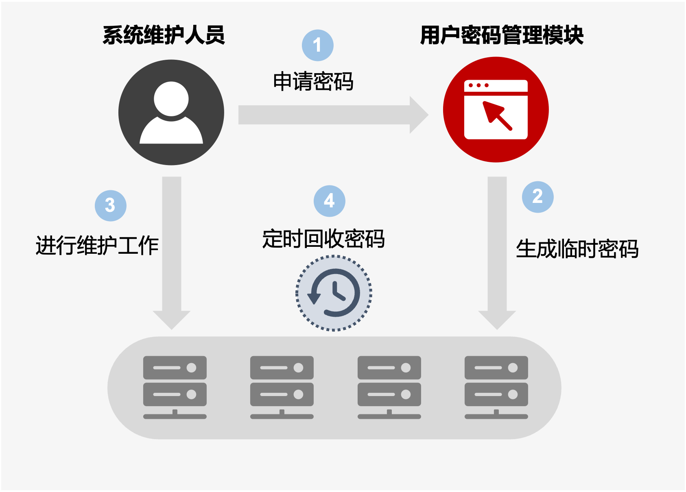


### 申请审批


#### 临时密码申请

临时密码申请页面用于普通用户申请临时密码


***功能说明***

- 申请临时密码：运维人员填写临时密码申请单，待管理员审核通过之后，系统会根据申请单中的主机、账号生成临时密码，供普通用户使用。
- 批量申请临时密码：用于申请多台主机、多个不同账号的密码
- 进入管理员面板：管理员面板入口，只有具备密码管理管理员角色的用户可见


***表格操作列按钮说明（从左至右）***

- 编辑：编辑选中申请单，只有状态为**待提交**的申请单可以编辑

- 提交申请：提交申请单，提交之后状态会更新为**已提交**

- 审批：**管理员**可以处理状态为**已提交**的申请单，通过审批之后将会根据申请单中的主机、账号生成临时密码，申请单状态将会更新为**密码已生成**。拒绝审批申请单状态将会更新为**已拒绝**，已拒绝的申请单无法再次编辑。

- 查看临时密码：申请人可以通过此按钮查看状态为**密码已生成**的主机账号密码

- 删除：删除申请单，只有状态为**待提交**的申请单可以删除

  

#### 管理员面板

管理员可以在此页面管理主机账号密码


***功能说明***

- 返回：回到临时密码申请页面

- 批量修改：批量修改指定主机账号的密码

- 选择修改：通过选择表格中的条目，修改指定的主机账号密码

- 检查密码状态：将系统中保存的账号密码与主机上的账号密码进行对比，确认系统中保存的密码是否可用

- 重置密码：根据密码重置策略，使用初始密码或者生成随机密码重新设置主机上的账号密码

- 账号密码导出：导出系统管理的主机账号密码

- 导入初始密码：将需要修改的密码信息，按模板填写并上传。系统将根据文件中的信息，批量修改对应主机的用户密码。修改后的密码作为初始密码

- 模板下载：下载初始密码导入模板

  

### 参数配置

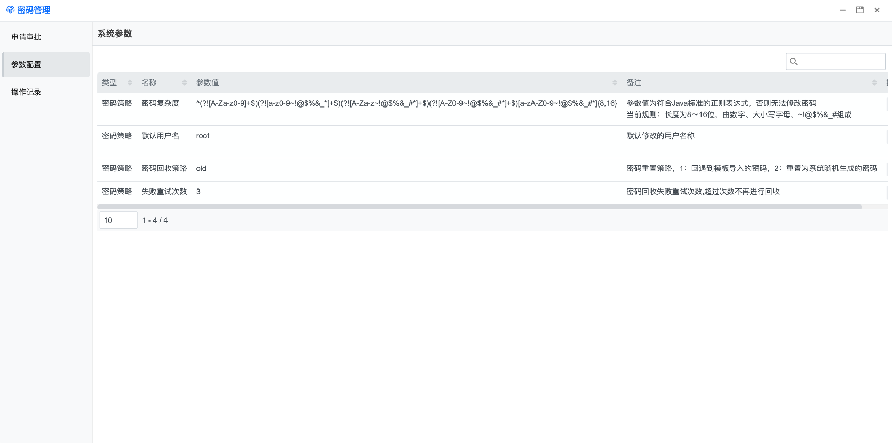

### 操作记录


## 设置和管理 

### 配置1名称（不超过10个字）

### 配置2名称（不超过10个字）


## 开发指南 

如果模块涉及API、脚本、函数等需要一定编程、配置等开发知识的内容，可以放在开发指南。


## 常见问题 


# RHEL装机 

RHEL装机功能是为项目中不同团队申请机器资源提供的场景, 提供装机清单的工单申请,流程审批及装机任务的下发

主要功能：

- **装机申请**：提供装机清单的申请工单填写, 不同团队可以在流程的不同节点填写本团队相关参数
- **历史工单**：可以查看历史执行的工单及对应状态
- **虚拟机列表**：可以查看当前已配置的 vCenter 中的所有虚拟机列表
- **参数配置**：包含 vCenter Server 的配置
- **运行记录**：可以查看历史装机作业的运行记录


## 快速入门 

**步骤1：进行 vCenter Server 配置**

首先从左侧菜单栏单击[参数配置]选项 如下图进入配置界面

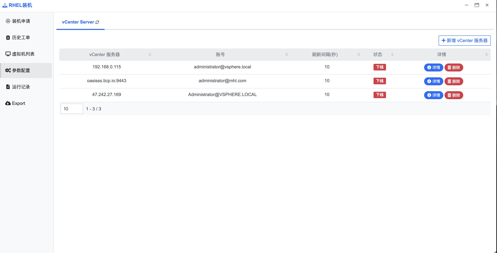

在参数配置中, 单击右上角[新增 vCenter 服务器]按钮, 在弹出的对话框中填写页面所展示的字段, 如下图

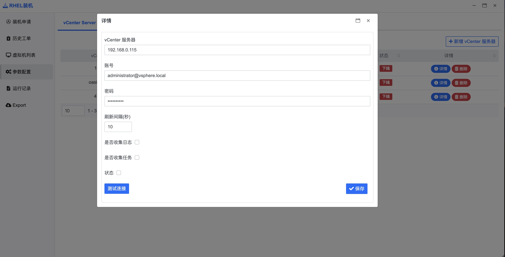

所有字段确认填写无误后单击[测试连接]按钮, 若提示连接成功, 单击[保存]按钮即可, 若连接失败或超时, 请检查服务器及账号密码是否有误, 或服务器相应端口/防火墙策略未打开或放行

在提示保存成功且列表中存在刚刚新增的记录后, 查看该条记录状态为上线即为新增成功

**步骤2：填写装机申请工单**

首先从左侧菜单栏单击[装机申请]选项 如下图进入配置界面

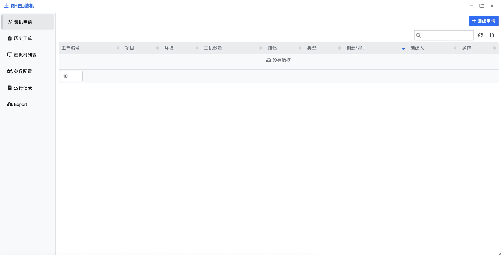

在[装机申请]中, 单击右上角[创建申请]按钮, 在弹出的对话框中填写工单展示的所有必填/选填字段, 如下图


提交完成后 不同团队会根据流程流转进度在列表内展示工单, 该团队相关人员可以填写关联字段, 并根据工单其他字段决定是否审批该工单并流转到下一流程步骤

当所有团队完成该工单后, 流程将根据该工单自动下发装机任务, 工单详细参数/装机任务运行状态及流程运行状态可以在历史工单中查看


## 使用指南 

### 功能概要

RHEL装机 主要功能包括装机工单填写及审批, 装机任务下发, 虚拟机列表及 vCenter Server 配置。

RHEL装机界面如下图：


### 装机申请

在左侧栏导航点击[装机申请]，单击右上角[创建申请]按钮新建工单


工单部分字段如下图所示


### 历史工单

在左侧栏导航点击[历史工单]，单击列表内[查看参数]可以查看工单详情, 单击列表内[流程执行状态]可以查看当前工单流程状态


### 虚拟机列表

在左侧栏导航点击[虚拟机列表]，进入虚拟机列表页面


### 参数配置

在左侧栏导航点击[参数配置]，进入参数配置页面


## 设置和管理 

### 权限配置

|        | 匿名用户 | 登录用户 | 管理员 |
|--------|------|------|---------|
| 工单申请 | -    | Y    | Y       |
| 工单审批 | -    | -    | Y       |
| 历史工单查看 | -    | Y    | Y       |
| 虚拟机列表 | -    | Y    | Y       |
| 参数配置 | -    | -    | Y       |
| 运行记录 | -    | Y    | Y       |


## 常见问题 


# 安全监测 

对Linux作业系统上的使用者和档进行风险监测

主要功能：

- **用户行为监测**：监测用户行为，包括用户新增、删除、非root用户UID为0、用户权限变更、非工作时间登录、用户登录失败等
- **系统文件监测**：监测系统文件，包括系统文件新增、删除、修改、文件权限变更、文件内容变更等（基于aide工具扫描）


## 快速入门 

我们在这里通过几个示例来演示安全监测基本功能。

### 示例：用户监测

**说明**

在这个示例，我们将对如何使用用户监测有一个基本的了解

**步骤1：参数配置**

登录系统，进入`http://{oplus_url}/oplus/base/#/applets/sfm`，页面进入安全监测首页，
在左侧导航栏选择【参数配置】按钮，进入参数配置页面，进入用户监测配置页面，可以看到如下配置项：


点击【选择】按钮，选择需要进行用户监测的主机

输入执行时间，例如：22:00（建议在夜间低频时段）

选择执行周期，可以选择【每隔一天】、【每隔三天】、【每隔一周】、【每隔一个月】

工作时间配置，指定工作时间段，例如：8:00-18:00

保存以上配置后，会根据设定的周期和工作时间进行用户监测

**步骤2：手动扫描**

在左侧导航栏选择【用户监测】按钮，进入用户监测页面，点击右上角【用户风险检查】按钮，系统会立即进行用户监测

### 示例：文件监测

**说明**

在这个示例，我们将对如何使用文件监测有一个基本的了解

**步骤1：参数配置**

登录系统，进入`http://{oplus_url}/oplus/base/#/applets/sfm`，页面进入安全监测首页，
在左侧导航栏选择【参数配置】按钮，进入参数配置页面，进入文件监测配置页面，可以看到如下配置项：


点击【选择】按钮，选择需要进行用户监测的主机

输入执行时间，例如：22:00（建议在夜间低频时段）

选择执行周期，可以选择【每隔一天】、【每隔三天】、【每隔一周】、【每隔一个月】

保存以上配置后，会根据设定的周期和工作时间进行文件监测

其他配置包括：aide保持默认配置即可

**步骤2：手动扫描**

在左侧导航栏选择【文件监测】按钮，进入文件监测页面，点击右上角【文件风险检查】按钮，系统会立即进行文件监测


## 使用指南 

### 功能概要

对Linux作业系统上的使用者和档进行风险监测

### 首页

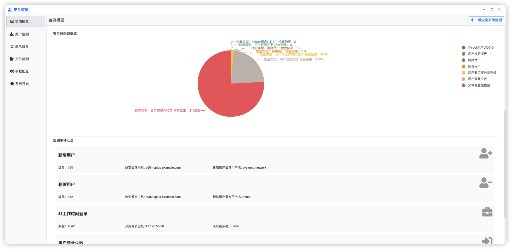

### 用户扫描

在左侧导航栏选择【用户监测】按钮，进入用户监测页面，点击右上角可以手动发起用户风险检查

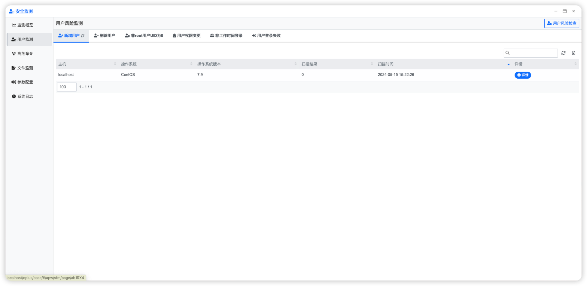

### 文件扫描

在左侧导航栏选择【文件监测】按钮，进入文件监测页面，点击右上角可以手动发起文件风险检查

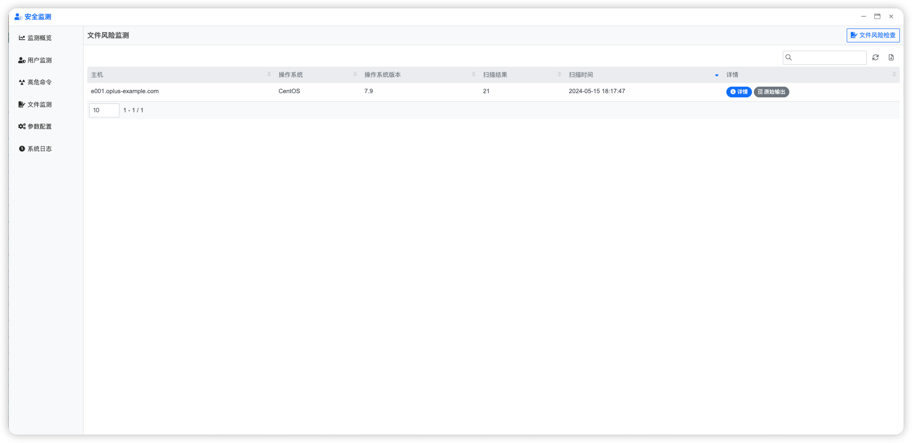

### 参数配置

在左侧导航栏选择【参数配置】按钮，进入参数配置页面，可以配置用户监测和文件监测的相关参数


### 日志报告

在左侧导航栏选择【系统日志】按钮，进入系统日志页面，可以查看用户监测和文件监测的日志报告


## 设置和管理 

### 权限配置

|        | 匿名用户 | 登录用户 | 安全监测模块管理员 |
|--------|------|------|-----------|
| 查看用户扫描 | -    | Y    | Y         |
| 查看文件扫描 | -    | Y    | Y         |
| 执行用户扫描 | -    | -    | Y         |
| 执行文件安装 | -    | -    | Y         |
| 系统参数配置 | -    | Y    | Y         |
| 查看日志报告 | -    | Y    | Y         |


## 常见问题 

### 扫描原理
Q：扫描的原理是什么？  
A：基于和上一次扫描的结果进行比对，如果有变化则报警。

### 扫描频率
Q：是类似监控吗？  
A：OPSmind 底层执行engine基于aap（ansible），由于aap（ansible）采用SSH协议，所以不适合频繁扫描，建议扫描频率设置为每天一次。

### 系统性能
Q：执行这些监测的时候，会不会影响系统性能？   
A：用户行为扫描基本不会影响系统性能，但是文件扫描（基于aide工具）会影响系统性能，建议在夜间低频时段执行。


# 软件包管理 

软件管理支持企业常用Linux，包括RHEL，CentOS进行软件包和Yum仓库管理。

主要包括四个功能模块：

- **软件包**：对主机进行软件包扫描，集中统一管理软件包安装、升级、卸载
- **Yum仓库**：主机进行软件仓库配置管理，统一管理Yum镜像源和配置
- **本地安装**：对离线软件包进行安装
- **日志记录**：对所有的操作记录详细的日志记录

为解决软件在安装、升级、卸载时带来的风险性和复杂性，平台将软件包同镜像源统一管理起来，方便统一更换镜像源或批量对主机进行软件操作，通过软件包管理。


## 快速入门 

我们在这里通过几个示例来演示补丁管理基本功能。

### 示例：Yum仓库

**说明**

在这个示例，我们将对配置Yum仓库有一定的了解

**步骤1：选择基准主机**

登录系统，进入`http://{oplus_url}/oplus/base/#/applets/spm`，页面进入软件包管理首页，
在左侧导航栏选择【仓库】按钮，进入仓库管理页面，点击【基准主机】Tab按钮进入基准主机配置界面，点击【选择基准主机】按钮，将所选择的主机设定为基准
主机（基准主机的选定标准：涵盖所有已纳管主机的操作系统以及Yum仓库）。

**步骤2：扫描基准主机Yum仓库**

点击【基准仓库】Tab按钮进入基准仓库配置界面，点击底部的【重新扫描仓库信息】按钮，将对上一步骤中设定的基准主机进行扫描，将基准主机中所有设定的
Yum仓库扫描出来。

**步骤3：自定义仓库**

点击【自定义仓库】Tab按钮进入自定义仓库配置界面，点击【仓库录入】按钮或【仓库导入按钮】，按规定要求格式填写Yum仓库的配置信息导入，选择需要配置
Yum仓库的主机进行配置。

### 示例：软件包管理

在这个示例，我们将对软件包管理有一定的了解

**步骤1：扫描软件包**

在左侧导航栏选择【软件包】按钮，进入软件包管理页面，点击【主机概览】Tab按钮，点击底部【重新进行软件包扫描】按钮，选择所需扫描的主机，进行软件包扫描。

**步骤2：软件安装**

点击【可用软件包】Tab按钮，在可用软件包列表中搜索所需安装的软件包，支持同时为多台主机安装多个软件包。

**步骤3：软件升级**

点击【已安装软件包】Tab按钮，在已安装软件包列表中勾选可升级，列表显示当前安装软件的版本以及支持升级软件版本，选择所需升级的软件包进行升级。

**步骤4：软件卸载**

点击【已安装软件包】Tab按钮，在已安装软件包列表中勾选所需卸载的软件包，进行软件包卸载。


## 使用指南 

### 功能概要

软件包管理分为软件包管理，Yum仓库管理几个功能模块，具体执行流程如下图：


软件包管理界面如下图：


页面主要元素有：

1. 侧边栏：功能导航菜单

    - 软件包：软件包数据概览，可对软件包进行安装、升级、回滚、卸载
    - 仓库：统一配置管理Yum仓库
    - 本地安装：针对Yum仓库中不存在离线软件包进行安装
    - 日志报告：对于所有操作记录，详细记录，方便回溯

2. 数据指标：对于软件包扫描，统计可用软件包个数和已配置仓库个数
3. 主机概览：展示主机扫描、软件包安装、升级、回滚、卸载等详细信息

### 软件包

1. 主机概览

- 单台主机扫描详情

显示该主机已配置仓库详情，包括：
    - 仓库
    - 仓库名
    - 配置文件
    - 仓库地址
    - 仓库状态（启用、停用）
    
- 单台主机可用软件包
显示当前所选主机已配置仓库中可用软件包，选择复选框后可安装所选软件包

  
  
- 单台主机已安装软件包
显示当前已选择主机中已安装软件包，选择复选框后可卸载，升级，回退软件包

  
2. 可用软件包

显示所有已扫描主机可用软件包详细信息，包括：
    - 软件包名
    - 软件包架构
    - 软件发行号
    - 软件版本号
    - 软件状态(可用/不可用)
    - 软件包所属仓库
    - 扫描时间
   
3. 已安装软件包

显示所有已扫描主机已安装软件包详细信息，包括：
    - 软件包名
    - 软件包架构
    - 软件包当前版本
    - 软件包可升级版本

### 仓库

> 软件仓库（Yum源）用于管理软件包，仓库中存放各种rpm的软件包以及软件包之间的依赖关系。每台主机上都可以配置自己的仓库，为避免仓库混乱，
> 建议使用统一的基准仓库。建议为每个操作系统版本配置一台基准主机，上面配置好适用于该系统版本的仓库。系统将扫描基准主机上的仓库配置信息，
> 做为基准仓库。

1. 基准仓库：为所配置基准主机中扫描的已配置的仓库详细信息，包括：

- 仓库ID
- 基准主机
- 系统版本
- 仓库配置文件
- 软件仓库所包含软件数量
- 软件仓库所包含软件大小
- 软件仓库配置地址
- 软件仓库状态：启用/停用
- 软件仓库更新时间：yum仓库更新时间
- 软件仓库信息更新时间：扫描仓库时间


2. 基准主机：为不同操作系统配置适合的软件仓库，将该主机设定为基准主机、


3. 自定义配置仓库：可以自定义配置软件仓库


4. 已配置仓库：显示已扫描主机上所有已配置的软件仓库


### 快照管理

快照是指对主机当前的状态做一个备份，系统支持对主机的软件包进行快照管理。当系统做一个快照时，会记录主机所安装的软件和版本。
在后面可以恢复这个快照，把主机的软件恢复到快照的版本。系统支持对一台主机做多个快照。

快照管理列表，列出了所有进行过快照的主机，以及快照的数量。


创建新的快照。选择快照内容为“已安装软件包”，点击按钮【开始创建快照】将为主机创建新的快照。


选择一个快照，会列出该快照的时间、内容，选择”已安装软件包“，点击按钮【从该快照回滚】，主机上的软件包将恢复为快照的版本。


### 本地安装

对于不在Yum源中的软件包，可以选择从本地安装。

OpenSSH软件编译和打包在线下完成，软件的升级安装通过平台完成，流程如图。
以RedHat 6系统的OpenSSH为例，RedHat 6的生命周期已经结束，厂商不提供8.6p1-1版本的升级包。通过官方源码编译打包成openssh-8.6p1-1.el6.x86_64.rpm，在平台进行安装。


### 日志报告

在左侧导航栏选择【日志报告】按钮，进入日志页面,包括如下：


用户以下的操作记录，会被系统记录保存：

- 软件包扫描
- 软件包安装
- 软件包卸载、更新、升级、回滚
- 配置基准仓库，扫描基准仓库信息
- 配置基准主机
- 本地软件包安装


## 设置和管理 

### 权限配置

|         | 匿名用户 | 登录用户 | 软件包模块管理员 |
|---------|------|------|----------|
| 查看软件包   | -    | Y    | Y        |
| 查看Yum仓库 | -    | Y    | Y        |
| 软件包安装   | -    | -    | Y        |
| 软件包升级   | -    | Y    | Y        |
| 软件包卸载   | -    | -    | Y        |
| Yum仓库配置 | -    | -    | Y        |
| Yum仓库删除 | -    | -    | Y        |
| 查看日志报告  | -    | Y    | Y        |


## 常见问题 


# 用户管理 

用户管理支持企业常用Linux，包括RHEL，CentOS，SUSE等，可以将Linux上的用户统一进行管理。

主要功能：

- **采集Linux上的用户和用户组信息**
- **批量维护用户和用户组、及时发现是否存在不合规用户账号**
- **批量重置密码、禁用、启用用户等常用操作**
- **自定义sudo权限模块，方便管理用户的使用权限**

用户管理通过可视化界面帮助管理员进行简单易用的操作，降低Linux用户的管理成本，提高工作效率。


## 快速入门 


## 使用指南 

### 总览

***总览页面通过图表的形式，使用不同维度的指标项，汇总展示当前系统管理的所有用户和用户组***

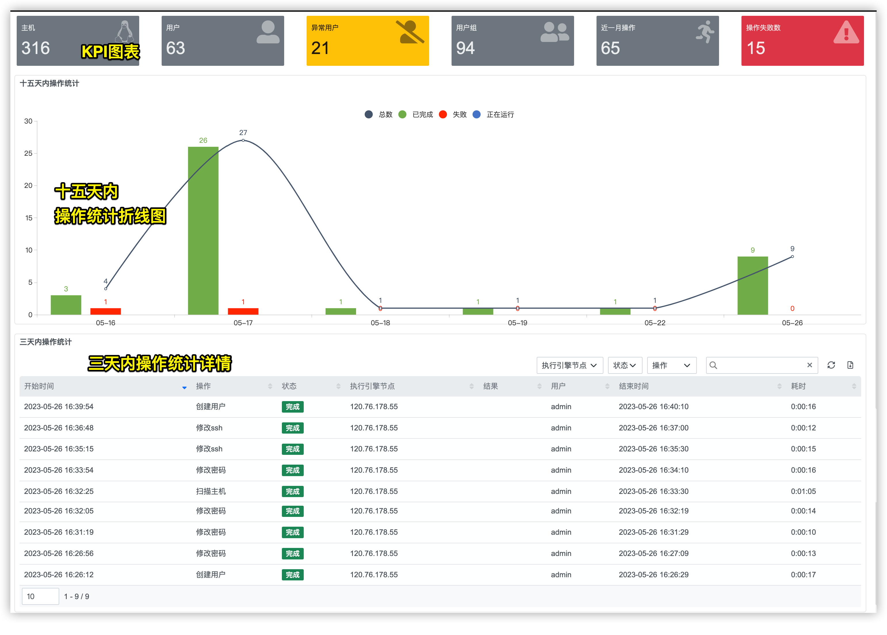

**KPI图表**

各指标业务含义如下：

- 主机：当前扫描用户成功的主机数量

- 用户：当前系统内所有用户名去重后的数量

- 异常用户：根据异常用户规则识别出来的异常用户数量

  > 异常用户规则
  >
  > 1（严重）普通用户UID，GID不允许为0
  >
  > 2（一般）Redhat5、6普通用户UID、GID不允许小于500，Redhat7、8普通用户UID、GID不允许小于1000
  >
  > 3（提示）用户登陆异常

- 用户组：当前系统内所有用户组名去重后的数量

- 近一月操作：用户管理模块最近一个月操作的数量

- 操作失败数：用户管理模块历史操作失败的数量

  

**十五天内操作统计**

最近一次操作的时间作为结束时间，往前十五天内的操作统计折线图


**三天内操作统计**

最近一次操作的时间作为结束时间，往前三天内的操作统计列表


### 用户

***用户页面可以进行用户扫描、批量创建、修改用户信息，以及提供详尽的用户信息列表***

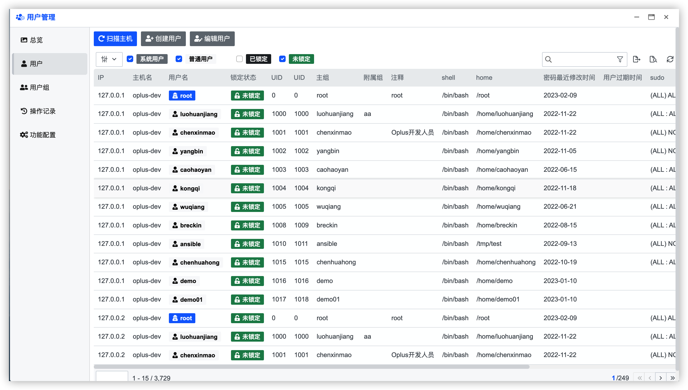


**用户信息列表**

展示当前已扫描成功的用户数据，可以根据IP、用户名、锁定状态、用户类型过滤


**扫描主机**

点击“扫描主机”按钮，打开弹窗，选择需要扫描用户的主机，点击“开始执行“后，系统会开始扫描选中主机上的用户和用户组信息。

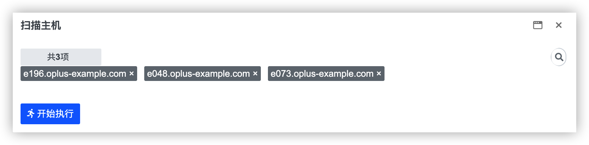


**创建用户**

点击“创建用户”按钮，打开弹窗。选中主机后，输入用户相关的信息，即可在对应主机上创建用户。

> 注意：主机、用户名和密码为必填项，其他参数为选填。


**编辑用户**

点击表格中用户名或者“编辑用户”按钮，都可以对用户进行编辑。


### 用户组

***用户组页面提供对用户组常用的一些操作***


### 操作记录

***操作记录展示了用户在用户管理里面的每次操作，方便回溯以及审计***

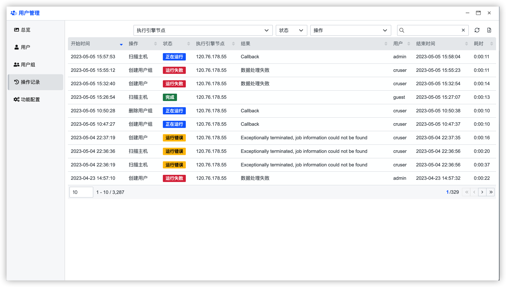


### 功能配置

***功能配置页面提供sudo模板和计划任务配置，方便管理sudo权限以及自定义扫描用户周期***

> sudo模板：一组sudo命令的集合，通过配置sudo模板可以方便配置不同用户的权限

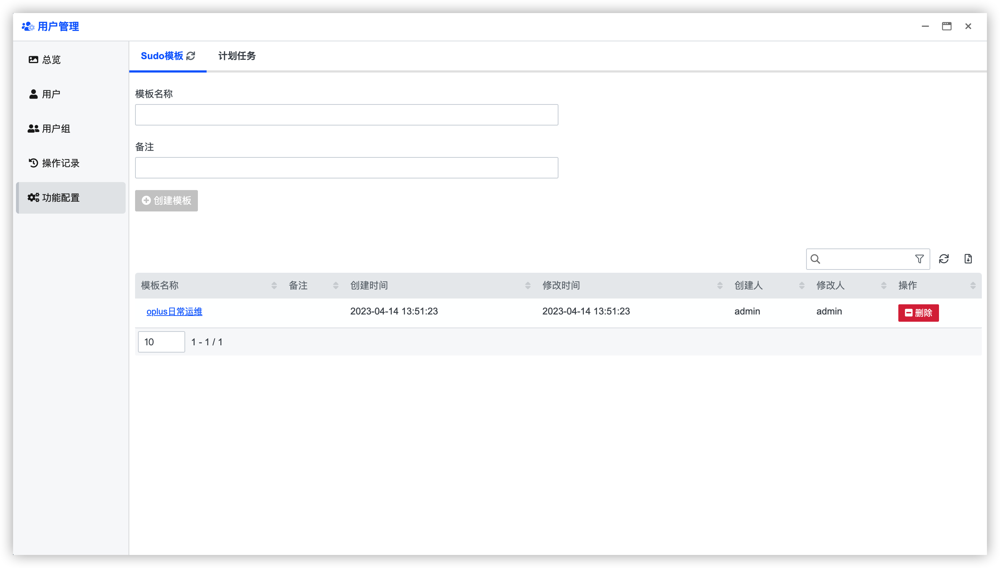


## 常见问题 


# 软件包管理 

软件管理支持企业常用Linux，包括RHEL，CentOS进行软件包和Yum仓库管理。

主要包括四个功能模块：

- **软件包**：对主机进行软件包扫描，集中统一管理软件包安装、升级、卸载
- **Yum仓库**：主机进行软件仓库配置管理，统一管理Yum镜像源和配置
- **本地安装**：对离线软件包进行安装
- **日志记录**：对所有的操作记录详细的日志记录

为解决软件在安装、升级、卸载时带来的风险性和复杂性，平台将软件包同镜像源统一管理起来，方便统一更换镜像源或批量对主机进行软件操作，通过软件包管理。


## 快速入门 

我们在这里通过几个示例来演示补丁管理基本功能。

### 示例：Yum仓库

**说明**

在这个示例，我们将对配置Yum仓库有一定的了解

**步骤1：选择基准主机**

登录系统，进入`http://{oplus_url}/oplus/base/#/applets/spm`，页面进入软件包管理首页，
在左侧导航栏选择【仓库】按钮，进入仓库管理页面，点击【基准主机】Tab按钮进入基准主机配置界面，点击【选择基准主机】按钮，将所选择的主机设定为基准
主机（基准主机的选定标准：涵盖所有已纳管主机的操作系统以及Yum仓库）。

**步骤2：扫描基准主机Yum仓库**

点击【基准仓库】Tab按钮进入基准仓库配置界面，点击底部的【重新扫描仓库信息】按钮，将对上一步骤中设定的基准主机进行扫描，将基准主机中所有设定的
Yum仓库扫描出来。

**步骤3：自定义仓库**

点击【自定义仓库】Tab按钮进入自定义仓库配置界面，点击【仓库录入】按钮或【仓库导入按钮】，按规定要求格式填写Yum仓库的配置信息导入，选择需要配置
Yum仓库的主机进行配置。

### 示例：软件包管理

在这个示例，我们将对软件包管理有一定的了解

**步骤1：扫描软件包**

在左侧导航栏选择【软件包】按钮，进入软件包管理页面，点击【主机概览】Tab按钮，点击底部【重新进行软件包扫描】按钮，选择所需扫描的主机，进行软件包扫描。

**步骤2：软件安装**

点击【可用软件包】Tab按钮，在可用软件包列表中搜索所需安装的软件包，支持同时为多台主机安装多个软件包。

**步骤3：软件升级**

点击【已安装软件包】Tab按钮，在已安装软件包列表中勾选可升级，列表显示当前安装软件的版本以及支持升级软件版本，选择所需升级的软件包进行升级。

**步骤4：软件卸载**

点击【已安装软件包】Tab按钮，在已安装软件包列表中勾选所需卸载的软件包，进行软件包卸载。


## 使用指南 

### 功能概要

软件包管理分为软件包管理，Yum仓库管理几个功能模块，具体执行流程如下图：


软件包管理界面如下图：


页面主要元素有：

1. 侧边栏：功能导航菜单

    - 软件包：软件包数据概览，可对软件包进行安装、升级、回滚、卸载
    - 仓库：统一配置管理Yum仓库
    - 本地安装：针对Yum仓库中不存在离线软件包进行安装
    - 日志报告：对于所有操作记录，详细记录，方便回溯

2. 数据指标：对于软件包扫描，统计可用软件包个数和已配置仓库个数
3. 主机概览：展示主机扫描、软件包安装、升级、回滚、卸载等详细信息

### 软件包

1. 主机概览

- 单台主机扫描详情

显示该主机已配置仓库详情，包括：
    - 仓库
    - 仓库名
    - 配置文件
    - 仓库地址
    - 仓库状态（启用、停用）
    
- 单台主机可用软件包
显示当前所选主机已配置仓库中可用软件包，选择复选框后可安装所选软件包

  
  
- 单台主机已安装软件包
显示当前已选择主机中已安装软件包，选择复选框后可卸载，升级，回退软件包

  
2. 可用软件包

显示所有已扫描主机可用软件包详细信息，包括：
    - 软件包名
    - 软件包架构
    - 软件发行号
    - 软件版本号
    - 软件状态(可用/不可用)
    - 软件包所属仓库
    - 扫描时间
   
3. 已安装软件包

显示所有已扫描主机已安装软件包详细信息，包括：
    - 软件包名
    - 软件包架构
    - 软件包当前版本
    - 软件包可升级版本

### 仓库

> 软件仓库（Yum源）用于管理软件包，仓库中存放各种rpm的软件包以及软件包之间的依赖关系。每台主机上都可以配置自己的仓库，为避免仓库混乱，
> 建议使用统一的基准仓库。建议为每个操作系统版本配置一台基准主机，上面配置好适用于该系统版本的仓库。系统将扫描基准主机上的仓库配置信息，
> 做为基准仓库。

1. 基准仓库：为所配置基准主机中扫描的已配置的仓库详细信息，包括：

- 仓库ID
- 基准主机
- 系统版本
- 仓库配置文件
- 软件仓库所包含软件数量
- 软件仓库所包含软件大小
- 软件仓库配置地址
- 软件仓库状态：启用/停用
- 软件仓库更新时间：yum仓库更新时间
- 软件仓库信息更新时间：扫描仓库时间


2. 基准主机：为不同操作系统配置适合的软件仓库，将该主机设定为基准主机、


3. 自定义配置仓库：可以自定义配置软件仓库


4. 已配置仓库：显示已扫描主机上所有已配置的软件仓库


### 快照管理

快照是指对主机当前的状态做一个备份，系统支持对主机的软件包进行快照管理。当系统做一个快照时，会记录主机所安装的软件和版本。
在后面可以恢复这个快照，把主机的软件恢复到快照的版本。系统支持对一台主机做多个快照。

快照管理列表，列出了所有进行过快照的主机，以及快照的数量。


创建新的快照。选择快照内容为“已安装软件包”，点击按钮【开始创建快照】将为主机创建新的快照。


选择一个快照，会列出该快照的时间、内容，选择”已安装软件包“，点击按钮【从该快照回滚】，主机上的软件包将恢复为快照的版本。


### 本地安装

对于不在Yum源中的软件包，可以选择从本地安装。

OpenSSH软件编译和打包在线下完成，软件的升级安装通过平台完成，流程如图。
以RedHat 6系统的OpenSSH为例，RedHat 6的生命周期已经结束，厂商不提供8.6p1-1版本的升级包。通过官方源码编译打包成openssh-8.6p1-1.el6.x86_64.rpm，在平台进行安装。


### 日志报告

在左侧导航栏选择【日志报告】按钮，进入日志页面,包括如下：


用户以下的操作记录，会被系统记录保存：

- 软件包扫描
- 软件包安装
- 软件包卸载、更新、升级、回滚
- 配置基准仓库，扫描基准仓库信息
- 配置基准主机
- 本地软件包安装


## 设置和管理 

### 权限配置

|         | 匿名用户 | 登录用户 | 软件包模块管理员 |
|---------|------|------|----------|
| 查看软件包   | -    | Y    | Y        |
| 查看Yum仓库 | -    | Y    | Y        |
| 软件包安装   | -    | -    | Y        |
| 软件包升级   | -    | Y    | Y        |
| 软件包卸载   | -    | -    | Y        |
| Yum仓库配置 | -    | -    | Y        |
| Yum仓库删除 | -    | -    | Y        |
| 查看日志报告  | -    | Y    | Y        |


## 常见问题 


# vCenter Manager 

vCenter Manager 功能提供了对团队 vCenter 资源的管理, 在配置好相关连接参数后实时刷新 vCenter 内的 <ESXi / Cluster / Datastore / VMs / Template / 告警 / 事件 / 任务> 等指标, 并支持根据 Template 创建/批量创建虚拟机的功能, 同时对 NSX服务器 也有部分支持

主要功能：

- **总览**：提供所有已配置的 vCenter Server 的统计指标, 如 <CPU / 内存 / 存储 / 告警 / 异常>, 并支持根据选择的 vCenter Server 查看统计指标
- **ESXi 主机与集群**：展示 ESXi 主机与集群的各项指标
- **虚拟机与模板**：展示虚拟机与模板的各项指标, 并支持对虚拟机进行开关机任务下发
- **告警**：展示告警信息
- **事件与任务**：展示事件与任务的信息
- **操作记录**：可以查看历史下发作业的运行记录
- **参数配置**：可以配置 vCenter Server 的各项参数


## 快速入门 

**步骤1：进行 vCenter Server 配置**

首先从左侧菜单栏单击[参数配置]选项 如下图进入配置界面

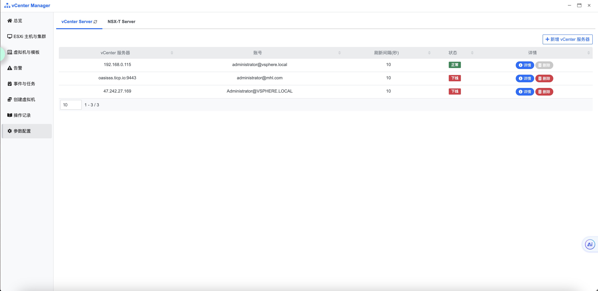

在参数配置中, 单击右上角[新增 vCenter 服务器]按钮, 在弹出的对话框中填写页面所展示的字段, 如下图


所有字段确认填写无误后单击[测试连接]按钮, 若提示连接成功, 单击[保存]按钮即可, 若连接失败或超时, 请检查服务器及账号密码是否有误, 或服务器相应端口/防火墙策略未打开或放行

在提示保存成功且列表中存在刚刚新增的记录后, 查看该条记录状态为上线即为新增成功

新增配置成功后, 后台实时自动同步当前所有已上线的 vCenter Server 所有指标项, 首次初始化加载可能需要一些时间


**步骤2：创建虚拟机**

如果需要进行创建虚拟机操作, 请按以下操作进行

在左侧栏导航点击[创建虚拟机]，在右侧选择 [vCenter Server] - [数据中心] - [ESXi] - 在列表中选择[Datastore] 并点击[创建虚拟机]按钮


在跳转的页面内填写页面展示的字段 如图

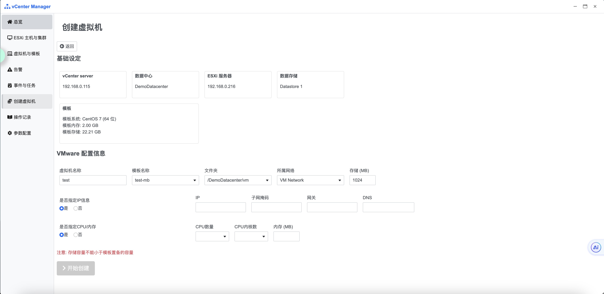

单击开始创建即可下发新建任务


## 使用指南 

### 功能概要

vCenter Server 主要功能包括查看 <ESXi / Cluster / Datastore / VMs / Template / 告警 / 事件 / 任务> 的各项指标以及对 vCenter Server 的各项配置。

vCenter Server 界面如下图：


### 总览

在左侧栏导航点击[总览]，上方展示不同指标卡片, 部分可以点击跳转至相关页面, 下方左侧服务器列表可以点击进行筛选, 下方右侧展示 [ESXi] 及 [Datastore] 的指标数据


### ESXi主机与集群

在左侧栏导航点击[ESXi主机与集群]，左侧服务器列表可以点击进行筛选, 右侧展示 [ESXi] 及 [集群] 的指标数据

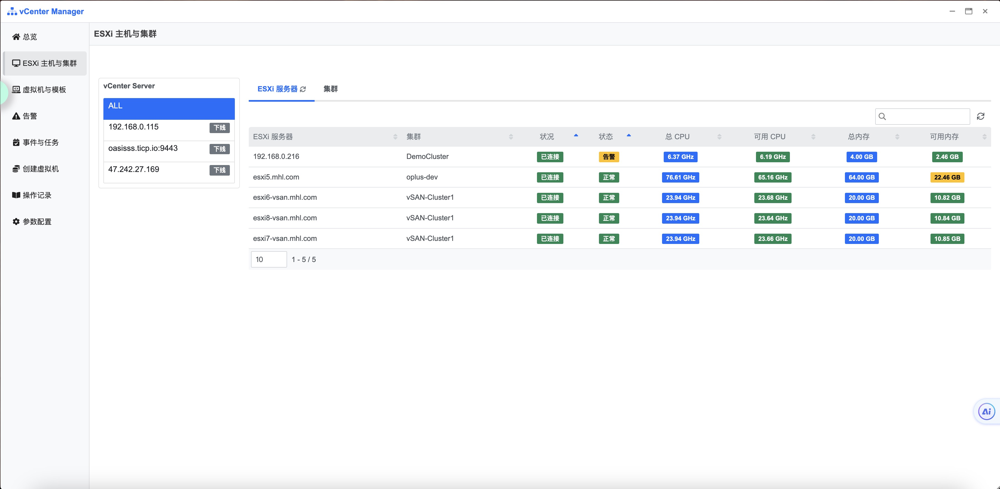


### 虚拟机与模板

在左侧栏导航点击[虚拟机与模板]，左侧服务器列表可以点击进行筛选, 右侧展示 [虚拟机] 及 [模板] 的指标数据

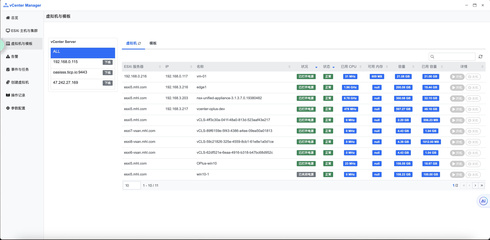


### 告警

在左侧栏导航点击[告警]，左侧服务器列表可以点击进行筛选, 右侧展示 [告警] 的指标数据

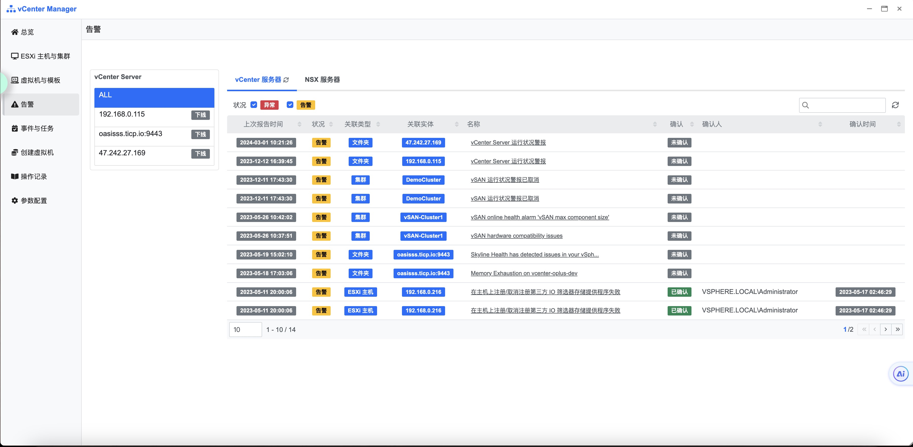

### 事件与任务

在左侧栏导航点击[事件与任务]，左侧服务器列表可以点击进行筛选, 右侧展示 [事件] 及 [任务] 的指标数据

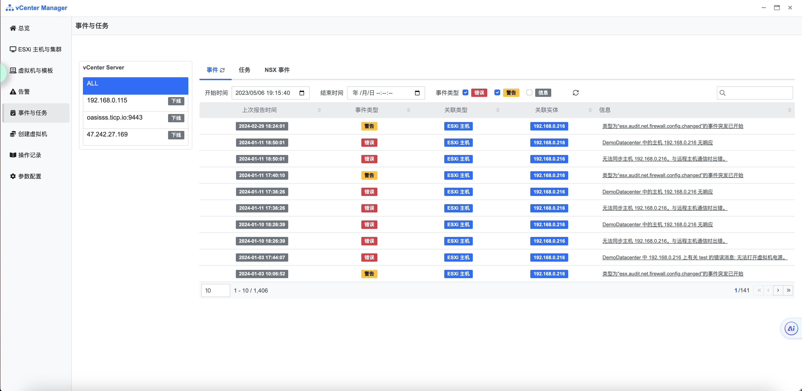
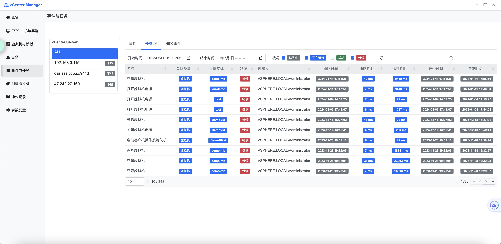

### 创建虚拟机

在左侧栏导航点击[创建虚拟机]，在右侧选择 [vCenter Server] - [数据中心] - [ESXi] - 在列表中选择[Datastore] 并点击[创建虚拟机]按钮


在跳转的页面内填写页面展示的字段 如图


单击开始创建即可下发新建任务

### 操作记录

在左侧栏导航点击[操作记录]，上方[执行日志]展示历史装机任务列表, 下方[操作日志]展示在当前功能内的操作日志

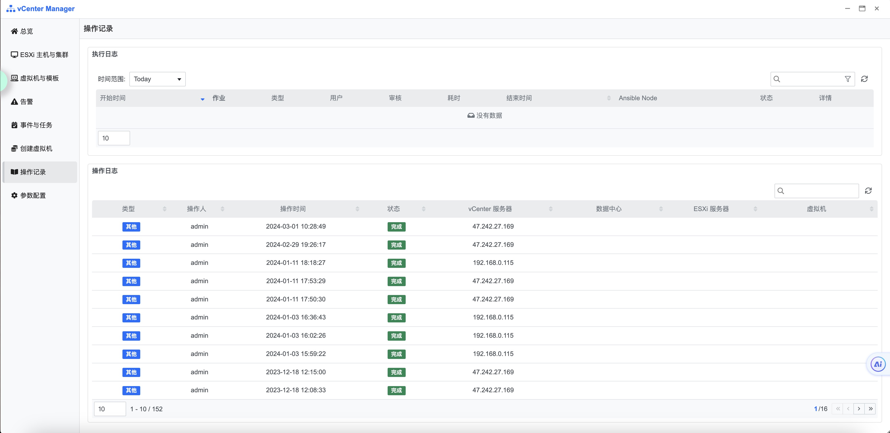

### 参数配置

在左侧栏导航点击[参数配置]，右侧表格展示当前所有已配置的 vCenter Server


## 设置和管理 

### 权限配置

|        | 匿名用户 | 登录用户 | 管理员 |
|--------|------|------|---------|
| 参数配置 | -    | -    | Y       |
| 总览 | -    | Y    | Y       |
| ESXi主机与集群 | -    | Y    | Y       |
| 虚拟机与模板 | -    | Y    | Y       |
| 告警 | -    | Y    | Y       |
| 事件与任务 | -    | Y    | Y       |
| 创建虚拟机 | -    | Y    | Y       |
| 批量创建虚拟机 | -    | Y    | Y       |
| 操作记录 | -    | Y    | Y       |
| 参数配置 | -    | -    | Y       |


## 常见问题 
