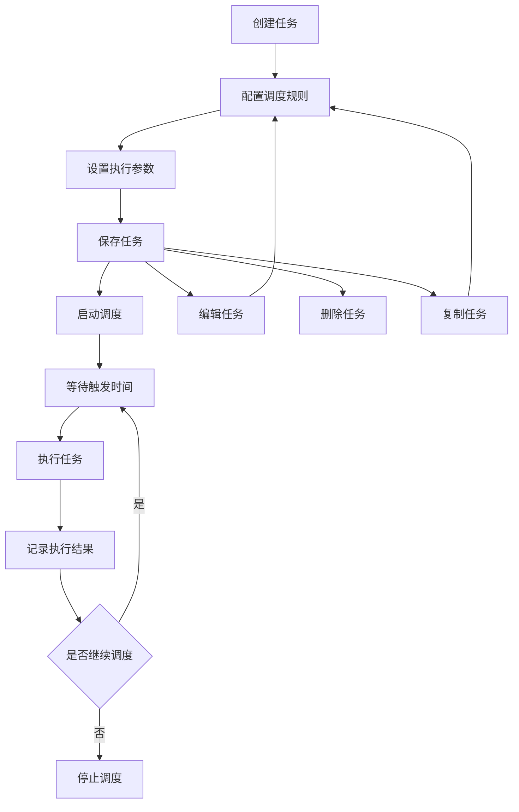
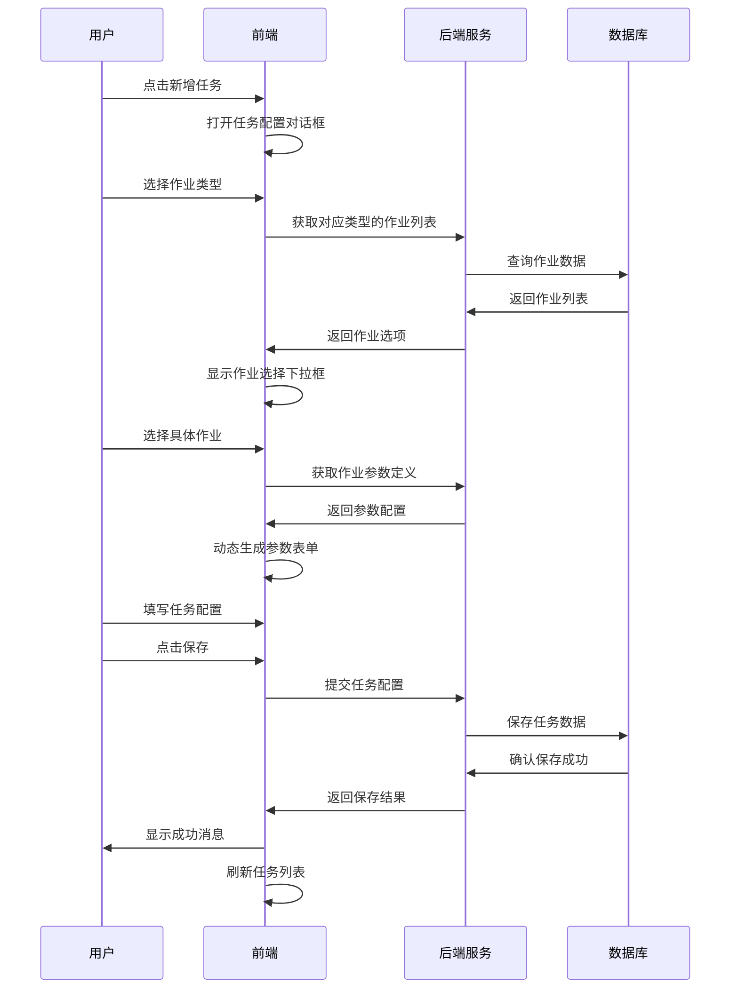
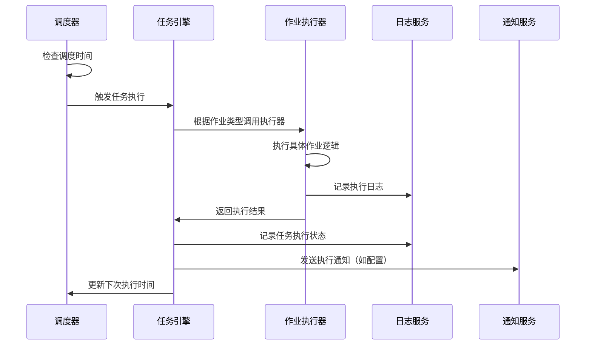
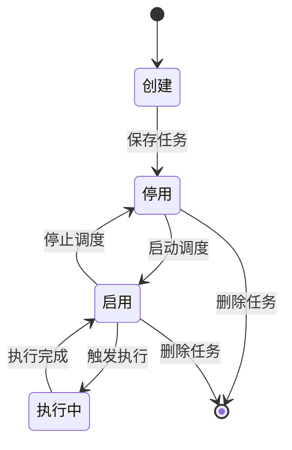

# 业务流程分析

## 1. 整体业务流程

### 1.1 任务调度生命周期



### 1.2 用户操作流程

#### 1.2.1 创建新任务
1. 用户点击"新增任务"按钮
2. 系统打开任务配置对话框
3. 用户填写任务基本信息：
   - 任务描述
   - 作业类型（script/rest/cac/cmd/flows）
   - 应用代码
   - CRON表达式
4. 根据作业类型选择具体的作业
5. 配置运行参数
6. 设置日志输出和加密选项
7. 保存任务

#### 1.2.2 管理现有任务
1. 查看任务列表
2. 执行操作：
   - **启动/停止**: 控制任务调度状态
   - **立即执行**: 手动触发任务执行
   - **编辑**: 修改任务配置
   - **复制**: 基于现有任务创建新任务
   - **删除**: 移除任务
   - **查看下次执行时间**: 预览调度计划

#### 1.2.3 批量操作
1. 选择多个任务
2. 点击批量启停按钮
3. 确认操作
4. 系统批量更新任务状态

## 2. 详细业务流程

### 2.1 任务创建流程



### 2.2 任务执行流程



### 2.3 任务状态管理

#### 2.3.1 任务状态定义
- **0 (停用)**: 任务已创建但未启动调度
- **1 (启用)**: 任务正在按调度规则执行

#### 2.3.2 状态转换流程


## 3. 作业类型业务逻辑

### 3.1 脚本作业 (script)
- **用途**: 执行预定义的脚本文件
- **参数**: 脚本路径、执行参数、目标主机
- **执行方式**: 通过Ansible或SSH在目标主机执行

### 3.2 REST作业 (rest)
- **用途**: 调用HTTP REST API
- **参数**: URL、HTTP方法、请求头、请求体
- **执行方式**: 发送HTTP请求并处理响应

### 3.3 CAC作业 (cac)
- **用途**: 执行配置审计检查模板
- **参数**: 模板ID、附件名称
- **执行方式**: 调用CAC模块执行审计检查

### 3.4 命令作业 (cmd)
- **用途**: 执行预定义的系统命令
- **参数**: 命令ID、目标主机
- **执行方式**: 在指定主机执行命令

### 3.5 流程作业 (flows)
- **用途**: 执行工作流程
- **参数**: 流程ID、流程参数
- **执行方式**: 启动工作流引擎执行流程

## 4. CRON表达式管理

### 4.1 CRON表达式格式
```
秒 分 时 日 月 周 年
* * * * * ? *
```

### 4.2 表达式验证流程
1. 用户输入CRON表达式
2. 前端调用验证API
3. 后端解析表达式
4. 返回下次执行时间列表
5. 前端显示执行计划

### 4.3 高频任务检测
- 检测执行间隔小于1小时的任务
- 显示高频执行警告
- 提醒用户注意系统资源消耗

## 5. 权限控制

### 5.1 权限定义
- **jao:view**: 查看任务调度列表
- **jao:edit**: 创建、编辑、删除任务
- **jao:execute**: 手动执行任务

### 5.2 权限检查流程
1. 用户访问功能
2. 前端检查用户权限
3. 根据权限显示/隐藏操作按钮
4. 后端API再次验证权限
5. 执行或拒绝操作

## 6. 错误处理流程

### 6.1 API调用失败
1. 检测API调用异常
2. 记录错误日志
3. 显示用户友好的错误消息
4. 提供重试机制

### 6.2 任务执行失败
1. 捕获执行异常
2. 记录详细错误信息
3. 更新任务状态
4. 发送失败通知（如配置）

### 6.3 数据格式错误
1. 验证API返回数据格式
2. 处理空数据或异常数据
3. 显示默认内容或错误提示
4. 防止前端崩溃