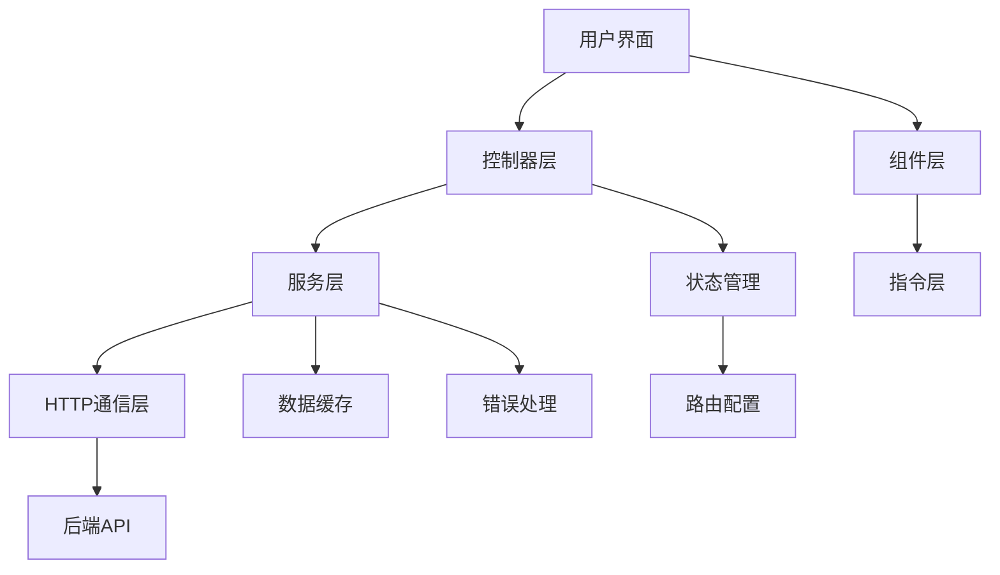

# 前端架构说明

## 1. 整体架构

### 1.1 技术栈
- **框架**: AngularJS 1.5.8
- **路由**: UI-Router
- **UI组件**: Bootstrap 4 + 自定义组件
- **数据表格**: DataTables
- **HTTP通信**: Angular $http + restUtils
- **模块化**: AMD/CommonJS

### 1.2 架构图



## 2. 目录结构

```
src/webapp/app/modules/jao/cronJob/
├── controllers/
│   ├── cron-job-list.controller.js      # 任务列表控制器
│   └── cron-job-dialog.controller.js    # 任务编辑对话框控制器
├── services/
│   └── cron-job.service.js              # 任务调度服务
├── templates/
│   ├── cron-job-list.html               # 任务列表模板
│   ├── cron-job-dialog.html             # 任务编辑对话框模板
│   └── cron.html                        # CRON表达式生成器
├── states/
│   └── cron-job.state.js                # 路由状态定义
└── assets/
    ├── css/
    └── images/
```

## 3. 控制器架构

### 3.1 CronJobController (任务列表控制器)

```javascript
// 控制器结构
function CronJobController($scope, $state, messageService, cronJobService, 
                          $translate, $uibModal, appletService, $q, currentUser) {
    
    // 控制器实例
    var that = this;
    
    // 公共方法
    that.deleteCronJob = deleteCronJob;
    that.copyCronJob = copyCronJob;
    that.executeCronJob = executeCronJob;
    that.batchStartStopCron = batchStartStopCron;
    that.startStop = startStop;
    that.nextExecutionTime = nextExecutionTime;
    that.debugApiConnection = debugApiConnection;
    
    // 私有方法
    function controlQuery() { /* 表格配置 */ }
    function getPromise() { /* 数据获取 */ }
    
    // 初始化
    controlQuery();
}
```

### 3.2 控制器职责分离

```javascript
// 数据管理职责
const DataManager = {
    loadTasks: function() { /* 加载任务数据 */ },
    saveTask: function(task) { /* 保存任务 */ },
    deleteTask: function(id) { /* 删除任务 */ },
    validateData: function(data) { /* 数据验证 */ }
};

// UI交互职责
const UIManager = {
    showModal: function(config) { /* 显示模态框 */ },
    showMessage: function(type, message) { /* 显示消息 */ },
    updateTable: function(data) { /* 更新表格 */ },
    handleError: function(error) { /* 错误处理 */ }
};

// 业务逻辑职责
const BusinessLogic = {
    startStopTask: function(id, status) { /* 启停任务 */ },
    executeTask: function(id) { /* 执行任务 */ },
    calculateNextTime: function(cron) { /* 计算下次执行时间 */ }
};
```

## 4. 服务层架构

### 4.1 cronJobService 服务

```javascript
function cronJobService(restUtils) {
    var module = "jao";
    
    // 公共接口
    this.cronRestInterface = cronRestInterface;
    this.getCacData = getCacData;
    
    // API调用统一接口
    function cronRestInterface(implement, data) {
        const apiMap = {
            "query": () => restUtils.callApi(module, 'GET', '/api/jao/cron'),
            "delete": (id) => restUtils.callApi(module, 'DELETE', '/api/jao/cron/{id}', {id}),
            "update": (data) => restUtils.callApi(module, 'PUT', '/api/jao/cron', null, data),
            "add": (data) => restUtils.callApi(module, 'POST', '/api/jao/cron', null, data),
            // ... 其他API映射
        };
        
        return apiMap[implement] ? apiMap[implement](data) : Promise.reject('Unknown API');
    }
}
```

### 4.2 服务层设计模式

```javascript
// 单例模式 - 服务实例
angular.module('oplus.jao').service('cronJobService', cronJobService);

// 工厂模式 - API调用工厂
function ApiCallFactory() {
    return {
        create: function(module, method, url, params, data) {
            return restUtils.callApi(module, method, url, params, data);
        }
    };
}

// 装饰器模式 - API调用装饰
function ApiDecorator(apiCall) {
    return function(params) {
        console.log('API调用开始:', params);
        return apiCall(params).then(function(result) {
            console.log('API调用成功:', result);
            return result;
        }).catch(function(error) {
            console.error('API调用失败:', error);
            throw error;
        });
    };
}
```

## 5. 状态管理

### 5.1 UI-Router状态配置

```javascript
// 主状态定义
.state('app.jao.cron_job', {
    url: '/cron-list',
    views: {
        'jaoMainView': {
            templateUrl: 'app/modules/jao/cronJob/cron-job-list.html',
            controller: 'CronJobController',
            controllerAs: '$ctrl'
        }
    },
    resolve: {
        // 预加载数据
        applets: ['appletService', function(appletService) {
            return appletService.findApplets();
        }]
    }
})

// 子状态定义
.state('app.jao.cron_job.new', {
    url: '/{id}/new',
    onEnter: ['$stateParams', '$state', '$uibModal', function($stateParams, $state, $uibModal) {
        // 模态框状态处理
    }]
})
```

### 5.2 状态数据管理

```javascript
// 状态数据结构
const stateData = {
    currentTask: null,          // 当前选中任务
    taskList: [],              // 任务列表
    selectedTasks: [],         // 选中的任务
    filters: {                 // 过滤条件
        jobType: '',
        appCode: '',
        status: ''
    },
    pagination: {              // 分页信息
        page: 1,
        size: 20,
        total: 0
    },
    loading: false,            // 加载状态
    error: null               // 错误信息
};

// 状态更新方法
const stateManager = {
    updateTaskList: function(tasks) {
        stateData.taskList = tasks;
        $scope.$apply();
    },
    setLoading: function(loading) {
        stateData.loading = loading;
        $scope.$apply();
    },
    setError: function(error) {
        stateData.error = error;
        $scope.$apply();
    }
};
```

## 6. 组件化设计

### 6.1 数据表格组件

```javascript
// 表格配置组件
const TableConfig = {
    columns: [
        {
            data: 'id',
            title: '任务ID',
            width: '80px'
        },
        {
            data: 'jobDesc',
            title: '任务描述',
            render: function(data, type, row) {
                return `<span title="${data}" class="text-truncate">${data}</span>`;
            }
        }
        // ... 其他列配置
    ],
    options: {
        order: [[0, 'desc']],
        pageLength: 20,
        responsive: true,
        language: {
            url: '/i18n/datatables-zh-cn.json'
        }
    }
};
```

### 6.2 模态框组件

```javascript
// 模态框配置
const ModalConfig = {
    template: 'app/modules/jao/cronJob/cron-job-dialog.html',
    controller: 'CronJobDialogCtrl',
    controllerAs: 'vm',
    backdrop: 'static',
    size: 'lg',
    resolve: {
        cronJobData: function() {
            return {
                jobDesc: "",
                scheduleConf: "",
                jobType: "",
                jobId: "",
                id: $stateParams.id
            };
        }
    }
};

// 模态框服务
const ModalService = {
    openTaskDialog: function(taskId) {
        return $uibModal.open(ModalConfig);
    },
    openConfirmDialog: function(message) {
        return messageService.confirm('确认操作', message);
    }
};
```

## 7. 数据绑定与监听

### 7.1 双向数据绑定

```html
<!-- 任务列表模板 -->
<div ng-controller="CronJobController as $ctrl">
    <!-- 搜索框 -->
    <input type="text" ng-model="$ctrl.searchText" 
           ng-change="$ctrl.onSearchChange()" 
           placeholder="搜索任务...">
    
    <!-- 数据表格 -->
    <opx-datatable config="$ctrl.tableConfig" 
                   class="table-responsive">
    </opx-datatable>
    
    <!-- 批量操作按钮 -->
    <button ng-click="$ctrl.batchStartStopCron()" 
            ng-show="$ctrl.selectedCrons.length > 0"
            class="btn btn-primary">
        批量启停
    </button>
</div>
```

### 7.2 事件监听

```javascript
// 控制器中的事件监听
function CronJobController($scope) {
    // 监听路由变化
    $scope.$on('$stateChangeStart', function(event, toState, toParams) {
        if (hasUnsavedChanges()) {
            event.preventDefault();
            confirmLeave().then(function() {
                $state.go(toState.name, toParams);
            });
        }
    });
    
    // 监听数据变化
    $scope.$watch('$ctrl.selectedCrons', function(newVal, oldVal) {
        if (newVal !== oldVal) {
            updateBatchButtonState();
        }
    }, true);
    
    // 监听窗口关闭
    $scope.$on('$destroy', function() {
        // 清理资源
        clearInterval(refreshTimer);
        cancelPendingRequests();
    });
}
```

## 8. 错误处理架构

### 8.1 全局错误处理

```javascript
// 全局错误拦截器
angular.module('oplus.jao').config(['$httpProvider', function($httpProvider) {
    $httpProvider.interceptors.push('errorInterceptor');
}]);

// 错误拦截器实现
function errorInterceptor($q, messageService) {
    return {
        responseError: function(rejection) {
            // 统一错误处理
            const errorMessage = getErrorMessage(rejection);
            messageService.toast('error', errorMessage);
            
            // 特殊错误处理
            if (rejection.status === 401) {
                redirectToLogin();
            } else if (rejection.status === 403) {
                showPermissionError();
            }
            
            return $q.reject(rejection);
        }
    };
}
```

### 8.2 组件级错误处理

```javascript
// 控制器错误处理
function handleApiError(error, operation) {
    console.error(`${operation} failed:`, error);
    
    const errorMap = {
        'NETWORK_ERROR': '网络连接失败，请检查网络设置',
        'TIMEOUT_ERROR': '请求超时，请稍后重试',
        'SERVER_ERROR': '服务器内部错误，请联系管理员',
        'PERMISSION_ERROR': '权限不足，无法执行此操作'
    };
    
    const message = errorMap[error.code] || error.message || '操作失败';
    messageService.toast('error', message);
}

// Promise错误处理
function safeApiCall(apiPromise, operation) {
    return apiPromise.then(function(result) {
        return result;
    }).catch(function(error) {
        handleApiError(error, operation);
        return null; // 返回默认值而不是抛出错误
    });
}
```

## 9. 性能优化

### 9.1 数据加载优化

```javascript
// 懒加载实现
const LazyLoader = {
    loadTaskList: function(page, size) {
        if (this.cache[page]) {
            return Promise.resolve(this.cache[page]);
        }
        
        return cronJobService.cronRestInterface("query", {page, size})
            .then(function(data) {
                LazyLoader.cache[page] = data;
                return data;
            });
    },
    cache: {},
    clearCache: function() {
        this.cache = {};
    }
};

// 防抖搜索
function debounceSearch(searchFn, delay) {
    let timeoutId;
    return function(...args) {
        clearTimeout(timeoutId);
        timeoutId = setTimeout(() => searchFn.apply(this, args), delay);
    };
}

const debouncedSearch = debounceSearch(function(keyword) {
    searchTasks(keyword);
}, 300);
```

### 9.2 DOM操作优化

```javascript
// 虚拟滚动实现
const VirtualScroll = {
    itemHeight: 50,
    containerHeight: 400,
    visibleItems: 8,
    
    getVisibleRange: function(scrollTop) {
        const start = Math.floor(scrollTop / this.itemHeight);
        const end = start + this.visibleItems;
        return {start, end};
    },
    
    renderItems: function(items, range) {
        const fragment = document.createDocumentFragment();
        for (let i = range.start; i < range.end && i < items.length; i++) {
            const element = createItemElement(items[i]);
            fragment.appendChild(element);
        }
        return fragment;
    }
};

// 批量DOM更新
function batchDOMUpdate(updates) {
    requestAnimationFrame(function() {
        updates.forEach(function(update) {
            update();
        });
    });
}
```

## 10. 测试架构

### 10.1 单元测试结构

```javascript
// 控制器测试
describe('CronJobController', function() {
    let controller, scope, cronJobService, messageService;
    
    beforeEach(function() {
        module('oplus.jao');
        
        inject(function($controller, $rootScope, _cronJobService_, _messageService_) {
            scope = $rootScope.$new();
            cronJobService = _cronJobService_;
            messageService = _messageService_;
            
            controller = $controller('CronJobController', {
                $scope: scope,
                cronJobService: cronJobService,
                messageService: messageService
            });
        });
    });
    
    it('should load task list on initialization', function() {
        spyOn(cronJobService, 'cronRestInterface').and.returnValue(Promise.resolve([]));
        
        controller.loadTasks();
        
        expect(cronJobService.cronRestInterface).toHaveBeenCalledWith('query');
    });
});
```

### 10.2 集成测试

```javascript
// E2E测试
describe('Task Scheduling Page', function() {
    beforeEach(function() {
        browser.get('/app/jao/cron-list');
    });
    
    it('should display task list', function() {
        const taskTable = element(by.css('.datatable'));
        expect(taskTable.isDisplayed()).toBe(true);
        
        const rows = element.all(by.css('.datatable tbody tr'));
        expect(rows.count()).toBeGreaterThan(0);
    });
    
    it('should create new task', function() {
        const newTaskButton = element(by.css('[ui-sref*="new"]'));
        newTaskButton.click();
        
        const modal = element(by.css('.modal'));
        expect(modal.isDisplayed()).toBe(true);
    });
});
```

## 11. 部署与构建

### 11.1 构建配置

```javascript
// gulpfile.js 相关配置
gulp.task('build-jao-cronJob', function() {
    return gulp.src([
        'src/webapp/app/modules/jao/cronJob/**/*.js',
        '!src/webapp/app/modules/jao/cronJob/**/*.spec.js'
    ])
    .pipe(concat('jao-cronJob.min.js'))
    .pipe(uglify())
    .pipe(gulp.dest('dist/js/modules/'));
});

// 模板编译
gulp.task('compile-jao-templates', function() {
    return gulp.src('src/webapp/app/modules/jao/cronJob/**/*.html')
        .pipe(templateCache('jao-cronJob-templates.js', {
            module: 'oplus.jao'
        }))
        .pipe(gulp.dest('dist/js/templates/'));
});
```

### 11.2 模块依赖

```javascript
// 模块依赖关系
angular.module('oplus.jao', [
    'ui.router',
    'ui.bootstrap',
    'ngAnimate',
    'oplus.commons',
    'oplus.uaa'
]);

// 依赖注入配置
angular.module('oplus.jao').config(['$provide', function($provide) {
    // 服务装饰
    $provide.decorator('cronJobService', ['$delegate', function($delegate) {
        // 添加额外功能
        return $delegate;
    }]);
}]);
```