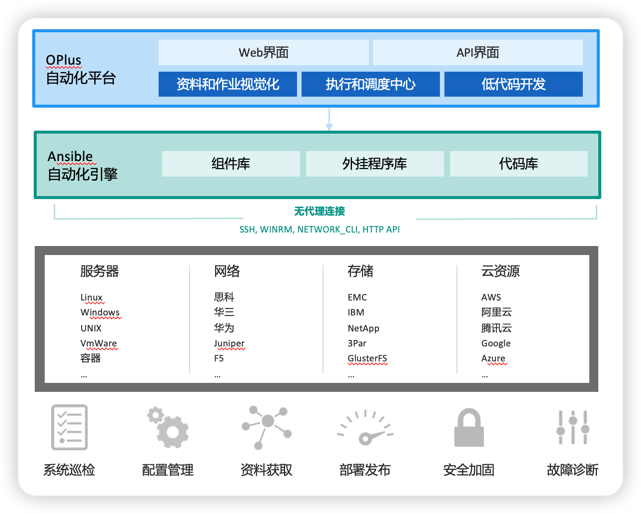

# OPSmind简介 {docsify-ignore}

OPSmind是一个无代理模式的的自动化运维平台，可以助力完成系统巡检、漏洞扫描、软件包安装、用户权限管理、信息采集等运维工作的自动化。

OPSmind把IT运维长期经验，通过标准化功能场景提供给用户。同时OPSmind提供了强大的开发能力，用户可以通过低代码的开发方式进行功能定制，轻松打造符合自身特性的自动化功能。

OPSmind建立在业界领先的自动化运维工具Ansible之上，保留了Ansible开放、模块丰富、维护简便、扩展灵活的优势，又在上面进行了大量功能扩展，让Ansible使用更简便和规范，自动化操作更直观和场景化。OPSmind采用无代理、模块化的架构，可以适用不同规模的IT环境。这种非侵入式的架构，可以在不替换现有运维架构的情况下，广泛兼容现有的多种运维系统和工具，最大程度保护现有的IT投资。

## 多类型设备接入

依托Ansible强大的设备管理能力，OPSmind可以对物理机、虚拟机、网络设备等进行统一的自动化接入和管理。
* 可以通过Excel等形式导入现有的设备信息，实现资产台账统一管理。
* 提供标签、分组、动态条件等方式对设备进行多维度查询和管理。
* 自动化采集设备信息，为企业CMDB或资产管理系统供准确可靠的数据。
* 支持自定义资产模型，灵活适配不同类型的设备信息。

## 统一的脚本和命令管理

OPSmind可以对运维脚本和命令进行统一的规范化管理，提高复用率，降低维护成本，使得脚本、命令等成为IT资产的一部分。
* 为脚本扩展了目录、描述、参数等信息，方便脚本的管理和使用。
* 支持脚本和命令的版本控制，记录所有的修改记录。
* 支持审核发布流程，对脚本和命令进行上线管控，防止危险和恶意操作。
* 可以将常用的操作按场景定义成命令组合，在应急处理时可以快速执行，获取诊断信息。

## 自动化作业

OPSmind可以通过作业的形式来编排脚本、命令、Web Service等任务和流程，完成复杂的配置变更、数据采集、发布部署等自动化工作。
* 通过拖拽方式完成操作流程的编排。
* 提供便利的工具查看执行进度和结果。
* 支持作业的定时和自动运行。
* 支持多个Ansible节点，可以通过水平扩展提高执行效率和实现跨网段设备管理。

## 低代码开发

OPSmind提供强大的开发功能，以可视化的方式制作数据看板、报表、监视大屏、操作表单等常用的运维前端界面，解决运维中频繁的数据展示和用户交互需求。
* 可以从MySQL、Oracle、DB2、SQLServer、REST API等多种数据源获取数据并在页面展示。
* 支持布局、表单输入、表格、图形、作业等40多种展示和操作组件。
* 无需编程，采用所见即所得的可视化开发模式，运维人员经过简单培训可自行进行开发。
* 运维功能的开发不再受限于开发人员，和传统的代码开发相比，上线周期缩短60%以上。
